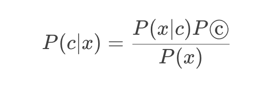
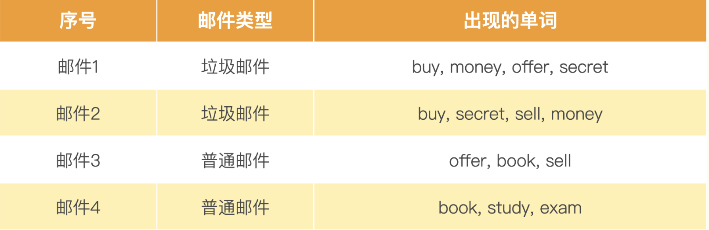

OpenAI 就只提供了 Complete 和 Embedding 两个接口，其中，Complete 可以让模型根据你的输入进行自动续写，Embedding 可以将你输入的文本转化成向量


#### 传统的二分类方法：朴素贝叶斯与逻辑回归 ####

对于“情感分析”类型的问题，传统的解决方案就是把它当成是一个分类问题，也就是先拿一部分评论数据，人工标注一下这些评论是正面还是负面的。如果有个用户说“这家餐馆真好吃”，那么就标注成“正面情感”。如果有个用户说“这个手机质量不好”，那么就把对应的评论标注成负面的。

我们把标注好的数据，喂给一个机器学习模型，训练出一组参数。然后把剩下的没有人工标注过的数据也拿给训练好的模型计算一下。模型就会给你一个分数或者概率，告诉你这一段评论的感情是正面的，还是负面的。

可以用来做情感分析的模型有很多，这些算法背后都是基于某一个数学模型。比如，很多教科书里，就会教你用朴素贝叶斯算法来进行垃圾邮件分类。



假设我们有一个训练集包含 4 封邮件，其中 2 封是垃圾邮件，2 封是非垃圾邮件。训练集里的邮件包含这些单词



然后来了一封新邮件，里面的单词是：buy、money、sell。

通过这些单词出现的概率，我们很容易就可以预先算出这封邮件是垃圾邮件还是普通邮件。

* P(buy∣垃圾)=2÷2=1
* P(money∣垃圾)=2÷2=1
* P(sell∣垃圾)=1÷2=0.5
* P(buy∣普通)=0÷2=0
* P(money∣普通)=0÷2=0
* P(sell∣普通)=1div2=0.5

#### 传统方法的挑战：特征工程与模型调参 ####

第一个是特征工程。对于很多自然语言问题，如果我们只是拿一段话里面是否出现了特定的词语来计算概率，不一定是最合适的。比如“这家餐馆太糟糕了，一点都不好吃”和 “这家餐馆太好吃了，一点都不糟糕”这样两句话，从意思上是完全相反的。但是里面出现的词语其实是相同的。在传统的自然语言处理中，我们会通过一些特征工程的方法来解决这个问题。

比如，我们不只是采用单个词语出现的概率，还增加前后两个或者三个相连词语的组合，也就是通过所谓的 2-Gram（Bigram 双字节词组）和 3-Gram（Trigram 三字节词组）也来计算概率。在上面这个例子里，第一句差评，就会有“太”和“糟糕”组合在一起的“太糟糕”，以及“不”和“好吃”组合在一起的“不好吃”。而后面一句里就有“太好吃”和“不糟糕”两个组合。有了这样的 2-Gram 的组合，我们判断用户好评差评的判断能力就比光用单个词语是否出现要好多了。

不同的特征工程方式，在不同的问题上效果不一样，比如我们做情感分析，可能就需要保留标点符号，因为像“！”这样的符号往往蕴含着强烈的情感特征。但是，这些种种细微的技巧，让我们在想要解决一个简单的情感分析问题时，也需要撰写大量文本处理的代码，还要了解针对当前特定场景的技巧，这非常依赖工程师的经验。

**机器学习相关经验**

#### 大语言模型：20 行代码的情感分析解决方案 ####

利用它提供的 Embedding 这个 API。这个 API 可以把任何你指定的一段文本，变成一个大语言模型下的向量，也就是用一组固定长度的参数来代表任何一段文本

我们需要提前计算“好评”和“差评”这两个字的 Embedding。而对于**任何一段文本评论，我们也都可以通过 API 拿到它的 Embedding**。那么，我们把**这段文本的 Embedding 和“好评”以及“差评”通过余弦距离（Cosine Similarity）计算出它的相似度**。然后我们拿这个 Embedding 和“好评”之间的相似度，去减去和“差评”之间的相似度，就会得到一个分数。如果这个分数大于 0，那么说明我们的评论和“好评”的距离更近，我们就可以判断它为好评。如果这个分数小于 0，那么就是离差评更近，我们就可以判断它为差评。

```python
from openai import OpenAI
import numpy as np
import os

client = OpenAI(api_key=os.environ['OPENAI_API_KEY'])

EMBEDDING_MODEL = "text-embedding-ada-002"

def get_embedding(text, model=EMBEDDING_MODEL):
   text = text.replace("\n", " ")
   return client.embeddings.create(input = [text], model=model).data[0].embedding

def cosine_similarity(vector_a, vector_b):
  dot_product = np.dot(vector_a, vector_b)
  norm_a = np.linalg.norm(vector_a)
  norm_b = np.linalg.norm(vector_b)
  epsilon = 1e-10
  cosine_similarity = dot_product / (norm_a * norm_b + epsilon)
  return cosine_similarity

positive_review = get_embedding("好评")
negative_review = get_embedding("差评")

positive_example = get_embedding("买的银色版真的很好看，一天就到了，晚上就开始拿起来完系统很丝滑流畅，做工扎实，手感细腻，很精致哦苹果一如既往的好品质")
negative_example = get_embedding("随意降价，不予价保，服务态度差")

def get_score(sample_embedding):
  return cosine_similarity(sample_embedding, positive_review) - cosine_similarity(sample_embedding, negative_review)

positive_score = get_score(positive_example)
negative_score = get_score(negative_example)

print("好评例子的评分 : %f" % (positive_score))
print("差评例子的评分 : %f" % (negative_score))

```

Output:

好评例子的评分 : 0.070963差评例子的评分 : -0.081472

京东上的好评通过 Embedding 相似度计算得到的分数是大于 0 的，京东上面的差评，这个分数是小于 0 的。

#### 更大的数据集上的真实案例 ####

下面这段代码，是来自 OpenAI Cookbook 里面的一个例子。它是用同样的方法，来判断亚马逊提供的用户对一些食物的评价，这个评价数据里面，不只有用户给出的评论内容，还有用户给这些食物打了几颗星。这些几颗星的信息，正好可以拿来验证我们这个方法有多准。对于用户打出 1～2 星的，我们认为是差评，对于 4～5 星的，我们认为是好评。

通过 Pandas，将这个 CSV 数据读取到内存里面。为了避免重新调用 OpenAI 的 API 浪费钱，这个数据集里，已经将获取到的 Embedding 信息保存下来了，不需要再重新计算。

```python
import pandas as pd
import numpy as np

from sklearn.metrics import classification_report

# 选择用于情感分析的模型
EMBEDDING_MODEL = "text-embedding-ada-002"


# 设置数据集文件路径
datafile_path = "data/fine_food_reviews_with_embeddings_1k.csv"

# 读取 csv 文件 
df = pd.read_csv(datafile_path)

# 新增一列 embedding 用于表示获取每行的embedding向量值
df["embedding"] = df.embedding.apply(eval).apply(np.array)

# convert 5-star rating to binary sentiment
df = df[df.Score != 3]

# 划分好评还是差评两个标签
df["sentiment"] = df.Score.replace({1: "negative", 2: "negative", 4: "positive", 5: "positive"})
```

和一个预先设定好的好评和差评的文本去做对比，然后看它离哪个近一些。这里的好评和差评，我们写得稍微长了一点，分别是 “An Amazon review with a negative sentiment.” 和 “An Amazon review with a positive sentiment.”。

```python
from sklearn.metrics import PrecisionRecallDisplay

def evaluate_embeddings_approach(
    labels = ['negative', 'positive'], 
    model = EMBEDDING_MODEL,
):
  
   # 计算每个 label 的向量值
    label_embeddings = [get_embedding(label, engine=model) for label in labels]
    
# 辅助函数 用于计算好评和review_embedding与差评和review_embedding向量余弦值差值
    def label_score(review_embedding, label_embeddings):
        return cosine_similarity(review_embedding, label_embeddings[1]) - cosine_similarity(review_embedding, label_embeddings[0])

     # 这里更新下 embedding 列 更新成对应的 分数
    probas = df["embedding"].apply(lambda x: label_score(x, label_embeddings))
    
    # 预测值
    preds = probas.apply(lambda x: 'positive' if x>0 else 'negative')

     # 生成一个分类报告
    report = classification_report(df.sentiment, preds)
    print(report)
    #绘制二分类的准确率-召回率曲线
    display = PrecisionRecallDisplay.from_predictions(df.sentiment, probas, pos_label='positive')
    _ = display.ax_.set_title("2-class Precision-Recall curve")

evaluate_embeddings_approach(labels=['An Amazon review with a negative sentiment.', 'An Amazon review with a positive sentiment.'])
```

```
              precision    recall  f1-score   support
    negative       0.98      0.73      0.84       136
    positive       0.96      1.00      0.98       789
    accuracy                           0.96       925
   macro avg       0.97      0.86      0.91       925
weighted avg       0.96      0.96      0.96       925
```

在结果里面可以看到，我们这个简单方法判定的好评差评的精度，也就是 precision 在 negative 和 positive 里，分别是 0.98 和 0.96，也就是在 95% 以上。

而召回率，也就是图里的 recall，在差评里稍微欠缺一点，只有 73%，这说明还是有不少差评被误判为了好评。不过在好评里，召回率则是 100%，也就是 100% 的好评都被模型找到了。这样综合考虑下来的整体准确率，高达 96%。而要达到这么好的效果，我们不需要进行任何机器学习训练，只需要几行代码调用一下大模型的接口，计算一下几个向量的相似度就好了。


