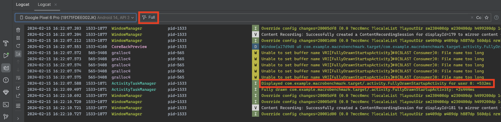

## TTID ##

初步显示所用时间 (TTID) 是指显示应用界面的第一帧所需的时间。该指标用于测量应用生成第一帧所用的时间，包括冷启动期间的进程初始化、冷启动或温启动期间的 activity 创建，以及显示第一帧。让应用的 TTID 保持较低水平，以便用户快速看到应用启动情况，有助于改善用户体验。Android 框架会自动为每个应用报告 TTID。在针对应用启动进行优化时，我们建议实现 [`reportFullyDrawn`](https://developer.android.com/reference/android/app/Activity?hl=zh-cn#reportFullyDrawn())，以获取最高可达 [TTFD](https://developer.android.com/topic/performance/vitals/launch-time?hl=zh-cn#time-full) 的信息。

TTID 以时间值的形式衡量，表示包含以下事件序列的总经过时间：

- 启动进程。
- 初始化对象。
- 创建和初始化 activity。
- 膨胀布局。
- 首次绘制应用

#### 检索 TTID

如需查找 TTID，请在 [Logcat 命令行工具](https://developer.android.com/tools/logcat?hl=zh-cn)中搜索包含名为 `Displayed` 的值的输出行。该值是 TTID，类似于以下示例（其中 TTID 为 3s534 毫秒）：

```bash
ActivityManager: Displayed com.android.myexample/.StartupTiming: +3s534ms
```

如需在 Android Studio 中查找 TTID，请从过滤器下拉菜单中停用 Logcat 视图中的过滤器，然后查找 `Displayed` 时间




### onActivityCreated ###

```java
  @Override
  public synchronized void onActivityCreated(Activity activity, Bundle savedInstanceState) {
    if (isStartedFromBackground || onCreateTime != null // An activity already called onCreate()
    ) {
      return;
    }

    systemForegroundCheck = systemForegroundCheck || isAnyAppProcessInForeground(appContext);
    launchActivity = new WeakReference<Activity>(activity);
    onCreateTime = clock.getTime();

    if (getStartTimerCompat().getDurationMicros(onCreateTime) > MAX_LATENCY_BEFORE_UI_INIT) {
      isTooLateToInitUI = true;
    }
  }
```

**clock.getTime()**

```
封装Timer时间对象
Timer有两个时间点：
1. MILLISECONDS.toMicros(System.currentTimeMillis());   //1970 到现在的时间
2，MILLISECONDS.toMicros(SystemClock.elapsedRealtime())  //系统启动到现在的时间
```

1. 判断onCreateTime是否为空，为空说明第一次启动
2. 记录在前台的变量 systemForgroundCheck
3. 初始化onCreateTime，并设置当前时间的timer对象
4. 获取getStartTimerCompat() 启动时间 和 第一次onCreateTime的时间差
5. 如果大于启动阈值则标识为UI初始化过慢，isTooLateToInitUI = true

**getStartTimerCompat**

```java
/**
   * Gets the timestamp that marks the beginning of app start, defined as the beginning of
   * BIND_APPLICATION, when the forked process is about to start loading the app's resources and
   * classes. Fallback to class-load time of a Firebase class for compatibility below API 24.
   */
private @NonNull Timer getStartTimerCompat() {
    // Preferred: Android system API provides BIND_APPLICATION time
    if (processStartTime != null) {
      return processStartTime;
    }
    // Fallback: static initializer time (during class-load) of a Firebase class
    return getClassLoadTimeCompat();
  }
```

**processStartTime初始化** (Process.getStartElapsedRealtime())

```java
 AppStartTrace(
      @NonNull TransportManager transportManager,
      @NonNull Clock clock,
      @NonNull ConfigResolver configResolver,
      @NonNull ExecutorService executorService) {
    this.transportManager = transportManager;
    this.clock = clock;
    this.configResolver = configResolver;
    this.executorService = executorService;
    this.experimentTtid = TraceMetric.newBuilder().setName("_experiment_app_start_ttid");
    // Set the timestamp for process-start (beginning of BIND_APPLICATION), if available
    this.processStartTime =
        Build.VERSION.SDK_INT >= Build.VERSION_CODES.N
            ? Timer.ofElapsedRealtime(Process.getStartElapsedRealtime())
            : null;
    // Set the timestamp for Firebase's first class's class-loading (approx.), if available
    StartupTime firebaseStart = FirebaseApp.getInstance().get(StartupTime.class);
    this.firebaseClassLoadTime =
        firebaseStart != null ? Timer.ofElapsedRealtime(firebaseStart.getElapsedRealtime()) : null;
  }
```


#### onActivityResumed ####

```java
 View rootView = activity.findViewById(android.R.id.content);
      rootView.getViewTreeObserver().addOnDrawListener(onDrawCounterListener);
			//rootView的onDraw的调用完成可以认为完成了第一次渲染
      FirstDrawDoneListener.registerForNextDraw(rootView, this::recordOnDrawFrontOfQueue);
      PreDrawListener.registerForNextDraw(
          rootView, this::recordPreDraw, this::recordPreDrawFrontOfQueue);
```

```java

public static void registerForNextDraw(View view, Runnable drawDoneCallback) {
    final FirstDrawDoneListener listener = new FirstDrawDoneListener(view, drawDoneCallback);
    // Handle bug prior to API 26 where OnDrawListener from the floating ViewTreeObserver is not
    // merged into the real ViewTreeObserver.
    // https://android.googlesource.com/platform/frameworks/base/+/9f8ec54244a5e0343b9748db3329733f259604f3
    if (Build.VERSION.SDK_INT < 26 && !isAliveAndAttached(view)) {
      view.addOnAttachStateChangeListener(
          new View.OnAttachStateChangeListener() {
            @Override
            public void onViewAttachedToWindow(View view) {
              view.getViewTreeObserver().addOnDrawListener(listener);
              view.removeOnAttachStateChangeListener(this);
            }

            @Override
            public void onViewDetachedFromWindow(View view) {
              view.removeOnAttachStateChangeListener(this);
            }
          });
    } else {
      view.getViewTreeObserver().addOnDrawListener(listener);
    }
  }


//onDraw中调用postAtFrontOfQueue把callback的调用放在handler消息处理队列中的头部
//保证渲染message处理之后就处理callback的调用，从而就可以记录onDraw之后的时间点
 @Override
  public void onDraw() {
    // Set viewReference to null so any onDraw past the first is a no-op
    View view = viewReference.getAndSet(null);
    if (view == null) {
      return;
    }
    // OnDrawListeners cannot be removed within onDraw, so we remove it with a
    // GlobalLayoutListener
    view.getViewTreeObserver()
        .addOnGlobalLayoutListener(() -> view.getViewTreeObserver().removeOnDrawListener(this));
    mainThreadHandler.postAtFrontOfQueue(callback);
  }
```

##### postAtFrontOfQueue(callback) #####

```java
  private void recordOnDrawFrontOfQueue() {
    if (onDrawPostAtFrontOfQueueTime != null) {
      return;
    }
    this.onDrawPostAtFrontOfQueueTime = clock.getTime();

    //记录 从启动 到首个Activity渲染完成的耗时（即冷启动耗时）
    this.experimentTtid.addSubtraces(
        TraceMetric.newBuilder()
            .setName("_experiment_onDrawFoQ")
            .setClientStartTimeUs(getStartTimerCompat().getMicros())
            .setDurationUs(
                getStartTimerCompat().getDurationMicros(this.onDrawPostAtFrontOfQueueTime))
            .build());
    if (processStartTime != null) {
      this.experimentTtid.addSubtraces(
          TraceMetric.newBuilder()
              .setName("_experiment_procStart_to_classLoad")
              .setClientStartTimeUs(getStartTimerCompat().getMicros())
              .setDurationUs(getStartTimerCompat().getDurationMicros(getClassLoadTimeCompat()))
              .build());
    }
    this.experimentTtid.putCustomAttributes(
        "systemDeterminedForeground", systemForegroundCheck ? "true" : "false");
    this.experimentTtid.putCounters("onDrawCount", onDrawCount);
    this.experimentTtid.addPerfSessions(this.startSession.build());
    logExperimentTrace(this.experimentTtid);
  }
```


