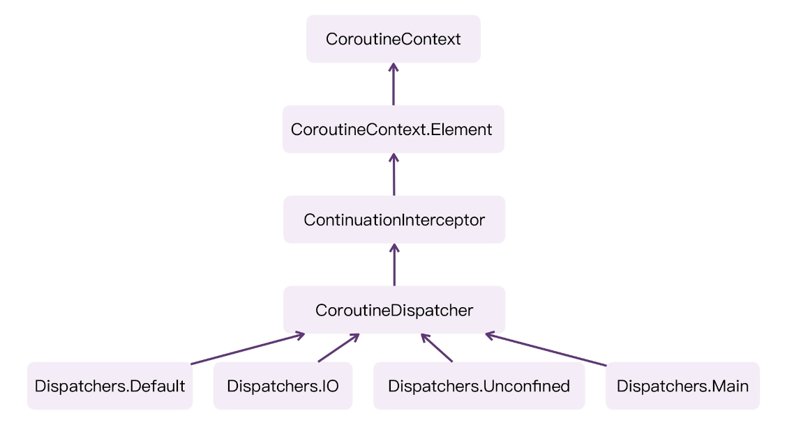

Kotlin 的 launch 会调用 startCoroutineCancellable()，接着又会调用 createCoroutineUnintercepted()，最终会调用编译器帮我们生成 SuspendLambda 实现类当中的 create() 方法。这样，协程就创建出来了。不过，协程是创建出来了，可它是如何运行的呢？

### Dispatchers ###

launch{}本质上是调用了 startCoroutineCancellable() 当中的 createCoroutineUnintercepted() 方法创建了协程。

```kotlin
// 代码段1

public fun <T> (suspend () -> T).startCoroutineCancellable(completion: Continuation<T>): Unit = runSafely(completion) {
    //                                        注意这里
    //                                           ↓
    createCoroutineUnintercepted(completion).intercepted().resumeCancellableWith(Result.success(Unit))
}
```

Dispatchers、CoroutineDispatcher、ContinuationInterceptor、CoroutineContext 之间的关系。

```kotlin
// 代码段2

public actual object Dispatchers {

    public actual val Default: CoroutineDispatcher = DefaultScheduler

    public actual val Main: MainCoroutineDispatcher get() = MainDispatcherLoader.dispatcher

    public actual val Unconfined: CoroutineDispatcher = kotlinx.coroutines.Unconfined

    public val IO: CoroutineDispatcher = DefaultIoScheduler

    public fun shutdown() {    }
}

public abstract class CoroutineDispatcher :
    AbstractCoroutineContextElement(ContinuationInterceptor), ContinuationInterceptor {}

public interface ContinuationInterceptor : CoroutineContext.Element {}

public interface Element : CoroutineContext {}
```

*  Dispatchers 是一个单例对象，它当中的 Default、Main、Unconfined、IO，类型都是 CoroutineDispatcher
* 而它本身就是 CoroutineContext



```kotlin
// 代码段3

fun main() {
    testLaunch()
    Thread.sleep(2000L)
}

private fun testLaunch() {
    val scope = CoroutineScope(Job())
    scope.launch{
        logX("Hello!")
        delay(1000L)
        logX("World!")
    }
}

/**
 * 控制台输出带协程信息的log
 */
fun logX(any: Any?) {
    println(
        """
================================
$any
Thread:${Thread.currentThread().name}
================================""".trimIndent()
    )
}

/*
输出结果
================================
Hello!
Thread:DefaultDispatcher-worker-1 @coroutine#1
================================
================================
World!
Thread:DefaultDispatcher-worker-1 @coroutine#1
================================
*/
```

我们没有为 launch() 传入任何 CoroutineContext 参数，但通过执行结果，我们发现协程代码居然执行在 DefaultDispatcher

来分析下 launch 的源代码

```kotlin
// 代码段4

public fun CoroutineScope.launch(
    context: CoroutineContext = EmptyCoroutineContext,
    start: CoroutineStart = CoroutineStart.DEFAULT,
    block: suspend CoroutineScope.() -> Unit
): Job {
    // 1
    val newContext = newCoroutineContext(context)
    val coroutine = if (start.isLazy)
        LazyStandaloneCoroutine(newContext, block) else
        StandaloneCoroutine(newContext, active = true)
    coroutine.start(start, coroutine, block)
    return coroutine
}
```

* 请留意 launch 的第一个参数，context，它的默认值是 EmptyCoroutineContext
* CoroutineContext 就相当于 Map，而 EmptyCoroutineContext 则相当于一个空的 Map。所以，我们可以认为，这里的 EmptyCoroutineContext 传了也相当于没有传，它的目的只是为了让 context 参数不为空而已

调用 newCoroutineContext(context)，将传入的 context 参数重新包装一下，然后返回

```kotlin
// 代码段5

public actual fun CoroutineScope.newCoroutineContext(context: CoroutineContext): CoroutineContext {
    // 1
    val combined = coroutineContext.foldCopiesForChildCoroutine() + context
    // 2
    val debug = if (DEBUG) combined + CoroutineId(COROUTINE_ID.incrementAndGet()) else combined
    // 3
    return if (combined !== Dispatchers.Default && combined[ContinuationInterceptor] == null)
        debug + Dispatchers.Default else debug
}
```

* 由于 newCoroutineContext() 是 CoroutineScope 的扩展函数，因此，我们可以直接访问 CoroutineScope 的 coroutineContext 对象,它其实就是 CoroutineScope 对应的上下文。**foldCopiesForChildCoroutine() 的作用，其实就是将 CoroutineScope 当中的所有上下文元素都拷贝出来，然后跟传入的 context 参数进行合并。这行代码，可以让子协程继承父协程的上下文元素**。
* 注释 2，它的作用是在调试模式下，为我们的协程对象增加唯一的 ID。我们在代码段 3 的输出结果中看到的“@coroutine#1”，其中的数字“1”就是在这个阶段生成的
* 注释 3，如果合并过后的 combined 当中没有 CoroutineDispatcher，那么，就会默认使用 Dispatchers.Default。

### CoroutineDispatcher 拦截器 ###

让我们回到开头提到过的 startCoroutineCancellable() 方法的源代码，其中的 createCoroutineUnintercepted() 方法，它的返回值类型就是Continuation。**而 intercepted() 方法，其实就是 Continuation 的扩展函数。**

```kotlin
// 代码段6

public fun <T> (suspend () -> T).startCoroutineCancellable(completion: Continuation<T>): Unit = runSafely(completion) {
    //                                        注意这里
    //                                           ↓
    createCoroutineUnintercepted(completion).intercepted().resumeCancellableWith(Result.success(Unit))
}


public actual fun <T> Continuation<T>.intercepted(): Continuation<T> =
    (this as? ContinuationImpl)?.intercepted() ?: this

internal abstract class ContinuationImpl(
    completion: Continuation<Any?>?,
    private val _context: CoroutineContext?
) : BaseContinuationImpl(completion) {
    constructor(completion: Continuation<Any?>?) : this(completion, completion?.context)

    @Transient
    private var intercepted: Continuation<Any?>? = null

    // 1
    public fun intercepted(): Continuation<Any?> =
        intercepted
            ?: (context[ContinuationInterceptor]?.interceptContinuation(this) ?: this)
                .also { intercepted = it }
}
```

* startCoroutineCancellable() 当中的 intercepted() 最终会调用 BaseContinuationImpl 的 intercepted() 方法
* intercepted() 方法首先会判断它的成员变量 intercepted 是否为空，如果为空，**就会调用 context[ContinuationInterceptor]，获取上下文当中的 Dispatcher 对象。**
* 以代码段 3 当中的逻辑为例，**这时候的 Dispatcher 肯定是 Default 线程池**。


继续跟进 interceptContinuation(this) 方法的话，会发现程序最终会调用 CoroutineDispatcher 的 interceptContinuation() 方法。

```kotlin
// 代码段7

public abstract class CoroutineDispatcher :
    AbstractCoroutineContextElement(ContinuationInterceptor), ContinuationInterceptor {

    // 1
    public final override fun <T> interceptContinuation(continuation: Continuation<T>): Continuation<T> =
        DispatchedContinuation(this, continuation)
}
```

interceptContinuation() 直接返回了一个 DispatchedContinuation 对象，并且将 this、continuation 作为参数传了进去。**这里的 this，其实就是 Dispatchers.Default。**

如果我们把 startCoroutineCancellable() 改写一下，它实际上会变成下面这样

```kotlin
// 代码段8

public fun <T> (suspend () -> T).startCoroutineCancellable(completion: Continuation<T>): Unit = runSafely(completion) {
    createCoroutineUnintercepted(completion).intercepted().resumeCancellableWith(Result.success(Unit))
}

// 等价
//  ↓

public fun <T> (suspend () -> T).startCoroutineCancellable(completion: Continuation<T>): Unit = runSafely(completion) {
    // 1
    val continuation = createCoroutineUnintercepted(completion)
    // 2
    val dispatchedContinuation = continuation.intercepted()
    // 3
    dispatchedContinuation.resumeCancellableWith(Result.success(Unit))
}
```

注释 1，2 我们都已经分析完了，现在只剩下注释 3 了。这里的 resumeCancellableWith()，其实就是真正将协程任务分发到线程上的逻辑

```kotlin
// 代码段9

internal class DispatchedContinuation<in T>(
    @JvmField val dispatcher: CoroutineDispatcher,
    @JvmField val continuation: Continuation<T>
) : DispatchedTask<T>(MODE_UNINITIALIZED), CoroutineStackFrame, Continuation<T> by continuation {

    inline fun resumeCancellableWith(
        result: Result<T>,
        noinline onCancellation: ((cause: Throwable) -> Unit)?
    ) {
        // 省略，留到后面分析
    }

}
```

也就是，DispatchedContinuation 是实现了 Continuation 接口，同时，**它使用了“类委托”的语法，将接口的具体实现委托给了它的成员属性 continuation。**

**它的成员属性 dispatcher 对应的就是 Dispatcher.Default，而成员属性 continuation 对应的则是 launch 当中传入的 SuspendLambda 实现类。**

另外，DispatchedContinuation 还继承自 DispatchedTask，我们来看看 DispatchedTask 到底是什么。

```kotlin
internal abstract class DispatchedTask<in T>(
    @JvmField public var resumeMode: Int
) : SchedulerTask() {

}

internal actual typealias SchedulerTask = Task

internal abstract class Task(
    @JvmField var submissionTime: Long,
    @JvmField var taskContext: TaskContext
) : Runnable {
    constructor() : this(0, NonBlockingContext)
    inline val mode: Int get() = taskContext.taskMode // TASK_XXX
}
```

DispatchedContinuation 继承自 DispatchedTask，而它则是 SchedulerTask 的子类，SchedulerTask 是 Task 的类型别名，而 Task 实现了 Runnable 接口

**因此，DispatchedContinuation 不仅是一个 Continuation，同时还是一个 Runnable。**

既然它是 Runnable，也就意味着它可以被分发到 Java 的线程当中去执行了。所以接下来，我们就来看看 resumeCancellableWith() 当中具体的逻辑

```kotlin
// 代码段9

internal class DispatchedContinuation<in T>(
    @JvmField val dispatcher: CoroutineDispatcher,
    @JvmField val continuation: Continuation<T>
) : DispatchedTask<T>(MODE_UNINITIALIZED), CoroutineStackFrame, Continuation<T> by continuation {

    inline fun resumeCancellableWith(
        result: Result<T>,
        noinline onCancellation: ((cause: Throwable) -> Unit)?
    ) {
        val state = result.toState(onCancellation)
        // 1
        if (dispatcher.isDispatchNeeded(context)) {
            _state = state
            resumeMode = MODE_CANCELLABLE
            // 2
            dispatcher.dispatch(context, this)
        } else {
            // 3
            executeUnconfined(state, MODE_CANCELLABLE) {
                if (!resumeCancelled(state)) {
                    resumeUndispatchedWith(result)
                }
            }
        }
    }

}

public abstract class CoroutineDispatcher :
    AbstractCoroutineContextElement(ContinuationInterceptor), ContinuationInterceptor {
    // 默认是true
    public open fun isDispatchNeeded(context: CoroutineContext): Boolean = true

    public abstract fun dispatch(context: CoroutineContext, block: Runnable)
}

internal object Unconfined : CoroutineDispatcher() {
    // 只有Unconfined会重写成false
    override fun isDispatchNeeded(context: CoroutineContext): Boolean = false
}
```

* dispatcher.isDispatchNeeded()，通过查看 CoroutineDispatcher 的源代码，我们发现它的返回值始终都是 true
* dispatcher.dispatch(context, this)，**这里其实就相当于将代码的执行流程分发到 Default 线程池**。**dispatch() 的第二个参数要求是 Runnable，这里我们传入的是 this，这是因为 DispatchedContinuation 本身就间接实现了 Runnable 接口。**
* executeUnconfined{}，它其实就对应着 Dispather 是 Unconfined 的情况，这时候，协程的执行不会被分发到别的线程，而是直接在当前线程执行。

让我们继续沿着注释 2 进行分析，这里的 dispatcher.dispatch() 其实就相当于调用了 Dispatchers.Default.dispatch()。让我们看看它的逻辑

```kotlin
public actual object Dispatchers {

    @JvmStatic
    public actual val Default: CoroutineDispatcher = DefaultScheduler
}

internal object DefaultScheduler : SchedulerCoroutineDispatcher(
    CORE_POOL_SIZE, MAX_POOL_SIZE,
    IDLE_WORKER_KEEP_ALIVE_NS, DEFAULT_SCHEDULER_NAME
) {}
```

Dispatchers.Default 本质上是一个单例对象 DefaultScheduler，它是 SchedulerCoroutineDispatcher 的子类。

```kotlin
internal open class SchedulerCoroutineDispatcher(
    private val corePoolSize: Int = CORE_POOL_SIZE,
    private val maxPoolSize: Int = MAX_POOL_SIZE,
    private val idleWorkerKeepAliveNs: Long = IDLE_WORKER_KEEP_ALIVE_NS,
    private val schedulerName: String = "CoroutineScheduler",
) : ExecutorCoroutineDispatcher() {

    private var coroutineScheduler = createScheduler()

    override fun dispatch(context: CoroutineContext, block: Runnable): Unit = coroutineScheduler.dispatch(block)
}
```

我们可以看到 Dispatchers.Default.dispatch() 最终会调用 SchedulerCoroutineDispatcher 的 dispatch() 方法，**而它实际上调用的是 coroutineScheduler.dispatch()。**

```kotlin
internal class CoroutineScheduler(
    @JvmField val corePoolSize: Int,
    @JvmField val maxPoolSize: Int,
    @JvmField val idleWorkerKeepAliveNs: Long = IDLE_WORKER_KEEP_ALIVE_NS,
    @JvmField val schedulerName: String = DEFAULT_SCHEDULER_NAME
) : Executor, Closeable {

    override fun execute(command: Runnable) = dispatch(command)

    fun dispatch(block: Runnable, taskContext: TaskContext = NonBlockingContext, tailDispatch: Boolean = false) {
        trackTask() 
        // 1
        val task = createTask(block, taskContext)
        // 2
        val currentWorker = currentWorker()
        // 3
        val notAdded = currentWorker.submitToLocalQueue(task, tailDispatch)
        if (notAdded != null) {
            if (!addToGlobalQueue(notAdded)) {

                throw RejectedExecutionException("$schedulerName was terminated")
            }
        }
        val skipUnpark = tailDispatch && currentWorker != null

        if (task.mode == TASK_NON_BLOCKING) {
            if (skipUnpark) return
            signalCpuWork()
        } else {

            signalBlockingWork(skipUnpark = skipUnpark)
        }
    }

    private fun currentWorker(): Worker? = (Thread.currentThread() as? Worker)?.takeIf { it.scheduler == this }

    // 内部类 Worker
    internal inner class Worker private constructor() : Thread() {
    }
}
```

CoroutineScheduler 其实是 Java 并发包下的 Executor 的子类，**它的 execute() 方法也被转发到了 dispatch()。**

* 注释 1，将传入的 Runnable 类型的 block（也就是 DispatchedContinuation），包装成 Task
* 注释 2，currentWorker()，拿到当前执行的线程。这里的 Worker 其实是一个内部类，它本质上仍然是 Java 的 Thread。
* 注释 3，currentWorker.submitToLocalQueue()，将当前的 Task 添加到 Worker 线程的本地队列，等待执行。

我们就来分析下 Worker 是如何执行 Task 的。

```kotlin
internal inner class Worker private constructor() : Thread() {

    override fun run() = runWorker()

    @JvmField
    var mayHaveLocalTasks = false

    private fun runWorker() {
        var rescanned = false
        while (!isTerminated && state != WorkerState.TERMINATED) {
            // 1
            val task = findTask(mayHaveLocalTasks)

            if (task != null) {
                rescanned = false
                minDelayUntilStealableTaskNs = 0L
                // 2
                executeTask(task)
                continue
            } else {
                mayHaveLocalTasks = false
            }

            if (minDelayUntilStealableTaskNs != 0L) {
                if (!rescanned) {
                    rescanned = true
                } else {
                    rescanned = false
                    tryReleaseCpu(WorkerState.PARKING)
                    interrupted()
                    LockSupport.parkNanos(minDelayUntilStealableTaskNs)
                    minDelayUntilStealableTaskNs = 0L
                }
                continue
            }

            tryPark()
        }
        tryReleaseCpu(WorkerState.TERMINATED)
    }
}
```

* 注释 1，在 while 循环当中，会一直尝试从 Worker 的本地队列取 Task 出来，如果存在需要执行的 Task，就会进入下一步
* 注释 2，executeTask(task)，其实就是执行对应的 Task。

```kotlin
internal inner class Worker private constructor() : Thread() {
    private fun executeTask(task: Task) {
        val taskMode = task.mode
        idleReset(taskMode)
        beforeTask(taskMode)
        // 1
        runSafely(task)
        afterTask(taskMode)
    }
}

fun runSafely(task: Task) {
    try {
        // 2
        task.run()
    } catch (e: Throwable) {
        val thread = Thread.currentThread()
        thread.uncaughtExceptionHandler.uncaughtException(thread, e)
    } finally {
        unTrackTask()
    }
}

internal abstract class Task(
    @JvmField var submissionTime: Long,
    @JvmField var taskContext: TaskContext
) : Runnable {
    constructor() : this(0, NonBlockingContext)
    inline val mode: Int get() = taskContext.taskMode // TASK_XXX
}
```

在 Worker 的 executeTask() 方法当中，会调用 runSafely() 方法，**而在这个方法当中，最终会调用 task.run()。前面我们就提到过 Task 本质上就是 Runnable，而 Runnable.run() 其实就代表了我们的协程任务真正执行了！**

那么，task.run() 具体执行的代码是什么呢？其实它是执行的 DispatchedTask.run()。**这里的 DispatchedTask 实际上是 DispatchedContinuation 的父类。**

```kotlin
internal class DispatchedContinuation<in T>(
    @JvmField val dispatcher: CoroutineDispatcher,
    @JvmField val continuation: Continuation<T>
) : DispatchedTask<T>(MODE_UNINITIALIZED), CoroutineStackFrame, Continuation<T> by continuation {

    public final override fun run() {

        val taskContext = this.taskContext
        var fatalException: Throwable? = null
        try {
            val delegate = delegate as DispatchedContinuation<T>
            val continuation = delegate.continuation
            withContinuationContext(continuation, delegate.countOrElement) {
                val context = continuation.context
                val state = takeState() 
                val exception = getExceptionalResult(state)

                val job = if (exception == null && resumeMode.isCancellableMode) context[Job] else null
                if (job != null && !job.isActive) {
                    // 1
                    val cause = job.getCancellationException()
                    cancelCompletedResult(state, cause)
                    continuation.resumeWithStackTrace(cause)
                } else {
                    if (exception != null) {
                        // 2
                        continuation.resumeWithException(exception)
                    } else {
                        // 3
                        continuation.resume(getSuccessfulResult(state))
                    }
                }
            }
        } catch (e: Throwable) {

            fatalException = e
        } finally {
            val result = runCatching { taskContext.afterTask() }
            handleFatalException(fatalException, result.exceptionOrNull())
        }
    }
}
```

* 注释 1，在协程代码执行之前，它首先会判断当前协程是否已经取消。如果已经取消的话，就会调用 continuation.resumeWithStackTrace(cause) 将具体的原因传出去。
* 注释 2，判断协程是否发生了异常，如果已经发生了异常，则需要调用 continuation.resumeWithException(exception) 将异常传递出去
* 注释 3，如果一切正常，则会调用 continuation.resume(getSuccessfulResult(state))，这时候，协程才会正式启动，并且执行 launch 当中传入的 Lambda 表达式。


<video src="./images/20240908124333_rec_.mp4"></video>


