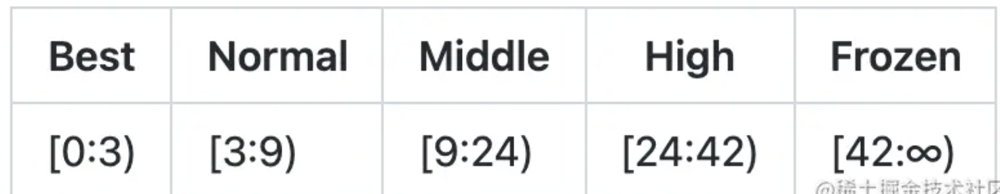
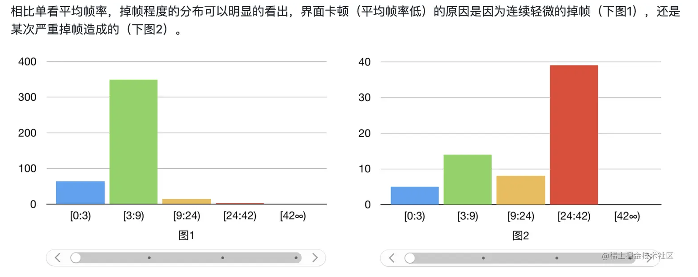

#### FrameTrace的触发时机 ####

```java
@Override
public synchronized void onStart() {
    if (!isInit) {
        MatrixLog.e(TAG, "[onStart] is never init.");
        return;
    }
    if (!isAlive) {
        this.isAlive = true;
        synchronized (this) {
            MatrixLog.i(TAG, "[onStart] callbackExist:%s %s", Arrays.toString(callbackExist), Utils.getStack());
            callbackExist = new boolean[CALLBACK_LAST + 1];
        }
        //1，这个int[]数组用来保存UI渲染一帧中的三个阶段(input、animation、traversal)的开始和结束状态。
        queueStatus = new int[CALLBACK_LAST + 1];
        //2，这个long[]数组则是保存每一帧的三个阶段每个阶段对应的执行耗时
        queueCost = new long[CALLBACK_LAST + 1];
        //3，往input类型的链表中加入一个input阶段的callback。
        addFrameCallback(CALLBACK_INPUT, this, true);
    }
}

```

先看 addFrameCallback 的源码：

```java
private synchronized void addFrameCallback(int type, Runnable callback, boolean isAddHeader) {
   //省略...
    try {
        //通过反射拿到的choreographer中锁对象。
        synchronized (callbackQueueLock) {
            Method method = null;
            switch (type) {
                case CALLBACK_INPUT:
              
                    method = addInputQueue;
                    break;
                case CALLBACK_ANIMATION:
                    method = addAnimationQueue;
                    break;
                case CALLBACK_TRAVERSAL:
                    method = addTraversalQueue;
                    break;
            }
            // 2，最终method就是 CallbackQueue的 addCallbackLocked 方法, 反射调用callback加入type对应的链表结构中
            if (null != method) {
                method.invoke(callbackQueues[type], !isAddHeader ? SystemClock.uptimeMillis() : -1, callback, null);
                callbackExist[type] = true;
            }
        }
    } catch (Exception e) {
        MatrixLog.e(TAG, e.toString());
    }
}

```

外部需要监听每一帧的不同阶段，那么就通过反射的方法对象，注册不同类型的 `callback` 进去即可。

可以看到，我们在 `onStart()` 方法中就注册了一个input类型的callback。后面肯定会走run方法。因此我们接着看下 callback 的`run` 方法：

```java
@Override
public void run() {
    final long start = System.nanoTime();
    try {
        doFrameBegin(token);
        doQueueBegin(CALLBACK_INPUT);

        addFrameCallback(CALLBACK_ANIMATION, new Runnable() {

            @Override
            public void run() {
                doQueueEnd(CALLBACK_INPUT);
                doQueueBegin(CALLBACK_ANIMATION);
            }
        }, true);

        addFrameCallback(CALLBACK_TRAVERSAL, new Runnable() {

            @Override
            public void run() {
                doQueueEnd(CALLBACK_ANIMATION);
                doQueueBegin(CALLBACK_TRAVERSAL);
            }
        }, true);

    } finally {
        if (config.isDevEnv()) {
            MatrixLog.d(TAG, "[UIThreadMonitor#run] inner cost:%sns", System.nanoTime() - start);
        }
    }
}

```

```java
private void doQueueBegin(int type) {
    queueStatus[type] = DO_QUEUE_BEGIN;
    queueCost[type] = System.nanoTime();
}

private void doQueueEnd(int type) {
    queueStatus[type] = DO_QUEUE_END;
    // 计算耗时
    queueCost[type] = System.nanoTime() - queueCost[type];
    synchronized (this) {
        callbackExist[type] = false;
    }
}

```

分别在input、animation、traversal三个阶段的开始和结束打点，然后统计每个阶段的耗时，存起来用作后面的上报。

`onStartTrace()`方法则调用了`onAlive()`：

```java
@Override
public void onAlive() {
    super.onAlive();
    if (isFPSEnable) {
        UIThreadMonitor.getMonitor().addObserver(this);
        Matrix.with().getApplication().registerActivityLifecycleCallbacks(this);
    }
}

```

如果 `isFPSEnable=true`，则注册监听 `LooperObserver` 类的回调。 至此，FrameTrace的初始化工作已经完成了。 后面就是等待回调信息过来，对数据进行处理后整合上报

`LooperObserver` 是一个抽象类，它封装了 looper 消息处理开始和结束的回调

```java
@Override
public void doFrame(String focusedActivity, long startNs, long endNs, boolean isVsyncFrame, long intendedFrameTimeNs, long inputCostNs, long animationCostNs, long traversalCostNs) {
    if (isForeground()) {
        notifyListener(focusedActivity, startNs, endNs, isVsyncFrame, intendedFrameTimeNs, inputCostNs, animationCostNs, traversalCostNs);
    }
}

```

只有在前台才会去做数据的收集和处理，后台情况下不会处理。为什么？ 因为应用不可见的时候是不会进行UI渲染的。这是系统来控制的，避免造成资源白白浪费。

```java
final long jiter = endNs - intendedFrameTimeNs;
//整个绘制过程的帧数： 实际上一帧的耗时/理论每一帧的时间。因此，就是卡顿导致的掉帧数
final int dropFrame = (int) (jiter / frameIntervalNs);

```

matrix根据掉帧数的区间分布，定出了这样一个衡量流畅度的标准



如果一个页面的掉帧数是0~3帧区间，认为是best级别。也就是每一帧的渲染时间基本维持在16ms ~ 48ms之间

这么定义有什么好处呢？ 如果单纯的去看界面的平均帧率，看不出来哪里卡顿了。再有就算每一帧是32ms，只要保持连续帧都是32ms，那么对人眼来说也不认为是卡顿。只有突然出现一帧如 >300ms，那么用户就会觉得不流畅。




**还有就是matrix是通过`looper`的消息结束的时候进行监听的，而不是在`choreographer`的`onVsync`方法中去监听。为什么？**

因为 onVsync只能监听到有卡顿，而不知道哪里卡顿了。 而matrix通过自己在外部不断postcallback到choreographer的队列中，只要发生了UI绘制，那么就肯定会走looper的消息结束接口，然后在计算每个阶段的以及当前帧的耗时。非常的巧妙呀！


