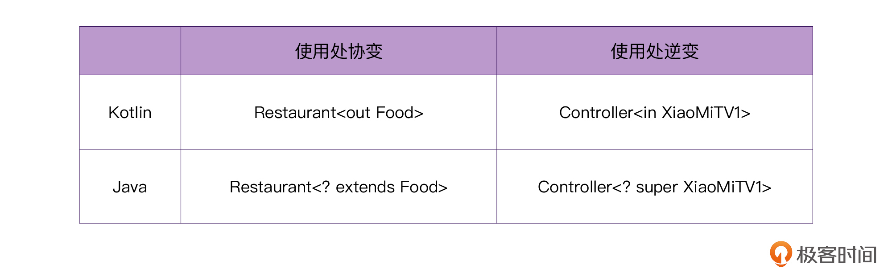

```kotlin
//          T代表泛型的形参
//               ↓
class Controller<T> {
    fun turnOn(tv: T) {}
    fun turnOff(tv: T) {}
}

fun main() {
//                                泛型的实参
//                                   ↓
    val mi1Controller = Controller<XiaoMiTV1>()
    mi1Controller.turnOn()

//                                  泛型的实参
//                                     ↓
    val mi2Controller = Controller<XiaoMiTV2>()
    mi2Controller.turnOn()
}
```

定义了一个“万能遥控器类”Controller，它当中的字母 T 代表了，这个遥控器可以控制很多种型号的电视，至于我们到底想要控制哪种型号，在使用的时候，只需要把 T 替换成实际的电视机型号即可

在定义泛型的时候，其实还可以为它的泛型参数增加一些**边界限制**，比如说，强制要求传入的泛型参数，必须是 TV 或者是它的子类。这叫做**泛型的上界**。

```kotlin
//               差别在这里
//                   ↓
class Controller<T: TV> {
    fun turnOn(tv: T) {}
    fun turnOff(tv: T) {}
}
```

#### 型变（Variance） 

它就是为了解决泛型的不变性问题。事实上，型变讨论的是：在已知 Cat 是 Animal 的子类的情况下，``MutableList<Cat>``与``MutableList<Animal>``之间是什么关系。

```kotlin
// 需要父类集合，传入子类集合

foo(list: MutableList<Animal>) {
    // 出错，Cat集合不能存Dog对象
    list.add(Dog())
    // 通过
    val animal: Animal = list[0] // 取出的Cat对象
}

fun main() {
    // 需要MutableList<Animal>，实际传MutableList<Cat>
    foo(mutableListOf<Cat>(Cat()))
    // 实际上，编译器在这里就会提示错误，我们现在假设编译器不阻止我们，会出什么问题
}
```

当程序需要 Animal 的集合时，如果我们传入的是 Cat 的集合，我们就可以往 list 里添加其他类型的动物，比如 Dog。然而，Dog 是无法存入 Cat 的集合的。

那么如果我们反过来呢

```kotlin
// 需要子类集合，传入父类集合

foo(list: MutableList<Cat>) {
    // 通过
    list.add(Cat())
    // 出错
    val cat: Cat = list[0] // 实际取出来的是Animal对象
}

fun main() {
    // 需要MutableList<Cat>，实际传MutableList<Animal>
    foo(mutableListOf(Animal()))
    // 实际上，编译器在这里就会提示错误，我们现在假设编译器不阻止我们，会出什么问题
}
```

编译器会认为``MutableList<Cat>``与``MutableList<Animal>``之间**不存在任何继承关系**，它们也无法互相替代，这样就不会出现前面提到的两种问题。这就是**泛型的不变性**。

在某些特定场景下，编译器这种行为还是会给我们带来麻烦的。而这个时候，就需要泛型的逆变与协变了

#### 逆变（Contravariant） 

```kotlin
open class TV {
    open fun turnOn() {}
}

class XiaoMiTV1: TV() {
    override fun turnOn() {}
}

class Controller<T> {
    fun turnOn(tv: T)
}
```

``Controller<XiaoMiTV1>``和``Controller<TV>``之间是什么关系呢？让我们来设想一个买遥控器的场景：

```kotlin
//                      需要一个小米电视1的遥控器
//                                ↓
fun buy(controller: Controller<XiaoMiTV1>) {
    val xiaoMiTV1 = XiaoMiTV1()
    // 打开小米电视1
    controller.turnOn(xiaoMiTV1)
}
```

那么，当我们需要打开一台小米电视机的时候，我们是否可以用一个“万能的遥控器”呢？当然可以！所以，我们可以写出下面这样的代码：

```kotlin
fun main() {
//                             实参
//                              ↓
    val controller = Controller<TV>()
    // 传入万能遥控器，报错
    buy(controller)
}
```

不过 Kotlin 编译器会报错，报错的内容是说“类型不匹配”，需要的是小米遥控器``Controller<XiaoMiTV1>``，你却买了个万能遥控器``Controller<TV>``。

所以，为了让我们的代码通过编译，我们需要主动告诉编译器一些额外的信息，具体的做法有两种。

**第一种做法，**是修改泛型参数的使用处代码，它叫做**使用处型变**。具体做法就是修改 buy 函数的声明，在 XiaoMiTV1 的前面增加一个 in 关键字：

```kotlin
//                         变化在这里
//                             ↓
fun buy(controller: Controller<in XiaoMiTV1>) {
    val xiaoMiTV1 = XiaoMiTV1()
    // 打开小米电视1
    controller.turnOn(xiaoMiTV1)
}
```

**第二种做法**，是修改 Controller 的源代码，这叫**声明处型变**。具体做法就是，在泛型形参 T 的前面增加一个关键字 in：

```kotlin
//            变化在这里
//               ↓
class Controller<in T> {
    fun turnOn(tv: T)
}
```

你会发现：在这个场景下，遥控器与电视机之间的父子关系颠倒了。**“小米电视”是“电视”的子类，但是，“万能遥控”成了“小米遥控”的子类**。这种父子关系颠倒的现象，我们就叫做“**泛型的逆变**

#### 协变（Covariant）

普通的食物、肯德基的食物，它们两者之间是父子关系。

```kotlin
open class Food {}

class KFC: Food() {}

class Restaurant<T> {
    fun orderFood(): T { /*..*/ }
}
```

```kotlin
//                      这里需要一家普通的饭店，随便什么饭店都行
//                                     ↓
fun orderFood(restaurant: Restaurant<Food>) {
    // 从这家饭店，点一份外卖
    val food = restaurant.orderFood()
}

fun main() {
//                  找到一家肯德基
//                        ↓
    val kfc = Restaurant<KFC>()
// 需要普通饭店，传入了肯德基，编译器报错
    orderFood(kfc)
}
```

如果我们直接运行上面的代码，会发现编译器提示最后一行代码报错，报错的原因同样是：“类型不匹配”，我们需要的是一家随便类型的饭店``Restaurant<Food>``，而传入的是肯德基``Restaurant<KFC>``，不匹配。

**第一种做法**，还是修改泛型参数的使用处，也就是使用处型变。具体的做法就是修改 orderFood() 函数的声明，在 Food 的前面增加一个 out 关键字：

```kotlin
//                                变化在这里
//                                    ↓
fun orderFood(restaurant: Restaurant<out Food>) {
    // 从这家饭店，点一份外卖
    val food = restaurant.orderFood()
}
```

**第二种做法**，是修改 Restaurant 的源代码，也就是声明处型变。具体做法就是，在它泛型形参 T 的前面增加一个关键字 out：

```kotlin
//            变化在这里
//                ↓
class Restaurant<out T> {
    fun orderFood(): T { /*..*/ }
}
```

Java 当中是没有声明处型变的。Java 里面只有使用处型变



#### 实战与思考

* 对于逆变的情况，我们模拟的是买遥控器的场景。**我们的泛型 T，它最终会以函数的参数的形式，被传入函数的里面，这往往是一种写入行为，这时候，我们使用关键字 in。**
* 对于协变的情况，我们的泛型 T，它最终会以**返回值的形式，被传出函数的外面**，**这往往是一种读取行为，这时候，我们使用关键字 out。**

将其总结为：传入 in，传出 out。或者，我们也可以说：泛型作为参数的时候，用 in，泛型作为返回值的时候，用 out。

Kotlin 源码当中型变的应用。首先，是逆变的应用

```kotlin
//                          逆变
//                           ↓
public interface Comparable<in T> {
//                                   泛型作为参数
//                                       ↓
    public operator fun compareTo(other: T): Int
}
```


```kotlin
sealed class Result<out R> {
//                     协变    ①
//                      ↓      ↓
    data class Success<out T>(val data: T, val message: String = "") : Result<T>()

    data class Error(val exception: Exception) : Result<Nothing>()

    data class Loading(val time: Long = System.currentTimeMillis()) : Result<Nothing>()
}
```

这里为什么可以使用协变呢？前面我们不是说过：“泛型作为参数，用 in；泛型作为返回值，用 out”吗？这里并没有任何函数参数或者返回值啊？

val 在 Kotlin 当中，代表不可变的变量，当它修饰类成员属性的时候，代表它只有 getter，没有 setter。

所以，**我们可以用 out 修饰 Success 泛型的原因，是因为 data 的 getter 方法，它本质上是一个返回 T 类型的方法**。这时候，如果我们将注释①处的 val 改为 var，那么代码就会立马报错。

```kotlin
sealed class Result<out R> {
//                 改为var后，编译器就会立马报错
//                             ↓
    data class Success<out T>(var data: T, val message: String = "") : Result<T>()

    data class Error(val exception: Exception) : Result<Nothing>()

    data class Loading(val time: Long = System.currentTimeMillis()) : Result<Nothing>()
}
```

编译器报错的原因是由于 var 修饰的成员属性，Kotlin 编译器会在背后生成对应 getter 和 setter，这个时候泛型参数既是“参数”也是“返回值”。所以，如果此时我们还用 out 修饰泛型 T，编译器就会报错了。
