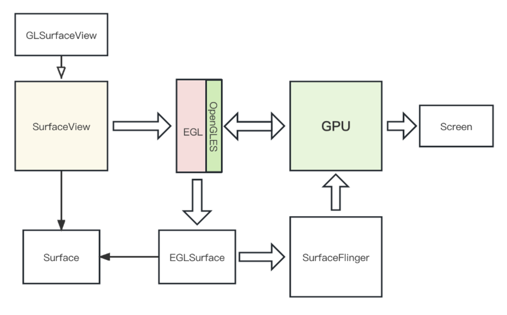
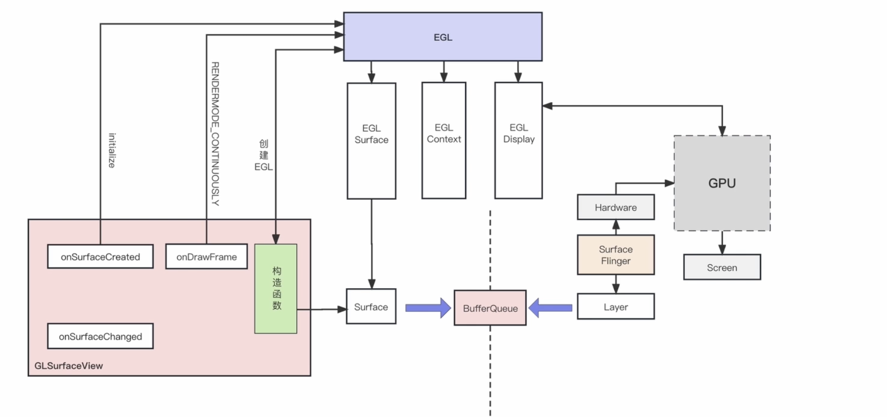
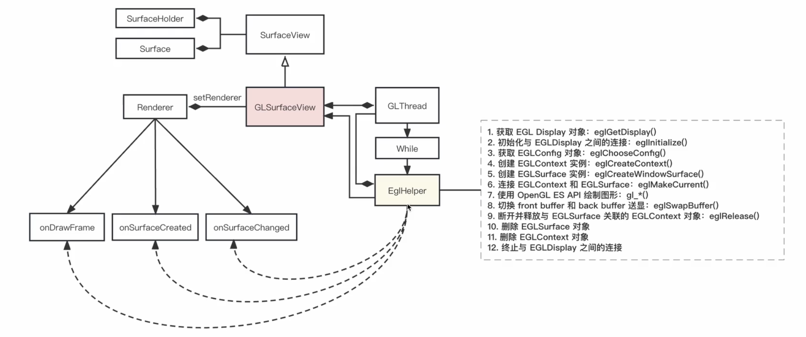
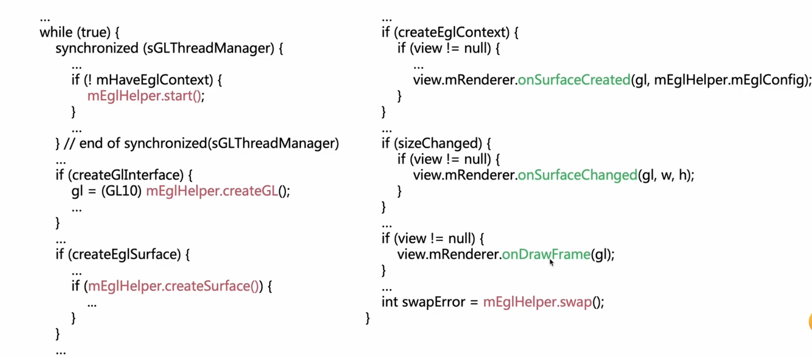
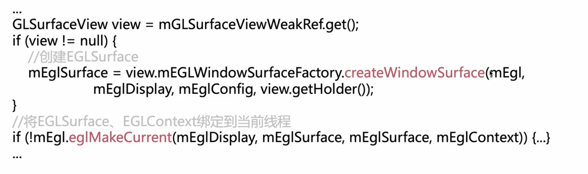
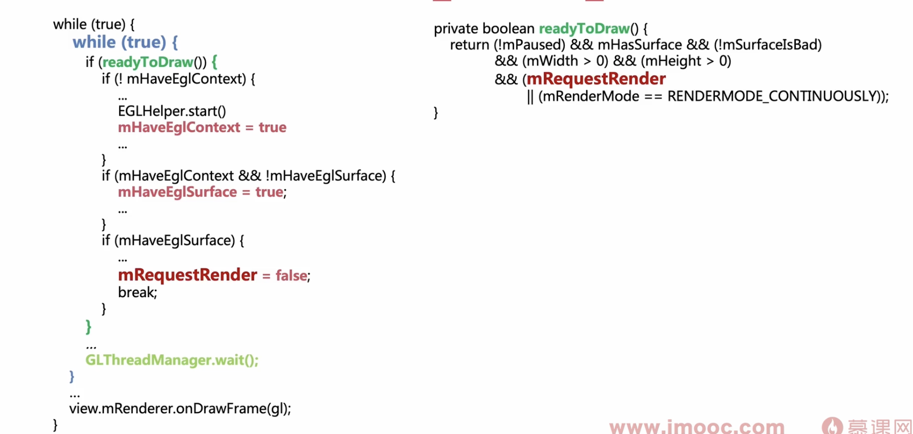

Android系统下OpenGL环境建立的原理图



* Surfaceview，它是View的子类，它自己会管理一个单独的Surface，因此这种类型的View更具有灵活性，尤其可以实现窗口浮动的功能。
* GLSurfaceview，它是Surfaceview的子类。我们使用OpenGL对视频、图像渲染时，一般不直接使用Surfaceview。其原因是Surfaceview虽然灵活，但其内部并没有自动构造OpenGL环境，而开发者自己实现这部分代码还是挺麻烦的,**在其内部会启动一个新的渲染线程，并在这个渲染线程中构造OpenGL环境，这样就大大减轻了开发者的负担。**
* Surface我们应该都非常清楚了，它是一个视频帧缓冲区队列的管理者，**用于在不同的进程之间传递视频帧或图像**。每当我们创建一个**Surfaceview或GLSurfaceview对象时，在其内部就会自动创建一个Surface。**
* EGL，它是OpenGLES的上下文，在我们使用OpenGL之前首先要先创建这个上下文。在创建EGL时，它会做以下几件事儿
  * 动态加载OpenGL库
  * 初始化OpenGL库，并获得其版本
  * 设置配置参数
  * **创建EGLSurface，并将它与Surfaceview中的Surface进行绑定**
* **EGLSurface，它是OpenGL的输出缓冲区**，当我们**使用OpenGL渲染视频、图像时，会将结果输出到EGLSurface中**。其实它就是Surfaceview中Surface的一个外壳，最终经过OpenGL渲染的数据会交由Surface管理。此时OpenGL就与Surfaceview或GLSurfaceview建立好了连接。
* **SurfaceFlinger**，它是Android系统一种后台服务。当**我们通过OpenGL让GPU对图像处理后，会将结果保存到EGLSurface中**。而**SurfaceFlinger则会为每个View中的Surface创建一个Layer，并让Layer成为Surface的消费者，从Surface中读取数据最终交由SurfaceFlinger进行合成。**
* Screen，它表示的是显示器，上面SurfaceFlinger通过Hardware(GPU)合成图层工作后，就会将最终的结果输出给Screen显示出来。

### OpenGL高效渲染的过程 ###



* EglGetDisplay， 获取EGLDisplay并加载OpenGLES库
  * gelInitialize, 初始化OpenGLES库，获取库的版本号
  * eglChooseConfig，传入期望的帧参数，获取EGLConfig
  * eglCreateContext,创建OpenGL ES上下文
  * eglCreateWindowSurface，创建EGLSurface
  * eglMakeCurrent， 将EGLContext与EGLSurface绑定到当前线程

#### GLSurfaceView内部架构 ###



setRenderer函数

```java
public void setRenderer(Renderer renderer){
  mRenderer = renderer;
  mGLThread = new GLThread(mThisWeakRef)
  mGLThread.start(); //启动后开始死循环
}
```

GLThread中Run函数主要逻辑：



* mEglHelper.swap() 把数据显示到屏幕上

* mEglHelper.start

  * ```c
    mEgl = (EGL10)EGLContext.getEGL();
    
    mEglDisplay = mEgl.eglGetDisplay(EGL10.EGL_DEFAULT_DISPLAY);//加载opengl库
    int[] version = new int[2];
    if(!mEgl.eglInitialize(mEglDisplay,version)){...}//初始化opengl库
    
    mEglConfig = view.mEGLConfigChooser.chooseConfig(mEgl,mEglDisplay);
    
    //Get OpenGL上下文
    mEglContext = view.mEGLContextFactory.createContext(mEgl,mEglDisplay,mEglConfig);
    ```

* mEglHelper.createSurface():   创建EGLSurface



* 回调onDrawFrame之后会调用mEglHelper.swap()函数来渲染到屏幕上（即调用eglSwapBuffers）

onDrawFrame就是通过回调的openGL上下文来调用shader等程序处理GPU 图像数据，最后调用eglSwapBuffers 来渲染到屏幕

#### RENDERMODE_CONTINUOUSY ####

刷新频率由eglSwapBuffers来控制

* 调用eflSwapBuffers后线程会阻塞，知道GPU下一帧通知过来的时候被唤醒继续执行上述的while循环

#### RENDERMODE_WHEN_DIRTY 

每当画面有变化时才更新

更新画面需要主动调用requestRender()函数



* Thread 循环中还有一个小的while循环，小循环会执行readyToDraw()的判断
* 如果DIRTY模式 且 mRequestRender标记为 false则会进入 GLThreadManager.wait() 等待
* 直到主动调用requestRender函数后会唤起等待的thread,然后执行onDrawframe
* 下次的readyToDraw就会true，然后又会将mRequestRender置为false