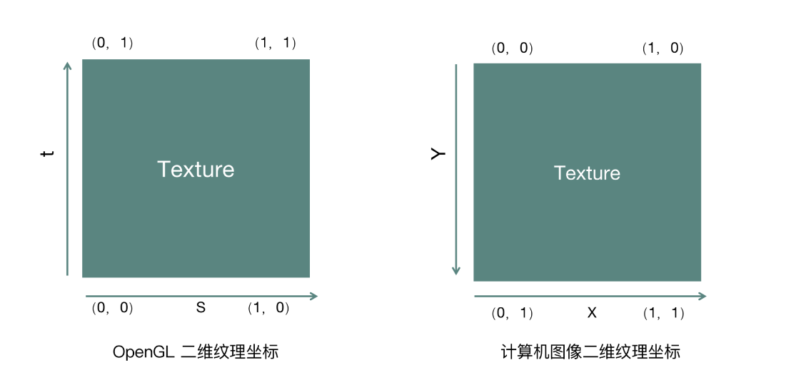
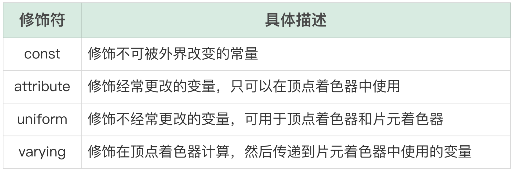
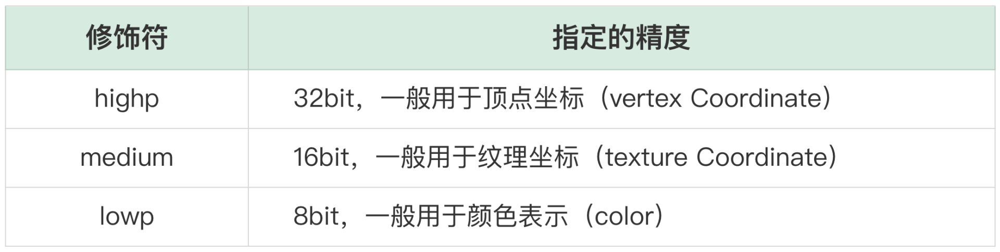

### OpenGL ES 的纹理 ###

* OpenGL 中的纹理用 GLUint 类型来表示，通常我们称之为 Texture 或者 TextureID，可以用来表示图像、视频画面等数据。
* 每个二维纹理都由许多小的片元组成，每一个片元我们可以理解为一个像素点
* 大多数的渲染过程，都是基于纹理进行操作的，最简单的一种方式就是从一个图像文件加载数据，然后上传到显存中构造成一个纹理

#### 纹理坐标系 ####



这种坐标其实是和 OpenGL 中的纹理坐标做了一个旋转 180 度，从本地图片中加载一张纹理并且渲染到界面上的时候，就会用到纹理坐标和计算机系统的坐标的转换。


##### 纹理创建与绑定  ####

如何**加载一张图片作为 OpenGL 中的纹理**。首先要在显卡中创建一个纹理对象

```c
void glGenTextures (GLsizei n, GLuint* textures)
```

* 第一个参数是需要创建几个纹理对象
* 第二个参数是一个数组（指针）的形式，**函数执行之后会将创建好的纹理句柄放入到这个数组中**
* 如果仅仅需要创建一个纹理对象的话，只需要声明一个 GLuint 类型的 texId**，然后将这个纹理 ID 取地址作为第二个参数，就可以创建出这个纹理对象**

```
glGenTextures(1, &texId);
```

执行完上面这个指令之后，**OpenGL 引擎就会在显卡中创建出一个纹理对象，并且把这个纹理对象的句柄存储到 texId 这个变量中。**

接下来我们要对这个纹理对象进行操作，具体应该怎么做呢？OpenGL ES 提供的都是类似于状态机的调用方式，也就是说在对某个 **OpenGL ES 对象操作之前，先进行绑定操作，然后接下来所有操作的目标都是针对这个绑定的对象进行的**

```c
glBindTexture(GL_TEXTURE_2D, texId);
```

执行完上面这个指令之后，OpenGL ES 引擎认为这个纹理对象已经处于绑定状态，**那么接下来所有对于纹理的操作都是针对这个纹理对象的了**

当我们操作完毕之后可以调用如下代码进行解绑：

```c
glBindTexture(GL_TEXTURE_2D, 0);
//代表我们不会对 texId 这个纹理对象做任何操作了，所以上面这行代码一般在一个 GLProgram 执行完成之后调用。
```

那一般对纹理的操作或者设置有哪些呢？

首先就是纹理的过滤方式，当纹理对象被渲染到物体表面上的时候，纹理的过滤方式指定纹理的放大和缩小规则

```c
//放大（magnification）规则的设置：
glTexParameteri(GL_TEXTURE_2D, GL_TEXTURE_MAG_FILTER, GL_LINEAR);

//缩小（minification）规则的设置：
glTexParameteri(GL_TEXTURE_2D, GL_TEXTURE_MIN_FILTER, GL_LINEAR);

//这种过滤方式叫做双线性过滤，底层使用双线性插值算法来平滑像素之间的过渡部分，OpenGL 的具体实现会使用四个邻接的纹理元素，并在它们之间用一个线性插值算法做插值，这种过滤方式是最常用的。
```

OpenGL 还提供了 GL_NEAREST 的过滤方式，GL_NEAREST 被称为最邻近过滤，底层为每个片段选择最近的纹理元素进行填充，缺点就是当放大的时候会丢失掉一些细节，会有很严重的锯齿效果

接下来，我们看纹理对象的另外一个设置，也就是在纹理坐标系中的 s 轴和 t 轴超出范围的纹理处理规则

```c
glTexParameteri(GL_TEXTURE_2D, GL_TEXTURE_WRAP_S, GL_CLAMP_TO_EDGE);
glTexParameteri(GL_TEXTURE_2D, GL_TEXTURE_WRAP_T, GL_CLAMP_TO_EDGE);

//给这个纹理的 s 轴和 t 轴的坐标设置为 GL_CLAMP_TO_EDGE 类型，代表所有大于 1 的像素值都按照 1 这个点的像素值来绘制，所有小于 0 的值都按照 0 这个点的像素值来绘制

//GL_REPEAT 代表超过 1 的会从 0 再重复一遍，也就是再平铺一遍，而 GL_MIRRORED_REPEAT 就是完全镜像地平铺一遍。
```

#### 纹理的上传与下载 ####

* 假设我们有一张 PNG 类型的图片，我们需要将它解码为内存中 RGBA 裸数据，所以首先我们需要解码
* 可以采用跨平台（C++ 层）的方式，引用 libpng 这个库来进行解码操作，当然也可以采用各自平台的 API 进行解码。无论哪一种方式，最终都可以得到 RGBA 的数据
* 等拿到 RGBA 的数据之后，记为 uint8_t 数组类型的 pixels。

接下来，就是要将 PNG 素材的内容放到这个纹理对象上面去了，如何上传到纹理上面去呢？代码如下：

```c
glTexImage2D(GL_TEXTURE_2D, 0, GL_RGBA, width, height, 0, GL_RGBA,
        GL_UNSIGNED_BYTE, pixels);
```

* 执行上述指令的前提是我们已经绑定了某个纹理
* OpenGL 的大部分纹理一般只接受 RGBA 类型的数据
* 上述指令正确执行之后，**RGBA 的数组表示的像素内容会上传到显卡里面 texId 所代表的纹理对象中**，以后要使用这个图片，直接使用这个纹理 ID 就可以了。

既然有内存数据上传到显存的操作，那么一定也会有显存的数据回传回内存的操作，这个应该如何实现呢？代码如下：

```c
glReadPixels(0, 0, width, height, GL_RGBA, GL_UNSIGNED_BYTE, pixels);
```

将绑定的这个纹理对象代表的内容拷贝回 pixels 这个数组中，这个拷贝会比较耗时，并且拷贝时间会和分辨率（width\height）大小成正比。一般在实际的开发工作中要尽量避免这种内存和显存之间的数据拷贝与传输，**而是使用各个平台提供的快速映射 API 去完成内存与显存的拷贝工作。**

接下来的任务就是将这个纹理绘制到物体（屏幕）上，首先要搭建好各自平台的 OpenGL ES 的环境，包括上下文与窗口管理，然后创建显卡可执行程序，最终让程序跑起来

先来看一个最简单的顶点着色器（Vertex Shader）

```glsl
static char* COMMON_VERTEX_SHADER =
      "attribute vec4 position;                   \n"
      "attribute vec2 texcoord;                   \n"
      "varying vec2 v_texcoord;                   \n"
      "                                            \n"
      "void main(void)                              \n"
      "{                                              \n"
      "   gl_Position = position;                 \n"
      "   v_texcoord = texcoord;                  \n"
      "}                                              \n";
```

片元着色器（Fragment Shader），代码如下

```glsl
static char* COMMON_FRAG_SHADER =
      "precision highp float;                                       \n"
      "varying highp vec2 v_texcoord;                               \n"
      "uniform sampler2D texSampler;                                \n"
      "                                                               \n"
      "void main() {                                                 \n"
      "    gl_FragColor = texture2D(texSampler, v_texcoord);      \n"
      "}                                                                                                                                       \n";
```

* 利用上面两个 Shader 创建好的这个 Program，我们记为 mGLProgId
* 这个 Program 中的重点属性以及常量的句柄寻找出来，以备后续渲染过程中向顶点着色器和片元着色器传递数据。

```c
mGLVertexCoords = glGetAttribLocation(mGLProgId, "position");
mGLTextureCoords = glGetAttribLocation(mGLProgId, "texcoord");
mGLUniformTexture = glGetUniformLocation(mGLProgId, "texSampler");
```

* 我们要从 Program 的顶点着色器中读取两个 attribute，并放置到全局变量的 mGLVertexCoords 与 mGLTextureCoords 中
* 从 Program 的片元着色器中读取出来的 uniform 会放置到 mGLUniformTexture 这个变量里。

```c
glViewport(0, 0, screenWidth, screenHeight); //规定窗口大小： 函数中的参数 screenWidth 表示绘制 View 或者目标 FBO 的宽度，screenHeight 表示绘制 View 或者目标 FBO 的高度。

glUseProgram(mGLProgId); //使用显卡绘制程序：

//设置物体坐标与纹理坐标：
GLfloat vertices[] = { -1.0f, -1.0f, 1.0f, -1.0f, -1.0f, 1.0f, 1.0f, 1.0f };
glVertexAttribPointer(mGLVertexCoords, 2, GL_FLOAT, 0, 0, vertices);
glEnableVertexAttribArray(mGLVertexCoords);


//设置纹理坐标：
GLfloat texCoords1[] = { 0.0f, 0.0f, 1.0f, 0.0f, 0.0f, 1.0f, 1.0f, 1.0f };
GLfloat texCoords2[] = { 0.0f, 1.0f, 1.0f, 1.0f, 0.0f, 0.0f, 1.0f, 0.0f };
glVertexAttribPointer(mGLTextureCoords, 2, GL_FLOAT, 0, 0,  texCoords2);
glEnableVertexAttribArray(mGLTextureCoords);


```

* 代码中有两个纹理坐标数组，分别是 texCoords1 与 texCoords2，最终我们使用的是 texCoords2 这个纹理坐标
* 因为我们的纹理对象是将一个 RGBA 格式的 PNG 图片上传到显卡上，其实**上传上来本身就需要转换坐标系，这两个纹理坐标恰好就是做了一个上下的翻转，从而将计算机坐标系和 OpenGL 坐标系进行转换。**
* 对于第一次上传内存数据的场景纹理坐标一般都会选用 texCoords2
* 但是如果这个纹理对象是 OpenGL 中的一个普通纹理对象的话，则需要使用 texCoords1。(不用转换坐标了)

指定我们要绘制的纹理对象，并且将纹理句柄传递给片元着色器中的 uniform 常量：

```c
glActiveTexture(GL_TEXTURE0);
glBindTexture(GL_TEXTURE_2D, texId);
glUniform1i(mGLUniformTexture, 0);

//执行绘制操作：
glDrawArrays(GL_TRIANGLE_STRIP, 0, 4);
```

相当于将最初内存中的 PNG 图片绘制到默认的 FBO 上去了，最终再通过各平台的窗口管理操作（Android 平台的 swapBuffer、iOS 平台的 renderBuffer），就可以让用户在屏幕上看到了。


除此之外，关于纹理的绘制我们还要额外注意一点：**我们提交给 OpenGL 的绘图指令并不会马上送给图形硬件执行，而是会放到一个指令缓冲区中。考虑性能的问题，等缓冲区满了以后，这些指令会被一次性地送给图形硬件执行**，指令比较少或比较简单的时候，是没办法填满缓冲区的，所以这些指令不能马上执行，也就达不到我们想要的效果。因此每次写完绘图代码，想让它立即完成效果的时候，就需要我们自己手动调用 glFlush() 或 gLFinish() 函数。


### GLSL 语法与内建函数 ###

这个部分的目标就是实现一组着色器来完成增强对比度的功能，但是这组着色器还不能直接看到效果，因为着色器是需要运行到显卡中的

GLSL（OpenGL Shading Language）就是 OpenGL 为了实现着色器给开发人员提供的一种开发语言。

GLSL 中变量的修饰符，具体如下：



**GLSL 的基本数据类型：int、float、bool**，这些都是和 C 语言一致的，有一点需要强调的就是，GLSL 中的 float 是可以再加一个修饰符的，这个修饰符用来指定精度。修饰符的可选项有三种：



向量类型是 Shader 中最常用的一个数据类型，因为在做数据传递的时候经常要传递多个参数，相较于写多个基本数据类型，使用向量类型更加简单

比如，通过 OpenGL 接口把物体坐标和纹理坐标传递到顶点着色器中，用的就是向量类型。每个顶点都是一个四维向量，在顶点着色器中利用这两个四维向量就能去做自己的运算

```c
attribute vec4 position;
```

矩阵类型在 GLSL 中同样也是一个非常重要的数据类型，**在某些效果器的开发中，需要开发者自己传入一些矩阵类型的数据，用于像素计算。比如 GPUImage 中的怀旧效果器，就需要传入一个矩阵来改变原始的像素数据**

```
uniform lowp mat4 colorMatrix;
```

上面的代码表示的是一个 44 的浮点矩阵，如果是 mat2 的声明，代表的就是 22 的浮点矩阵，而 mat3 代表的就是 3*3 的浮点矩阵。OpenGL 为开发者提供了以下接口，把内存中的数据（mColorMatrixLocation）传递给着色器。

```c
glUniformMatrix4fv(mColorMatrixLocation, 1, false, mColorMatrix);
//mColorMatrix 是这个变量在接口程序中的句柄。这里一定要注意，上边的这个函数不属于 GLSL 部分，而是属于客户端代码
```

下面 GLSL 代码是**二维纹理类型**的声明方式。

```
uniform sampler2D texSampler；
```

那客户端如何写代码来把图像传递进来呢？**首先我们需要拿到这个变量的句柄，定义为 mGLUniformTexture**，然后就可以给它绑定一个纹理

```c
glActiveTexture(GL_TEXTURE0); //激活的是哪个纹理句柄
glBindTexture(GL_TEXTURE_2D, texId);
glUniform1i(mGLUniformTexture, 0);
```

比如说**代码中激活的纹理句柄是 GL_TEXTURE0，对应的第三行代码中的第二个参数 Index 就是 0**，如果激活的纹理句柄是 GL_TEXTURE1，那对应的 Index 就是 1，句柄的个数在不同的平台不一样，但是一般都会在 32 个以上。

在 GLSL 中有一个特殊的修饰符就是 varying，这个修饰符修饰的变量都是用来在顶点着色器和片元着色器之间传递参数的。最常见的使用场景就是在顶点着色器中修饰纹理坐标，顶点着色器会改变这个纹理坐标，然后把这个坐标传递到片元着色器

```c
attribute vec2 texcoord;
varying vec2 v_texcoord;
void main(void)
{
    //计算顶点坐标
    v_texcoord = texcoord;
}

//在片元着色器中也要声明同名的变量，然后使用 texture2D 方法来取出二维纹理中这个纹理坐标点上的纹理像素值
varying vec2 v_texcoord;
vec4 texel = texture2D(texSampler, v_texcoord);
```

取出了这个坐标点上的像素值，就可以进行像素变化操作了，比如说去提高对比度，最终将改变的像素值赋值给 gl_FragColor。

### GLSL 的内置变量与内嵌函数 ###

常见的是两个 Shader 的输出变量，一个是顶点着色器的内置变量 gl_position，**它用来设置顶点转换到屏幕坐标的位置。**

```
vec4 gl_posotion;
```

片元着色器的内置变量 gl_FragColor，用来指定当前纹理坐标所代表的像素点的最终颜色值。

```c
vec4 gl_FragColor;
```


