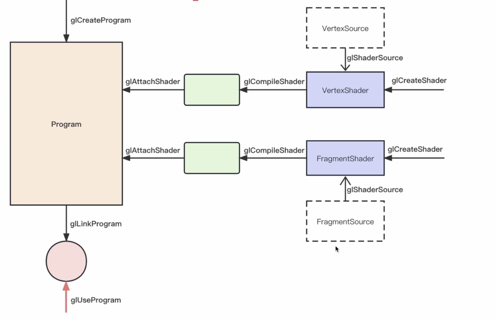

#### OpenGL shader程序的编译过程

#### shader中数据的传输

* glGetAttribLocation 来获取vPositon 在Prog中的引角
* glEnableVertexAttribArray 开启获取的引角id
* glVertexAttribPointer  给指定的引角传递数据

* glGetUniformLocation 获取vColor 引角
* glUniform4fv 向指定引角传递color数据

#### glDrawArrays

* 触发Shader程序工作
* 同时指定了绘制的基本图形以及读取数据的位置和数量