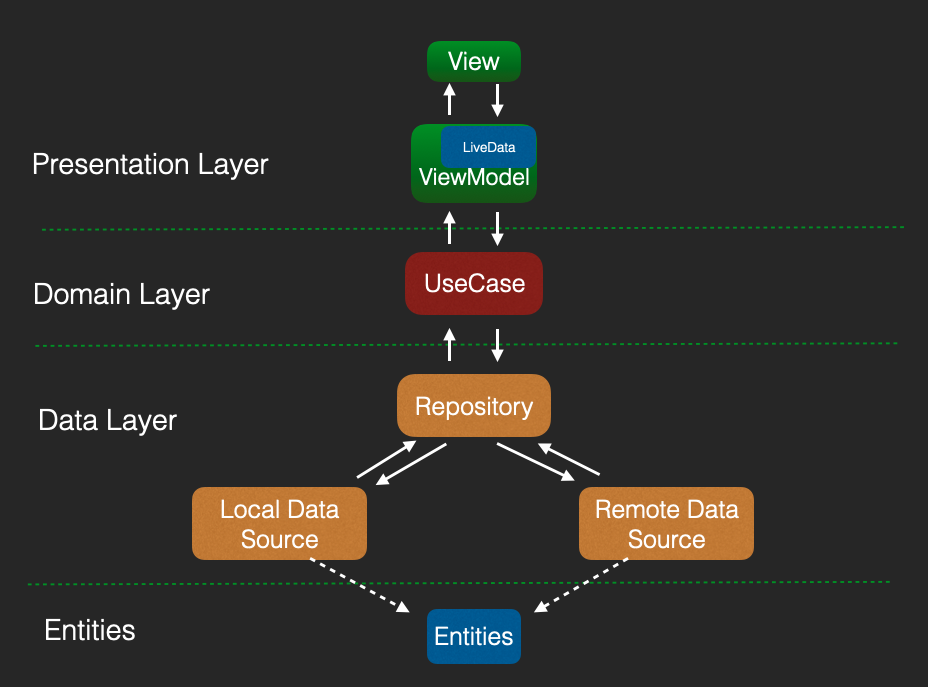

* 实体层，这里其实就是我们平时定义的一些 Bean 的实体类，用 Kotlin 的数据类即可
* 数据层，这里一般会有两个概念，分别是 DataSource 与 Repository，前者代表数据源，后者代表数据仓库。数据源一般会区分本地数据源和远程数据源，而数据仓库则会统筹它们两者。
* 领域层，这里一般会是一些相对具体一些的业务逻辑。
* 表现层，这里则是接近 UI 展示的上层逻辑了。

##### 实体层

```kotlin
sealed class ResultX<out R: Any> {

    data class Success<out T: Any>(val data: T) : ResultX<T>()
    data class Error(val exception: Exception) : ResultX<Nothing>()
    object Loading : ResultX<Nothing>()

    override fun toString(): String {
        return when (this) {
            is Success<*> -> "Success[data=$data]"
            is Error -> "Error[exception=$exception]"
            Loading -> "Loading"
        }
    }
}
```

```kotlin
data class RepoList(
    val count: Int = 0,
    val items: List<Repo> = listOf(),
    val msg: String = "数据为空"
)

data class Repo(
    val added_stars: String = "",
    val avatars: List<String> = listOf(),
    val desc: String = "",
    val forks: String = "",
    val lang: String = "",
    val repo: String = "",
    val repo_link: String = "",
    val stars: String = ""
)
```

##### 数据层

```kotlin
//远程数据源
interface RepoDataSource {
    suspend fun getRepos(): ResultX<RepoList>
}
//数据源管理
interface IRepository {
    suspend fun getRepoList(): ResultX<RepoList>
}
```

```kotlin
object RetrofitClient {

    private const val TAG = "OkHttp"
    private const val BASE_URL = "https://baseUrl.com/"
    private const val TIME_OUT = 10

    val moshi: Moshi by lazy {
        Moshi.Builder()
            .add(KotlinJsonAdapterFactory())
            .build()
    }

    val service by lazy { getService(RepoService::class.java, BASE_URL) }

    private val client: OkHttpClient by lazy {
        val builder = OkHttpClient.Builder()
        builder.connectTimeout(TIME_OUT.toLong(), TimeUnit.SECONDS)
        builder.build()
    }

    private fun <S> getService(
        serviceClass: Class<S>,
        baseUrl: String,
        client: OkHttpClient = this.client
    ): S {
        return Retrofit.Builder()
            .client(client)
            .addConverterFactory(MoshiConverterFactory.create(moshi))
            .baseUrl(baseUrl)
            .build().create(serviceClass)
    }
}

interface RepoService {
    @GET("repo")
    suspend fun repos(@Query("lang") lang: String = "Kotlin", @Query("since") since: String = "weekly"): RepoList
}
```


```kotlin
object RemoteRepoDataSource : RepoDataSource {
    const val TAG = "RemoteRepoDataSource"
    override suspend fun getRepos(): ResultX<RepoList> =
        withContext(Dispatchers.IO) {
            try {
                Success(RetrofitClient.service.repos())
            } catch (e: Exception) {
                Log.e(TAG, e.message, e)
                Error(e)
            }
        }
}
```

实现了 RepoDataSource 这个数据源的接口。而它具体的实现方法，是使用 withContext{} 将 API 请求分发到了 IO 线程池，然后根据实际的运行结果，将数据封装成对应的 ResultX 的子类型。

数据仓库它一般是用于统筹缓存数据、远程数据的，这里为了不引入过多的复杂度，我们简单来实现：

```kotlin
class MainRepository(
    private val dataSource: RepoDataSource = RemoteRepoDataSource,
    private val localDataSource: RepoDataSource? = null
) : IRepository {
    override suspend fun getRepoList(): ResultX<RepoList> {
        // 暂不处理缓存逻辑
        return dataSource.getRepos()
    }
}
```

##### 领域层

所谓领域层，其实就像是业务逻辑的一个小单元，这里的小单元，我们可以将其称为 UseCase。

```kotlin
class GetRepoListUseCase(private val repository: IRepository = MainRepository()) {
    suspend operator fun invoke(): ResultX<RepoList> {
        return repository.getRepoList()
    }
}
```

在实际的工作场景中，UseCase 是可以承载复杂的业务逻辑的。

##### 表现层

这里主要涉及到 ViewModel 还有 Activity、Fragment。我们先来看看 ViewModel。

```kotlin
class MainViewModel(
    val getRepoListUseCase: GetRepoListUseCase = GetRepoListUseCase()
) : ViewModel() {
    val repos: LiveData<RepoList>
        get() = _repos
    private val _repos = MutableLiveData<RepoList>()

    fun loadRepos() {
        viewModelScope.launch {
            val result = getRepoListUseCase()
            when (result) {
                is ResultX.Success -> {
                    _repos.value = result.data
                }
                is ResultX.Error -> {
                    _repos.value = RepoList()
                }
                ResultX.Loading -> {
                    // 展示Loading
                }
            }
        }
    }
}
```

在 loadRepos() 这个方法中，我们用到了 viewModelScope.launch {} 来启动协程。我们知道以这种方式启动的协程是不会发生泄漏的，其中的协程任务会随着 Activity 的销毁而取消。

最后，就是 Activity 当中的逻辑了

```kotlin
class MainActivity : AppCompatActivity() {
    // 1
    private val viewModel: MainViewModel by viewModels()
    // 2
    private lateinit var binding: ActivityMainBinding

    private lateinit var adapter: RepoAdapter
    private val layoutManager = LinearLayoutManager(this, LinearLayoutManager.VERTICAL, false)

    override fun onCreate(savedInstanceState: Bundle?) {
        super.onCreate(savedInstanceState)
        binding = ActivityMainBinding.inflate(layoutInflater)
        setContentView(binding.root)

        viewModel.loadRepos()
        observeData()
    }

    private fun observeData() {
        // 3
        viewModel.repos.observe(this) {
            display(it)
        }
    }

    private fun display(repoList: RepoList) {
        adapter = RepoAdapter(repoList)
        binding.recycler.layoutManager = layoutManager
        binding.recycler.adapter = adapter
    }
}
```

可以看到，我们在 ViewModel 当中定义了一组 LiveData，并且针对它的读写做了限制

* 注释 1，这里我们使用了委托的语法，将 ViewModel 的创建交给了"by viewModels()"。它其实是 Activity 的一个扩展函数，是由 KTX 实现的
* 注释 2，ActivityMainBinding，这里我们使用了 Jetpack 当中的 ViewBinding，这样我们就不用写烦人的 findViewById() 了。
* 注释 3，viewModel.repos.observe{}，这里我们完成了 ViewModel 当中 LiveData 的数据监听，当我们的网络请求有结果以后，它就会立刻被回调。

以上代码中还涉及到了一些 RecyclerView 相关的适配器逻辑，也非常简单

```kotlin
class RepoAdapter(private val repoList: RepoList): RecyclerView.Adapter<RepoHolder>() {
    override fun onCreateViewHolder(parent: ViewGroup, viewType: Int): RepoHolder {
        return RepoHolder(LayoutInflater.from(parent.context).inflate(R.layout.item_repo, parent, false))
    }

    override fun onBindViewHolder(holder: RepoHolder, position: Int) {
        holder.text.text = repoList.items.getOrNull(position)?.repo
    }

    override fun getItemCount(): Int = repoList.count
}

class RepoHolder(itemView: View): RecyclerView.ViewHolder(itemView) {
    val text : TextView = itemView.findViewById(R.id.text)
}
```

###### 空安全

如果服务端返回的 JSON 字段是 null 的话，我们的程序仍然会出错。具体来说，我们可以用这个单元测试来模拟

```kotlin
@Test
fun test() {
    //                  强行返回null
    //                      ↓
    val json = """{"repo": null, "repo_link": "https://github.com/JetBrains/kotlin", "desc": "The Kotlin Programming Language.", "lang": "Kotlin", "stars": "40,907", "forks": "5,067", "added_stars": "98 stars this week", "avatars": ["https://avatars.githubusercontent.com/u/292714?s=40&v=4", "https://avatars.githubusercontent.com/u/1127631?s=40&v=4", "https://avatars.githubusercontent.com/u/908958?s=40&v=4", "https://avatars.githubusercontent.com/u/3007027?s=40&v=4", "https://avatars.githubusercontent.com/u/888318?s=40&v=4"]}"""
    val repo = RetrofitClient.moshi.adapter(Repo::class.java).fromJson(json)
    println(repo?.repo)
}

/*
报错：
Non-null value 'repo' was null at $.repo at com.squareup.moshi.internal.Util
*/
```

将 Repo 中所有的成员都定义成“非空类型”以后，当 API 不返回某个字段的时候，程序是可以自动填充默认值的。但是，当 API 强行在接口当中返回 null 的时候，我们的程序还是会崩溃。

需要为 JSON 解析框架 Moshi，配置一个额外的规则：

```kotlin
object NullStringAdapter {
    @FromJson
    fun fromJson(reader: JsonReader): String {
        if (reader.peek() != JsonReader.Token.NULL) {
            return reader.nextString()
        }
        reader.nextNull<Unit>()
        return ""
    }

    @ToJson
    fun toJson(writer: JsonWriter, value: String?) {
        writer.value(value)
    }
}
```

这个 Adapter，其实就是在服务端返回 null 的时候，我们做一层兼容，将其替换成默认值。它的用法也很简单：

```kotlin
object RetrofitClient {

    // 省略

    val moshi: Moshi by lazy {
        Moshi.Builder()
            .add(NullStringAdapter) // 变化在这里
            .add(KotlinJsonAdapterFactory())
            .build()
    }

}
```


