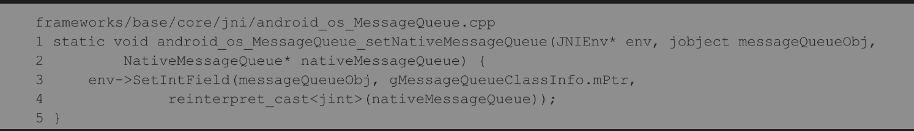

### 创建线程消息队列 ###

Java层中的每一个Looper对象内部都有一个类型为MessageQueue的成员变量mQueue，它指向了一个MessageQueue对象；而在C++层中，每一个NativeMessageQueue对象内部都有一个类型为Looper的成员变量mLooper，它指向了一个C++层的Looper对象

Java层中的每一个MessageQueue对象都有一个类型为int的成员变量mPtr，它保存了C++层中的一个NativeMessageQueue对象的地址值，这样我们就可以**将Java层中的一个MessageQueue对象与C++层中的一个NativeMessageQueue对象关联起来**

C++层中的Looper对象有两个类型为int的成员变量mWakeReadPipeFd和mWakeWritePipeFd，它们分别用来描述一个管道的读端文件描述符和写端文件描述符。**当一个线程的消息队列没有消息需要处理时，它就会在这个管道的读端文件描述符上进行睡眠等待，直到其他线程通过这个管道的写端文件描述符来唤醒它为止。**

* 当我们调用Java层的Looper类的静态成员函数prepareMainLooper或者prepare来为一个线程创建一个消息队列时，Java层的Looper类就会在这个线程中创建一个Looper对象和一个MessageQueue对象
* 在创建Java层的MessageQueue对象的过程中，又会调用它的成员函数nativeInit在C++层中创建一个NativeMessageQueue对象和一个Looper对象
* 在创建C++层的Looper对象时，又会创建一个管道，这个管道的读端文件描述符和写端文件描述符就保存在它的成员变量mWakeReadPipeFd和mWakeWritePipeFd中

Looper类的静态成员函数prepareMainLooper和prepare的实现如下所示

每一个创建了消息队列的Android应用程序线程在里面都有一个关联的Looper对象。当我们调用这个静态成员变量的成员函数get或者Looper类的静态成员函数myLooper时，就可以获得与当前线程关联的一个Looper对象；而当我们调用这个静态成员变量的成员函数set时，就可以将一个Looper对象与当前线程关联起来

一个Looper对象在创建的过程中，会在内部创建一个MessageQueue对象，并且保存在它的成员变量mQueue中

一个MessageQueue对象在创建的过程中，又会在C++层中创建一个NativeMessageQueue对象，这是通过调用MessageQueue类的成员函数nativeInit来实现的

C++层中创建一个NativeMessageQueue对象，接着第5行代码调用函数android_os_MessageQueue_setNativeMessageQueue将它与参数obj所描述的一个Java层的MessageQueue对象关联起来。

函数android_os_MessageQueue_setNativeMessageQueue的实现如下所示

gMessageQueueClassInfo是一个全局变量,它的成员变量clazz指向了Java层的MessageQueue类；成员变量mPtr指向了MessageQueue类的成员变量mPtr。

函数android_os_MessageQueue_setNativeMessageQueue实际上是将一个**C++层的NativeMessageQueue对象的地址值保存在一个Java层的MessageQueue对象的成员变量mPtr中，从而可以将它们关联起来。**

一个NativeMessageQueue对象在创建的过程中，又会在内部创建一个C++层的Looper对象

一个C++层的Looper对象在创建的过程中，又会在内部创建一个管道

* 第5行代码首先调用函数pipe创建了一个管道，接着第8行和第9行代码分别将这个管道的读端文件描述符和写端文件描述符保存在C++层的Looper类的成员变量mWakeReadPipeFd和mWakeWritePipeFd中
* 当一个线程没有新的消息需要处理时，它就会睡眠在这个管道的读端文件描述符上，直到有新的消息需要处理为止
* 其次，当其他线程向这个线程的消息队列发送了一个消息之后，其他线程就会通过这个管道的写端文件描述符往这个管道写入一个数据，从而将这个线程唤醒
* 第14行代码首先调用函数epoll_create来创建一个epoll实例，并且将它的文件描述符保存在C++层的Looper类的成员变量mEpollFd中
* 接着第17行到第21行代码将前面所创建的管道的读端文件描述符添加到这个epoll实例中，以便可以对它所描述的管道的写操作进行监听。

前面所创建的epoll实例只监听了一个文件描述符的IO写事件，即前面所创建的管道的IO写事件，这值得使用epoll机制来实现吗?其实，以后我们还可以调用C++层的Looper类的成员函数addFd向这个epoll实例中注册更多的文件描述符，以便可以监听它们的IO读写事件，这样就可以充分地利用一个线程的消息循环来做其他事情了

### 线程消息循环过程 ###

Step 1：Looper.loop

* 第5行和第6行代码首先获得当前线程的消息队列，接着第9行到第16行的while循环不断地检查这个消息队列中是否有新的消息需要处理
* 如果有新的消息需要处理，那么第10行代码获得的Message对象msg就不等于null；否则，当前线程就会在MessageQueue类的成员函数next中进入睡眠等待状态

Step 2：MessageQueue.next

* 第5行代码定义了一个变量pendingIdleHandlerCount，用来保存注册到消息队列中的空闲消息处理器(IdleHandler)的个数,当线程发现它的消息队列没有新的消息需要处理时，不是马上就进入睡眠等待状态，而是先调用注册到它的消息队列中的IdleHandler对象的成员函数queueIdle，以便它们有机会在线程空闲时执行一些操作
* 第6行代码定义了另外一个变量nextPollTimeoutMillis，用来描述当消息队列中没有新的消息需要处理时，当前线程需要进入睡眠等待状态的时间,如果变量nextPollTimeoutMillis的值等于-1，那么就表示当消息队列中没有新的消息需要处理时，当前线程需要无限地处于睡眠等待状态，直到它被其他线程唤醒为止。
* 第8行到第45行的for循环不断地调用成员函数nativePollOnce来检查当前线程的消息队列中是否有新的消息需要处理

MessageQueue类内部有一个类型为Message的成员变量mMessages，用来描述当前线程需要处理的消息。当前线程从成员函数nativePollOnce返回来之后，**如果它有新的消息需要处理，即MessageQueue类的成员变量mMessages不等于null**

1. 第19行代码首先获得MessageQueue类的成员变量mMessages所描述的消息的处理时间。如果这个消息的处理时间小于等于系统的当前时间，那么就说明当前线程需要马上对它进行处理
2. 否则，第27行代码就会计算当前线程下一次调用成员函数nativePollOnce时，如果没有新的消息需要处理，那么当前线程需要进入睡眠等待状态的时间
3. 当前线程执行到第40行代码时，就说明它目前没有新的消息需要处理，于是接下来它就会重新执行第8行到第45行的for循环来等待下一个需要处理的消息。这时候当前线程需要进入睡眠等待状态的时间就保存在变量nextPollTimeoutMillis中

第44行代码是在注册到消息队列中的IdleHandler对象处理完成一个线程空闲消息之后执行的，它主要是将变量nextPollTimeoutMillis的值重新设置为0，表示当前线程接下来在调用成员函数nativePollOnce时，不可以进入睡眠等待状态。**由于注册的IdleHandler对象在处理线程空闲消息期间，其他线程可能已经向当前线程的消息队列发送了一个或者若干个消息，因此，这时候当前线程就不能够在成员函数nativePollOnce中进入睡眠等待状态，而是要马上返回来检查它的消息队列中是否有新的消息需要处理。**

Step 3：MessageQueue.nativePollOnce

第3行代码就可以安全地将参数ptr转换成一个NativeMessageQueue对象，接着第4行代码再调用这个NativeMessageQueue对象的成员函数pollOnce来检查当前线程是否有新的消息需要处理

Step 4：NativeMessageQueue.pollOnce

* 第3行到第13行的for循环不断地调用成员函数pollInner来检查当前线程是否有新的消息需要处理。如果有新的消息需要处理，那么成员函数pollInner的返回值就不会等于0

* 第8行代码调用函数epoll_wait来监听注册在前面所创建的epoll实例中的文件描述符的IO读写事件
* 从函数epoll_wait返回来之后，接下来第11行到第21行的for循环就检查是哪一个文件描述符发生了IO读写事件。第14行的if语句检查发生IO读写事件的文件描述符是否是与当前线程所关联的一个管道的读端文件描述符mWakeReadPipeFd。如果是，并且它所发生的IO读写事件的类型为EPOLLIN，即第15行的if语句为ture，那么这时候就说明其他线程向与当前线程所关联的一个管道写入了一个新的数据
* 当其他线程向当前线程的消息队列发送了一个消息之后，它们就会向与当前线程所关联的一个管道写入一个新的数据，目的是将当前线程唤醒，以便它可以及时地去处理刚刚发送到它的消息队列的消息
* 第16行代码调用成员函数awoken将与当前线程所关联的一个管道的数据读出来，以便当前线程下一次可以重新在这个管道上等待其他线程向它的消息队列发送一个新的消息。

