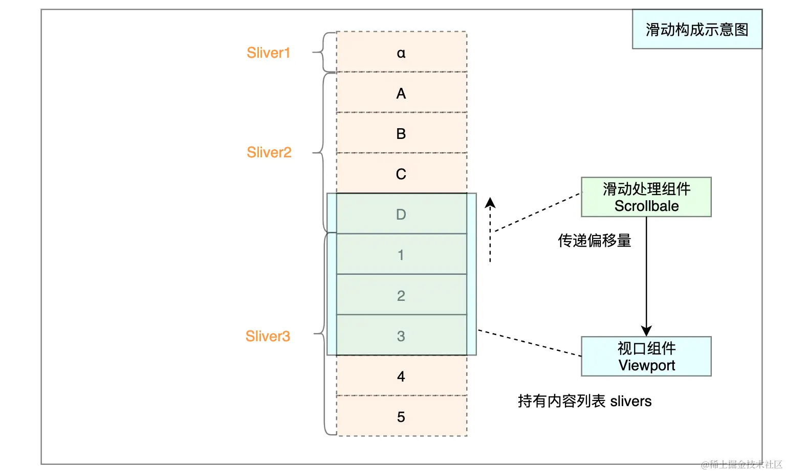

从一个简单ListView说起

下面是一个很简单列表，每个条目上显示 `第 n 个` 字样文字，并且每个相邻颜色的透明度周期性递增


条目组件为 `ItemBox` 

```dart
---->[02/01_simple_use/main.dart]----
class ItemBox extends StatelessWidget {
  final int index;

  const ItemBox({
    Key? key,
    required this.index,
  }) : super(key: key);

  Color get color => Colors.blue.withOpacity((index % 10) * 0.1);

  @override
  Widget build(BuildContext context) {
    return Container(
      alignment: Alignment.center,
      color: color,
      height: 56,
      child: Text(
        '第 $index 个',
        style: const TextStyle(fontSize: 20),
      ),
    );
  }
}

```

`ListView` 组件有四个构造函数，我们先看一下最简单的：指定 `children` 的构造函数

```dart
---->[02/01_simple_use/main.dart]----
class HomePage extends StatelessWidget {
  HomePage({Key? key}) : super(key: key);

  final List<int> data = List.generate(60, (index) => index + 1);// tag1

  @override
  Widget build(BuildContext context) {
    
    final List<Widget> children = data // tag2
        .map((index) => ItemBox(index: index)).toList();

    return Scaffold(
      appBar: AppBar(
        title: const Text('ListView 基础测试'),
      ),
      body: ListView(
        children: children // tag3
      ),
    );
  }
}

```

- `tag1` 处，成员 `data` 是有 60 个整数的列表，从 `1~60`；
- `tag2` 处，根据 `data` 列表生成组件列表 `children`；
- `tag3` 处，在构建 `ListView` 组件时传入 `children` 列表；

这样通过 `ListView` 组件，内容大于Viewport(视口)时，就可以进行滑动。这种构造方式和 `Column` 比较类似，都是直接将组件列表传给 `children` 参数。那如果把上面的 `ListView` 改为 `Column` ，会怎样呢？

```dart
body: Column(
  children: children,
),

```

对于 `Column` 组件来说，超过自身区域的内容`无法被显示`

#### ListView 的成员变量

- `childrenDelegate`: 类型为`SliverChildDelegate` ，不可为 `null `；
- `itemExtent` : 类型为`double `，可为 `null` ；
- `prototypeItem` : 类型为 `Widget` ，可为 `null` ；

由于 `childrenDelegate` 成员是`不能为 null `的，而 `ListView` 案例中没有对该变量`赋值`的痕迹。这就说明：`ListView` 通常构造方法中一定会基于入参，对 `childrenDelegate` 成员进行初始化。

接下来看一下 `childrenDelegate` 对象在 `ListView` 中的用途。如下图所示，在 `buildChildLayout` 方法中可以发现它的身影


##### 成员变量 `itemExtent` 和 `prototypeItem` 分析

itemExtent` 属性可以为条目组件增加一个`强约束

指定 `itemExtent` 来确定条目的高度要比让条目自己计算高度要`更高效` 。这很好理解，通过指定 `itemExtent` 可以为条目增加强约束，就可以`预知`组件的尺寸

从源码的角度来看，`itemExtent` 的作用非常明显。当它 `非空时`，`ListView` 组件内容依赖于 `SliverFixedExtentList` 展示。同理 `prototypeItem` 非空时，依赖于 `SliverPrototypeExtentList` 。如果两者都为空，则依赖于 `SliverList` 展示。

#### ListView 的构造方法

构造方法最重要的作用是什么。七个字：`初始化成员变量`

构造方法在方法的右括号后加`:`，其面可以追加若干条语句，语句间通过 `,` 分割。常见的语句有 `assert` 断言、`成员变量初始化`、和 `super` 构造器。

```dart
class B {
  final String name;
  B(this.name);
}

class A extends B {
  final int alpha;

  A({
    double opacity = 0,
    String name = 'A',
  })  : assert(opacity > 0),
        assert(opacity < 1),
        alpha = (opacity * 255).toInt(),
        super(name);
}

```

`ListView` 类成员的初始化情况： `itemExtent` 和 `prototypeItem` 两个入参通过 `this.属性` 直接赋值；上面提过 `childrenDelegate` 成员在其后通过入参进行实例化。

##### ListView 的 `builder` 构造

`ListView` 的普通构造中要传入 `children` 组件列表，这就注定在构造 `ListView` 对象前，就要实例化所有的 `ItemBox` 对象。这对于`大量或无限`的条目而言，显然是不能接受的。而 `ListView.builder` 构造就是为了解决这个问题的。

与普通构造想比，该构造方法多了 `itemBuilder` 和 `itemCount` 两个入参。如下 `tag1` 处会根据这两个入参初始化 `childrenDelegate` 成员。

```dart
typedef IndexedWidgetBuilder = Widget Function(BuildContext context, int index);

ListView.builder({
  // 暂略其他无关内容...
  required IndexedWidgetBuilder itemBuilder,
  int? itemCount,
  bool addAutomaticKeepAlives = true,
  bool addRepaintBoundaries = true,
  bool addSemanticIndexes = true,
  // 暂略其他无关内容...
}) : // 暂略其他无关内容...
     childrenDelegate = SliverChildBuilderDelegate( //<--- tag1 
       itemBuilder,
       childCount: itemCount,
       addAutomaticKeepAlives: addAutomaticKeepAlives,
       addRepaintBoundaries: addRepaintBoundaries,
       addSemanticIndexes: addSemanticIndexes,
     ),
     // 暂略其他无关内容...

```

可以总结出， `ListView` 类只做了两件重要的事：

```
[1]. 在 [构造函数] 中对 childrenDelegate 等成员的初始化。
[2]. 在 buildChildLayout 方法中根据成员创建 [SliverXXXList] 组件。

```

#### 探索 BoxScrollView 源码

从继承体系上来看 `ListView` 继承自 `BoxScrollView` ； `BoxScrollView` 继承自 `ScrollView`； `ScrollView` 继承自 `StatelessWidget`。也就是说 `ListView` 的本质是 `无状态组件`，也就是说它是基于`其他组件进行构建的` ，本身并不具备状态变化的能力

`BoxScrollView` 类信息：可以看出它是一个抽象类，只有一个 `buildChildLayout` 抽象方法。只维护一个 `padding` 成员。这说明 `BoxScrollView` 本身并不复杂，只是为了处理一下 `内边距` 而已。

`ListView` 组件类的实现，其中最重要的是`维护三个成员属性`和 `根据成员属性构建组件`。在 `ListView` 的四个构造方法中有很多共同的入参。这些入参会通过 `super` 构造来传入父类构造中：

`ListView` 的父类正是 `BoxScrollView`，也就是说上面 `ListView#super` 构造会执行到 `BoxScrollView` 构造方法


`BoxScrollView` 构造方法中，只是对自身维护的 `padding` 成员进行初始化。并为一些属性提供默认值，大部分的入参会继续传入 `super` 构造

从定义中来看，`BoxScrollView#buildChildLayout` 抽象方法作用是：`根据上下文来创建组件`


另外，`BoxScrollView` 中覆写了父类的 `buildSlivers` 方法，返回组件列表。 **`内容组件列表` 是构成滑动的主要部分之一。这里的 `buildSlivers` 就是负责创建`滑动内容组件列表`**

```
对于 [BoxScrollView] 组件而言，滑动内容(Sliver)组件列表只有一个元素。
```

为了更清楚地认知 `BoxScrollView` 构建内容列表的过程，这里调试看一下：
这里调试测试的是 `ListView` 组件，

* 所以下面 `第 714` 行的 `buildChildLayout` 方法会进入 `ListView#buildChildLayout` 
* 由于测试的 `ListView` 没有设置 `itemExtent`、`prototypeItem` 属性，所以返回的是 `SliverList` 
* 也就是说`第 714` 行的创建的 `sliver` 组件，是由 `子类` 实现的 `buildChildLayout` 方法负责构建的


当 `ListView` 中未设置 `padding` 属性时，为 `null` 时，会根据滑动方向使用 `MediaQueryData` 中的 `水平/竖直` 边距为 `effectivePadding` 赋值。并在 `sliver` 的外层包裹 `MediaQuery` 组件，来为其子树设置 `MediaQuery` 的默认数据。

##### BoxScrollView 源码小结

通过 `SliverPadding` 组件为 `buildChildLayout` 方法生成的组件`添加内边距`。 其最大的价值是：没有设置 `padding` 时，会通过 `MediaQuery` 进行默认处理

`BoxScrollView` **作为抽象类，只是为了在构建时通过 `SliverPadding` 组件处理边距，并通过抽象方法 `buildChildLayout` 构建滑动内容，具体实现会交由子类完成。** Flutter 框架中 `BoxScrollView` 有`ListView` 和 `GridView` 两个子类 ，这说明两者在结构上是相似的，只是在抽象方法的`具体实现`上有所差异。

#### 初步认识 ScrollView 源码实现

`ScrollView` 相对而言是比较底层的组件， 它实现了视口滑动，也就表明其内部要整合 `滑动的三要素` 。

另外，注意它只是实现视口滑动的组件`之一`，并非所有的滑动视图都是基于 `ScrollView` 进行拓展的。

**Flutter` 框架中只有 `CustomScrollView` 、`GridView`、`ListView` 这三个常用组件是 `ScrollView` 的子类。 其他的，比如 `PageView`、`SingleChildScrollView` 等并非 `ScrollView` 的子类。**

ScrollView` 是一个继承自 `StatelessWidget` 抽象类。可以知道它本身`不维护状态

ScrollView` 类的结构：它抽象出一个 `buildSlivers` 方法，其目的是通过上下文创建 `组件列表`。另外，还定义了非常多的 `成员属性

##### ScrollView#build -- 创建滑动内容

在 `ScrollView#build` 方法中打上断点


* 虽然现在的断点在 `ScrollView` 中，但我们创建的是 `ListView` 对象，所以当前 `this` 对象的运行时类型是 `ListView`
* 因为当前实例对象类型是 `ListView` ，而这里调用的是 `buildSlivers 成员方法` 。但在`ListView` 中没有定义 `buildSlivers` 方法。根据类继承的特性，下一帧会跳转到 `BoxScrollView#buildSlivers` 方法中进行处理
* 默认情况下 `BoxScrollView#buildSlivers` 返回组件列表，其中只有一个 `SliverPadding` 组件，并且 `SliverPadding` 内部包裹 `SliverList` 。

 `ScrollView` 想要支持滑动，那就必然需要构建 `滑动内容` 。但它并不关心具体的`内容组件列表`构建逻辑，所以抽象出 `buildSlivers` 的行为，交由子类来实现

`BoxScrollView` 作为 `ScrollView` 的子类，要去实现这个抽象方法，但它只想处理一下 `padding` ，并返回只有`一块滑动内容` 的列表。作为抽象类的它，也不想关心这个`内容组件` 的构建逻辑。所以抽象出 `buildChildLayout` 的行为，交由子类实现。

`ListView` 不是抽象类，作为 `BoxScrollView` 的子类，必然要去实现 `buildChildLayout` 来创建 `一块滑动内容`，这块内容就是上一章我们提到的 `SliverXXXList`。

##### ScrollView#build -- 创建滑动处理组件

在创建完内容列表 `slives` 后，下来 `第 393 行`会使用 `成员属性` 创建 `Scrollable` 组件对象。`Scrollable` 组件便是负责监听拖动事件，处理偏移逻辑的核心类。


##### ScrollView#build -- 创建视口组件

滑动内容(`sliver 列表`)和 滑动处理器( `Scrollable 组件` )都创建完毕，还剩一个 `视口` (`Viewport 组件` ) ，那它是何时创建的呢？

`Viewport` 组件并 `不关心` 滑动偏移量的`计算过程`。随着触点的拖动， `Scrollable` 会通过一定的手段将偏移量告诉它，从而更新显示。
说到一个类要将内部数据传递到外界，让另一个类知晓，自然会想到 `回调函数`。 `Scrollable` 在构造时需要传入 `viewportBuilder` 函数对象，它便可以回调出 `ViewportOffset` 对象。

`Scrollable` 构造时的 `viewportBuilder` 回调，会通过 `Scrollable#buildViewport` 成员方法进行处理。

##### ScrollView 源码小结

可以分析出 `ScrollView` 组件中三个部分的结构：`Scrollable` 组件负责监听事件，处于上层；其下方有 `Viewport` 组件， `Scrollable` 会将滑动偏移信息传递给它；最后是`sliver` 列表，它会作为 `Viewport` 组件的构造入参，放在 `Viewport` 的下方。




