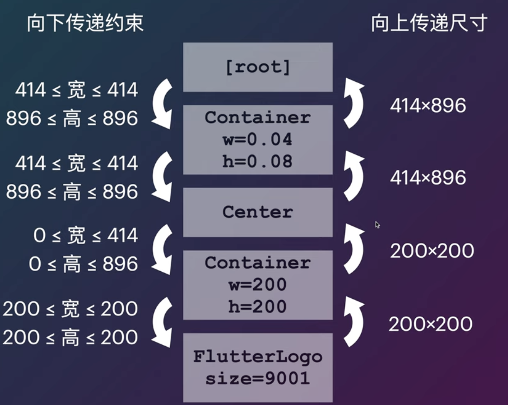

#### Flutter布局约束 #####

```dart
void main(){
  runApp(
  	Container(
    	width: 0.04,
      height: 0.008,
      color: Colors.red[200],
      child: Center(
      	child: Container(
        	width: 200,
          height: 200,
          color: Colors.white,
          child: FlutterLogo(size: 9001)
        )
      )
    )
  )
}
```



#### 获取和设置布局约束 ####

```dart
Center(
	child: Container(
  	width: 400,
    height: 400,
    color: Colors.red[200],
    child: Center(
    	child: LayoutBuilder(
    		builder: (BuildContext context, BoxConstrains constrains){
        	print("constrains: $constrains");
        	return FlutterLogo(size: 9001);
      }
    )
    )
  )
)
  
output:
flutter: constrains: BoxConstrains(0.0 <= w <= 400.0, 0.0 <= h <= 400.0)
```

```dart
SizeBox.expand() //越大越好
  
FractionallySizeBox(
	widthFactor: 0.5,
  heightFactor: 0.5
) //占父view的一半
  
ConstrainsedBox(
	constrains: BoxConstrains(
  	minWidth: 60,
    maxWidth: 120,
    minHeight: 60,
    maxHeight: 120
  )
)
```


#### Container ####

* Container如果有child会尽量包住child,如果没有child默认会撑满父约束的最大

```dart

Center(
	child: SizeBox(
  	width: 200,
		child: Container(
			color: Colors.orange,
			child: FlutterLogo(size: 100)
		) 
	) 
)
//由于Container没有给子元素约束，所以会把父约束传递给子元素
//Container父约束的width是紧约束200 ，所以FlutterLogo的width要修正为200
//Container父约束height是0-800，FlutterLogo的height满足这个约束，所以是100

```

#### CustomMultiChildLayout ####

A widget that uses a delegate to size and position multiple children.

The delegate can determine(确定) the layout constraints for each child and can decide where to position each child. The delegate can also determine the size of the parent, but the size of the parent cannot depend on the sizes of the children.

```dart
CustomMultiChildLayout(
	delegate: Mydelegate(),
  children:[
    LayoutId(
    	id: 1,
      child: FlutterLogo(),
    ),
    LayoutId(
    	id: 2,
      child: FlutterLogo()
    )
  ]
)
  
  
class MyDelegate extends MultiChildLayoutDelegate {
  
  void performLayout(Size size){
    var size1, size2;
    if(hasChild(1)){
      size1 = layoutChild(1, 
                     BoxConstrainsts(minWidth: 100,
                                     minHeight: 100,
                                     maxHeight: 100,
                                     maxWidth:100)); //决定子view的宽高约束
       positionChild(1, Offset(0, 0))  //子view放在哪
    }
    
     if(hasChild(2)){
      size2 = layoutChild(1, 
                     BoxConstrainsts(minWidth: 200,
                                     minHeight: 200,
                                     maxHeight: 200,
                                     maxWidth:200));
       positionChild(2, Offset(size1.width, size1.height))
    }
   
  }
  
}
```

画一个加下划线的Text

```dart
CustomMultiChildLayout(
	delegate: Mydelegate(),
  children:[
    LayoutId(
    	id: "underline",
      child: Container(color: Color.red),
    ),
    LayoutId(
    	id: "text",
      child: Text("WSBT", style: TextStyle(fontSize: 72))
    )
  ]
)

class MyDelegate extends MultiChildLayoutDelegate {
		void performLayout(Size size){
     	final sizeText = layoutChild("text",BoxConstrains.loose(size)); // 给一个松约束
      
      positionChild("text", Offset(0, 0));
      
      
      final sizeUnderline = layoutChild("underline", BoxConstrains(minWidth: sizeText.width,
                                                                   minheight: 4, 
                                                                   maxWidth: sizeText.width,
                                                                   maxHeight: 4));
      positionChild("underline", Offset(0, sizeText.height));
    }
}
```


#### 自定义RenderObject ####

```dart
class ShadowBox extends SingleChildRenderObjectWidget {
  final double distance;
  
  ShadowBox({Widget child, this.distance}) : super(child: child)
    
  RenderObject createRenderObject(BuildContext context){
    return RenderShadowBox(distance);
  }
  
  void updateRenderObject(BuildContext context,covariant RenderShadowBox renderObject){
    renderObject.distance = distance;
  }
}


class RenderShadowBox extends RenderBox with RenderObjectWithChildMixin {
   double distance;
  RenderShadowBox(this.distance);
  
  @override
  void performLayout() {
    //当parent不需要child的size的时候就会阻断尺寸的传递，因为向下传递约束，向上传递尺寸
    //因为size和child的size没有关系，所以parent不需要关心child的尺寸信息，起到优化性能作用
    child.layout(constrains, parentUserSize:true);
    size = (child as RenderBox).size;
  }
  
  @override
  void paint(PaintingContext context, Offset offset){
    context.paintChild(child, offset);
    
    context.pushOpacity(offset, 127, (context, offset){
      context.paintChild(child, offset + offset(distance, distance))
    }); //画一个child的阴影
  }
  
}

```


