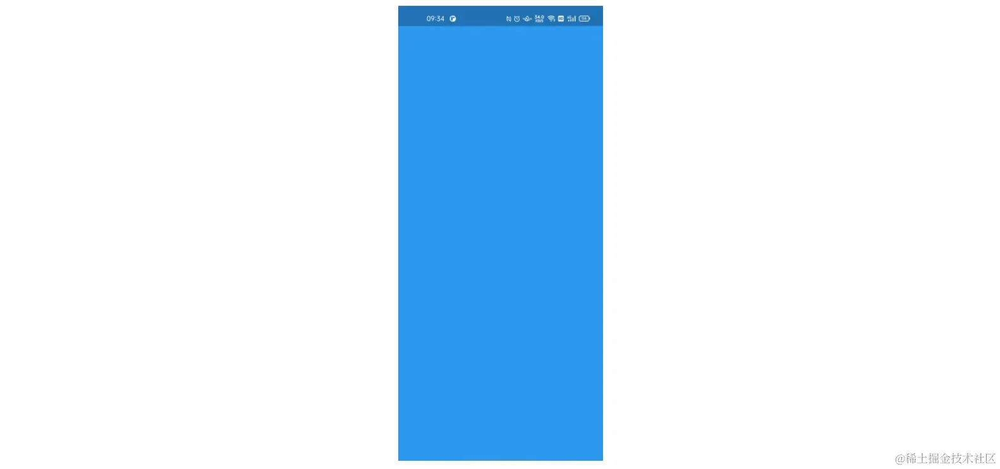
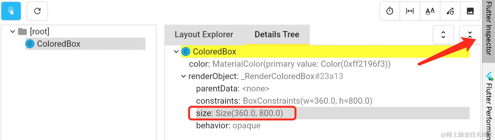
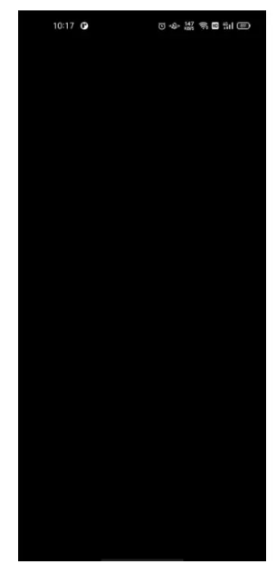
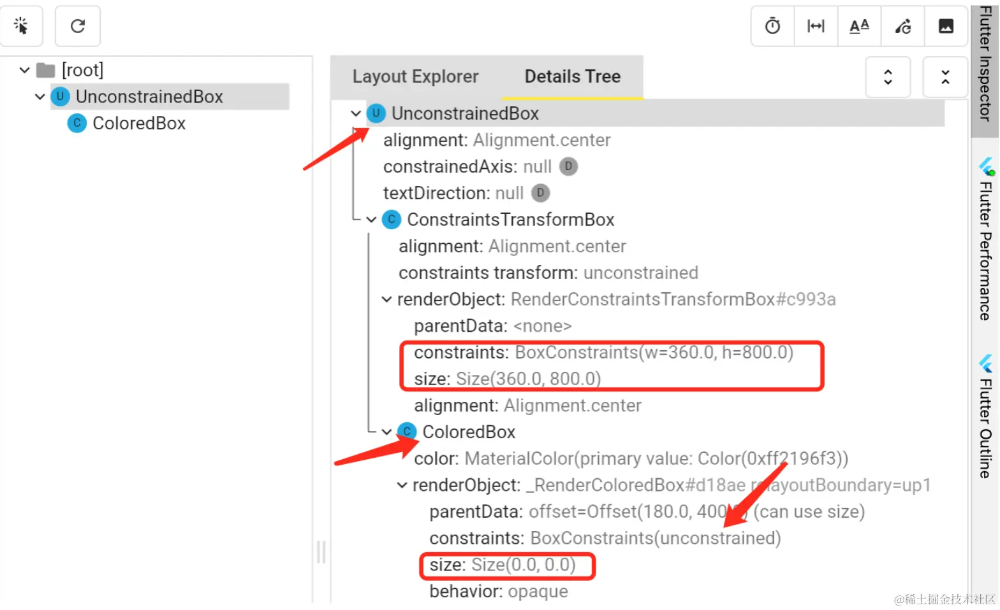
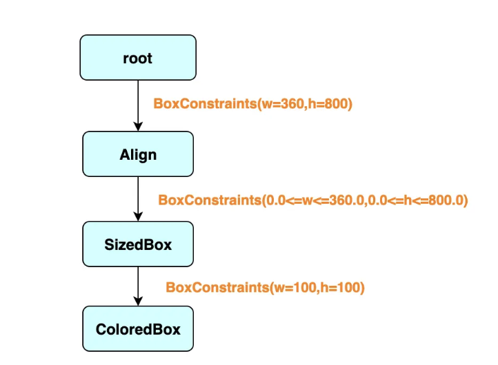

`设置的尺寸并非期望尺寸`，绝大多数都是 `紧约束` 在作怪

现在来看一个最简单的紧约束：如下，通过 `ColoredBox` 组件为这个默认区域进行着色

```dart
---->[01/01]----
void main() {
  runApp(const ColoredBox(color: Colors.blue));
}

```

可以看到在 `runApp` 方法中，展示的 `ColoredBox` 组件尺寸是 `屏幕尺寸` ：



从布局信息树中也可以看出： 此时 `ColoredBox` 对应的`渲染对象`尺寸是 `360*800` ，也就是屏幕尺寸。



现在来看一下，通过 `SizedBox` 为 `ColoredBox` 指定 `100*100` 的尺寸会有什么效果

```dart
---->[01/02]----
void main() {
  runApp(
    const SizedBox(
      width: 100,
      height: 100,
      child: ColoredBox(color: Colors.blue),
    ),
  );
}

```

在父级是`紧约束`的条件下，`SizedBox` 无法对子级的尺寸进行修改：

`SizedBox `的面子不够大，改不了我定的约束，ColoredBox还是维持全屏宽高的紧约束

#### 如何打破紧约束

`SizedBox` 的面子不够大，那哪些布局组件的面子可以大到修改紧约束呢？

##### 1. 解除约束：UnconstrainedBox

```dart
---->[01/03]----
void main() {
  runApp(
    const UnconstrainedBox(
      child: ColoredBox(color: Colors.blue),
    ),
  );
}

```

屏幕全黑，这也是情理之中。因为 `ColoredBox` 的尺寸没有限制，后面通过源码可以知道 `ColoredBox` 的尺寸特点是取约束的最小值，所以这里尺寸就是 `Size(0,0)` 。



`ColoredBox` 变成了无约束 `unconstrained`，尺寸是 `Size(0,0)` ，所以屏幕上一片黑。另外注意一点： `UnconstrainedBox` 本身受到父级强约束限制，尺寸是 `Size(360,800)` 。



如何显示一个 `100*100` 的蓝色方块呢？

```dart
---->[01/04]----
void main() {
  runApp(
    const UnconstrainedBox(
      child: SizedBox(
        width: 100,
        height: 100,
        child: ColoredBox(color: Colors.blue),
      ),
    ),
  );
}

```

##### 2. 通过布局组件放松约束

```dart
---->[01/05]----
void main() {
  runApp(
    const Align(
      alignment: Alignment.topLeft,
      child: ColoredBox(color: Colors.blue),
    ),
  );
}

```

通过 `Align` 的参与，`ColoredBox` 的父级约束发生了变化，由原来的紧约束，变成了 `BoxConstraints(0.0<=w<=360.0,0.0<=h<=800.0)` 的宽松约束。

除了 `Align` 组件有放宽约束的能力之外，还有如 `Flex` 、 `Column`、`Row`、 `Wrap` 、`Stack` 等组件可以让父级的紧约束在一定程度上变得宽松


##### 3.自定义布局重新设置约束

可以让我们自由地改变子级的约束，改成什么约束就是什么约束？不像 `SizedBox` 那样，添加个强约束，还要看父级约束的 `"脸色"` 。

通过 `CustomSingleChildLayout` 组件进行实现。如下，自定义 `DiyLayoutDelegate` ，通过覆写 `getConstraintsForChild` 方法可以随意修改子级的约束。

```dart
---->[01/07]----
void main() {
  runApp(
    CustomSingleChildLayout(
      delegate: DiyLayoutDelegate(),
      child: const ColoredBox(color: Colors.blue),
    ),
  );
}

class DiyLayoutDelegate extends SingleChildLayoutDelegate {
  
  @override
  bool shouldRelayout(covariant SingleChildLayoutDelegate oldDelegate) => false;

  @override
  BoxConstraints getConstraintsForChild(BoxConstraints constraints) {
    return BoxConstraints.tight(const Size(100, 100));// tag1
  }
}

```




