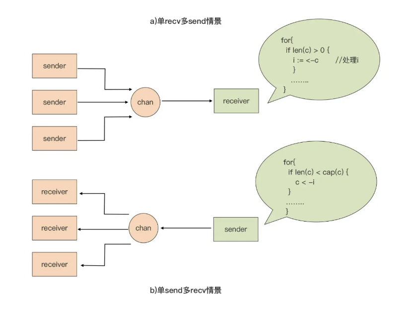

#### 创建 channel ####

声明了一个元素为 int 类型的 channel 类型变量 ch

为 channel 类型变量赋初值的唯一方法就是使用 make 这个 Go 预定义的函数

```go
ch1 := make(chan int)   //无缓冲
ch2 := make(chan int, 5)  //带缓冲
```

#### 发送与接收 ####

**channel 是用于 Goroutine 间通信的**，所以绝大多数对 channel 的读写都被分别放在了不同的 Goroutine 中

由于无缓冲 channel 的运行时层实现不带有缓冲区，**所以 Goroutine 对无缓冲 channel 的接收和发送操作是同步的**。也就是说，对同一个无缓冲 channel，只有对它进行接收操作的 Goroutine 和对它进行发送操作的 Goroutine 都存在的情况下，通信才能得以进行，否则单方面的操作会让对应的 Goroutine 陷入挂起状态

```go
func main() {
    ch1 := make(chan int)
    go func() {
        ch1 <- 13 // 将发送操作放入一个新goroutine中执行
    }()
    n := <-ch1
    println(n)
}
```

**对无缓冲 channel 类型的发送与接收操作，一定要放在两个不同的 Goroutine 中进行，否则会导致 deadlock。**


**对带缓冲 channel 的发送操作在缓冲区未满、接收操作在缓冲区非空的情况下是异步的**（发送或接收不需要阻塞等待）。

```go
func produce(ch chan<- int) {
    for i := 0; i < 10; i++ {
        ch <- i + 1
        time.Sleep(time.Second)
    }
    close(ch)
}

func consume(ch <-chan int) {
    for n := range ch {
        println(n)
    }
}

func main() {
    ch := make(chan int, 5)
    var wg sync.WaitGroup
    wg.Add(2)
    go func() {
        produce(ch)
        wg.Done()
    }()

    go func() {
        consume(ch)
        wg.Done()
    }()

    wg.Wait()
}
```

生产者只能向 channel 中发送数据，我们使用 chan<- int 作为 produce 函数的参数类型；消费者只能从 channel 中接收数据，我们使用<-chan int 作为 consume 函数的参数类型。

在消费者函数 consume 中，我们使用了 for range 循环语句来从 channel 中接收数据，for range 会阻塞在对 channel 的接收操作上，直到 channel 中有数据可接收或 channel 被关闭，才会继续向下执行。channel 被关闭后，for range 循环也就结束了。

#### 关闭 channel ####

produce 函数在发送完数据后，调用 Go 内置的 close 函数关闭了 channel。**channel 关闭后，所有等待从这个 channel 接收数据的操作都将返回。**

channel 是在 produce 函数中被关闭的，这也是 channel 的一个使用惯例，**那就是发送端负责关闭 channel。**

#### select ####

通过 select，我们可以同时在多个 channel 上进行发送 / 接收操作：

```go
select {
case x := <-ch1:     // 从channel ch1接收数据
  ... ...

case y, ok := <-ch2: // 从channel ch2接收数据，并根据ok值判断ch2是否已经关闭
  ... ...

case ch3 <- z:       // 将z值发送到channel ch3中:
  ... ...

default:             // 当上面case中的channel通信均无法实施时，执行该默认分支
}
```

#### 无缓冲 channel 的惯用法

无缓冲 channel 用作信号传递的时候，有两种情况，分别是 1 对 1 通知信号和 1 对 n 通知信号。我们先来分析下 1 对 1 通知信号这种情况。

```go
type signal struct{}

func worker() {
    println("worker is working...")
    time.Sleep(1 * time.Second)
}

func spawn(f func()) <-chan signal {
    c := make(chan signal)
    go func() {
        println("worker start to work...")
        f()
        c <- signal{}
    }()
    return c
}

func main() {
    println("start a worker...")
    c := spawn(worker)
    <-c
    fmt.Println("worker work done!")
}
```

在这个例子中，spawn 函数返回的 channel，被用于承载新 Goroutine 退出的“通知信号”，这个信号专门用作通知 main goroutine。main goroutine 在调用 spawn 函数后一直阻塞在对这个“通知信号”的接收动作上。


有些时候，无缓冲 channel 还被用来实现 1 对 n 的信号通知机制。这样的信号通知机制，常被用于协调多个 Goroutine 一起工作

```go
func worker(i int) {
    fmt.Printf("worker %d: is working...\n", i)
    time.Sleep(1 * time.Second)
    fmt.Printf("worker %d: works done\n", i)
}

type signal struct{}
func spawnGroup(f func(i int), num int, groupSignal <-chan signal) <-chan signal {
    c := make(chan signal)
    var wg sync.WaitGroup

    for i := 0; i < num; i++ {
        wg.Add(1)
        go func(i int) {
            <-groupSignal
            fmt.Printf("worker %d: start to work...\n", i)
            f(i)
            wg.Done()
        }(i + 1)
    }

    go func() {
        wg.Wait()
        c <- signal{}
    }()
    return c
}

func main() {
    fmt.Println("start a group of workers...")
    groupSignal := make(chan signal)
    c := spawnGroup(worker, 5, groupSignal)
    time.Sleep(5 * time.Second)
    fmt.Println("the group of workers start to work...")
    close(groupSignal)
    <-c
    fmt.Println("the group of workers work done!")
}
```

main goroutine 创建了一组 5 个 worker goroutine，这些 Goroutine 启动后会阻塞在名为 groupSignal 的无缓冲 channel 上。main goroutine 通过close(groupSignal)向所有 worker goroutine 广播“开始工作”的信号，收到 groupSignal 后，所有 worker goroutine 会“同时”开始工作，就像起跑线上的运动员听到了裁判员发出的起跑信号枪声。

关闭一个无缓冲 channel 会让所有阻塞在这个 channel 上的接收操作返回，从而实现了一种 1 对 n 的“广播”机制。

#### 第二种用法：用于替代锁机制 ####

使用无缓冲 channel 替代锁后的实现：

```go
type counter struct {
    c chan int
    i int
}

func NewCounter() *counter {
    cter := &counter{
        c: make(chan int),
    }
    go func() {
        for {
            cter.i++
            cter.c <- cter.i
        }
    }()
    return cter
}

func (cter *counter) Increase() int {
    return <-cter.c
}

func main() {
    cter := NewCounter()
    var wg sync.WaitGroup
    for i := 0; i < 10; i++ {
        wg.Add(1)
        go func(i int) {
            v := cter.Increase()
            fmt.Printf("goroutine-%d: current counter value is %d\n", i, v)
            wg.Done()
        }(i)
    }
    wg.Wait()
}
```

将计数器操作全部交给一个独立的 Goroutine 去处理，并通过无缓冲 channel 的同步阻塞特性，实现了计数器的控制。这样其他 Goroutine 通过 Increase 函数试图增加计数器值的动作，实质上就转化为了一次无缓冲 channel 的接收动作。

这种并发设计逻辑更符合 Go 语言所倡导的“**不要通过共享内存来通信，而是通过通信来共享内存**”的原则。

#### 带缓冲 channel 的惯用法  ####

Go 并发设计的一个惯用法，就是将带缓冲 channel 用作计数信号量（counting semaphore）。带缓冲 channel 中的当前数据个数代表的是，当前同时处于活动状态（处理业务）的 Goroutine 的数量，而带缓冲 channel 的容量（capacity），就代表了允许同时处于活动状态的 Goroutine 的最大数量

```go
var active = make(chan struct{}, 3)
var jobs = make(chan int, 10)

func main() {
    go func() {
        for i := 0; i < 8; i++ {
            jobs <- (i + 1)
        }
        close(jobs)
    }()

    var wg sync.WaitGroup

    for j := range jobs {
        wg.Add(1)
        go func(j int) {
            active <- struct{}{}
            log.Printf("handle job: %d\n", j)
            time.Sleep(2 * time.Second)
            <-active
            wg.Done()
        }(j)
    }
    wg.Wait()
}
```

创建了一组 Goroutine 来处理 job，同一时间允许最多 3 个 Goroutine 处于活动状态。

#### len(channel) 的应用 ####

* 当 ch 为无缓冲 channel 时，len(ch) 总是返回 0；
* 当 ch 为带缓冲 channel 时，len(ch) 返回当前 channel ch 中尚未被读取的元素个数

channel 原语用于多个 Goroutine 间的通信，一旦多个 Goroutine 共同对 channel 进行收发操作，len(channel) 就会在多个 Goroutine 间形成“竞态”。单纯地依靠 len(channel) 来判断 channel 中元素状态，是不能保证在后续对 channel 的收发时 channel 状态是不变的。

Goroutine1 使用 len(channel) 判空后，就会尝试从 channel 中接收数据。但在它真正从 channel 读数据之前，另外一个 Goroutine2 已经将数据读了出去，所以，**Goroutine1 后面的读取就会阻塞在 channel 上，导致后面逻辑的失效。**

因此，**为了不阻塞在 channel 上，常见的方法是将“判空与读取”放在一个“事务”中，将“判满与写入”放在一个“事务”中**，而这类“事务”我们可以通过 select 实现

```go
func producer(c chan<- int) {
    var i int = 1
    for {
        time.Sleep(2 * time.Second)
        ok := trySend(c, i)
        if ok {
            fmt.Printf("[producer]: send [%d] to channel\n", i)
            i++
            continue
        }
        fmt.Printf("[producer]: try send [%d], but channel is full\n", i)
    }
}

func tryRecv(c <-chan int) (int, bool) {
    select {
    case i := <-c:
        return i, true

    default:
        return 0, false
    }
}

func trySend(c chan<- int, i int) bool {
    select {
    case c <- i:
        return true
    default:
        return false
    }
}

func consumer(c <-chan int) {
    for {
        i, ok := tryRecv(c)
        if !ok {
            fmt.Println("[consumer]: try to recv from channel, but the channel is empty")
            time.Sleep(1 * time.Second)
            continue
        }
        fmt.Printf("[consumer]: recv [%d] from channel\n", i)
        if i >= 3 {
            fmt.Println("[consumer]: exit")
            return
        }
    }
}

func main() {
    var wg sync.WaitGroup
    c := make(chan int, 3)
    wg.Add(2)
    go func() {
        producer(c)
        wg.Done()
    }()

    go func() {
        consumer(c)
        wg.Done()
    }()

    wg.Wait()
}
```

由于用到了 select 原语的 default 分支语义，当 channel 空的时候，tryRecv 不会阻塞；当 channel 满的时候，trySend 也不会阻塞。

这种方法适用于大多数场合，但是这种方法有一个“问题”，那就是它改变了 channel 的状态，会让 channel 接收了一个元素或发送一个元素到 channel。

在特定的场景下，我们可以用 len(channel) 来实现：



* 有且只有一个接收者。在这样的场景下，我们可以在接收 goroutine 中使用 len(channel)是否大于0来判断是否 channel 中有数据需要接收
* 有且只有一个发送者。在这样的场景下，我们可以在发送 Goroutine 中使用 len(channel)是否小于 cap(channel)来判断是否可以执行向 channel 的发送操作。

#### 利用 default 分支避免阻塞 ####

无论是无缓冲 channel 还是带缓冲 channel，这两个函数都能适用，并且不会阻塞在空 channel 或元素个数已经达到容量的 channel 上。

在 Go 标准库中，这个惯用法也有应用，比如：

```go
// $GOROOT/src/time/sleep.go
func sendTime(c interface{}, seq uintptr) {
    // 无阻塞的向c发送当前时间
    select {
    case c.(chan Time) <- Now():
    default:
    }
}
```

#### 实现超时机制 ####

```go
func worker() {
  select {
  case <-c:
       // ... do some stuff
  case <-time.After(30 *time.Second):
      return
  }
}
```

在应用带有超时机制的 select 时，我们要特别注意 timer 使用后的释放，尤其在大量创建 timer 的时候。

#### 实现心跳机制 ####

结合 time 包的 Ticker，我们可以实现带有心跳机制的 select。这种机制让我们可以在监听 channel 的同时，执行一些周期性的任务

```go
func worker() {
  heartbeat := time.NewTicker(30 * time.Second)
  defer heartbeat.Stop()
  for {
    select {
    case <-c:
      // ... do some stuff
    case <- heartbeat.C:
      //... do heartbeat stuff
    }
  }
}
```

使用 time.NewTicker，创建了一个 Ticker 类型实例 heartbeat。这个实例包含一个 channel 类型的字段 C，这个字段会按一定时间间隔持续产生事件，就像“心跳”一样。这样 for 循环在 channel c 无数据接收时，会每隔特定时间完成一次迭代，然后回到 for 循环进行下一次迭代。


