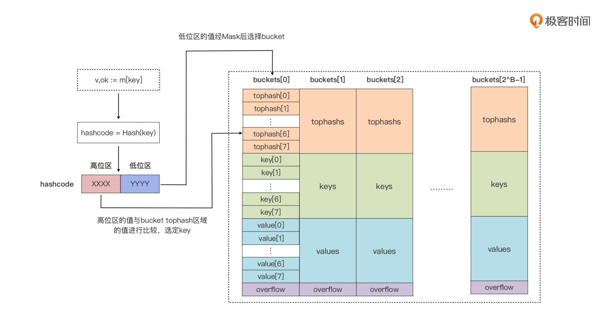
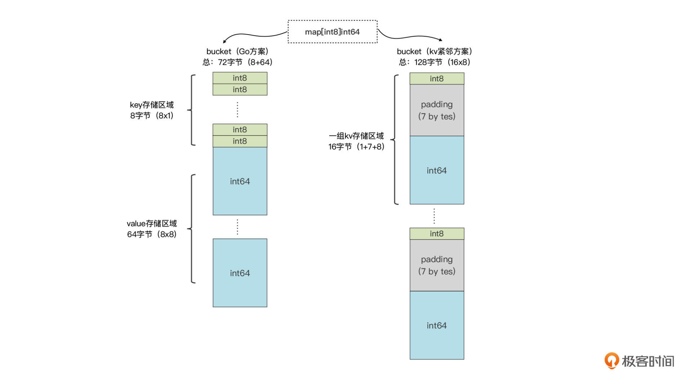
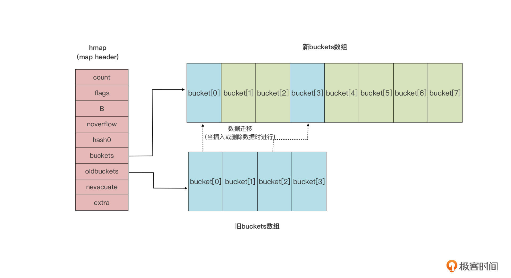

作为复合类型的 map，它在 Go 中的类型表示也是由 key 类型与 value 类型组成的，就像下面代码：

```go
map[key_type]value_type
```

map 类型对 value 的类型没有限制，但是对 key 的类型却有严格要求，因为 map 类型要保证 key 的唯一性。Go 语言中要求，**key 的类型必须支持“==”和“!=”两种比较操作符。**

一定要注意：函数类型、map 类型自身，以及切片类型是不能作为 map 的 key 类型的。

```go
var m map[string]int // 一个map[string]int类型的变量

//如果我们没有显式地赋予 map 变量初值，map 类型变量的默认值为 nil。
```

初值为零值 nil 的切片类型变量，可以借助内置的 append 的函数进行操作，这种在 Go 语言中被称为**“零值可用”**

**但 map 类型，因为它内部实现的复杂性，无法“零值可用”**。所以，如果我们对处于零值状态的 map 变量直接进行操作，就会导致运行时异常（panic）

和切片一样，为 map 类型变量显式赋值有两种方式：一种是使用复合字面值；另外一种是使用 make 这个预声明的内置函数。

```go
//使用复合字面值初始化 map 类型变量。
m := map[int]string{}

m1 := map[int][]string{
    1: []string{"val1_1", "val1_2"},
    3: []string{"val3_1", "val3_2", "val3_3"},
    7: []string{"val7_1"},
}

type Position struct { 
    x float64 
    y float64
}

m2 := map[Position]string{
    Position{29.935523, 52.568915}: "school",
    Position{25.352594, 113.304361}: "shopping-mall",
    Position{73.224455, 111.804306}: "hospital",
}

//Go 提供了“语法糖”。这种情况下，Go 允许省略字面值中的元素类型。因为 map 类型表示中包含了 key 和 value 的元素类型，Go 编译器已经有足够的信息，来推导出字面值中各个值的类型了。

m2 := map[Position]string{
    {29.935523, 52.568915}: "school",
    {25.352594, 113.304361}: "shopping-mall",
    {73.224455, 111.804306}: "hospital",
}
```

###### 使用 make 为 map 类型变量进行显式初始化。

```go
m1 := make(map[int]string) // 未指定初始容量
m2 := make(map[int]string, 8) // 指定初始容量为8
```

##### map 的基本操作

我们不需要自己判断数据有没有插入成功，因为 Go 会保证插入总是成功的。这里，Go 运行时会负责 map 变量内部的内存管理，因此除非是系统内存耗尽，我们可以不用担心向 map 中插入新数据的数量和执行结果。

如果我们插入新键值对的时候，某个 key 已经存在于 map 中了，那我们的插入操作就会用新值覆盖旧值：

map 类型也可以通过内置函数 len，获取当前变量已经存储的键值对数量：

```go
m := map[string]int {
  "key1" : 1,
  "key2" : 2,
}

fmt.Println(len(m)) // 2
m["key3"] = 3  
fmt.Println(len(m)) // 3
```

这里要注意的是我们不能对 map 类型变量调用 cap，来获取当前容量，这是 map 类型与切片类型的一个不同点

当我们尝试去获取一个键对应的值的时候，**如果这个键在 map 中并不存在**，我们也会得到一个值，**这个值是 value 元素类型的零值。**

Go 语言的 map 类型支持通过用一种名为“comma ok”的惯用法，进行对某个 key 的查询。接下来我们就用“comma ok”惯用法改造一下上面的代码：

```go
m := make(map[string]int)
v, ok := m["key1"]
if !ok {
    // "key1"不在map中
}

// "key1"在map中，v将被赋予"key1"键对应的value
```

在 Go 语言中，请使用“comma ok”惯用法对 map 进行键查找和键值读取操作。


内置函数 delete 来从 map 中删除数据。使用 delete 函数的情况下，传入的第一个参数是我们的 map 类型变量，第二个参数就是我们想要删除的键

```go
m := map[string]int {
  "key1" : 1,
  "key2" : 2,
}

fmt.Println(m) // map[key1:1 key2:2]
delete(m, "key2") // 删除"key2"
fmt.Println(m) // map[key1:1]
```

遍历 map 中的键值数据

```go
package main
  
import "fmt"

func main() {
    m := map[int]int{
        1: 11,
        2: 12,
        3: 13,
    }

    fmt.Printf("{ ")
    for k, v := range m {
        fmt.Printf("[%d, %d] ", k, v)
    }
    fmt.Printf("}\n")
}
```

对同一 map 做多次遍历的时候，每次遍历元素的次序都不相同


##### map 变量的传递开销

和切片类型一样，map 也是引用类型。这就意味着 map 类型变量作为参数被传递给函数或方法的时候，实质上传递的只是一个“描述符”

### map 的内部实现 ###

Go 运行时使用一张哈希表来实现抽象的 map 类型

运行时实现了 map 类型操作的所有功能，包括查找、插入、删除等。在编译阶段，Go 编译器会将 Go 语法层面的 map 操作，重写成运行时对应的函数调用

```go
// 创建map类型变量实例
m := make(map[keyType]valType, capacityhint) → m := runtime.makemap(maptype, capacityhint, m)

// 插入新键值对或给键重新赋值
m["key"] = "value" → v := runtime.mapassign(maptype, m, "key") v是用于后续存储value的空间的地址

// 获取某键的值 
v := m["key"]      → v := runtime.mapaccess1(maptype, m, "key")
v, ok := m["key"]  → v, ok := runtime.mapaccess2(maptype, m, "key")

// 删除某键
delete(m, "key")   → runtime.mapdelete(maptype, m, “key”)
```

#### 初始状态 #######

与语法层面 map 类型变量（m）一一对应的是 *runtime.hmap 的实例，即 **runtime.hmap 类型的指针，也就是我们前面在讲解 map 类型变量传递开销时提到的 map 类型的描述符**

hmap 类型是 map 类型的头部结构（header），它存储了后续 map 类型操作所需的所有信息

真正用来存储键值对数据的是桶，也就是 bucket，**每个 bucket 中存储的是 Hash 值低 bit 位数值相同的元素**，默认的元素个数为 BUCKETSIZE

* 当某个 bucket（比如 buckets[0]) 的 8 个空槽 slot）都填满了，且 map 尚未达到扩容的条件的情况下，运行时会建立 overflow bucket
* 并将这个 overflow bucket 挂在上面 bucket（如 buckets[0]）末尾的 overflow 指针上，这样两个 buckets 形成了一个链表结构，**直到下一次 map 扩容之前，这个结构都会一直存在。**

###### tophash 区域

当我们向 map 插入一条数据，或者是从 map 按 key 查询数据的时候，运行时都会使用哈希函数对 key 做哈希运算，并获得一个哈希值（hashcode）

**其中低位区的值用于选定 bucket，高位区的值用于在某个 bucket 中确定 key 的位置**



* **每个 bucket 的 tophash 区域其实是用来快速定位 key 位置的**,这样就避免了逐个 key 进行比较这种代价较大的操作, 尤其是当 key 是 size 较大的字符串类型时，好处就更突出了。这是一种以空间换时间的思路。

##### key 存储区域

tophash 区域下面是一块连续的内存区域，存储的是这个 bucket 承载的所有 key 数据

当我们声明一个 map 类型变量，比如 var m map[string]int 时，Go 运行时就会为这个变量对应的特定 map 类型，生成一个 runtime.maptype 实例。如果这个实例已经存在，就会直接复用。maptype 实例的结构是这样的

```go
type maptype struct {
    typ        _type
    key        *_type
    elem       *_type
    bucket     *_type // internal type representing a hash bucket
    keysize    uint8  // size of key slot
    elemsize   uint8  // size of elem slot
    bucketsize uint16 // size of bucket
    flags      uint32
} 
```

这个实例包含了我们需要的 map 类型中的所有"元信息"。我们前面提到过，编译器会把语法层面的 map 操作重写成运行时对应的函数调用

这些运行时函数都有一个共同的特点，那就是第一个参数都是 maptype 指针类型的参数。

**Go 运行时就是利用 maptype 参数中的信息确定 key 的类型和大小的**。map 所用的 hash 函数也存放在 maptype.key.alg.hash(key, hmap.hash0) 中。同时 maptype 的存在也让 Go 中所有 map 类型都共享一套运行时 map 操作函数，**而不是像 C++ 那样为每种 map 类型创建一套 map 操作函数，这样就节省了对最终二进制文件空间的占用。**

###### value 存储区域

Go 运行时采用了把 key 和 value 分开存储的方式，而不是采用一个 kv 接着一个 kv 的 kv 紧邻方式存储，这带来的其实是算法上的复杂性，**但却减少了因内存对齐带来的内存浪费。**



当前 Go 运行时使用的方案内存利用效率很高，而 kv 紧邻存储的方案在 map[int8]int64 这样的例子中内存浪费十分严重，它的内存利用率是 72/128=56.25%，有近一半的空间都浪费掉了。

如果 key 或 value 的数据长度大于一定数值，那么运行时不会在 bucket 中直接存储数据，而是会存储 key 或 value 数据的指针。目前 Go 运行时定义的最大 key 和 value 的长度是这样的：

```go
// $GOROOT/src/runtime/map.go
const (
    maxKeySize  = 128
    maxElemSize = 128
)
```

### map 扩容 

Go 运行时的 map 实现中引入了一个 LoadFactor（负载因子），当 count > LoadFactor * 2^B 或 overflow bucket 过多时，运行时会自动对 map 进行扩容。

这两方面原因导致的扩容，在运行时的操作其实是不一样的。**如果是因为 overflow bucket 过多导致的“扩容”，实际上运行时会新建一个和现有规模一样的 bucket 数组**，然后在 assign 和 delete 时做排空和迁移。

如果是因为当前数据数量超出 LoadFactor 指定水位而进行的扩容，那么运行时会建立一个两倍于现有规模的 bucket 数组

**但真正的排空和迁移工作也是在 assign 和 delete 时逐步进行的。原 bucket 数组会挂在 hmap 的 oldbuckets 指针下面，直到原 buckets 数组中所有数据都迁移到新数组后，原 buckets 数组才会被释放**

