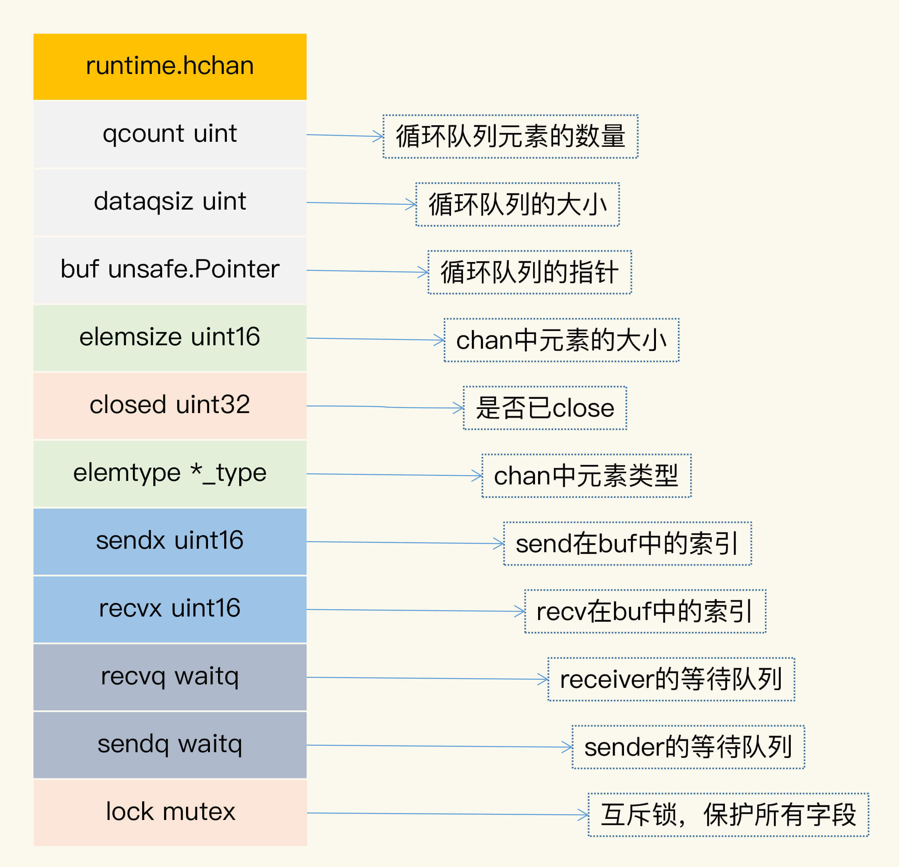

### CSP ###

执行业务处理的 goroutine 不要通过共享内存的方式通信，而是要通过 Channel 通信的方式分享数据。

“share memory by communicating”则是类似于 CSP 模型的方式，通过通信的方式，一个 goroutine 可以把数据的“所有权”交给另外一个 goroutine（虽然 Go 中没有“所有权”的概念，**但是从逻辑上说，你可以把它理解为是所有权的转移）。**

综合起来，我把 Channel 的应用场景分为五种类型

1. **数据交流**：当作并发的 buffer 或者 queue，解决生产者 - 消费者问题。多个 goroutine 可以并发当作生产者（Producer）和消费者（Consumer）。
2. **数据传递**：一个 goroutine 将数据交给另一个 goroutine，相当于把数据的拥有权 (引用) 托付出去。
3. **信号通知**：一个 goroutine 可以将信号 (closing、closed、data ready 等) 传递给另一个或者另一组 goroutine 。
4. **任务编排**：可以让一组 goroutine 按照一定的顺序并发或者串行的执行，这就是编排的功能。
5. **锁**：利用 Channel 也可以实现互斥锁的机制。

send 和 recv 都可以作为 select 语句的 case clause，如下面的例子：

```go
func main() {
    var ch = make(chan int, 10)
    for i := 0; i < 10; i++ {
        select {
        case ch <- i:
        case v := <-ch:
            fmt.Println(v)
        }
    }
}
```

#### Channel 的实现原理 ####

**chan 数据结构**



* qcount：代表 chan 中已经接收但还没被取走的元素的个数。内建函数 len 可以返回这个字段的值。
* dataqsiz：队列的大小。chan 使用一个循环队列来存放元素，循环队列很适合这种生产者 - 消费者的场景
* buf：存放元素的循环队列的 buffer。
* elemtype 和 elemsize：chan 中元素的类型和元素 size
* sendx：处理发送数据的指针在 buf 中的位置。一旦接收了新的数据，指针就会加上 elemsize，移向下一个位置。buf 的总大小是 elemsize 的整数倍，而且 buf 是一个循环列表。
* recvx：处理接收请求时的指针在 buf 中的位置。一旦取出数据，此指针会移动到下一个位置。
* recvq：chan 是多生产者多消费者的模式，**如果消费者因为没有数据可读而被阻塞了，就会被加入到 recvq 队列中。**
* sendq：**如果生产者因为 buf 满了而阻塞，会被加入到 sendq 队列中。**

来看一下 makechan 的主要逻辑。主要的逻辑我都加上了注释，它会根据 chan 的容量的大小和元素的类型不同，初始化不同的存储空间：

```go
func makechan(t *chantype, size int) *hchan {
    elem := t.elem
  
        // 略去检查代码
        mem, overflow := math.MulUintptr(elem.size, uintptr(size))
        
    //
    var c *hchan
    switch {
    case mem == 0:
      // chan的size或者元素的size是0，不必创建buf
      c = (*hchan)(mallocgc(hchanSize, nil, true))
      c.buf = c.raceaddr()
    case elem.ptrdata == 0:
      // 元素不是指针，分配一块连续的内存给hchan数据结构和buf
      c = (*hchan)(mallocgc(hchanSize+mem, nil, true))
            // hchan数据结构后面紧接着就是buf
      c.buf = add(unsafe.Pointer(c), hchanSize)
    default:
      // 元素包含指针，那么单独分配buf
      c = new(hchan)
      c.buf = mallocgc(mem, elem, true)
    }
  
        // 元素大小、类型、容量都记录下来
    c.elemsize = uint16(elem.size)
    c.elemtype = elem
    c.dataqsiz = uint(size)
    lockInit(&c.lock, lockRankHchan)

    return c
  }
```

**send**

Go 在编译发送数据给 chan 的时候，会把 send 语句转换成 chansend1 函数，chansend1 函数会调用 chansend

```go
func chansend1(c *hchan, elem unsafe.Pointer) {
    chansend(c, elem, true, getcallerpc())
}
func chansend(c *hchan, ep unsafe.Pointer, block bool, callerpc uintptr) bool {
        // 第一部分
    if c == nil {
      if !block {
        return false
      }
      gopark(nil, nil, waitReasonChanSendNilChan, traceEvGoStop, 2)
      throw("unreachable")
    }
      ......
  }
```

最开始，第一部分是进行判断：**如果 chan 是 nil 的话，就把调用者 goroutine park（阻塞休眠）**， 调用者就永远被阻塞住了，所以，第 11 行是不可能执行到的代码

```go
  // 第二部分，如果chan没有被close,并且chan满了，直接返回
    if !block && c.closed == 0 && full(c) {
      return false
  }
```

第二部分的逻辑是当你往一个已经满了的 chan 实例发送数据时，并且想不阻塞当前调用，那么这里的逻辑是直接返回

```go
  // 第三部分，chan已经被close的情景
    lock(&c.lock) // 开始加锁
    if c.closed != 0 {
      unlock(&c.lock)
      panic(plainError("send on closed channel"))
  }
```

第三部分显示的是，如果 chan 已经被 close 了，再往里面发送数据的话会 panic。

```go
      // 第四部分，从接收队列中出队一个等待的receiver
     //recvq 没有数据可读阻塞的消费者
        if sg := c.recvq.dequeue(); sg != nil {
      // 
      send(c, sg, ep, func() { unlock(&c.lock) }, 3)
      return true
    }
```

第四部分，**如果等待队列中有等待的 receiver，那么这段代码就把它从队列中弹出，然后直接把数据交给它（通过 memmove(dst, src, t.size)）**，而不需要放入到 buf 中，速度可以更快一些。

```go
    // 第五部分，buf还没满
      if c.qcount < c.dataqsiz {
      qp := chanbuf(c, c.sendx)
      if raceenabled {
        raceacquire(qp)
        racerelease(qp)
      }
      typedmemmove(c.elemtype, qp, ep)
      c.sendx++
      if c.sendx == c.dataqsiz {
        c.sendx = 0
      }
      c.qcount++
      unlock(&c.lock)
      return true
    }
```

第五部分说明当前没有 receiver，需要把数据放入到 buf 中，放入之后，就成功返回了

```go
  // 第六部分，buf满。
    // chansend1不会进入if块里，因为chansend1的block=true
    if !block {
  unlock(&c.lock)
  return false
}
    ......
```

第六部分是处理 buf 满的情况。如果 buf 满了，发送者的 goroutine 就会加入到发送者的等待队列中，直到被唤醒。这个时候，数据或者被取走了，或者 chan 被 close 了。

#### recv #####

在处理从 chan 中接收数据时，Go 会把代码转换成 chanrecv1 函数

```go
    func chanrecv1(c *hchan, elem unsafe.Pointer) {
    chanrecv(c, elem, true)
  }
  func chanrecv2(c *hchan, elem unsafe.Pointer) (received bool) {
    _, received = chanrecv(c, elem, true)
    return
  }

    func chanrecv(c *hchan, ep unsafe.Pointer, block bool) (selected, received bool) {
        // 第一部分，chan为nil
    if c == nil {
      if !block {
        return
      }
      gopark(nil, nil, waitReasonChanReceiveNilChan, traceEvGoStop, 2)
      throw("unreachable")
    }
```

chanrecv1 和 chanrecv2 传入的 block 参数的值是 true，都是阻塞方式，所以我们分析 chanrecv 的实现的时候，不考虑 block=false 的情况。

第一部分是 chan 为 nil 的情况。和 send 一样，从 nil chan 中接收（读取、获取）数据时，调用者会被永远阻塞。

```go
        // 加锁，返回时释放锁
      lock(&c.lock)
      // 第三部分，c已经被close,且chan为空empty
    if c.closed != 0 && c.qcount == 0 {
      unlock(&c.lock)
      if ep != nil {
        typedmemclr(c.elemtype, ep)
      }
      return true, false
    }
```

第三部分是 chan 已经被 close 的情况。如果 chan 已经被 close 了，并且队列中没有缓存的元素，那么返回 true、false。

```go
      // 第四部分，如果sendq队列中有等待发送的sender
        if sg := c.sendq.dequeue(); sg != nil {
      recv(c, sg, ep, func() { unlock(&c.lock) }, 3)
      return true, true
    }
```

第四部分是处理 buf 满的情况。这个时候，如果是 unbuffer 的 chan，就直接将 sender 的数据复制给 receiver，**否则就从队列头部读取一个值，并把这个 sender 的值加入到队列尾部。**

```go
      // 第五部分, 没有等待的sender, buf中有数据
    if c.qcount > 0 {
      qp := chanbuf(c, c.recvx)
      if ep != nil {
        typedmemmove(c.elemtype, ep, qp)
      }
      typedmemclr(c.elemtype, qp)
      c.recvx++
      if c.recvx == c.dataqsiz {
        c.recvx = 0
      }
      c.qcount--
      unlock(&c.lock)
      return true, true
    }

    if !block {
      unlock(&c.lock)
      return false, false
    }

        // 第六部分， buf中没有元素，阻塞
        ......
```

第五部分是**处理没有等待的 sender 的情况。这个是和 chansend 共用一把大锁，所以不会有并发的问题**。如果 buf 有元素，就取出一个元素给 receiver。

第六部分是处理 buf 中没有元素的情况。如果没有元素，那么当前的 receiver 就会被阻塞，直到它从 sender 中接收了数据，或者是 chan 被 close，才返回。

#### close ####

通过 close 函数，可以把 chan 关闭，编译器会替换成 closechan 方法的调用。

* 如果 chan 为 nil，close 会 panic；
* 如果 chan 已经 closed，再次 close 也会 panic
* 如果 chan 不为 nil，chan 也没有 closed，就把等待队列中的 sender（writer）和 receiver（reader）从队列中全部移除并唤醒。

#### 使用 Channel 容易犯的错误 ####

使用 Channel 最常见的错误是 panic 和 goroutine 泄漏。

1. close 为 nil 的 chan；
2. send 已经 close 的 chan；
3. close 已经 close 的 chan。

goroutine 泄漏的问题也很常见，下面的代码也是一个实际项目中的例子：

```go
func process(timeout time.Duration) bool {
    ch := make(chan bool)

    go func() {
        // 模拟处理耗时的业务
        time.Sleep((timeout + time.Second))
        ch <- true // block
        fmt.Println("exit goroutine")
    }()
    select {
    case result := <-ch:
        return result
    case <-time.After(timeout):
        return false
    }
}
```

在这个例子中，process 函数会启动一个 goroutine，去处理需要长时间处理的业务，处理完之后，会发送 true 到 chan 中，目的是通知其它等待的 goroutine，可以继续处理了。

* 如果发生超时，process 函数就返回了，这就会导致 unbuffered 的 chan 从来就没有被读取
* unbuffered chan 必须等 reader 和 writer 都准备好了才能交流，否则就会阻塞。
* 超时导致未读，结果就是子 goroutine 就阻塞在第 7 行永远结束不了，进而导致 goroutine 泄漏。

解决这个 Bug 的办法很简单，就是将 unbuffered chan 改成容量为 1 的 chan，这样第 7 行就不会被阻塞了。(它就不会因为没有 receiver 就被 block 住)


