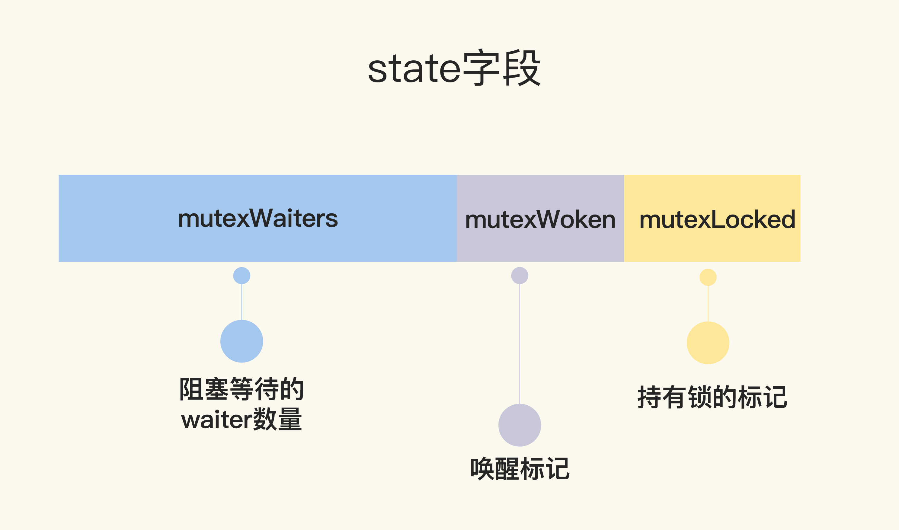

### 初版的互斥锁 ###

可以通过一个 flag 变量，标记当前的锁是否被某个 goroutine 持有。如果这个 flag 的值是 1，就代表锁已经被持有，那么，其它竞争的 goroutine 只能等待；如果这个 flag 的值是 0，就可以通过 CAS（compare-and-swap，或者 compare-and-set）将这个 flag 设置为 1，标识锁被当前的这个 goroutine 持有了

```go
   // CAS操作，当时还没有抽象出atomic包
    func cas(val *int32, old, new int32) bool
    func semacquire(*int32)
    func semrelease(*int32)
    // 互斥锁的结构，包含两个字段
    type Mutex struct {
        key  int32 // 锁是否被持有的标识
        sema int32 // 信号量专用，用以阻塞/唤醒goroutine
    }
    
    // 保证成功在val上增加delta的值
    func xadd(val *int32, delta int32) (new int32) {
        for {
            v := *val
            if cas(val, v, v+delta) {
                return v + delta
            }
        }
        panic("unreached")
    }
    
    // 请求锁
    func (m *Mutex) Lock() {
        if xadd(&m.key, 1) == 1 { //标识加1，如果等于1，成功获取到锁
            return
        }
        semacquire(&m.sema) // 否则阻塞等待
    }
    
    func (m *Mutex) Unlock() {
        if xadd(&m.key, -1) == 0 { // 将标识减去1，如果等于0，则没有其它等待者
            return
        }
        semrelease(&m.sema) // 唤醒其它阻塞的goroutine
    }    
```

* CAS 指令将给定的值和一个内存地址中的值进行比较，如果它们是同一个值，就使用新值替换内存地址中的值，这个操作是原子性的。
* CAS 是实现互斥锁和同步原语的基础
* 字段 key：是一个 flag，用来标识这个排外锁是否被某个 goroutine 所持有，如果 key 大于等于 1，说明这个排外锁已经被持有；
* 字段 sema：是个信号量变量，用来控制等待 goroutine 的阻塞休眠和唤醒。

1. 调用 Lock 请求锁的时候，通过 xadd 方法进行 CAS 操作
2. xadd 方法通过循环执行 CAS 操作直到成功，保证对 key 加 1 的操作成功完成。如果比较幸运，锁没有被别的 goroutine 持有，那么，Lock 方法成功地将 key 设置为 1，这个 goroutine 就持有了这个锁
3. 如果锁已经被别的 goroutine 持有了，那么，当前的 goroutine 会把 key 加 1，而且还会调用 semacquire 方法,使用信号量将自己休眠，等锁释放的时候，信号量会将它唤醒。
4. 持有锁的 goroutine 调用 Unlock 释放锁时，它会将 key 减 1,如果当前没有其它等待这个锁的 goroutine，这个方法就返回了
5. 如果还有等待此锁的其它 goroutine，那么，它会调用 semrelease 方法,利用信号量唤醒等待锁的其它 goroutine 中的一个。

### 给新人机会 ###

```go
   type Mutex struct {
        state int32
        sema  uint32
    }


    const (
        mutexLocked = 1 << iota // mutex is locked
        mutexWoken
        mutexWaiterShift = iota
    )
```



state 是一个复合型的字段，一个字段包含多个意义，这样可以通过尽可能少的内存来实现互斥锁:

* 这个字段的第一位（最小的一位）来表示这个锁是否被持有
* 第二位代表是否有唤醒的 goroutine，剩余的位数代表的是等待此锁的 goroutine 数

```go
   func (m *Mutex) Lock() {
        // Fast path: 幸运case，能够直接获取到锁
        if atomic.CompareAndSwapInt32(&m.state, 0, mutexLocked) {
            return
        }

        awoke := false
        for {
            old := m.state
            new := old | mutexLocked // 新状态加锁
            if old&mutexLocked != 0 {
                new = old + 1<<mutexWaiterShift //等待者数量加一
            }
            if awoke {
                // goroutine是被唤醒的，
                // 新状态清除唤醒标志
                new &^= mutexWoken
            }
            if atomic.CompareAndSwapInt32(&m.state, old, new) {//设置新状态
                if old&mutexLocked == 0 { // 锁原状态未加锁
                    break
                }
                runtime.Semacquire(&m.sema) // 请求信号量
                awoke = true
            }
        }
    }
```

1. 首先是通过 CAS 检测 state 字段中的标志,如果没有 goroutine 持有锁，也没有等待持有锁的 gorutine，那么，当前的 goroutine 就很幸运，可以直接获得锁，这也是注释中的 Fast path 的意思。
2. 如果不够幸运，state 不是零值，那么就通过一个循环进行检查,在锁释放唤醒之后，它并不能像先前一样直接获取到锁，还是要和正在请求锁的 goroutine 进行竞争。**这会给后来请求锁的 goroutine 一个机会，也让 CPU 中正在执行的 goroutine 有更多的机会获取到锁，在一定程度上提高了程序的性能**
3. for 循环是不断尝试获取锁，如果获取不到，就通过 runtime.Semacquire(&m.sema) 休眠，休眠醒来之后 awoke 置为 true，尝试争抢锁。
4. 代码中将当前的 flag 设置为加锁状态，如果能成功地通过 CAS 把这个新值赋予 state，就代表抢夺锁的操作成功了。
5. 如果成功地设置了 state 的值，但是之前的 state 是有锁的状态，那么，state 只是清除 mutexWoken 标志或者增加一个 waiter 而已。

释放锁的 Unlock 方法也有些复杂，我们来看一下。

```go
   func (m *Mutex) Unlock() {
        // Fast path: drop lock bit.
        new := atomic.AddInt32(&m.state, -mutexLocked) //去掉锁标志
        if (new+mutexLocked)&mutexLocked == 0 { //本来就没有加锁
            panic("sync: unlock of unlocked mutex")
        }
    
        old := new
        for {
            if old>>mutexWaiterShift == 0 || old&(mutexLocked|mutexWoken) != 0 { // 没有等待者，或者有唤醒的waiter，或者锁原来已加锁
                return
            }
            new = (old - 1<<mutexWaiterShift) | mutexWoken // 新状态，准备唤醒goroutine，并设置唤醒标志
            if atomic.CompareAndSwapInt32(&m.state, old, new) {
                runtime.Semrelease(&m.sema)
                return
            }
            old = m.state
        }
    }
```

1. 第 3 行是尝试将持有锁的标识设置为未加锁的状态，这是通过减 1 而不是将标志位置零的方式实现,第 4 到 6 行还会检测原来锁的状态是否已经未加锁的状态，如果是 Unlock 一个未加锁的 Mutex 会直接 panic。
2. 第一种情况，如果没有其它的 waiter，说明对这个锁的竞争的 goroutine 只有一个，那就可以直接返回了；如果这个时候有唤醒的 goroutine，或者是又被别人加了锁，那么直接返回
3. 第二种情况，如果有等待者，并且没有唤醒的 waiter，那就需要唤醒一个等待的 waiter。在唤醒之前，需要将 waiter 数量减 1，并且将 mutexWoken 标志设置上，这样，Unlock 就可以返回了。

### 多给些机会 ###

如果新来的 goroutine 或者是被唤醒的 goroutine 首次获取不到锁，它们就会通过自旋（spin，通过循环不断尝试）

```go
   func (m *Mutex) Lock() {
        // Fast path: 幸运之路，正好获取到锁
        if atomic.CompareAndSwapInt32(&m.state, 0, mutexLocked) {
            return
        }

        awoke := false
        iter := 0
        for { // 不管是新来的请求锁的goroutine, 还是被唤醒的goroutine，都不断尝试请求锁
            old := m.state // 先保存当前锁的状态
            new := old | mutexLocked // 新状态设置加锁标志
            if old&mutexLocked != 0 { // 锁还没被释放
                if runtime_canSpin(iter) { // 还可以自旋
                    if !awoke && old&mutexWoken == 0 && old>>mutexWaiterShift != 0 &&
                        atomic.CompareAndSwapInt32(&m.state, old, old|mutexWoken) {
                        awoke = true
                    }
                    runtime_doSpin()
                    iter++
                    continue // 自旋，再次尝试请求锁
                }
                new = old + 1<<mutexWaiterShift
            }
            if awoke { // 唤醒状态
                if new&mutexWoken == 0 {
                    panic("sync: inconsistent mutex state")
                }
                new &^= mutexWoken // 新状态清除唤醒标记
            }
            if atomic.CompareAndSwapInt32(&m.state, old, new) {
                if old&mutexLocked == 0 { // 旧状态锁已释放，新状态成功持有了锁，直接返回
                    break
                }
                runtime_Semacquire(&m.sema) // 阻塞等待
                awoke = true // 被唤醒
                iter = 0
            }
        }
    }
```

这次的优化，增加了第 13 行到 21 行、第 25 行到第 27 行以及第 36 行。如果可以 spin 的话，第 9 行的 for 循环会重新检查锁是否释放。对于临界区代码执行非常短的场景来说，这是一个非常好的优化。**因为临界区的代码耗时很短，锁很快就能释放，而抢夺锁的 goroutine 不用通过休眠唤醒方式等待调度，直接 spin 几次，可能就获得了锁。**

### 解决饥饿 ###


