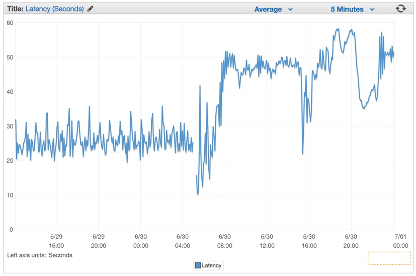

## The Problem

our goal was to be able to handle a large amount of POST requests from millions of endpoints. The web handler would receive a JSON document that may contain a collection of many payloads that needed to be written to Amazon S3, in order for our map-reduce systems to later operate on this data.

We started by creating a few structures to define the web request payload that we would be receiving through the POST calls, and a method to upload it into our S3 bucket.

```go
type PayloadCollection struct {
	WindowsVersion  string    `json:"version"`
	Token           string    `json:"token"`
	Payloads        []Payload `json:"data"`
}

type Payload struct {
    // [redacted]
}

func (p *Payload) UploadToS3() error {
    // the storageFolder method ensures that there are no name collision in
    // case we get same timestamp in the key name
    storage_path := fmt.Sprintf("%v/%v", p.storageFolder, time.Now().UnixNano())

	bucket := S3Bucket

	b := new(bytes.Buffer)
	encodeErr := json.NewEncoder(b).Encode(payload)
	if encodeErr != nil {
		return encodeErr
	}

    // Everything we post to the S3 bucket should be marked 'private'
    var acl = s3.Private
	var contentType = "application/octet-stream"

	return bucket.PutReader(storage_path, b, int64(b.Len()), contentType, acl, s3.Options{})
}

```

Initially we took a very naive implementation of the POST handler, just trying to parallelize the job processing into a simple goroutine:

```go
func payloadHandler(w http.ResponseWriter, r *http.Request) {

    if r.Method != "POST" {
		w.WriteHeader(http.StatusMethodNotAllowed)
		return
	}

    // Read the body into a string for json decoding
	var content = &PayloadCollection{}
	err := json.NewDecoder(io.LimitReader(r.Body, MaxLength)).Decode(&content)
    if err != nil {
		w.Header().Set("Content-Type", "application/json; charset=UTF-8")
		w.WriteHeader(http.StatusBadRequest)
		return
	}

    // Go through each payload and queue items individually to be posted to S3
    for _, payload := range content.Payloads {
        go payload.UploadToS3()   // <----- DON'T DO THIS
    }

    w.WriteHeader(http.StatusOK)
}

```

There is no way to control how many go routines we are spawning. And since we were getting 1 million POST requests per minute of course this code crashed and burned very quickly.

this could work for the majority of people, but this quickly proved to not work very well at a large scale

### Trying again

So the second iteration was to create a buffered channel where we could queue up some jobs and upload them to S3, and since we could control the maximum number of items in our queue and we had plenty of RAM to queue up jobs in memory, we thought it would be okay to just buffer jobs in the channel queue.

```go
var Queue chan Payload

func init() {
    Queue = make(chan Payload, MAX_QUEUE)
}

func payloadHandler(w http.ResponseWriter, r *http.Request) {
    ...
    // Go through each payload and queue items individually to be posted to S3
    for _, payload := range content.Payloads {
        Queue <- payload
    }
    ...
}

```

And then to actually dequeue jobs and process them, we were using something similar to this:

```go
func StartProcessor() {
    for {
        select {
        case job := <-Queue:
            job.payload.UploadToS3()  // <-- STILL NOT GOOD
        }
    }
}

```

This must have been a late night full of Red-Bulls. This approach didn’t buy us anything, we have traded flawed concurrency with a buffered queue that was simply postponing(推迟) the problem.(我们用一个缓冲队列来交换有缺陷的并发性，这只是推迟了问题)

our buffered channel was quickly reaching its limit and blocking the request handler ability to queue more items.



### The Better Solution

The idea was to parallelize the uploads to S3 to a somewhat sustainable rate, one that would not cripple the machine nor start generating connections errors from S3. So we have opted for creating a Job/Worker pattern(这个想法是将上传到 S3 的并行速度保持在某种程度上可持续的速度，既不会损坏机器，也不会开始从 S3 生成连接错误。所以我们选择创建一个 Job/Worker 模式)

```go
var (
	MaxWorker = os.Getenv("MAX_WORKERS")
	MaxQueue  = os.Getenv("MAX_QUEUE")
)

// Job represents the job to be run
type Job struct {
	Payload Payload
}

// A buffered channel that we can send work requests on.
var JobQueue chan Job

// Worker represents the worker that executes the job
type Worker struct {
	WorkerPool  chan chan Job
	JobChannel  chan Job
	quit    	chan bool
}

func NewWorker(workerPool chan chan Job) Worker {
	return Worker{
		WorkerPool: workerPool,
		JobChannel: make(chan Job),
		quit:       make(chan bool)}
}

// Start method starts the run loop for the worker, listening for a quit channel in
// case we need to stop it
func (w Worker) Start() {
	go func() {
		for {
			// register the current worker into the worker queue.
			w.WorkerPool <- w.JobChannel

			select {
			case job := <-w.JobChannel:
				// we have received a work request.
				if err := job.Payload.UploadToS3(); err != nil {
					log.Errorf("Error uploading to S3: %s", err.Error())
				}

			case <-w.quit:
				// we have received a signal to stop
				return
			}
		}
	}()
}

// Stop signals the worker to stop listening for work requests.
func (w Worker) Stop() {
	go func() {
		w.quit <- true
	}()
}

```

* ``func (w Worker) Start()  `` 表示启动一个Worker 并把Worker放入Pool中
* 等待接收w.JobChannel 中的job 然后处理```Payload.UploadToS3()```

We have modified our Web request handler to create an instance of `Job` struct with the payload and send into the `JobQueue` channel for the workers to pickup.

During our web server initialization we create a `Dispatcher` and call `Run()` to create the pool of workers and to start listening for jobs that would appear in the `JobQueue`.

```go
dispatcher := NewDispatcher(MaxWorker)
dispatcher.Run()

```

Below is the code for our dispatcher implementation:

```go
type Dispatcher struct {
	// A pool of workers channels that are registered with the dispatcher
	WorkerPool chan chan Job
}

func NewDispatcher(maxWorkers int) *Dispatcher {
	pool := make(chan chan Job, maxWorkers)
	return &Dispatcher{WorkerPool: pool}
}

func (d *Dispatcher) Run() {
    // starting n number of workers
	for i := 0; i < d.maxWorkers; i++ {
		worker := NewWorker(d.pool)
		worker.Start()
	}

	go d.dispatch()
}

func (d *Dispatcher) dispatch() {
	for {
		select {
		case job := <-JobQueue:
			// a job request has been received
			go func(job Job) {
				// try to obtain a worker job channel that is available.
				// this will block until a worker is idle
				jobChannel := <-d.WorkerPool

				// dispatch the job to the worker job channel
				jobChannel <- job
			}(job)
		}
	}
}

```

* 根据maxWorkers创建一个Pool,并根据maxWorkers创建Worker, 启动Worker（即创建一个job channel 并送入Pool中）
* dispatch从JobQueue 获取job 
* 尝试从WorkerPool 获取 一个jobChannel，jobChannel 是Worker中的对象
* 往jobChannel 发送一个job , Worker之前等待的地方就开始工作处理了
* 当Worker处理完一个job后会重新把jobChannel放入Pool以表示自己就绪了
* 如果WorkPool中取不出jobChannel说明 Worker都太繁忙了，没有新的Worker送入WorkerPool了

```go
func payloadHandler(w http.ResponseWriter, r *http.Request) {

    if r.Method != "POST" {
		w.WriteHeader(http.StatusMethodNotAllowed)
		return
	}

    // Read the body into a string for json decoding
	var content = &PayloadCollection{}
	err := json.NewDecoder(io.LimitReader(r.Body, MaxLength)).Decode(&content)
    if err != nil {
		w.Header().Set("Content-Type", "application/json; charset=UTF-8")
		w.WriteHeader(http.StatusBadRequest)
		return
	}

    // Go through each payload and queue items individually to be posted to S3
    for _, payload := range content.Payloads {

        // let's create a job with the payload
        work := Job{Payload: payload}

        // Push the work onto the queue.
        JobQueue <- work
    }

    w.WriteHeader(http.StatusOK)
}

```

Immediately after we have deployed it we saw all of our latency rates drop to insignificant numbers and our ability to handle requests surged drastically.


