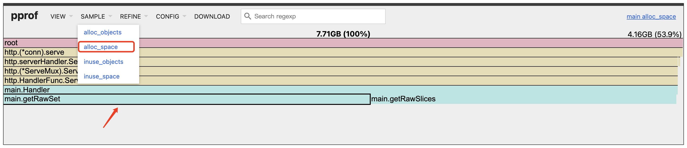
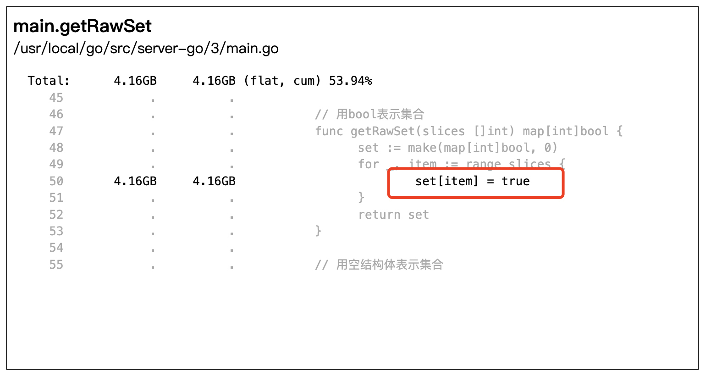

#### 实验设计

先构造一个 http 服务。这个服务包含一个请求处理方法 Handler。方法里有两个逻辑，一个是循环往切片 append 数据，另一个是用 map 类型构造一个集合。

```go
package main

import (
    "fmt"
    "net/http"
    _ "net/http/pprof"
)

func Handler(w http.ResponseWriter, r *http.Request) {
    slices := getRawSlices()
    getRawSet(slices)
    // 设置响应头，这里设置Content-Type为text/plain，表示返回纯文本内容
    w.Header().Set("Content-Type", "text/plain")
    // 向客户端写入响应内容
    fmt.Fprintln(w, "hh")
}
func main() {
    // 注册路由，当客户端访问根路径"/"时，会调用Handler函数进行处理
    http.HandleFunc("/", Handler)
    err := http.ListenAndServe(":8888", nil)
    if err != nil {
        panic(err)
    }
}

// getRawSlices 循环往切片append数据
func getRawSlices() []int {
    n := 10000
    slices := make([]int, 0)
    for i := 0; i < n; i++ {
        slices = append(slices, i)
    }
    return slices
}

// 构造集合
func getRawSet(slices []int) map[int]bool {
    set := make(map[int]bool, 0)
    for _, item := range slices {
        set[item] = true
    }
    return set
}
```

现在让我们用 ab 工具（Apache Bench）模拟线上用户，对这个 http 服务发起请求压测。

```
-n 请求数量 
-c 并发数量
ab -n 30000 -c 2 http://127.0.0.1:8888/
```

发现内存资源占用比较高，可以用pprof 工具，采集单机内存性能报告并生成下面的内存火焰图。

```bash
curl "http://127.0.0.1:8888/debug/pprof/heap?seconds=30" > heap.pprof

go tool pprof -http :8889 heap.pprof
```



getRawSet 函数是内存消耗最大的函数。接着，我们点击火焰图的最后一行进入 getRawSet 函数内部查看，可以看到下面的图，消耗内存资源的热点代码是 map 赋值这行代码。



* 先考虑存入 map 的数据能不能尽量少。
* 除了我们存入的数据之外，map 赋值操作是如何实现的，里面是否存在耗内存的动作，有的话能否减少甚至规避掉？

##### 空结构体：集合表示如何省内存

从集合的使用场景来看，我们要么判断一个 key 是不是在 map 中，要么获取 map 里面的所有 key，而 map 里面的 value 值，在集合的使用场景中并不需要。**那有没有办法消除 map 里面的 value 所占的内存空间呢？**

在 Go 语言里，**提供了空结构体类型 struct{}，而空结构体对象所占的空间大小为 0**

可以把 map 的 value 类型，从 bool 类型改为空结构体类型，就像下面的代码一样。

```go
// value用空结构体类型
func getEmptyStructSet(slices []int) map[int]struct{} {
    set := make(map[int]struct{}, 0)
    for _, item := range slices {
        set[item] = struct{}{}
    }
    return set
}
```

用 Benchmark 来测一测。Benchmark 脚本如下所示：

```go
var slices []int

func init() {
    slices = getRawSlices()
}

func BenchmarkGetRawSet(b *testing.B) {
    for n := 0; n < b.N; n++ {
        getRawSet(slices)
    }
}

func BenchmarkGetEmptyStructSet(b *testing.B) {
    for n := 0; n < b.N; n++ {
        getEmptyStructSet(slices)
    }
}
```

value 用空结构体类型，性能有了一定程度的提升。从内存消耗来看，value 用 bool 类型，单次函数调用要 427596 字节内存，而用空结构体类型，每次函数调用只要 389449 字节内存，节约了 9% 左右的内存资源。

```bash
killianxu@KILLIANXU-MB0 3 % go test -bench='.' -benchmem -benchtime=10s
warning: GOPATH set to GOROOT (/usr/local/go) has no effect
goos: darwin
goarch: amd64
pkg: server-go/3
cpu: Intel(R) Core(TM) i5-7360U CPU @ 2.30GHz
BenchmarkGetRawSet-4               17214            608437 ns/op          427596 B/op        319 allocs/op
BenchmarkGetEmptyStructSet-4       19430            563814 ns/op          389449 B/op        255 allocs/op
```

#### 指定容量：容器操作如何避免扩容迁移？

map 底层其实是以数组 + 链表的数据结构存储 key-value 对的。为了描述方便，数组的每一个位置，通常我们称它为桶。

正常情况下，当往 map 中写入 ket-value 对时，Go 底层会根据 key 做 hash，定位到需要写入 key-value 对的桶，并插入桶对应的链表中。

但是当 map 里面写入的数据过多时，数组里面的桶链表会越来越长。而 map 的写入和读取，都需要遍历桶链表，因此**过长的桶链表会影响 map 的读写性能。**

为了缓解这种情况，在往 map 写入数据时，如果 map 中的数据量已经比较多了，Go 底层还有个扩容迁徙的分支逻辑


首先申请更大的数组空间。

然后将旧数组空间数据迁移到新数组空间。Go 采取了渐进式 hash 的思想，**每次往 map 写入数据时，会触发从旧数组空间往新数组空间迁移两个桶链表数据，从而避免一次迁移全量数据导致 map 写请求延时抖动，直到旧数组空间的所有桶链表迁移完为止。**

虽然通过扩容迁移，将原先在同一个桶链表里的数据，重新 hash 到新数组不同的桶链表中，可以减少桶链表长度，避免 map 读写性能大幅度裂化。**但是扩容迁移属于消耗内存和 CPU 资源的操作，如果循环往 map 写入，可能会触发多次扩容迁移，消耗大量内存和 CPU 资源。**

创建 map 的 make 函数提供了一个 size 参数。Go 底层在创建 map 对象时，会根据传入的 size 参数申请数组空间。因此**只要我们能提前知道 map 要存储的数据量，就能传入这个 size 参数，从而避免写入过程频繁扩容**。

```go
// 提前指定容量
func getCapacitySet(slices []int) map[int]struct{} {
    set := make(map[int]struct{}, len(slices))
    for _, item := range slices {
        set[item] = struct{}{}
    }
    return set
}
```

* 从内存消耗来看，不指定 map 容量的方式，单次函数调用要 389461 字节内存，而指定容量的方式，每次函数调用只要 182480 字节内存，节约了 53% 左右的内存资源
* 从 CPU 资源消耗来看，不指定 map 容量的方式，单次函数调用要 563814ns，而指定容量的方式只要 287038ns，节约了 49% 左右的 CPU 资源。

####  总结

1. 尽量避免频繁对 map 和 slice 的增删，这会触发底层结构重新分配
2. 并发场景下 减少锁争用，比如使用并发安全的 sync.map 或者 通过分片技术将大 map 分为小 map 
3. 需要大量短生命周期容器对象时，通过 sync.pool 复用对象，减少频繁的内存重新分配
4. 在多线程场景下，使用 sync.once 优化初始化操作，保证只执行一次
5. 容器元素为 大对象 或者 复杂结构体，传递指针而不是值，这样可以减少拷贝的开销，特别是在作为函数参数时
6. 对于结构体来说，按照字段的大小降序排列，可以降低内存对齐时的填充浪费


