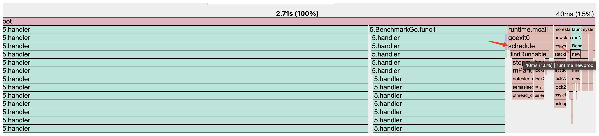

#### 对象池：如何避免频繁分配相同类型临时对象的开销？

首先是内存分配。我们不停地创建对象时，就得不断地在堆里面找空闲的内存块，然后进行分配

再就是垃圾收集（GC）。要是临时对象很多，那在进行垃圾收集的时候，就需要耗费更多的 CPU 资源去扫描这些对象

这段代码会不断地创建 bytes.Buffer 临时对象。

```go
var data = make([]byte, 1000)

func WriteBufferNoPool() {
    var buf bytes.Buffer
    buf.Write(data)
}

func BenchmarkNoPool(b *testing.B) {
    for i := 0; i < b.N; i++ {
        // 请求处理逻辑
        WriteBufferNoPool()
    }
}
```

生成并查看一下 CPU 火焰图。

```go
go test -bench=BenchmarkNoPool -benchmem -cpuprofile='cpu.pprof'
go tool pprof -http :8889 cpu.pprof
```

从火焰图里我们能发现，在 WriteBufferNoPool 函数的调用栈里，消耗 CPU 资源最多的是 mallocgc 函数，这个函数就是专门负责堆内存分配的

由于我们每次申请的都是同一种类型的对象，也就是 bytes.Buffer。既然这样，像下面的图一样，我们可以在每次用完这个临时对象之后，把它放到一个池子里。等下次要用的时候，就直接从池子里取出来用。

对于对象池，Golang 里有个 sync.Pool 类型来支持它。那这个 sync.Pool 是怎么用的呢？

得定义一个 New 函数。为啥要定义这个呢？因为当我们从对象池里取对象的时候，如果池子里没有对象，就需要调用这个 New 函数来创建。

```go
var objectPool = sync.Pool{
    New: func() interface{} {
        return &bytes.Buffer{}
    },
}
```

当我们使用 sync.Pool 的时候，像下面的代码一样，是通过调用 Get 和 Put 这两个方法，来实现从池里取出临时对象和把临时对象放回池里这两个操作的。

```go
func WriteBufferWithPool() {
    // 获取临时对象
    buf := objectPool.Get().(*bytes.Buffer)
    // 使用
    buf.Write(data)
    // 将buf对象里面的字段恢复初始值
    buf.Reset()
    // 放回
    objectPool.Put(buf)
}
```

对象池在 Golang 标准库中也有很多使用。比如咱们很常用的 fmt.Printf() 函数，就像下面的代码一样，在它的底层实现中就会调用 newPrinter 函数和 p.free() 方法。

```go
func Printf(format string, a ...any) (n int, err error) {
    return Fprintf(os.Stdout, format, a...)
}

func Fprintf(w io.Writer, format string, a ...any) (n int, err error) {
    p := newPrinter()
    p.doPrintf(format, a)
    n, err = w.Write(p.buf)
    p.free()
    return
}
```

它的 newPrinter 函数就会从一个对象池里获取 pp 对象

```go
// pp is used to store a printer's state and is reused with sync.Pool to avoid allocations.
type pp struct {
    buf buffer
    ...
}

var ppFree = sync.Pool{
    New: func() any { return new(pp) },
}

// newPrinter allocates a new pp struct or grabs a cached one.
func newPrinter() *pp {
    p := ppFree.Get().(*pp)
    p.panicking = false
    p.erroring = false
    p.wrapErrs = false
    p.fmt.init(&p.buf)
    return p
}
```

而 p.free() 方法就是把临时对象放回对象池中

```go
// free saves used pp structs in ppFree; avoids an allocation per invocation.
func (p *pp) free() {
    // Proper usage of a sync.Pool requires each entry to have approximately
    // the same memory cost. To obtain this property when the stored type
    // contains a variably-sized buffer, we add a hard limit on the maximum
    // buffer to place back in the pool. If the buffer is larger than the
    // limit, we drop the buffer and recycle just the printer.
    //
    // See https://golang.org/issue/23199.
    if cap(p.buf) > 64*1024 {
        p.buf = nil
    } else {
        p.buf = p.buf[:0]
    }
    ppFree.Put(p)
}
```

#### 协程池：如何避免频繁创建协程的开销

1. 第一就是内存分配。在 Golang 中，每次创建一个协程，默认都得分配 2KB 的内存空间，而且还要进行初始化。要是不停地创建协程，那就得不停地进行内存分配和初始化，这个过程就需要消耗不少 CPU 资源。
2. 第二就是协程调度。特别是那种 CPU 密集型的应用，如果频繁创建协程，将会导致处于就绪状态、能被 CPU 调度的协程过多。协程调度就会变得很频繁，要知道，协程调度这个过程本身也是会消耗 CPU 资源的。

```go
const benchmarkTimes = 10000

func handler(a, b int) int {
    if b < 100 {
        return handler(0, b+1)
    }
    return 0
}

func BenchmarkGo(b *testing.B) {
    var wg sync.WaitGroup
    b.ReportAllocs()
    b.ResetTimer()
    for i := 0; i < b.N; i++ {
        wg.Add(benchmarkTimes)
        for j := 0; j < benchmarkTimes; j++ {
            go func() {
                handler(0, 0)
                wg.Done()
            }()
        }
        wg.Wait()
    }
}
```

```
go test -bench=BenchmarkGo -benchmem -cpuprofile='cpu.pprof'
go tool pprof -http :8889 cpu.pprof
```



runtime.newproc 和 runtime.schedule 这两个函数也占用了一部分 CPU 资源。而这两个函数就是 Go 协程创建和调度逻辑。

不同的请求需要使用协程运行任务时，不用重新创建协程，而是将自己的任务加到任务通道中，协程池中的协程从通道中获取任务运行，这样就实现了协程共用，避免频繁创建协程

```go
type handlerFunc func()

// 工作池
type WorkerPool struct {
    WorkNum int
    tasks   chan handlerFunc
}

// 构造函数，启动固定数目协程
func NewWorkerPool(workNum int) *WorkerPool {
    w := &WorkerPool{WorkNum: workNum, tasks: make(chan handlerFunc)}
    w.start()
    return w
}
func (w *WorkerPool) start() {
    for i := 0; i < w.WorkNum; i++ {
        go func() {
            for task := range w.tasks {
                task()
            }
        }()
    }
}
```

接着，我们可以给 WorkerPool 添加一个方法。这个方法的作用就是往通道里面写入任务。这样一来，我们就成功实现了一个简单的协程池类型，也就是 WorkerPool。

```go
func (w *WorkerPool) addTask(task handlerFunc) {
    w.tasks <- task
}
```

在实际应用的时候，其实并不需要去实现协程池，因为有不少好用的第三方库可供我们选择。在众多第三方库里面，下面这几个就比较受欢迎。

https://github.com/bytedance/gopkg/tree/main/util/gopool

gopool 是字节开源的高性能协程池，它能够实现协程的复用，并且还可以对协程的最大数目加以限制

只需要把原本用 go 关键字去创建协程的地方，替换成调用 gopool.Go 方法，就能轻松使用默认的协程池运行咱们的逻辑代码。

```go
package main

import (
    "github.com/bytedance/gopkg/util/gopool"
)

func main() {
    // 创建协程运行
    go func() {
        // do your job
    }()
    // 用默认协程池运行
    gopool.Go(func() {
        /// do your job
    })
}
```

* 对于 CPU 密集型任务，我们可以将协程数目设置得比 CPU 核心数略大一些，一般可以设置为 CPU 核心数的倍数。不过要注意不能超出核心数太多。因为一旦超出过多，就会导致协程调度过于频繁，进而增加 CPU 的开销。
* **而对于 I/O 密集型任务，协程数目则可以比 CPU 核心数大许多**。这样的话，当某个协程因 I/O 操作而被阻塞时，其他协程就能够充分利用 CPU 资源。通常情况下，I/O 阻塞的时间越长，协程数目可以相应设置得越大。
* 对于混合型任务，其协程数目的设置值应介于 CPU 密集型任务和 I/O 密集型任务的协程数目之间。

要是在压测过程中发现 CPU 利用率很高，系统的吞吐量无法继续提升，那么我们可以适当调低协程数目，然后再次进行压测，观察吞吐量是否比之前有所提高。若吞吐量确实提高了，就表明此次协程数目的调整是有效的。

##### 总结

数据库连接池，使用 database/sql 包时，可以配置连接池来复用数据库连接，减少连接创建和关闭的开销。 HTTP 连接池，使用 http.Client 时，可以通过设置 Transport 来配置连接池，减少创建新的 TCP 连接的成本。 IO 操作的缓冲，使用 bufio 包中的 Reader 和 Writer，它们可以缓冲 I/O 操作，从而减少系统调用的次数，提高性能。


