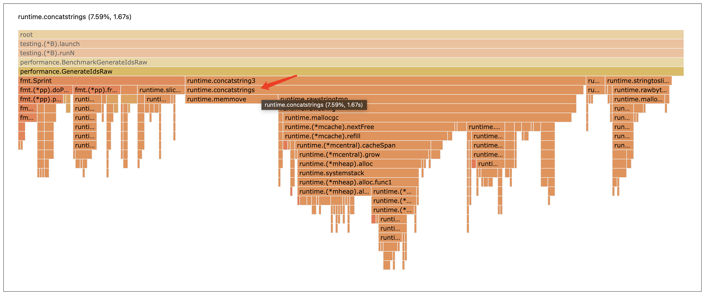

这段代码会循环做字符串拼接、整型转字符串和字符串转字节切片操作

```go
package performance

import (
    "fmt"
)

type User struct {
    Id   int
    Name string
}

// GenerateIdsRaw 原始待优化函数
func GenerateIdsRaw(users []*User) (string, string, []byte) {
    names := ""
    idStr := ""
    var nameByte []byte
    for index := range users {
        idStr = fmt.Sprint(users[index].Id)
        names = names + "," + users[index].Name
        nameByte = []byte(users[index].Name)
    }
    return idStr, names, nameByte
}
```

Benchmark 代码，也就是对前面构造的那段代码做基准测试，评估前面代码在大规模用户数据处理时的性能。

```go
package performance

import (
    "fmt"
    "testing"
)

// 初始化构造测试用例
var users []*User

func init() {
    for i := 0; i < 1000; i++ {
        users = append(users, &User{Id: i, Name: fmt.Sprintf("user%d", i)})
    }
}

func BenchmarkGenerateIdsRaw(b *testing.B) {
    for n := 0; n < b.N; n++ {
        GenerateIdsRaw(users)
    }
}
```

Benchmark 代码来生成并查看一下 CPU 火焰图

```bash
go test -run=none -bench=BenchmarkGenerateIdsRaw -benchtime=10s -gcflags=all=-l -cpuprofile cpu.prof
go tool pprof -http=":8081" cpu.prof
```



消耗 CPU 最多的是 runtime.concatstrings 函数，而这个函数是 Go 语言 “+” 操作符进行字符串拼接的底层实现函数。

#### 高性能字符串拼接

当用 “+” 连接符拼接两个字符串的时候，**得先开辟一块新的内存空间来存放拼接后的字符串，然后把这两个字符串按照拼接的顺序拷贝到新空间。**这个新空间的大小等于原来两个字符串长度的和。

如字符串“ab” 和 字符串“cd” 要拼接，就得先给结果字符串找个地方，然后把字符串“ab” 和 “cd” 分别拷贝过去，这样就得到了新的字符串

```go
s1 := "ab" + "cd"
```

如果是循环拼接字符串，每次循环迭代都要分配新空间的话，就需要不停地在堆上分配内存。而且每次迭代还得把拼接的字符串都拷贝到结果空间，需要不停地拷贝。而堆内存分配和拷贝都是比较消耗 CPU 的操作。

因此，要减少字符串拼接操作对 CPU 资源的消耗，就需要减少字符串拼接的内存分配和拷贝

Go 语言里有个 strings.Builder 类型，这个 strings.Builder 类型可以减少内存分配和拷贝，高效地拼接字符串。

```go
package main

import (
        "fmt"
        "strings"
)

func main() {
    var b strings.Builder
    for i := 3; i >= 1; i-- {
            fmt.Fprintf(&b, "%d...", i)
    }
    b.WriteString("ignition")
    fmt.Println(b.String()) // 输出 3...2...1...ignition
}
```

第一个是它有内存预分配的功能。这个类型有一个 Grow 方法，可以提前把内存分配好，实现预分配功能。这样每次循环迭代时就不用重新分配内存，内存频繁分配的问题就解决了。

```go
// Grow grows b's capacity, if necessary, to guarantee space for another n bytes. 
// After Grow(n), at least n bytes can be written to b without another allocation. 
func (b *Builder) Grow(n int)
```

第二个厉害的地方是，字符串拼接时，内存拷贝次数更少

因为 Builder 底层是用 [] byte 类型来存字符串的。往 Builder 里写东西的时候，只有它的 buf 容量不够、需要扩容时，才会发生内存迁移拷贝，不像之前每次循环都得拷贝字符串。**要是提前用 Grow 方法分配好足够的内存，在循环拼接的时候，就不会发生扩容迁移，导致拷贝了。**

```go
type Builder struct {
    buf  []byte
}

// WriteString appends the contents of s to b's buffer.
// It returns the length of s and a nil error.
func (b *Builder) WriteString(s string) (int, error) {
    b.buf = append(b.buf, s...)
    return len(s), nil
}
```

用这个 strings.Builder 来重新实现一下我们的函数：

```go
// GenerateIdsBuilder 使用strings.Builder拼接字符串
func GenerateIdsBuilder(users []*User) (string, string, []byte) {
    names := ""
    idStr := ""
    var nameByte []byte
    length := 0
    for index := range users {
        idStr = fmt.Sprint(users[index].Id)
        nameByte = []byte(users[index].Name)
        length += len(users[index].Name) + 1
    }
    var builder strings.Builder
    builder.Grow(length) // 预分配
    for index := range users {
        builder.WriteString(",")
        builder.WriteString(users[index].Name)
    }
    return idStr, names, nameByte
}
```

Benchmark 脚本：

```go
package performance

import (
    "fmt"
    "testing"
)

// 初始化构造测试用例
var users []*User

func init() {
    for i := 0; i < 1000; i++ {
        users = append(users, &User{Id: i, Name: fmt.Sprintf("user%d", i)})
    }
}

func BenchmarkGenerateIdsRaw(b *testing.B) {
    for n := 0; n < b.N; n++ {
        GenerateIdsRaw(users)
    }
}

func BenchmarkGenerateIdsBuilder(b *testing.B) {
    for n := 0; n < b.N; n++ {
        GenerateIdsBuilder(users)
    }
}
```

用 strings.Builder 拼接字符串的方式，性能有巨大的提升。

```bash
killianxu@KILLIANXU-MB0 performance % go test -run=none -benchmem  -bench=. -gcflags=all=-l
goos: darwin
goarch: amd64
pkg: example.com/performance
cpu: Intel(R) Core(TM) i5-7360U CPU @ 2.30GHz
BenchmarkGenerateIdsRaw-4                    862           1190253 ns/op  4194661 B/op        3739 allocs/op
BenchmarkGenerateIdsBuilder-4               6018            167267 ns/op    30069 B/op        2735 allocs/op
```

* 从 CPU 资源消耗来看，“+” 操作符拼接字符串的方式，单次函数调用要 1190253ns，而 strings.Builder 拼接方式只要 167267ns，节约了 86% 左右的 CPU 资源。
* 从内存消耗来看，“+” 操作符拼接字符串的方式，单次函数调用要 4194661 字节内存，而用 strings.Builder 拼接字符串的方式，每次函数调用只要 30069 字节内存，节约了 99% 左右的内存资源。

在 Golang 官方文档注释中，也特意提到了 strings.Builder。

```
A Builder is used to efficiently build a string using Builder.Write methods. It minimizes memory copying. The zero value is ready to use. Do not copy a non-zero Builder.
```

Go 本身的库函数，也有很多是用 strings.Builder 实现的。比如我们常用的 strings.Join 和 strings.Replace 函数。

用 strings.Builder 优化后，消耗 CPU 最多的函数变成了 fmt.Sprint 函数。

#### 高性能整型转字符串

```
idStr := fmt.Sprint(user.Id)
```

fmt.Sprint 及其变体函数，需要用反射来识别它们正在处理的类型，然后确定如何将其格式化为字符串。而这两者都增加了时间和内存开销

```go
func (p *pp) doPrint(a []any) {
    prevString := false
    for argNum, arg := range a {
        // 反射
        isString := arg != nil && reflect.TypeOf(arg).Kind() == reflect.String
        // Add a space between two non-string arguments.
        if argNum > 0 && !isString && !prevString {
            p.buf.writeByte(' ')
        }
        // 格式化逻辑
        p.printArg(arg, 'v')
        prevString = isString
    }
}
```

strconv 库里面的函数是为特定的转换任务设计的，所以它们比更通用的  fmt 函数执行得更快。

```go
// GenerateIdsStrconv 使用strconv实现整型转字符串
func GenerateIdsStrconv(users []*User) (string, string, []byte) {
    names := ""
    idStr := ""
    var nameByte []byte
    length := 0
    for index := range users {
        idStr = strconv.Itoa(users[index].Id)
        nameByte = []byte(users[index].Name)
        length += len(users[index].Name) + 1
    }
    var builder strings.Builder
    builder.Grow(length) // 预分配
    for index := range users {
        builder.WriteString(",")
        builder.WriteString(users[index].Name)
    }
    return idStr, names, nameByte
}
```

下面是 Benchmark 脚本：

```go
func BenchmarkGenerateIdsStrconv(b *testing.B) {
    for n := 0; n < b.N; n++ {
        GenerateIdsStrconv(users)
    }
}
```

使用 strconv 库将整型转换为字符串的方式，性能提升明显。

```bash
killianxu@KILLIANXU-MB0 performance % go test -run=none -benchmem  -bench=. -gcflags=all=-l 
goos: darwin
goarch: amd64
pkg: example.com/performance
cpu: Intel(R) Core(TM) i5-7360U CPU @ 2.30GHz
BenchmarkGenerateIdsBuilder-4               7215            165601 ns/op         30069 B/op       2735 allocs/op
BenchmarkGenerateIdsStrconv-4              15163             79333 ns/op         23392 B/op       1901 allocs/op
```

* 从 CPU 资源消耗来看，fmt 的方式，单次函数调用要 165601ns，而 strconv 的方式，只要 79333ns，节约了 52% 左右的 CPU 资源。
* 从内存消耗来看，fmt 的方式，单次函数调用要 30069 字节内存，而 strconv 的方式，每次函数调用只要 23392 字节内存，节约了 22% 左右的内存资源。

#### 高性能字符串转字节切片

runtime.stringtoslicebyte 函数是怎么实现字符串转换为字节切片的呢？这里面是不是也有优化空间呢？

```go
nameByte = []byte(users[index].Name)
```

字符串在 Golang 底层对应的是 stringStruct 结构，这个结构里有两个成员变量，str 指针和 len，str 指针指向字符串的内容，len 存储字符串的长度。

切片对应的是 slice 结构，这个结构里有三个成员变量，array、len 和 cap。array 是指向数组的指针，这个数组里面存的就是切片内容，len 表示切片的长度，cap 表示切片的容量。

```go
// 字符串数据结构
type stringStruct struct {
    str unsafe.Pointer //指针类型，指向字节数组
    len int
}

// 切片数据结构
type slice struct {
    array unsafe.Pointer // 数组指针类型，指向数据数组
    len   int
    cap   int
}
```

runtime.stringtoslicebyte 函数是怎么实现字符串转换为字节切片的呢？这里面有三个步骤。

* 第一步，根据字符串的长度，为字节数组申请内存。
* 第二步，构建字节切片对象，设置 slice 结构的成员变量。
* 第三步，把字符串的内容拷贝到字节切片的底层数组里。

```go
func stringtoslicebyte(s string) []byte {
    var b []byte
    // 分配内存，构建字节切片对象
    b := rawbyteslice(len(s))
    // 字符串拷贝到字节切片的array数组
    copy(b, s)
    return b
}
// rawbyteslice allocates a new byte slice. The byte slice is not zeroed.
func rawbyteslice(size int) (b []byte) {
    cap := roundupsize(uintptr(size))
    // 分配内存
    p := mallocgc(cap, nil, false)
    *(*slice)(unsafe.Pointer(&b)) = slice{p, size, int(cap)}
    return
}
```

当将字符串转换为字节切片时，会发生底层字节数组空间的内存申请和拷贝。而且随着字符串长度变长，内存拷贝的性能损耗也会变大。

**unsafe 包可以做一些绕过 Go 类型安全检查的操作，更灵活地操作内存。**它有两个很重要的功能。

第一个是定义了 Pointer 类型，任何类型的指针都能和这个 Pointer 互相转换，有点像 C 语言里的万能指针 void*。

```go
var a int = 1
p := unsafe.Pointer(&a) // 其它类型指针转Pointer
b := (*int)(p) // Pointer类型转其它类型指针
fmt.Println(*b) // 输出1
```

第二个功能是定义了 uintptr 类型，Pointer 和 uintptr 可以互相转换，这样就能做指针的加减等算术运算了。

```go
type Person struct {
    age int
    name string
}
person := Person{age:18,name:"k哥"}
p := unsafe.Pointer(&person) // 其它类型指针转Pointer
u := uintptr(p) // Pointer类型转为uintptr
u=u+8 // uintptr加减操作
pName := unsafe.Pointer(u) // uintptr转换为Pointer
name := *(*string)(pName)
fmt.Println(name) // 输出k哥
```

在 Go 语言里，int、uintptr、unsafe.Pointer 这三个类型所占的大小是相等的，32 位机器上是 4 字节，64 位机器上是 8 字节。

让我们用 unsafe 包实现一个字符串转换为字节切片的函数。

* 第一步，可以把字符串对象想象成一个长度为 2 的 uintptr 类型数组 x，这个数组的 0 号位置其实就是字符串的 str 成员变量，1 号位置就是字符串的 len 成员变量
* 第二步，构造一个长度为 3 的 uintptr 类型数组 b，0 号位置代表字节数组指针，1 号位置代表字节切片长度，2 号位置代表字节切片容量。
* 第三步，把这个 uintptr 类型数组重新解释成字节切片。

```go
func Str2Bytes(s string) []byte {
    x := (*[2]uintptr)(unsafe.Pointer(&s))
    b := [3]uintptr{x[0], x[1], x[1]}
    res := *(*[]byte)(unsafe.Pointer(&b))
    return res
}
```

用 unsafe 包来重新实现一下我们的函数：

```go
func GenerateIdsUnsafe(users []*User) (string, string, []byte) {
    names := ""
    idStr := ""
    var nameByte []byte
    length := 0
    for index := range users {
        idStr = strconv.Itoa(users[index].Id)
        // unsafe包实现字符串转字节切片
        nameByte = Str2Bytes(users[index].Name)
        length += len(users[index].Name) + 1
    }
    var builder strings.Builder
    builder.Grow(length) // 预分配
    for index := range users {
        builder.WriteString(",")
        builder.WriteString(users[index].Name)
    }
    return idStr, names, nameByte
}
```

unsafe 包，通过字符串和字节切片底层数组空间共用，实现高性能转换。并且，也可以用 unsafe 包将字节切片转换为字符串。


