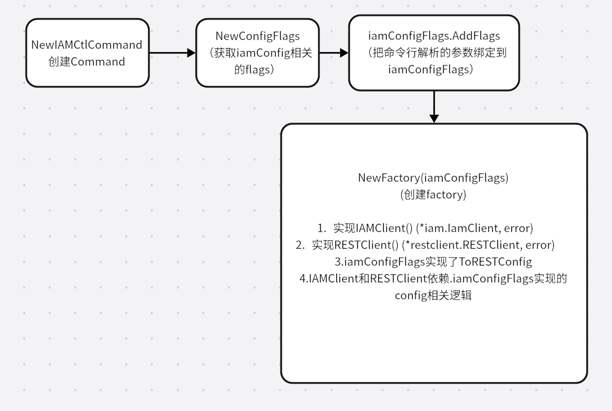
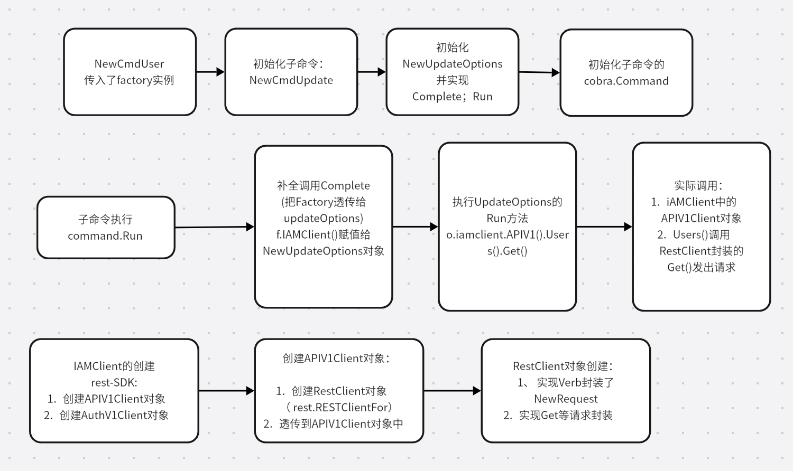

实现自动化：可以通过在脚本中调用 xxxctl 工具，实现自动化。

提高效率：通过将应用的功能封装成命令和参数，方便运维、开发人员在 Linux 服务器上调用。

### 大型系统客户端（xxxctl）的特点 ###


* 支持命令和子命令，命令 / 子命名有自己独有的命令行参数。
* 支持一些特殊的命令。比如支持 completion 命令，completion 命令可以输出 bash/zsh 自动补全脚本，实现命令行及参数的自动补全。还支持 version 命令，version 命令不仅可以输出客户端的版本，还可以输出服务端的版本
* 支持全局 option，全局 option 可以作为所有命令及子命令的命令行参数
* 打印命令 / 子命令的帮助信息

```shell
$ istioctl help register
Registers a service instance (e.g. VM) joining the mesh
 
Usage:
  istioctl register <svcname> <ip> [name1:]port1 [name2:]port2 ... [flags]
```

#### iamctl 的核心实现 ####

iamctl 实现的命令如下：


iamctl 工具的 main 函数位于[iamctl.go](https://github.com/marmotedu/iam/blob/v1.0.6/cmd/iamctl/iamctl.go)文件中

```go
func main() {
	command := cmd.NewDefaultIAMCtlCommand()
	if err := command.Execute(); err != nil {
		os.Exit(1)
	}
}
```

命令的实现存放在internal/iamctl/cmd/cmd.go文件中。

iamctl 的命令统一存放在internal/iamctl/cmd目录下，每个命令都是一个 Go 包,具体实现存放在 internal/iamctl/cmd/<命令>/<命令>.go 文件中。如果命令有子命令，则子命令的实现存放在 internal/iamctl/cmd/<命令>/<命令>_<子命令>.go 文件中

添加命令行选项的代码在```NewIAMCtlCommand```函数中，核心代码为：

```go
func NewIAMCtlCommand(in io.Reader, out, err io.Writer) *cobra.Command {
		cmds := &cobra.Command{
		Use:   "iamctl",
		Short: "iamctl controls the iam platform",
		Long: templates.LongDesc(`
		iamctl controls the iam platform, is the client side tool for iam platform.

		Find more information at:
			https://github.com/marmotedu/iam/blob/master/docs/guide/en-US/cmd/iamctl/iamctl.md`),
		Run: runHelp,
		// Hook before and after Run initialize and write profiles to disk,
		// respectively.
		PersistentPreRunE: func(*cobra.Command, []string) error {
			return initProfiling()
		},
		PersistentPostRunE: func(*cobra.Command, []string) error {
			return flushProfiling()
		},
	}
  ....
  flags := cmds.PersistentFlags()
  
  //获取iamConfig相关的flags
  iamConfigFlags :=      genericclioptions.NewConfigFlags(true).WithDeprecatedPasswordFlag().WithDeprecatedSecretFlag()
	
  //把命令行解析的参数绑定到iamConfigFlags
  iamConfigFlags.AddFlags(flags)
  //matchVersionIAMConfigFlags就是一个实现RESTClientGetter的对象
  //iamConfigFlags 也是实现了RESTClientGetter的对象，这样NewMatchVersionFlags就能把iamConfigFlags当做内部代理来实现一些通用方法，NewMatchVersionFlags就相当于iamConfigFlags的wrapper
	matchVersionIAMConfigFlags := cmdutil.NewMatchVersionFlags(iamConfigFlags)
	matchVersionIAMConfigFlags.AddFlags(cmds.PersistentFlags())
  
  ...
  f := cmdutil.NewFactory(matchVersionIAMConfigFlags)
 
  //将f 传入构建的子命令中
  groups := templates.CommandGroups{
    {
			Message: "Identity and Access Management Commands:",
			Commands: []*cobra.Command{
				user.NewCmdUser(f, ioStreams),
				secret.NewCmdSecret(f, ioStreams),
				policy.NewCmdPolicy(f, ioStreams),
			},
		},
  }
  
  
}
```

接下来就看看NewIAMCtlCommand 中的主要流程：

### 创建iamConfig ###

NewCongifFlags() :https://github.com/marmotedu/iam/blob/master/pkg/cli/genericclioptions/config_flags.go#L216

* 创建一个ConfigFlags 对象
* ConfigFlags 对象主要包含了一些命令行的基础配置，比如CertFile,APIServer,Timeout,RetryInterval等
* 同时ConfigFlags实现了RESTClientGetter。
* 创建好ConfigFlags对象之后调用 iamConfigFlags.AddFlags(flags)来绑定命令行参数，比如FlagUsername 等

```go
// NewConfigFlags returns ConfigFlags with default values set.
func NewConfigFlags(usePersistentConfig bool) *ConfigFlags {
	return &ConfigFlags{
		IAMConfig: pointer.ToString(""),

		BearerToken:   pointer.ToString(""),
		Insecure:      pointer.ToBool(false),
		TLSServerName: pointer.ToString(""),
		CertFile:      pointer.ToString(""),
		KeyFile:       pointer.ToString(""),
		CAFile:        pointer.ToString(""),

		APIServer:           pointer.ToString(""),
		Timeout:             pointer.ToDuration(30 * time.Second),
		MaxRetries:          pointer.ToInt(0),
		RetryInterval:       pointer.ToDuration(1 * time.Second),
		usePersistentConfig: usePersistentConfig,
	}
}

type RESTClientGetter interface {
	// ToRESTConfig returns restconfig
	ToRESTConfig() (*rest.Config, error)
	// ToRawIAMConfigLoader return iamconfig loader as-is
	ToRawIAMConfigLoader() clientcmd.ClientConfig
}

// ToRESTConfig implements RESTClientGetter.
// Returns a REST client configuration based on a provided path
// to a .iamconfig file, loading rules, and config flag overrides.
// Expects the AddFlags method to have been called.
func (f *ConfigFlags) ToRESTConfig() (*rest.Config, error) {
	return f.ToRawIAMConfigLoader().ClientConfig()
}

// implements RESTClientGetter.
func (f *ConfigFlags) ToRawIAMConfigLoader() clientcmd.ClientConfig {
	if f.usePersistentConfig {
		return f.toRawIAMPersistentConfigLoader()
	}

	return f.toRawIAMConfigLoader()
}

func (f *ConfigFlags) toRawIAMConfigLoader() clientcmd.ClientConfig {
	config := clientcmd.NewConfig()
	if err := viper.Unmarshal(&config); err != nil {
		panic(err)
	}

	return clientcmd.NewClientConfigFromConfig(config)
}


// AddFlags binds client configuration flags to a given flagset.
func (f *ConfigFlags) AddFlags(flags *pflag.FlagSet) {
  if f.IAMConfig != nil {
		flags.StringVar(f.IAMConfig, FlagIAMConfig, *f.IAMConfig,
			fmt.Sprintf("Path to the %s file to use for CLI requests", FlagIAMConfig))
	}

 ....

	if f.Username != nil {
		flags.StringVar(f.Username, FlagUsername, *f.Username, "Username for basic authentication to the API server")
	}

	if f.Password != nil {
		flags.StringVar(f.Password, FlagPassword, *f.Password, "Password for basic authentication to the API server")
	}
.....

}


```

* `pointer` 包的核心功能是通过一系列函数，将Go语言中的内置类型（如`string`、`int64`、`time.Time`等）转换为对应的指针类型，比如 ``ToString(s string) *string`：将字符串转换为字符串指针。``ToInt64(i int64) *int64`：将`int64`转换为`int64`指针。
* flagSet 用法：```go run main.go test -name=xxx      #test就是定义的flagset name就是flags.StringVar定义的```

### cmdutil.NewFactory()流程 ###

```NewFactory(matchVersionIAMConfigFlags)```,  所以MatchVersionFlags类型的matchVersionIAMConfigFlags就是一个实现RESTClientGetter的对象

https://github.com/marmotedu/iam/blob/819ffde48fcb88230e5a0dfa1aa21a37c87fb930/internal/iamctl/cmd/util/factory_client_access.go#L44

```go
type Factory interface {
	genericclioptions.RESTClientGetter
	// IAMClient gives you back an external iamclient
	IAMClient() (*iam.IamClient, error)
	// Returns a RESTClient for accessing IAM resources or an error.
	RESTClient() (*restclient.RESTClient, error)
}

func NewFactory(clientGetter genericclioptions.RESTClientGetter) Factory {
	if clientGetter == nil {
		panic("attempt to instantiate client_access_factory with nil clientGetter")
	}

	f := &factoryImpl{
		clientGetter: clientGetter,
	}

	return f
}

type factoryImpl struct {
	clientGetter genericclioptions.RESTClientGetter
}

func (f *factoryImpl) ToRESTConfig() (*restclient.Config, error) {
	return f.clientGetter.ToRESTConfig()
}

func (f *factoryImpl) ToRawIAMConfigLoader() clientcmd.ClientConfig {
	return f.clientGetter.ToRawIAMConfigLoader()
}

func (f *factoryImpl) IAMClient() (*iam.IamClient, error) {
	clientConfig, err := f.ToRESTConfig()
	if err != nil {
		return nil, err
	}
	return iam.NewForConfig(clientConfig)
}

func (f *factoryImpl) RESTClient() (*restclient.RESTClient, error) {
	clientConfig, err := f.ToRESTConfig()
	if err != nil {
		return nil, err
	}
	setIAMDefaults(clientConfig)
	return restclient.RESTClientFor(clientConfig)
}
```

* NewFactory 实际返回一个 factoryImpl 类型的对象，factoryImpl对象包含了RESTClientGetter 类型的对象
* factoryImpl 也实现了RESTClientGetter 接口，相当于内部的clientGetter代理了factoryImpl实现RESTClientGetter接口里的方法
* 同时factoryImpl也实现了Factory 接口 提供了 获取 RESTClient  和  获取IAMClient方法

### NewCmdUser等命令是如何构建的

将变量 f 传入到命令中，在命令中使用 Factory 接口提供的 RESTClient() 和 IAMClientSet() 方法，分别返回 RESTful API 客户端和 SDK 客户端，从而使用客户端提供的接口函数


你可以将一个命令行工具提供的命令进行分组。每个分组包含多个命令，每个命令又可以具有多个子命令

* 通过 NewCmdXyz 函数创建命令框架。 NewCmdXyz 函数通过创建一个 cobra.Command 类型的变量来创建命令；通过指定 cobra.Command 结构体类型的 Short、Long、Example 字段，来指定该命令的使用文档iamctl -h 、详细使用文档iamctl xyz -h 和使用示例。
* 通过 cmd.Flags().XxxxVar 来给该命令添加命令行选项。
* 为了在不指定命令行参数时，能够按照默认的方式执行命令，可以通过 NewXyzOptions 函数返回一个设置了默认选项的 XyzOptions 类型的变量。
* XyzOptions 选项具有 Complete 、Validate 和 Run 三个方法，分别完成选项补全、选项验证和命令执行。命令的执行逻辑可以在 func (o *XyzOptions) Run(args []string) error 函数中编写。

比如：https://github.com/marmotedu/iam/blob/v1.0.6/internal/iamctl/cmd/user/user.go

```go
// NewCmdUser returns new initialized instance of 'user' sub command.
func NewCmdUser(f cmdutil.Factory, ioStreams genericclioptions.IOStreams) *cobra.Command {
	cmd := &cobra.Command{
		Use:                   "user SUBCOMMAND",
		DisableFlagsInUseLine: true,
		Short:                 "Manage users on iam platform",
		Long:                  userLong,
		Run:                   cmdutil.DefaultSubCommandRun(ioStreams.ErrOut),
	}

	cmd.AddCommand(NewCmdCreate(f, ioStreams))
	cmd.AddCommand(NewCmdGet(f, ioStreams))
	cmd.AddCommand(NewCmdList(f, ioStreams))
	cmd.AddCommand(NewCmdDelete(f, ioStreams))
	cmd.AddCommand(NewCmdUpdate(f, ioStreams))

	return cmd
}
```

user_update子命令 https://github.com/marmotedu/iam/blob/v1.0.6/internal/iamctl/cmd/user/user_update.go：

```go
// NewCmdUpdate returns new initialized instance of update sub command.
func NewCmdUpdate(f cmdutil.Factory, ioStreams genericclioptions.IOStreams) *cobra.Command {
	o := NewUpdateOptions(ioStreams)

	cmd := &cobra.Command{
		Use:                   updateUsageStr,
		DisableFlagsInUseLine: true,
		Aliases:               []string{},
		Short:                 "Update a user resource",
		TraverseChildren:      true,
		Long:                  updateLong,
		Example:               updateExample,
		Run: func(cmd *cobra.Command, args []string) {
			cmdutil.CheckErr(o.Complete(f, cmd, args))
			cmdutil.CheckErr(o.Validate(cmd, args))
			cmdutil.CheckErr(o.Run(args))
		},
		SuggestFor: []string{},
	}

	cmd.Flags().StringVar(&o.Nickname, "nickname", o.Nickname, "The nickname of the user.")
	cmd.Flags().StringVar(&o.Email, "email", o.Email, "The email of the user.")
	cmd.Flags().StringVar(&o.Phone, "phone", o.Phone, "The phone number of the user.")

	return cmd
}

// UpdateOptions is an options struct to support update subcommands.
type UpdateOptions struct {
	Name     string
	Nickname string
	Email    string
	Phone    string

	iamclient iam.IamInterface
	genericclioptions.IOStreams
}

// NewUpdateOptions returns an initialized UpdateOptions instance.
func NewUpdateOptions(ioStreams genericclioptions.IOStreams) *UpdateOptions {
	return &UpdateOptions{
		IOStreams: ioStreams,
	}
}

// Complete completes all the required options.
func (o *UpdateOptions) Complete(f cmdutil.Factory, cmd *cobra.Command, args []string) error {
	var err error
	if len(args) == 0 {
		return cmdutil.UsageErrorf(cmd, updateUsageErrStr)
	}

	o.Name = args[0]
	o.iamclient, err = f.IAMClient()
	if err != nil {
		return err
	}

	return nil
}

// Run executes a update subcommand using the specified options.
func (o *UpdateOptions) Run(args []string) error {
	user, err := o.iamclient.APIV1().Users().Get(context.TODO(), o.Name, metav1.GetOptions{})
	if err != nil {
		return err
	}

	if o.Nickname != "" {
		user.Nickname = o.Nickname
	}
	if o.Email != "" {
		user.Email = o.Email
	}
	if o.Phone != "" {
		user.Phone = o.Phone
	}

	ret, err := o.iamclient.APIV1().Users().Update(context.TODO(), user, metav1.UpdateOptions{})
	if err != nil {
		return err
	}

	fmt.Fprintf(o.Out, "user/%s updated\n", ret.Name)

	return nil
}
```

* ``f.IAMClient()`` 就是调用了上述的factoryImpl对象中的``IAMClient``方法

##### iamctl是如何进行API调用的 #####

回顾一下factoryImpl 中的IAMClient方法

```go
func (f *factoryImpl) IAMClient() (*iam.IamClient, error) {
	clientConfig, err := f.ToRESTConfig()
	if err != nil {
		return nil, err
	}
	return iam.NewForConfig(clientConfig)
}
```

#### rest-sdk ####

* iam.NewForConfig(clientConfig)  从https://github.com/marmotedu/marmotedu-sdk-go/blob/master/marmotedu/service/iam/iam_client.go   rest-sdk 中调用

```go
// IamInterface holds the methods that iam server-supported API services,
// versions and resources.
type IamInterface interface {
	APIV1() apiv1.APIV1Interface
	AuthzV1() authzv1.AuthzV1Interface
}

// IamClient contains the clients for iam service. Each iam service has exactly one
// version included in a IamClient.
type IamClient struct {
	apiV1   *apiv1.APIV1Client
	authzV1 *authzv1.AuthzV1Client
}


// NewForConfig creates a new IamV1Client for the given config.
func NewForConfig(c *rest.Config) (*IamClient, error) {
	configShallowCopy := *c

	var ic IamClient

	var err error

	ic.apiV1, err = apiv1.NewForConfig(&configShallowCopy)
	if err != nil {
		return nil, err
	}

	ic.authzV1, err = authzv1.NewForConfig(&configShallowCopy)
	if err != nil {
		return nil, err
	}

	return &ic, nil
}

// APIV1 retrieves the APIV1Client.
func (c *IamClient) APIV1() apiv1.APIV1Interface {
	return c.apiV1
}

// AuthzV1 retrieves the AuthzV1Client.
func (c *IamClient) AuthzV1() authzv1.AuthzV1Interface {
	return c.authzV1
}
```

##### 如何创建 IamClient #####

* 首先创建IamClient中的APIV1Client对象
* APIV1Client 创建需要传入一个基础的RESTClient对象
* RESTClientFor就是创建RESTClient 对象

```go
//https://github.com/marmotedu/marmotedu-sdk-go/blob/master/marmotedu/service/iam/apiserver/v1/apiserver_client.go

// APIV1Interface has methods to work with iam resources.
type APIV1Interface interface {
	RESTClient() rest.Interface
	SecretsGetter
	UsersGetter
	PoliciesGetter
}
type APIV1Client struct {
	restClient rest.Interface
}

// Users create and return user rest client.
func (c *APIV1Client) Users() UserInterface {
	return newUsers(c)
}

func NewForConfig(c *rest.Config) (*APIV1Client, error) {
	config := *c
	setConfigDefaults(&config)

	client, err := rest.RESTClientFor(&config)
	if err != nil {
		return nil, err
	}

	return &APIV1Client{client}, nil
}

// New creates a new APIV1Client for the given RESTClient.
func New(c rest.Interface) *APIV1Client {
	return &APIV1Client{c}
}

func (c *APIV1Client) RESTClient() rest.Interface {
	if c == nil {
		return nil
	}

	return c.restClient
}


```

##### RESTClientFor 创建 RESTClient对象 #####

https://github.com/marmotedu/marmotedu-sdk-go/blob/master/rest/client.go#L95

```go
func RESTClientFor(config *Config) (*RESTClient, error) {
  	clientContent := ClientContentConfig{
		Username:           config.Username,
		Password:           config.Password,
		SecretID:           config.SecretID,
		SecretKey:          config.SecretKey,
		BearerToken:        config.BearerToken,
		BearerTokenFile:    config.BearerTokenFile,
		TLSClientConfig:    config.TLSClientConfig,
		AcceptContentTypes: config.AcceptContentTypes,
		ContentType:        config.ContentType,
		GroupVersion:       gv,
		Negotiator:         config.Negotiator,
	}
	return NewRESTClient(baseURL, versionedAPIPath, clientContent, client)
}
```

```go
func NewRESTClient(baseURL *url.URL, versionedAPIPath string,
	config ClientContentConfig, client *gorequest.SuperAgent) (*RESTClient, error) {
	if len(config.ContentType) == 0 {
		config.ContentType = "application/json"
	}

	base := *baseURL
	if !strings.HasSuffix(base.Path, "/") {
		base.Path += "/"
	}

	base.RawQuery = ""
	base.Fragment = ""

	return &RESTClient{
		base:             &base,
		group:            config.GroupVersion.Group,
		versionedAPIPath: versionedAPIPath,
		content:          config,
		Client:           client,
	}, nil
}

// Verb begins a Verb request.
func (c *RESTClient) Verb(verb string) *Request {
	return NewRequest(c).Verb(verb)
}

// Get begins a GET request. Short for c.Verb("GET").
func (c *RESTClient) Get() *Request {
	return c.Verb("GET")
}
```

##### APIV1Interface中UsersGetter的实现 #####

https://github.com/marmotedu/marmotedu-sdk-go/blob/master/marmotedu/service/iam/apiserver/v1/user.go#L40

```go
//回顾APIV1Interface  中的Users实际上就是实现了UsersGetter接口
func (c *APIV1Client) Users() UserInterface {
	return newUsers(c)
}
```

* newUsers(c) 传入APIV1Client 以便构建users 对象

```go
type UsersGetter interface {
	Users() UserInterface
}

// UserInterface has methods to work with User resources.
type UserInterface interface {
	Create(ctx context.Context, user *v1.User, opts metav1.CreateOptions) (*v1.User, error)
	Update(ctx context.Context, user *v1.User, opts metav1.UpdateOptions) (*v1.User, error)
	Delete(ctx context.Context, name string, opts metav1.DeleteOptions) error
	DeleteCollection(ctx context.Context, opts metav1.DeleteOptions, listOpts metav1.ListOptions) error
	Get(ctx context.Context, name string, opts metav1.GetOptions) (*v1.User, error)
	List(ctx context.Context, opts metav1.ListOptions) (*v1.UserList, error)
	UserExpansion
}

// users implements UserInterface.
type users struct {
	client rest.Interface
}

// newUsers returns a Users.
func newUsers(c *APIV1Client) *users {
	return &users{
		client: c.RESTClient(),
	}
}

// Get takes name of the user, and returns the corresponding user object, and an error if there is any.
func (c *users) Get(ctx context.Context, name string, options metav1.GetOptions) (result *v1.User, err error) {
	result = &v1.User{}
	err = c.client.Get().
		Resource("users").
		Name(name).
		VersionedParams(options).
		Do(ctx).
		Into(result)

	return
}

```

#### 逻辑流程图 ####

初始化iamConfig 并通过创建Factory 来初始化IAMClient和RESTClient的创建逻辑



初始化子命令，以及子命令的执行逻辑




* NewMatchVersionFlags 指定是否需要服务端版本和客户端版本一致。如果不一致，在调用服务接口时会报错。

```go
//https://github.com/marmotedu/iam/blob/master/internal/iamctl/cmd/util/iam_match_version.go#L108
func NewMatchVersionFlags(delegate genericclioptions.RESTClientGetter) *MatchVersionFlags {
	return &MatchVersionFlags{
		Delegate: delegate,
	}
}

func (f *MatchVersionFlags) AddFlags(flags *pflag.FlagSet) {
	flags.BoolVar(
		&f.RequireMatchedServerVersion,
		flagMatchBinaryVersion,
		f.RequireMatchedServerVersion,
		"Require server version to match client version",
	)
}

// ToRESTConfig implements RESTClientGetter.
// Returns a REST client configuration based on a provided path
// to a .iamconfig file, loading rules, and config flag overrides.
// Expects the AddFlags method to have been called.
func (f *MatchVersionFlags) ToRESTConfig() (*rest.Config, error) {
	if err := f.checkMatchingServerVersion(); err != nil {
		return nil, err
	}
  //f.Delegate就是传入的iamConfigFlags对象的ToRESTConfig方法
	clientConfig, err := f.Delegate.ToRESTConfig()
	if err != nil {
		return nil, err
	}
	// TODO we should not have to do this.  It smacks of something going wrong.
	setIAMDefaults(clientConfig)
	return clientConfig, nil
}

```

* ``NewMatchVersionFlags(iamConfigFlags)``  **iamConfigFlags 也是实现了RESTClientGetter的对象**，这样NewMatchVersionFlags就能把iamConfigFlags当做内部代理来实现一些通用方法，**NewMatchVersionFlags就相当于iamConfigFlags的wrapper**

回到NewIAMCtlCommand

```go
func NewIAMCtlCommand(in io.Reader, out, err io.Writer) *cobra.Command {
  ....
  f := cmdutil.NewFactory(matchVersionIAMConfigFlags)
	groups := templates.CommandGroups{
		{
			Message: "Basic Commands:",
			Commands: []*cobra.Command{
				info.NewCmdInfo(f, ioStreams),
				color.NewCmdColor(f, ioStreams),
				new.NewCmdNew(f, ioStreams),
				jwt.NewCmdJWT(f, ioStreams),
			},
		},
		{
			Message: "Identity and Access Management Commands:",
			Commands: []*cobra.Command{
				user.NewCmdUser(f, ioStreams),
				secret.NewCmdSecret(f, ioStreams),
				policy.NewCmdPolicy(f, ioStreams),
			},
		},
		{
			Message: "Troubleshooting and Debugging Commands:",
			Commands: []*cobra.Command{
				validate.NewCmdValidate(f, ioStreams),
			},
		},
		{
			Message: "Settings Commands:",
			Commands: []*cobra.Command{
				set.NewCmdSet(f, ioStreams),
				completion.NewCmdCompletion(ioStreams.Out, ""),
			},
		},
	}
  groups.Add(cmds)
  templates.ActsAsRootCommand(cmds, filters, groups...)
  ...
}
```

* NewFactory(matchVersionIAMConfigFlags) 后的Factory对象透传到Commands命令数组中

### 配置文件解析 ###

iamctl 需要连接 iam-apiserver，来完成用户、策略和密钥的增删改查，并且需要进行认证。要完成这些功能，需要有比较多的配置项。这些配置项如果每次都在命令行选项指定，会很麻烦，也容易出错。

最好的方式是保存到配置文件中，并加载配置文件。加载配置文件的代码位于 NewIAMCtlCommand 函数中，代码如下：

```go
_ = viper.BindPFlags(cmds.PersistentFlags())
cobra.OnInitialize(func() {
    genericapiserver.LoadConfig(viper.GetString(genericclioptions.FlagIAMConfig), "iamctl")
})  

```

iamctl 会按以下优先级加载配置文件：

* 命令行参 --iamconfig 指定的配置文件。
* 当前目录下的 iamctl.yaml 文件。
* $HOME/.iam/iamctl.yaml 文件。

####  ####


