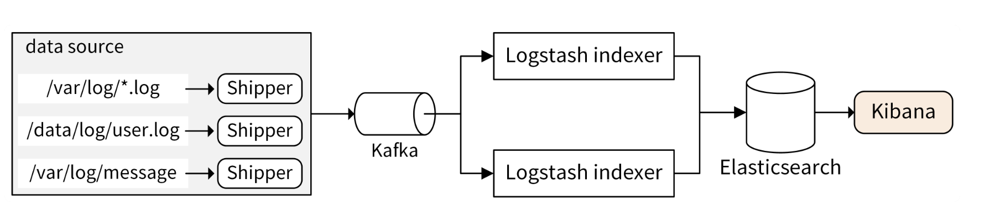

### 基础功能 ###

日志包需要支持基本的日志信息，包括时间戳、文件名、行号、日志级别和日志信息。

通过日志级别，可以知道日志的错误类型，最通常的用法是：直接过滤出 Error 级别的日志，这样就可以直接定位出问题出错点，然后再结合其他日志定位出出错的原因。如果不支持日志级别，在定位问题时，可能要查看一大堆无用的日志

有些日志包，例如 logrus，还支持 Trace 日志级别。Trace 级别比 Debug 级别还低，能够打印更细粒度的日志信息。

* 输出级别：打印日志时，我们期望日志的输出级别。例如，我们调用 glog.Info("This is info message") 打印一条日志，则输出日志级别为 Info
* 开关级别：启动应用程序时，期望哪些输出级别的日志被打印。例如，使用 glog 时 -v=4 ，说明了只有日志级别高于 4 的日志才会被打印。

### 高级功能 ###

* 支持日志轮转

大型项目中，一天可能会产生几十个 G 的日志。为了防止日志把磁盘空间占满，导致服务器或者程序异常，就需要确保日志大小达到一定量级时，对日志进行切割、压缩，并转存。

你可以按照日志大小进行切割，也可以按日期切割。日志的切割、压缩和转存功能可以基于 GitHub 上一些优秀的开源包来封装，例如：lumberjack可以支持按大小和日期归档日志，file-rotatelogs支持按小时数进行日志切割。

* 具备 Hook 能力

Hook 能力可以使我们对日志内容进行自定义处理。例如，当某个级别的日志产生时，发送邮件或者调用告警接口进行告警。很多优秀的开源日志包提供了 Hook 能力，例如 logrus 和 zap。

### 设计日志包时需要关注的点 ###

* 高性能：因为我们要在代码中频繁调用日志包，记录日志，所以日志包的性能是首先要考虑的点，一个性能很差的日志包必然会导致整个应用性能很差。
* 插件化能力：日志包应该能提供一些插件化的能力，比如允许开发者自定义输出格式，自定义存储位置，自定义错误发生时的行为（例如 告警、发邮件等）
* 日志参数控制：日志包应该能够灵活地进行配置，初始化时配置或者程序运行时配置。例如：初始化配置可以通过 Init 函数完成，运行时配置可以通过 SetOptions / SetLevel 等函数来完成

### 如何记录日志？ ###

* 在分支语句处打印日志。在分支语句处打印日志，可以判断出代码走了哪个分支，有助于判断请求的下一跳，继而继续排查问题。
* 写操作必须打印日志。写操作最可能会引起比较严重的业务故障，写操作打印日志，可以在出问题时找到关键信息。
* 在循环中打印日志要慎重。如果循环次数过多，会导致打印大量的日志，严重拖累代码的性能，建议的办法是在循环中记录要点，在循环外面总结打印出来。
* 在错误产生的最原始位置打印日志。对于嵌套的 Error，可在 Error 产生的最初位置打印 Error 日志
* 支持 RequestID：使用 RequestID 串联一次请求的所有日志，这些日志可能分布在不同的组件，不同的机器上。支持 RequestID 可以大大提高排障的效率，降低排障难度。在一些大型分布式系统中，没有 RequestID 排障简直就是灾难。
* 总是将日志记录在本地文件：通过将日志记录在本地文件，可以和日志中心化平台进行解耦，这样当网络不可用，或者日志中心化平台故障时，仍然能够正常的记录日志。

### 分布式日志解决方案（EFK/ELK)

在实际 Go 项目开发中，为了实现高可用，同一个服务至少需要部署两个实例，通过轮询的负载均衡策略转发请求。另外，一个应用又可能包含多个服务。假设我们的应用包含两个服务，每个服务部署两个实例，如果应用出故障，我们可能需要登陆 4（2 x 2）台服务器查看本地的日志文件，定位问题，非常麻烦，会增加故障恢复时间。所以在真实的企业场景中，我们会将这些日志统一收集并展示。

Elasticsearch + Logstash + Kibana：

* 通过 log 包将日志记录在本地文件中（*.log 文件）
* 再通过 Shipper 收集到 Kafka 中。Shipper 可以根据需要灵活选择，常见的 Shipper 有 Logstash Shipper、Flume、Fluentd、Filebeat。其中 Filebeat 和 Logstash Shipper 用得最多
* Shipper 没有直接将日志投递到 Logstash indexer，或者 Elasticsearch，是因为 Kafka 能够支持更大的吞吐量，起到削峰填谷的作用。
* Kafka 中的日志消息会被 Logstash indexer 消费
* 投递到 Elasticsearch 中存储起来。Elasticsearch 是实时全文搜索和分析引擎，提供搜集、分析、存储数据三大功能。Elasticsearch 中存储的日志
* 通过 Kibana 提供的图形界面来展示。Kibana 是一个基于 Web 的图形界面，用于搜索、分析和可视化存储在 Elasticsearch 中的日志数据。

其中，Logstash Shipper 监控并收集日志，并将日志内容发送到 Logstash indexer，然后 Logstash indexer 过滤日志，并将日志提交给 Elasticsearch。

