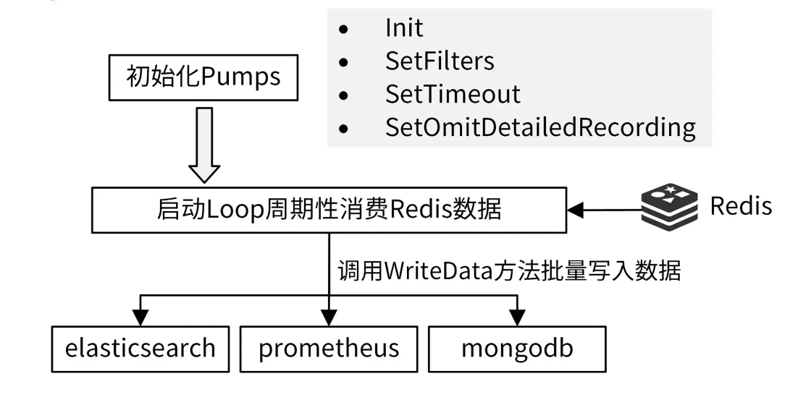

* 数据采集服务会导致已有的服务请求延时变高。
* 采集数据性能差，需要较长时间才能采集完一批数据。
* 启停服务时，会导致采集的数据丢失

### 数据采集方式的分类 ###

同步采集和异步采集。二者的概念和优缺点如下表所示：


IAM Pump Server 服务，采用的就是异步采集的方式。

### 数据采集系统设计 ###

采集系统首先需要一个数据源 Input，Input 可以是一个或者多个，Input 中的数据来自于应用程序上报。**采集后的数据通常需要经过处理，比如格式化、增删字段、过滤无用的数据等，然后将处理后的数据存储到下游系统（Output）中**


* 如果 Input 产生数据的速度大于 Output 的消费能力，产生数据堆积怎么办？
* 数据采集后需要存储到下游系统。在存储之前，我们需要对数据进行不同的处理，并可能会存储到不同的下游系统，这种可变的需求如何满足？

如果是异步，我们需要先把数据缓存在内存中，然后再异步上报到目标系统中。当然，**为了提高上报的效率，可以采用批量上报的方式。**

对于数据堆积这个问题，比较好的解决方法是，**将采集的数据先上报到一些具有高吞吐量、可以存储大量数据的中间组件，比如 Kafka、Redis** 中。这种方式也是业界标准的处理方式

#### 数据上报功能设计 #### 

为了提高异步上报的吞吐量，你可以将数据缓存在内存中（Go 中可以使用有缓冲 channel），并使用多个 worker 去消费内存中的数据。使用多个 worker ，可以充分发挥 CPU 的多核能力。

#### 数据采集功能设计 ####

未来你可能需要将数据从上报到 MongoDB 切换到 HBase 中，或者同时将数据上报到 MongoDB 和 HBase 中。因此，上报给下游的程序逻辑要具有插件化的能力，并能通过配置选择需要的插件。

为了提高程序性能，会先把数据缓存在内存中。但是这样有个缺点：在关停程序时，内存中的数据就会丢失。所以，在程序结束之前，我们需要**确保内存中的数据能够上报成功，也就是说采集程序需要实现优雅关停功能**

#### 数据采集应用模型 ####


#### 数据采集系统落地项目：iam-authz-server + iam-pump ####

* iam-authz-server：实现数据上报功能
* iam-pump：实现数据采集功能。

### iam-authz-server：数据上报 ###


iam-authz-server 服务中的数据上报功能可以选择性开启: https://github.com/marmotedu/iam/blob/v1.0.6/internal/authzserver/server.go#L147-L156

```go
 if s.analyticsOptions.Enable {                                           
        analyticsStore := storage.RedisCluster{KeyPrefix: RedisKeyPrefix}              
        analyticsIns := analytics.NewAnalytics(s.analyticsOptions, &analyticsStore)    
        analyticsIns.Start()                                                   
        s.gs.AddShutdownCallback(shutdown.ShutdownFunc(func(string) error {    
            analyticsIns.Stop()    
                          
            return nil    
        }))    
    }     
```

也就是说可以通过配置文件来启用 / 禁用数据上报功能。配置方式也很简单：将 iam-authz-server.yaml 的 analytics.enable 设置为 true，代表开启数据上报功能；设置为 false ，则代表关闭数据上报功能。

在上面的代码中，通过 [NewAnalytics](https://github.com/marmotedu/iam/blob/v1.0.6/internal/authzserver/analytics/analytics.go#L64-L79)创建一个数据上报服务，代码如下：

```go
func NewAnalytics(options *AnalyticsOptions, store storage.AnalyticsHandler) *Analytics {
	ps := options.PoolSize
	recordsBufferSize := options.RecordsBufferSize
	workerBufferSize := recordsBufferSize / uint64(ps)
	log.Debug("Analytics pool worker buffer size", log.Uint64("workerBufferSize", workerBufferSize))

	recordsChan := make(chan *AnalyticsRecord, recordsBufferSize)

	return &Analytics{
		store:                      store,
		poolSize:                   ps,
		recordsChan:                recordsChan,
		workerBufferSize:           workerBufferSize,
		recordsBufferFlushInterval: options.FlushInterval,
	}
}
```

* store：  [storage.AnalyticsHandler](https://github.com/marmotedu/iam/blob/v1.0.6/pkg/storage/storage.go#L65-L71)接口类型，提供了 Connect() bool和 AppendToSetPipelined(string, byte)函数，**分别用来连接 storage 和上报数据给 storage。iam-authz-server 用了 redis storage。**
* recordsChan：授权日志会缓存在 recordsChan 带缓冲 channel 中，其长度可以通过 iam-authz-server.yaml 配置文件中的 analytics.records-buffer-size 配置。
* poolSize：指定开启 worker 的个数，也就是开启多少个 Go 协程来消费 recordsChan 中的消息。
* workerBufferSize：批量投递给下游系统的的消息数。通过批量投递，可以进一步提高消费能力、减少 CPU 消耗。
* recordsBufferFlushInterval：设置最迟多久投递一次，也就是投递数据的超时时间。

analytics.ecords-buffer-size 和 analytics.pool-size 建议根据部署机器的 CPU 和内存来配置。在应用真正上线前，我建议你通过压力和负载测试，来配置一个合适的值。

Analytics 提供了 3 种方法：

* Start()，用来启动数据上报服务。
* Stop()，用来关停数据上报服务。主程序在收到系统的终止命令后，调用 Stop 方法优雅关停数据上报服务，确保缓存中的数据都上报成功。
* ```RecordHit(record *AnalyticsRecord) error```，用来记录 AnalyticsRecord 的数据。

通过 NewXxx （NewAnalytics）返回一个 Xxx （Analytics）类型的结构体，Xxx（Analytics） 类型带有一些方法，如下：

```go
func NewAnalytics(options) *Analytics {
    ...
}

func (r *Analytics) Start() {
    ...
}
func (r *Analytics) Stop() {
    ...
}
func (r *Analytics) RecordHit(record *AnalyticsRecord) error {
    ...
}
```

* 功能模块化：将数据上报的功能封装成一个服务模块，数据和方法都围绕着 Xxx 结构体来展开,NewXxx 相当于初始化一个类实例，Start、Stop、RecordHit 是这个类提供的方法
* 方便数据传递：可以将数据存放在 Xxx 结构体字段中，供不同的方法共享使用，如果有并发，数据共享时，注意要给非并发安全的类型加锁，例如 recordsChan。

### 启动服务：启动数据上报服务 ###

通过调用 analyticsIns.Start() 启动数据上报服务。Start 代码如下：

```go
func (r *Analytics) Start() {
    analytics = r
    r.store.Connect()

    // start worker pool
    atomic.SwapUint32(&r.shouldStop, 0)
    for i := 0; i < r.poolSize; i++ {
        r.poolWg.Add(1)
        go r.recordWorker()
    }

    // stop analytics workers
    go r.Stop()
}
```

数据上报和数据采集都大量应用了 Go 协程来并发地执行操作，为了防止潜在的并发读写引起的 Bug，**建议你的测试程序编译时加上 -race**，例如 go build -race cmd/iam-authz-server/authzserver.go。然后，在测试过程中，观察程序日志，看有无并发问题出现。

Start 中会开启 poolSize 个数的 worker 协程，这些协程共同消费 recordsChan 中的消息，消费逻辑见 [recordWorker](https://github.com/marmotedu/iam/blob/v1.0.6/internal/authzserver/analytics/analytics.go#L128-L173)

```go
func (r *Analytics) recordWorker() {
  defer r.poolWg.Done()

  // this is buffer to send one pipelined command to redis
  // use r.recordsBufferSize as cap to reduce slice re-allocations
  recordsBuffer := make([][]byte, 0, r.workerBufferSize)

  // read records from channel and process
  lastSentTS := time.Now()
  for {
    readyToSend := false
    select {
    case record, ok := <-r.recordsChan:
      // check if channel was closed and it is time to exit from worker
      if !ok {
        // send what is left in buffer
        r.store.AppendToSetPipelined(analyticsKeyName, recordsBuffer)
        return
      }

      // we have new record - prepare it and add to buffer

      if encoded, err := msgpack.Marshal(record); err != nil {
        log.Errorf("Error encoding analytics data: %s", err.Error())
      } else {
        recordsBuffer = append(recordsBuffer, encoded)
      }

      // identify that buffer is ready to be sent
      readyToSend = uint64(len(recordsBuffer)) == r.workerBufferSize

    case <-time.After(r.recordsBufferFlushInterval):
      // nothing was received for that period of time
      // anyways send whatever we have, don't hold data too long in buffer
      readyToSend = true
    }

    // send data to Redis and reset buffer
    if len(recordsBuffer) > 0 && (readyToSend || time.Since(lastSentTS) >= recordsBufferForcedFlushInterval) {
      r.store.AppendToSetPipelined(analyticsKeyName, recordsBuffer)
      recordsBuffer = recordsBuffer[:0]
      lastSentTS = time.Now()
    }
  }
}
```

recordWorker 函数会将接收到的授权日志保存在 recordsBuffer 切片中，**当数组内元素个数为 workerBufferSize ，或者距离上一次投递时间间隔为 recordsBufferFlushInterval 时**，就会将 recordsBuffer 数组中的数据上报给目标系统（Input）。

recordWorker() 中有些设计技巧，很值得你参考。

* 使用 msgpack 序列化消息：msgpack 是一个高效的二进制序列化格式。它像 JSON 一样，让你可以在各种语言之间交换数据。但是它比 JSON 更快、更小。
* 支持 Batch Windows：当 worker 的消息数达到指定阈值时，会批量投递消息给 Redis，阈值判断代码为```readyToSend = uint64(len(recordsBuffer)) == r.workerBufferSize```。
* 超时投递：为了避免因为产生消息太慢，一直达不到 Batch Windows，无法投递消息这种情况，投递逻辑也支持超时投递，通过 ```case <-time.After(r.recordsBufferFlushInterval)```代码段实现
* 支持优雅关停：当 recordsChan 关闭时，将 recordsBuffer 中的消息批量投递给 Redis，之后退出 worker 协程。

#### 运行服务：异步上报授权日志 ####

开启了数据上报服务后，当有授权日志产生时，程序就会自动上报数据

iam-authz-server 会在授权成功时调用 LogGrantedAccessRequest 函数，在授权失败时调用 LogRejectedAccessRequest 函数。并且，在这两个函数中，调用 RecordHit 函数，记录授权日志。

iam-authz-server 通过调用 ```RecordHit(record *AnalyticsRecord) error ```函数，异步缓存授权日志。调用 RecordHit 后，会将 AnalyticsRecord 类型的消息存放到 recordsChan 有缓冲 channel 中。

这里要注意：在缓存前，需要判断上报服务是否在优雅关停中，如果在关停中，则丢弃该消息：

### iam-pump：数据采集 ###

iam-authz-server 将数据上报到 Redis，iam-pump 消费 Redis 中的数据，并保存在 MongoDB 中做持久化存储。

iam-pump 的设计要点是：插件化、可配置地将 Redis 中的数据处理后存储到下游系统中，并且实现优雅关停功能



```go
func (s preparedPumpServer) Run(stopCh <-chan struct{}) error {
	ticker := time.NewTicker(time.Duration(s.secInterval) * time.Second)
	defer ticker.Stop()

	for {
		select {
		case <-ticker.C:
			analyticsValues := s.analyticsStore.GetAndDeleteSet(storage.AnalyticsKeyName)
			if len(analyticsValues) > 0 {
				// Convert to something clean
				keys := make([]interface{}, len(analyticsValues))

				for i, v := range analyticsValues {
					decoded := analytics.AnalyticsRecord{}
					err := msgpack.Unmarshal([]byte(v.(string)), &decoded)
					log.Debugf("Decoded Record: %v", decoded)
					if err != nil {
						log.Errorf("Couldn't unmarshal analytics data: %s", err.Error())
					} else {
						if s.omitDetails {
							decoded.Policies = ""
							decoded.Deciders = ""
						}
						keys[i] = interface{}(decoded)
					}
				}

				// Send to pumps
				writeToPumps(keys, s.secInterval)
			}
		// exit consumption cycle when receive SIGINT and SIGTERM signal
		case <-stopCh:
			log.Info("stop purge loop")

			return nil
		}
	}
}

```

#### 初始化服务：数据采集插件定义  ####

数据采集组件设计的核心是插件化，**这里我将需要上报的系统抽象成一个个的 pump**，那么如何定义 pump 接口呢？


