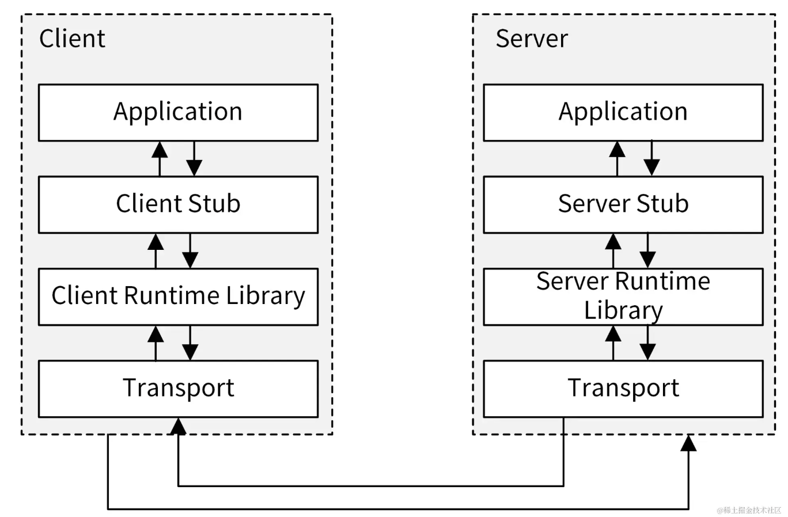
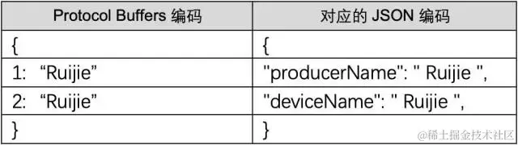

## gRPC 核心知识讲解

[gRPC 官网文档](https://link.juejin.cn/?target=https%3A%2F%2Fgrpc.io%2Fdocs%2F)。gRPC 库的 Go 语言实现是：[grpc/grpc-go](https://link.juejin.cn/?target=https%3A%2F%2Fgithub.com%2Fgrpc%2Fgrpc-go)

服务端实现了一个函数，客户端使用 RPC 框架提供的接口，像调用本地函数一样调用这个函数，并获取返回值。RPC 屏蔽了底层的网络通信细节，使得开发人员无需关注网络编程的细节，可以将更多的时间和精力放在业务逻辑本身的实现上，从而提高开发效率。

RPC 的调用过程如下图所示



1. Client 通过本地调用，调用 Client Stub；
2. Client Stub 将参数打包（也叫 Marshalling）成一个消息，然后发送这个消息；
3. Client 所在的 OS 将消息发送给 Server；
4. Server 端接收到消息后，将消息传递给 Server Stub；
5. Server Stub 将消息解包（也叫 Unmarshalling）得到参数；
6. Server Stub 调用服务端的子程序（函数），处理完后，将最终结果按照相反的步骤返回给 Client。

gRPC 是由 Google 开发的高性能、开源、跨多种编程语言的通用 RPC 框架，基于 HTTP 2.0 协议开发，默认采用 Protocol Buffers 数据序列化协议。gRPC 具有如下特性：

- 语言中立：支持多种语言，例如 Go、Java、C、C++、C#、Node.js、PHP、Python、Ruby 等；
- 基于 IDL 定义服务：基于 IDL（Interface Definition Language）文件定义服务，通过 proto3 工具生成指定语言的数据结构、服务端接口以及客户端 Stub。通过这种方式，也可以将服务端和客户端解耦，使客户端和服务端可以并行开发；
- 基于 HTTP/2 协议：通信协议基于标准的 HTTP/2 设计，支持双向流、消息头压缩、单 TCP 的多路复用、服务端推送等特性；
- 支持 Protocol Buffer 序列化：Protocol Buffer 简称 Protobuf，是一种语言无关的高性能序列化框架，可以减少网络传输流量，提高通信效率。另外，Protobuf 语法简单，表达能力强很适合用来进行接口定义。

1. 客户端（gRPC Sub）调用 A 方法，发起 RPC 调用；
2. 对请求信息使用 Protobuf 进行对象序列化压缩（IDL）；
3. 服务端（gRPC Server）接收到请求后，解码请求体，进行业务逻辑处理并返回；
4. 对响应结果使用 Protobuf 进行对象序列化压缩（IDL）；
5. 客户端接收到服务端响应，解码请求体。回调被调用的 A 方法，唤醒正在等待响应（阻塞）的客户端调用并返回响应结果。

### Protocol Buffers 介绍

被用在一些对数据传输性能要求比较高的系统中，作为数据传输格式。Protocol Buffers 的主要特性有下面这几个。

- 更快的数据传输速度：protobuf 在传输时，会将数据序列化为二进制数据，和 XML、JSON 的文本传输格式相比，这可以节省大量的 IO 操作，从而提高数据传输速度。
- 跨平台多语言：protobuf 自带的编译工具 protoc 可以基于 protobuf 定义文件，编译出不同语言的客户端或者服务端，供程序直接调用，因此可以满足多语言需求的场景。
- 具有非常好的扩展性和兼容性，可以更新已有的数据结构，而不破坏和影响原有的程序。
- 基于 IDL 文件定义服务，通过 proto3 工具生成指定语言的数据结构、服务端和客户端接口。

```protobuf
message UserInfo {
  string username = 1;
  string nickname = 2;
  string email = 4;
  string phone = 5;
  int64 postCount = 6;
  google.protobuf.Timestamp createdAt = 7;
  google.protobuf.Timestamp updatedAt = 8;
}

```

```go
service MiniBlog {
  rpc ListUser(ListUserRequest) returns (ListUserResponse) {}
}
```

使用 XML、JSON 进行数据编译时，数据文本格式更容易阅读，但进行数据交换时，设备就需要耗费大量的 CPU 在 I/O 动作上，自然会影响整个传输速率。Protocol Buffers 不像前者，它会将字符串进行序列化后再进行传输，即二进制数据。



## miniblog 实现 gRPC 服务器

miniblog 模拟了一个场景：miniblog 配套一个运营系统，运营系统需要通过接口获取所有的用户，进行注册用户统计。为了确保应用的最优化，这种内部调用我选择了通过 RPC 协议来调用。为此，miniblog 需要实现一个 gRPC 服务器

1. 定义 gRPC 服务；
2. 生成客户端和服务器代码；
3. 实现 gRPC 服务端；
4. 实现 gRPC 客户端。


### 定义 gRPC 服务

编写 `.proto` Protobuf 定义文件来定义一个 gRPC 服务。服务包含以下内容：

1. 服务定义：定义了服务包含了哪些 API 接口；
2. 定义请求和返回参数：服务定义了一系列的 API 接口，每个 API 接口需要一些请求参数和返回参数来完成请求。

`miniblog.proto` 文件，内容如下：

```protobuf
syntax = "proto3"; // 告诉编译器此文件使用什么版本的语法

package v1;

import "google/protobuf/timestamp.proto";

option go_package = "github.com/nosbelm/miniblog/pkg/proto/miniblog/v1";

// MiniBlog 定义了一个 MiniBlog RPC 服务.
service MiniBlog {
  rpc ListUser(ListUserRequest) returns (ListUserResponse) {}
}

message UserInfo {
  string username = 1;         
  string nickname = 2;         
  string email = 4;         
  string phone = 5;         
  int64 postCount = 6;         
  google.protobuf.Timestamp createdAt = 7;         
  google.protobuf.Timestamp updatedAt = 8;         
}

// ListUserRequest 指定了 `ListUser` 接口的请求参数.
message ListUserRequest {
  optional int64 limit = 1;
  optional int64 offset = 2;
}


// ListUserResponse 指定了 `GET /v1/users` 接口的返回参数，相当于 HTTP Response.
message ListUserResponse {
  int64 totalCount = 1;         
  repeated UserInfo Users = 2;
}

```

gRPC 支持定义 4 种类型的服务方法，上述我们其实定义的是简单模式的服务方法。4 种服务方法介绍如下：

- 简单模式（Simple RPC）：是最简单的 gRPC 模式。客户端发起一次请求，服务端响应一个数据。定义格式为 `rpc SayHello (HelloRequest) returns (HelloReply) {}`；
- 服务端数据流模式（Server-side streaming RPC）：客户端发送一个请求，服务器返回数据流响应，客户端从流中读取数据直到为空。定义格式为 `rpc SayHello (HelloRequest) returns (stream HelloReply) {}`；
- 客户端数据流模式（Client-side streaming RPC）：客户端将消息以流的方式发送给服务器，服务器全部处理完成之后返回一次响应。定义格式为 `rpc SayHello (stream HelloRequest) returns (HelloReply) {}`；
- 双向数据流模式（Bidirectional streaming RPC）：客户端和服务端都可以向对方发送数据流，这个时候双方的数据可以同时互相发送，也就是可以实现实时交互 RPC 框架原理。定义格式为 `rpc SayHello (stream HelloRequest) returns (stream HelloReply) {}`。


**接口参数定义**

- `singular`：默认值，说明该字段可以出现 0 次或者 1 次（不能超过 1 次）；
- `optional`：指定字段为可选字段；
- `repeated`：指定字段可以重复任意次数（包括 0），可以看成是一个数组。

### 生成客户端和服务器代码

需要使用 `protoc` 工具编译该文件，以生成我们需要的客户端和服务端代码。因为，随着项目的迭代，我们经常需要修改 Protobuf 文件，并重新编译。为了提高开发效率、简化项目维护复杂度，我们可以将编译操作作为一个Makefile目标来执行。在 `Makefile` 文件中添加以下代码：

```makefile
...

# Protobuf 文件存放路径
APIROOT=$(ROOT_DIR)/pkg/proto
...

protoc: ## 编译 protobuf 文件.
  @echo "===========> Generate protobuf files"
  @protoc                                            \
    --proto_path=$(APIROOT)                          \
    --proto_path=$(ROOT_DIR)/third_party             \
    --go_out=paths=source_relative:$(APIROOT)        \
    --go-grpc_out=paths=source_relative:$(APIROOT)   \
    $(shell find $(APIROOT) -name *.proto)

```

`protoc`是通过插件机制实现对不同语言的支持。比如 `--xxx_out` 参数，那么 `protoc` 将首先查询是否有内置的 `xxx` 插件，如果没有内置的 `xxx` 插件，那么将继续查询当前系统中是否存在 `protoc-gen-xxx` 命名的可执行程序。例如 `--go_out` 使用的插件名为 `protoc-gen-go`。

在 `pkg/proto/miniblog/v1/miniblog.proto` 文件中，我们通过以下语句导入了 `google/protobuf/timestamp.proto` 文件：

```protobuf
import "google/protobuf/timestamp.proto";

```

我们要将 `timestamp.proto` 文件保存在匹配的路径下，并且通过 `--proto_path=$(ROOT_DIR)/third_party` 添加到 proto 文件的搜索路径中（需要注意目录层级）。

因为 `timestamp.proto` 是第三方项目的文件，根据目录结构规范，我们需要存放在项目根目录下的 `third_party` 目录中

```shell
$ make protoc
```

上述命令会在 `pkg/proto/miniblog/v1/` 目录下生成以下 2 个文件：

- `miniblog.pb.go`：根据 `message` 关键字所指定的消息结构体，生成对应的 Go 结构体和方法的保存文件；
- `miniblog_grpc.pb.go`：根据 `service` 关键字所指定的 gRPC 服务定义，生成对应的 interface 和方法的保存文件。

### 实现服务端

我们生成了 `miniblog_grpc.pb.go` 文件，该文件中包含了启动 gRPC 服务必要的函数。接下来，我们可以在 `internal/miniblog/miniblog.go` 文件中添加以下 2 行代码来启动一个 gRPC 服务器：

```go
// startGRPCServer 创建并运行 GRPC 服务器.
func startGRPCServer() *grpc.Server {
    lis, err := net.Listen("tcp", viper.GetString("grpc.addr"))
    if err != nil {
        log.Fatalw("Failed to listen", "err", err)
    }

    // 创建 GRPC Server 实例
    grpcsrv := grpc.NewServer()
    pb.RegisterMiniBlogServer(grpcsrv, user.New(store.S, nil))

    // 运行 GRPC 服务器。在 goroutine 中启动服务器，它不会阻止下面的正常关闭处理流程
    // 打印一条日志，用来提示 GRPC 服务已经起来，方便排障
    log.Infow("Start to listening the incoming requests on grpc address", "addr", viper.GetString("grpc.addr"))
    go func() {
        if err := grpcsrv.Serve(lis); err != nil {
            log.Fatalw(err.Error())
        }
    }()

    return grpcsrv
}

```

是启动 gRPC 服务的标准流程。上面我们通过 `viper.GetString()` 获取 gRPC 的监听端口，所以我们还要在 `configs/miniblog.yaml` 进行以上配置：

```yaml
# GRPC 相关配置
grpc:
  addr: :9090 # GRPC 服务器监听地址

```

最后，我们需要实现 `MiniBlog` 服务所定义的 API 接口：`pc ListUser(ListUserRequest) returns (ListUserResponse) {}`。实现方式跟之前实现 REST API 的流程和思路类似，按 Store 层 -> Biz 层 -> Controller 层的顺序依次实现。

```go
 pb.RegisterMiniBlogServer(grpcsrv, user.New(store.S, nil))
 //这里的user就是UserController
//UserController必须是实现了grpc定义的server

//miniblog_grpc.pb.go 里定义处理grpc的server
type MiniBlogServer interface {
	ListUser(context.Context, *ListUserRequest) (*ListUserResponse, error)
	mustEmbedUnimplementedMiniBlogServer()
}


//所以UserController 必须实现 MiniBlogServer中的ListUser方法

//创建user对象 需要传入数据源store
func New(ds store.IStore) *UserController {
	return &UserController{b: biz.NewBiz(ds)}
}

//创建biz对象，biz同样需要一个store(controller透传的)
func NewBiz(ds store.IStore) *biz {
	return &biz{ds: ds}
}

//通过biz可以获取对应业务的具体biz,比如userBiz
func (b *biz) Users() user.UserBiz {
	return user.New(b.ds)
}

//UserBiz实现了一些和User业务相关的逻辑，比如listUser
type UserBiz interface {
	Create(ctx context.Context, r *v1.CreateUserRequest) error
	Login(ctx context.Context, r *v1.LoginRequest) (*v1.LoginResponse, error)
	List(ctx context.Context, offset, limit int) (*v1.ListUserResponse, error)
}


//回到UserController 实现MiniBlogServer
func (ctrl *UserController) ListUser(ctx context.Context, r *pb.ListUserRequest) (*pb.ListUserResponse, error) {
	log.C(ctx).Infow("ListUser function called")

  //controller中的biz对象，获取UserBiz对象，然后取得List
	resp, err := ctrl.b.Users().List(ctx, int(r.Offset), int(r.Limit))
	if err != nil {
		return nil, err
	}

	users := make([]*pb.UserInfo, 0, len(resp.Users))

	for _, u := range resp.Users {
		createdAt, _ := time.Parse("2006-01-02 15:04:05", u.CreatedAt)
		updatedAt, _ := time.Parse("2006-01-02 15:04:05", u.UpdatedAt)
		users = append(users, &pb.UserInfo{
			Username:  u.Username,
			Nickname:  u.Nickname,
			Email:     u.Email,
			Phone:     u.Phone,
			PostCount: u.PostCount,
			CreatedAt: timestamppb.New(createdAt),
			UpdatedAt: timestamppb.New(updatedAt),
		})
	}

	ret := &pb.ListUserResponse{
		TotalCount: resp.TotalCount,
		Users:      users,
	}

	return ret, nil

}


```


### 实现客户端

有了 gRPC 服务端之后，我们就可以开发一个客户端，连接 gRPC 服务器，并调用其提供的 API 接口。客户端实现也很简单，我们新建一个`examples/client/main.go` 文件，内容如下：

```go
package main

import (
    "context"
    "encoding/json"
    "flag"
    "fmt"
    "time"

    "google.golang.org/grpc"
    "google.golang.org/grpc/credentials/insecure"

    "github.com/nosbelm/miniblog/internal/pkg/log"
    pb "github.com/nosbelm/miniblog/pkg/proto/miniblog/v1"
)

var (
    addr  = flag.String("addr", "localhost:9090", "The address to connect to.")
    limit = flag.Int64("limit", 10, "Limit to list users.")
)

func main() {
    flag.Parse()
    // 建立与服务器的连接
    conn, err := grpc.Dial(*addr, grpc.WithTransportCredentials(insecure.NewCredentials()))
    if err != nil {
        log.Fatalw("Did not connect", "err", err)
    }
    defer conn.Close()
    c := pb.NewMiniBlogClient(conn)

    ctx, cancel := context.WithTimeout(context.Background(), time.Second)
    defer cancel()

    // 请求 ListUser 接口
    r, err := c.ListUser(ctx, &pb.ListUserRequest{Offset: 0, Limit: *limit})
    if err != nil {
        log.Fatalw("could not greet: %v", err)
    }

    // 打印请求结果
    fmt.Println("TotalCount:", r.TotalCount)
    for _, u := range r.Users {
        d, _ := json.Marshal(u)
        fmt.Println(string(d))
    }
}

```


