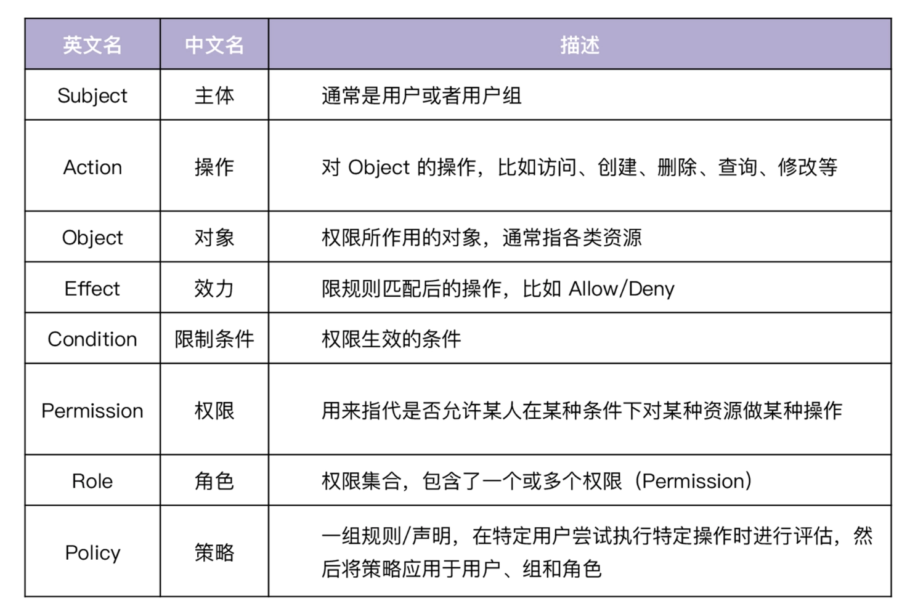
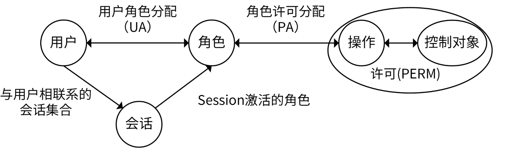

### 权限相关术语介绍 ###



### 权限模型介绍 ###

#### 简单的权限模型：权限控制列表（ACL） ####

ACL（Access Control List，权限控制列表），用来判断用户是否可以对资源做特定的操作。例如，允许 Colin 创建文章的 ACL 策略为：

```sh
Subject: Colin
Action: Create
Object: Article
```

在 ACL 权限模型下，权限管理是围绕资源 Object 来设定的，ACL 权限模型也是比较简单的一种模型。

#### 基于 ACL 下放权限的权限模型：自主访问控制（DAC） ####

经典的 ACL 模型权限集中在同一个 Subject 上，缺乏灵活性，为了加强灵活性，在 ACL 的基础上，DAC 模型将权限下放，允许拥有权限的 Subject 自主地将权限授予其他 Subject。

#### 基于 ACL 且安全性更高的权限模型：强制访问控制（MAC） ####

Object 可以被 Subject 做 Action 操作。

```
Subject: Article
Action: Create
Object: Colin
```

Colin 可以创建文章，但是 James 不能创建文章

#### 最普及的权限模型：基于角色的访问控制（RBAC） ####

将权限与角色进行关联。用户通过扮演某种角色，具有该角色的所有权限。具体如下图所示：



**每个用户关联一个或多个角色，每个角色关联一个或多个权限，每个权限又包含了一个或者多个操作，操作包含了对资源的操作集合**。通过用户和权限解耦，可以实现非常灵活的权限管理。例如，可以满足以下两个权限场景

第一，可以通过角色批量给一个用户授权。例如，公司新来了一位同事，需要授权虚拟机的生产、销毁、重启和登录权限。这时候，我们可以将这些权限抽象成一个运维角色。如果再有新同事来，就可以通过授权运维角色，直接批量授权这些权限，不用一个个地给用户授权这些权限

第二，可以批量修改用户的权限。例如，我们有很多用户，同属于运维角色，这时候对运维角色的任何权限变更，就相当于对运维角色关联的所有用户的权限变更，不用一个个去修改这些用户的权限。

例如，我们有 write article 和 manage article 的权限：

```
Permission:
    - Name: write_article
        - Effect: "allow"
        - Action: ["Create", "Update", "Read"]
        - Object: ["Article"]
    - Name: manage_article
        - Effect: "allow"
        - Action: ["Delete", "Read"]
        - Object: ["Article"]
```

同时，我们也有 Writer、Manager 和 CEO 3 个角色，Writer 具有 write_article 权限，Manager 具有 manage_article 权限，CEO 具有所有权限：

```
Role:
    - Name: Writer
      Permissions:
        - write_article
    - Name: Manager
      Permissions:
        - manage_article
    - Name: CEO
      Permissions:
        - write_article
        - manage_article
```

接下来，我们对 Colin 用户授予 Writer 角色：

```
Subject: Colin
Roles:
    - Writer
```

那么现在 Colin 就具有 Writer 角色的所有权限 write_article，write_article 权限可以创建文章。

接下来，再对 James 用户授予 Writer 和 Manager 角色：

```
Subject: James
Roles:
    - Writer
    - Manager
```

#### 最强大的权限模型：基于属性的权限验证（ABAC） ####

规定了哪些属性的用户可以对哪些属性的资源在哪些限制条件下进行哪些操作。跟 RBAC 相比，ABAC 对权限的控制粒度更细

* 用户属性，例如性别、年龄、工作等。
* 资源属性，例如创建时间、所属位置等。
* 操作属性，例如创建、修改等。
* 环境属性，例如来源 IP、当前时间等

```shell
Subject:
    Name: Colin
    Department: Product
    Role: Writer
Action:
    - create
    - update
Resource:
    Type: Article
    Tag:
        - technology
        - software
    Mode:
        - draft
Contextual:
    IP: 10.0.0.10
```

产品部门的 Colin 作为一个 Writer 角色，可以通过来源 IP 是 10.0.0.10 的客户端，创建和更新带有 technology 和 software 标签的草稿文章。

通过现实中的 ABAC 授权策略，帮你理解 ABAC 权限模型。下面是一个腾讯云的 CAM 策略，也是一种 ABAC 授权模式：

```json
{
  "version": "2.0",
  "statement": [
    {
      "effect": "allow",
      "action": [
        "cos:List*",
        "cos:Get*",
        "cos:Head*",
        "cos:OptionsObject"
      ],
      "resource": "qcs::cos:ap-shanghai:uid/1250000000:Bucket1-1250000000/dir1/*",
      "condition": {
        "ip_equal": {
          "qcs:ip": [
            "10.217.182.3/24",
            "111.21.33.72/24"
          ]
        }
      }
    }
  ]
}
```

用户必须在 10.217.182.3/24 或者 111.21.33.72/24 网段才能调用云 API（cos:List*、cos:Get*、cos:Head*、cos:OptionsObject），对 1250000000 用户下的 dir1 目录下的文件进行读取操作。

这里，ABAC 规定的四类属性分别是：

* 用户属性：用户为 1250000000。
* 资源属性：dir1 目录下的文件。
* 操作属性：读取（cos:List*、cos:Get*、cos:Head*、cos:OptionsObject 都是读取 API）。
* 环境属性：10.217.182.3/24 或者 111.21.33.72/24 网段。

### 相关开源项目 ###

[Casbin](https://github.com/casbin/casbin) 是一个用 Go 语言编写的访问控制框架，功能强大，支持 ACL、RBAC、ABAC 等访问模型，很多优秀的权限管理系统都是基于 Casbin 来构建的。Casbin 的核心功能都是围绕着访问控制来构建的，不负责身份认证。

[go-admin](https://github.com/go-admin-team/go-admin) 是一个基于 Gin + Vue + Element UI 的前后端分离权限管理系统脚手架，它的访问控制模型采用了 Casbin 的 RBAC 访问控制模型，功能强大，包含了如下功能

该项目还支持 RESTful API 设计规范、Swagger 文档、GORM 库等。go-admin 不仅是一个优秀的权限管理系统，也是一个优秀的、功能齐全的 Go 开源项目。你在做项目开发时，也可以参考该项目的构建思路。go-admin 管理系统自带前端


