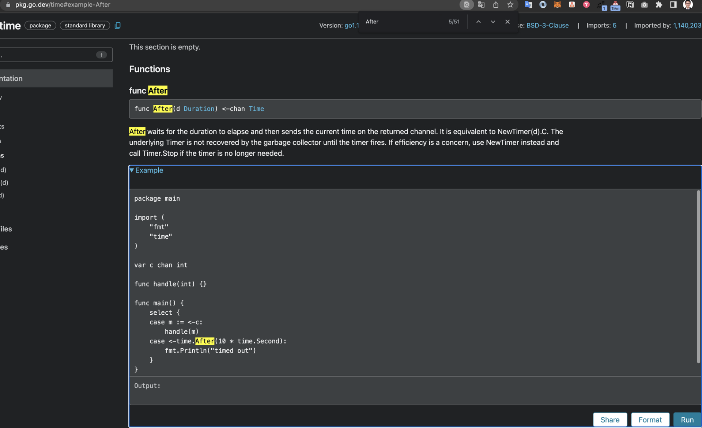

将 package 命名为 collect，把它作为我们的采取引擎

```go
mkdir collect
touch collect/collect.go
```

定义一个 Fetcher 接口，内部有一个方法签名 Get，参数为网站的 URL。后面我们还将对函数的方法签名进行改变，也会添加其他方法签名，比如用于控制超时的 Context 参数等

```go
type Fetcher interface {
  Get(url string) ([]byte, error)
}
```

定义一个结构体 BaseFetch，用最基本的爬取逻辑实现 Fetcher 接口：

```go
func (BaseFetch) Get(url string) ([]byte, error) {
  resp, err := http.Get(url)

  if err != nil {
    fmt.Println(err)
    return nil, err
  }

  defer resp.Body.Close()

  if resp.StatusCode != http.StatusOK {
    fmt.Printf("Error status code:%d", resp.StatusCode)
  }
  bodyReader := bufio.NewReader(resp.Body)
  e := DeterminEncoding(bodyReader)
  utf8Reader := transform.NewReader(bodyReader, e.NewDecoder())
  return ioutil.ReadAll(utf8Reader)
}
```

在 main.go 中定义一个类型为 BaseFetch 的结构体，用接口 Fetcher 接收并调用 Get 方法，这样就完成了使用接口来实现基本爬取的逻辑。

```go
var f collect.Fetcher = collect.BaseFetch{}
body, err := f.Get(url)
```

### 模拟浏览器访问

在请求中调用 req.Header.Set 设置 User-Agent 请求头。最后调用 client.Do 完成 HTTP 请求。

```go
type BrowserFetch struct {
}

//模拟浏览器访问
func (BrowserFetch) Get(url string) ([]byte, error) {
  client := &http.Client{}

  req, err := http.NewRequest("GET", url, nil)
  if err != nil {
    return nil, fmt.Errorf("get url failed:%v", err)
  }

  req.Header.Set("User-Agent", "Mozilla/5.0 (Macintosh; Intel Mac OS X 10_15_4) AppleWebKit/537.36 (KHTML, like Gecko) Chrome/80.0.3987.149 Safari/537.36")

  resp, err := client.Do(req)
  if err != nil {
    return nil, err
  }

  bodyReader := bufio.NewReader(resp.Body)
  e := DeterminEncoding(bodyReader)
  utf8Reader := transform.NewReader(bodyReader, e.NewDecoder())
  return ioutil.ReadAll(utf8Reader)
}
```

### 远程访问浏览器

浏览器引擎会对 HTML 与 CSS 文件进行渲染，并且执行 JavaScript 脚本，还可能会完成一些实时推送、异步调用工作。这导致内容会被延迟展示，无法直接通过简单的 http.Get 方法获取到数据。

* 借助浏览器驱动协议（WebDriver protocol）远程与浏览器交互
* 借助谷歌开发者工具协议（CDP，Chrome DevTools Protocol）远程与浏览器交互；
* 在浏览器应用程序中注入要执行的 JavaScript，典型的工具有 Cypress， TestCafe。

#### Webdriver Protocol

Webdriver 协议是操作浏览器的一种远程控制协议。借助 Webdriver 协议完成爬虫的框架或库有 Selenium，WebdriverIO，Nightwatch，其中最知名的就是 Selenium。Selenium 为每一种语言（例如 Java、Python、Ruby 等）都准备了一个对应的 clinet 库，它整合了不同浏览器的驱动（这些驱动由浏览器厂商提供，例如谷歌浏览器的驱动和火狐浏览器的驱动）。

Selenium 通过 W3C 约定的 WebDriver 协议与指定的浏览器驱动进行通信，之后浏览器驱动操作特定浏览器，从而实现开发者操作浏览器的目的。

与 Selenium 需要与浏览器驱动进行交互不同的是，Chrome DevTools 协议直接通过 Web Socket 协议与浏览器暴露的 API 进行通信，这使得 Chrome DevTools 协议操作浏览器变得更快。

在 Go 中实现了 Chrome DevTools 协议的知名第三方库是chromedp。它的操作简单，也不需要额外的依赖。借助chromedp 提供的能力与浏览器交互，我们就具有了许多灵活的能力，例如截屏、模拟鼠标点击、提交表单、下载 / 上传文件等。chromedp 的一些操作样例你可以参考example 代码库



我们经常面临这种情况，即需要完成一些交互才能获取到对应的数据。要模拟上面的完整操作，代码如下所示：

```go
package main

import (
  "context"
  "log"
  "time"

  "github.com/chromedp/chromedp"
)

func main() {
  // 1、创建谷歌浏览器实例
  ctx, cancel := chromedp.NewContext(
    context.Background(),
  )
  defer cancel()

  // 2、设置context超时时间
  ctx, cancel = context.WithTimeout(ctx, 15*time.Second)
  defer cancel()

  // 3、爬取页面，等待某一个元素出现,接着模拟鼠标点击，最后获取数据
  var example string
  err := chromedp.Run(ctx,
    chromedp.Navigate(`https://pkg.go.dev/time`),
    chromedp.WaitVisible(`body > footer`),
    chromedp.Click(`#example-After`, chromedp.NodeVisible),
    chromedp.Value(`#example-After textarea`, &example),
  )
  if err != nil {
    log.Fatal(err)
  }
  log.Printf("Go's time.After example:\\n%s", example)
}
```

首先我们导入了 chromedp 库，并调用 chromedp.NewContext 为我们创建了一个浏览器的实例。它的实现原理非常简单，即查找当前系统指定路径下指定的谷歌应用程序，**并默认用无头模式（Headless 模式）启动谷歌浏览器实例。通过无头模式，我们肉眼不会看到谷歌浏览器窗口的打开过程，但它确实已经在后台运行了。**

所以说，当前程序能够运行的重要前提是在指定路径中存在谷歌浏览器程序。当然，一般我们系统中可浏览的谷歌浏览器的大小都是比较大的，所以 chromedp 还好心地为我们提供了一个包含了无头谷歌浏览器的应用程序的镜像：headless-shell。

chromedp.Run 执行多个 action，chromedp 中抽象了 action 和 task 两种行为。其中，action 指的是爬取、等待、点击、获取数据这样的行为。而 task 指的是一个任务，task 是多个 action 的集合

#### 空接口

通过使用空接口，常见的 fmt.Println 函数提供了打印任何类型的功能。

```go
func Println(a ...interface{}) (n int, err error) {
  return Fprintln(os.Stdout, a...)
}
```

如果不使用空接口，那么每一个类型都需要实现一个对应的 Println 函数，是非常不方便的

**不过，空接口带来便利的同时，也意味着我们必须在内部解析接口的类型，并对不同的类型进行相应的处理**。以 fmt.Println 为例，Println 函数内部通过检测接口的具体类型来调用不同的处理函数。如果是自定义类型，还需要使用反射、递归等手段完成复杂类型的打印功能。

```go
func (p *pp) printArg(arg interface{}, verb rune) {
    switch f := arg.(type) {
      case bool:
        p.fmtBool(f, verb)
      case float32:
        p.fmtFloat(float64(f), 32, verb)
      case float64:
        p.fmtFloat(f, 64, verb)
      case complex64:
        p.fmtComplex(complex128(f), 64, verb)
      ....
}
```

由于爬虫爬取的数据是多种多样的，我们也会用空接口来实现数据存储的拓展性。

### 空接口与反射

空接口是实现反射的基础，**因为空接口中会存储动态类型的信息，这为我们提供了复杂、意想不到的处理能力和灵活性。我们可以获取结构体变量内部的方法名、属性名，能够动态地检查函数或方法的参数个数和返回值个数，也可以在运行时通过函数名动态调用函数**。这些能力不使用反射都无法做到。

在 createQuery 函数中，我们可以传递任何的结构体类型，该函数会遍历结构体中所有的字段，并构造 Query 字符串。

```go
func createQuery(q interface{}) string{
  // 判断类型为结构体
  if reflect.ValueOf(q).Kind() == reflect.Struct {
    // 获取结构体名字
    t := reflect.TypeOf(q).Name()
    // 查询语句
    query := fmt.Sprintf("insert into %s values(", t)
    v := reflect.ValueOf(q)
    // 遍历结构体字段
    for i := 0; i < v.NumField(); i++ {
      // 判断结构体类型
      switch v.Field(i).Kind() {
      case reflect.Int:
        if i == 0 {
          query = fmt.Sprintf("%s%d", query, v.Field(i).Int())
        } else {
          query = fmt.Sprintf("%s, %d", query, v.Field(i).Int())
        }
      case reflect.String:
        if i == 0 {
          query = fmt.Sprintf("%s\\"%s\\"", query, v.Field(i).String())
        } else {
          query = fmt.Sprintf("%s, \\"%s\\"", query, v.Field(i).String())
        }
        ...
      }
    }
    query = fmt.Sprintf("%s)", query)
    fmt.Println(query)
    return query
  }
}
```

现在，假设我们新建了一个 Trade 结构体，任意结构体都可以通过 createQuery 方法完成构建过程

```go
type Trade struct {
  tradeId int
  Price int
}

func main(){
  createQuery(Student{Age: 20, Name: "jonson",})
  createQuery(Trade{tradeId: 123, Price: 456,})
}
```


