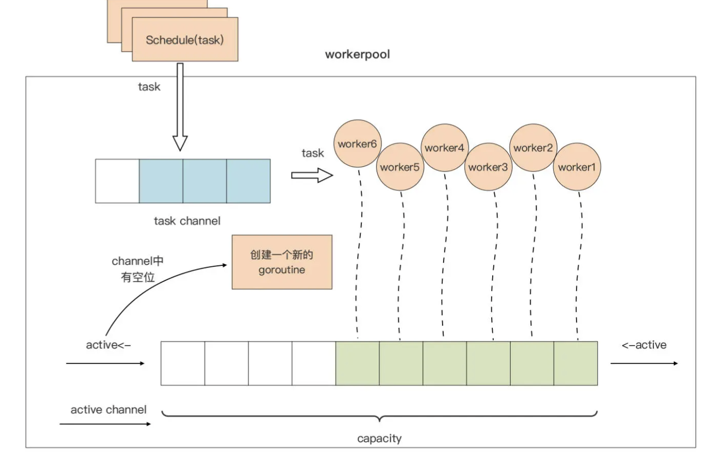

### 为什么要用到 Goroutine 池？ ###

Go 应用通常可以为每个新建立的连接创建一个对应的新 Goroutine，甚至是为每个传入的请求生成一个 Goroutine 去处理。这种设计还有一个好处，实现起来十分简单，Gopher 们在编写代码时也没有很高的心智负担。

一旦规模化后，这种非零成本也会成为瓶颈。我们以一个 Goroutine 分配 2KB 执行栈为例，100w Goroutine 就是 2GB 的内存消耗。

随着 Goroutine 数量的增加，Go 运行时进行 Goroutine 调度的处理器消耗，也会随之增加，成为阻碍 Go 应用性能提升的重要因素。

Goroutine 池就是一种常见的解决方案。这个方案的核心思想是对 Goroutine 的重用，**也就是把 M 个计算任务调度到 N 个 Goroutine 上，而不是为每个计算任务分配一个独享的 Goroutine**，从而提高计算资源的利用率。

### workerpool 的实现原理 ###

capacity 是 pool 的一个属性，代表整个 pool 中 worker 的最大容量

我们使用一个带缓冲的 channel：active，作为 worker 的“计数器”，这种 channel 使用模式就是计数信号量

当 active channel 可写时，我们就创建一个 worker，**用于处理用户通过 Schedule 函数提交的待处理的请求**

当 active channel 满了的时候，pool 就会停止 worker 的创建，直到某个 worker 因故退出，active channel 又空出一个位置时，pool 才会创建新的 worker 填补那个空位。

把用户要提交给 workerpool 执行的请求抽象为一个 Task。Task 的提交与调度也很简单：**Task 通过 Schedule 函数提交到一个 task channel 中，已经创建的 worker 将从这个 task channel 中读取 task 并执行。**

### workerpool 的一个最小可行实现 ###

为这个项目创建 go module：

```sh
$mkdir workerpool1
$cd workerpool1
$go mod init github.com/bigwhite/workerpool
```

创建 pool.go 作为 workpool 包的主要源码文件。在这个源码文件中，我们定义了 Pool 结构体类型，这个类型的实例代表一个 workerpool：



```go
type Pool struct {
    capacity int         // workerpool大小

    active chan struct{} // 对应上图中的active channel
    tasks  chan Task     // 对应上图中的task channel

    wg   sync.WaitGroup  // 用于在pool销毁时等待所有worker退出
    quit chan struct{}   // 用于通知各个worker退出的信号channel
}
```

workerpool 包对外主要提供三个 API，它们分别是：

1. workerpool.New：用于创建一个 pool 类型实例，并将 pool 池的 worker 管理机制运行起来；
2. workerpool.Free：用于销毁一个 pool 池，停掉所有 pool 池中的 worker
3. Pool.Schedule：这是 Pool 类型的一个导出方法，workerpool 包的用户通过该方法向 pool 池提交待执行的任务（Task）。

```go
func New(capacity int) *Pool {
    if capacity <= 0 {
        capacity = defaultCapacity
    }
    if capacity > maxCapacity { 
        capacity = maxCapacity
    } 

    p := &Pool{
        capacity: capacity,
        tasks:    make(chan Task),
        quit:     make(chan struct{}),
        active:   make(chan struct{}, capacity),
    }

    fmt.Printf("workerpool start\n")

    go p.run()

    return p
}
```

New 函数接受一个参数 capacity 用于指定 workerpool 池的容量，这个参数用于控制 workerpool 最多只能有 capacity 个 worker，共同处理用户提交的任务请求。函数开始处有一个对 capacity 参数的“防御性”校验，当用户传入不合理的值时，函数 New 会将它纠正为合理的值。

Goroutine 执行的是 Pool 类型的 run 方法：

```go
func (p *Pool) run() { 
    idx := 0 

    for { 
        select { 
        case <-p.quit:
            return
        case p.active <- struct{}{}:
            // create a new worker
            idx++
            p.newWorker(idx)
        } 
    } 
}
```

run 方法内是一个无限循环，循环体中使用 select 监视 Pool 类型实例的两个 channel：quit 和 active。**这种在 for 中使用 select 监视多个 channel 的实现，在 Go 代码中十分常见，是一种惯用法。**

1. 当接收到来自 quit channel 的退出“信号”时，这个 Goroutine 就会结束运行。
2. 当 active channel 可写时，run 方法就会创建一个新的 worker Goroutine。 此外，为了方便在程序中区分各个 worker 输出的日志，我这里将一个从 1 开始的变量 idx 作为 worker 的编号，并把它以参数的形式传给创建 worker 的方法。

创建新的 worker goroutine 的职责，封装到一个名为 newWorker 的方法中：

在创建一个新的 worker goroutine 之前，newWorker 方法会先调用 p.wg.Add 方法将 WaitGroup 的等待计数加一。由于每个 worker 运行于一个独立的 Goroutine 中，newWorker 方法通过 go 关键字创建了一个新的 Goroutine 作为 worker。

```go
func (p *Pool) newWorker(i int) {
    p.wg.Add(1)
    go func() {
        defer func() {
            if err := recover(); err != nil {
                fmt.Printf("worker[%03d]: recover panic[%s] and exit\n", i, err)
                <-p.active
            }
            p.wg.Done()
        }()

        fmt.Printf("worker[%03d]: start\n", i)

        for {
            select {
            case <-p.quit:
                fmt.Printf("worker[%03d]: exit\n", i)
                <-p.active
                return
            case t := <-p.tasks:
                fmt.Printf("worker[%03d]: receive a task\n", i)
                t()
            }
        }
    }()
}
```

新 worker 通过 select 监视 quit 和 tasks 两个 channel。和前面的 run 方法一样，当接收到来自 quit channel 的退出“信号”时，这个 worker 就会结束运行

tasks channel 中放置的是用户通过 Schedule 方法提交的请求，新 worker 会从这个 channel 中获取最新的 Task 并运行这个 Task。

Task 是一个对用户提交的请求的抽象，它的本质就是一个函数类型：

```go
type Task func()
```


在新 worker 中，为了防止用户提交的 task 抛出 panic，进而导致整个 workerpool 受到影响，我们在 worker 代码的开始处，**使用了 defer+recover 对 panic 进行捕捉，**

捕捉后 worker 也是要退出的，于是还通过<-p.active更新了 worker 计数器。并且一旦 worker goroutine 退出，p.wg.Done 也需要被调用，这样可以减少 WaitGroup 的 Goroutine 等待数量。

workerpool 提供给用户提交请求的导出方法 Schedule

```go
var ErrWorkerPoolFreed    = errors.New("workerpool freed")       // workerpool已终止运行

func (p *Pool) Schedule(t Task) error {
    select {
    case <-p.quit:
        return ErrWorkerPoolFreed
    case p.tasks <- t:
        return nil
    }
}
```

将传入的 Task 实例发送到 workerpool 的 tasks channel 中。但考虑到现在 workerpool 已经被销毁的状态，我们这里通过一个 select，检视 quit channel 是否有“信号”可读，如果有，就返回一个哨兵错误 ErrWorkerPoolFreed。如果没有，一旦 p.tasks 可写，提交的 Task 就会被写入 tasks channel，以供 pool 中的 worker 处理。


这里的 Pool 结构体中的 tasks 是一个无缓冲的 channel，**如果 pool 中 worker 数量已达上限，而且 worker 都在处理 task 的状态，那么 Schedule 方法就会阻塞**

现在建立一个使用 workerpool 的项目 demo1：

```sh
$mkdir demo1
$cd demo1
$go mod init demo1
```

要引用本地的 module，所以我们需要手工修改一下 demo1 的 go.mod 文件，并利用 replace 指示符将 demo1 对 workerpool 的引用指向本地 workerpool1 路径：

```go
module demo1

go 1.17

require github.com/bigwhite/workerpool v1.0.0

replace github.com/bigwhite/workerpool v1.0.0 => ../workerpool1
```

main.go 文件，源码如下：

```go
package main
  
import (
    "time"
    "github.com/bigwhite/workerpool"
)

func main() {
    p := workerpool.New(5)

    for i := 0; i < 10; i++ {
        err := p.Schedule(func() {
            time.Sleep(time.Second * 3)
        })
        if err != nil {
            println("task: ", i, "err:", err)
        }
    }

    p.Free()
}
```

问题：比如当 workerpool 中的 worker 数量已达上限，而且 worker 都在处理 task 时，用户调用 Schedule 方法将阻塞，如果用户不想阻塞在这里，以我们目前的实现是做不到的。


