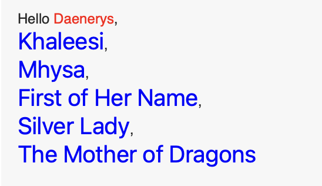

#### NSAttributedString

To demonstrate how result builders work, you’ll build a small project that uses `NSAttributedString` to show a fancy greet message. By the end of this chapter, you’ll create a string that looks like this:



`NSAttributedString` is a special object that holds a string and lets you add attributes, like color and font, to the whole string or only to part of it.

Enter this function into the playground:

```swift
func greet(name: String) -> NSAttributedString {
  let message = NSAttributedString(string: "Hello " + name)
  return message
}

```

 You’ll change that by adding color to the greeting message using an attribute.

```swift
func greet(name: String) -> NSAttributedString {
  let attributes = [NSAttributedString.Key.foregroundColor : UIColor.red]
  let message = NSAttributedString(string: "Hello " + name, attributes: attributes)
  return message
}
```

### Adding Color to a Specific String

```swift
let message = NSMutableAttributedString()
message.append(NSAttributedString(string: "Hello "))
message.append(NSAttributedString(string: name, attributes: attributes))

```

## Creating a Result Builder

Start by creating a new `enum` called `AttributedStringBuilder`. To make it an actual result builder, you use the `@resultBuilder` annotation, which goes *above* the `enum` definition.

```swift
@resultBuilder
enum AttributedStringBuilder {
}
```

Add the missing required method inside the `enum` definition:

```swift
static func buildBlock(_ components: NSAttributedString...) -> NSAttributedString {
  ...
}

```

As you can see, it can take multiple components of type `NSAttributedString` and combine them into a single `NSAttributedString`

The method uses a variadic parameter (`NSAttributedString...`), which means the result builder can support any number of components.

Now, to implement the builder. Insert this code in the `buildBlock(_:)` method body:

```swift
let attributedString = NSMutableAttributedString()
for component in components {
  attributedString.append(component)
}
return attributedString
```

### Building the Greeting String With the Result Builder

```swift
@AttributedStringBuilder
func greetBuilder(name: String) -> NSAttributedString {
}
```

you’ll add a few `NSMutableAttributedString`s, then call `greetBuilder`, like so:

```swift
@AttributedStringBuilder
func greetBuilder(name: String) -> NSAttributedString {
  NSMutableAttributedString(string: "Hello ")
  NSMutableAttributedString(string: name)
  NSMutableAttributedString(string: ", Mother of Dragons")
}

greetBuilder(name: "Daenerys")

```

The method will return the string: “Hello Daenerys, Mother of Dragons”. Here, you send the `NSMutableAttributedString`s to `buildBlock(_:)`, which you implemented earlier

### Using Extensions and Type Aliases

```swift
extension NSMutableAttributedString {
  public func color(_ color : UIColor) -> NSMutableAttributedString {
    self.addAttribute(NSAttributedString.Key.foregroundColor,
                      value: color,
                      range: NSRange(location: 0, length: self.length))
    return self
  }

  public func font(_ font : UIFont) -> NSMutableAttributedString {
    self.addAttribute(NSAttributedString.Key.font,
                      value: font,
                      range: NSRange(location: 0, length: self.length))
    return self
  }
}
```

These methods apply a new attribute to the string, then return it.

Now, you could write something like this (don’t actually add this to the playground):

```swift
let name = NSMutableAttributedString(string: "Daenerys").color(.blue)
```

### Adding Fonts and Color

```swift
@AttributedStringBuilder
func greetBuilder(name: String, title: String) -> NSAttributedString {
  NSMutableAttributedString(string: "Hello ")
  NSMutableAttributedString(string: name)
    .color(.red)
  NSMutableAttributedString(string: ", ")
  NSMutableAttributedString(string: title)
    .font(.systemFont(ofSize: 20))
    .color(.blue)
}

```

### Using typealias

```swift
typealias Text = NSMutableAttributedString
```

Here, you tell the compiler to treat `Text` as an alias of `NSMutableAttributedString`. You can now replace all occurrences(发生) of `NSMutableAttributedString` with `Text`:

```swift
@AttributedStringBuilder
func greetBuilder(name: String, title: String) -> NSAttributedString {
  Text(string: "Hello ")
  Text(string: name)
    .color(.red)
  Text(string: ", ")
  Text(string: title)
    .font(.systemFont(ofSize: 20))
    .color(.blue)
}
```

Finally, you can remove the need to specify the argument label `string` every time

To do this, add another initializer that omits(省略) the argument label to `NSMutableAttributedString`. Add this to the extension:

```swift
convenience init(_ string: String) {
  self.init(string: string)
}
```

```swift
@AttributedStringBuilder
func greetBuilder(name: String, title: String) -> NSAttributedString {
  Text("Hello ")
  Text(name)
    .color(.red)
  Text(", ")
  Text(title)
    .font(.systemFont(ofSize: 20))
    .color(.blue)
}
```

### Using Conditional Logic

If you pass in an empty title, you’ll get a weird result that looks like this:

```swift
greetBuilder(name: "Daenerys", title: "")
// Hello Daenerys, 
```

Wrap the last two `Text` elements in an `if` statement:

```swift
if !title.isEmpty {
  Text(", ")
  Text(title)
    .font(.systemFont(ofSize: 20))
    .color(.blue)
}
```

Oops! Once you add this code, you get an error: `Closure containing control flow statement cannot be used with result builder 'AttributedStringBuilder'`. What’s going on?

 you must add a new method to its definition. Add this to `enum AttributedStringBuilder`:

```swift
static func buildOptional(_ component: NSAttributedString?) -> NSAttributedString {
  component ?? NSAttributedString()
}
```

Give the new logic a try by passing an empty string to the `title` parameter of `greetBuilder`

### Using Complex Conditional Logic

```swift
if !title.isEmpty {
  ...
} else {
  Text(", No title")
}
```

You add two methods for the `if-else` case because you might want to distinguish the cases where the `if` condition was met from cases where it wasn’t.

```swift
static func buildEither(first component: NSAttributedString) -> NSAttributedString {
  component
}

static func buildEither(second component: NSAttributedString) -> NSAttributedString {
  component
}
```

### Using Loops with Result Builders

```swift
@AttributedStringBuilder
func greetBuilder(name: String, titles: [String]) -> NSAttributedString {
  Text("Hello ")
  Text(name)
    .color(.red)
  if !titles.isEmpty {
    for title in titles {
      Text(", ")
      Text(title)
        .font(.systemFont(ofSize: 20))
        .color(.blue)
    }
  } else {
    Text(", No title")
  }
}
```

Now, add all of Daenerys’ titles:

```swift
let titles = ["Khaleesi",
              "Mhysa",
              "First of Her Name",
              "Silver Lady",
              "The Mother of Dragons"]
greetBuilder(name: "Daenerys", titles: titles)
```

To handle this, you must implement `buildArray(_:)`.

```swift
static func buildArray(_ components: [NSAttributedString]) -> NSAttributedString {
  let attributedString = NSMutableAttributedString()
  for component in components {
    attributedString.append(component)
  }
  return attributedString
}
```