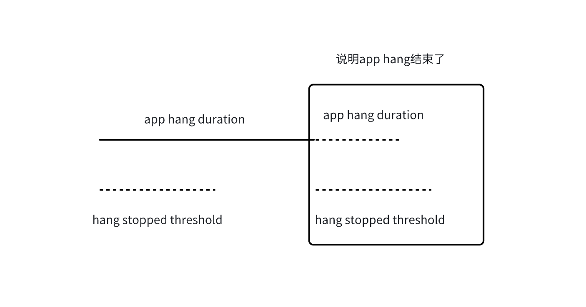

#### CADisplayLink

CADisplayLink相当于一个定时器，比起NSTimer，它可以确保系统渲染每一帧的时候我们的方法都被调用，从而保证了动画的流畅性。
iOS设备的屏幕刷新频率是固定的，**CADisplayLink在正常情况下会在每次刷新结束都被调用，精确度相当高**。NSTimer的精确度相对显得较低；CADisplayLink使用场合相对专一，适合做UI的不停重绘，比如自定义动画引擎或者视频播放的渲染。NSTimer的使用范围要广泛的多，各种需要单次或者循环定时处理的任务都可以使用。

1. `frameInterval`（ios10被弃用）
   标识间隔多少帧调用一次selector方法。
   CADisplayLink的selector每秒调用次数 = 60 / frameInterval。
   苹果文档中还提到：**如果应用不能及时提供显示帧，则应该降低帧率，可以通过增大 frameInterval 这一属性的值来降低动画帧率**。frameInterval 默认值为 1，表示每帧都回调一次selector。在没有卡顿时，iOS 设备屏幕显示每秒刷新60次，意味着 frameInterval 为默认值时，每秒回调60次 selector，当frameInterval 改为2时，每秒回调30（60/2）次 selector。

2. timestamp属性 表示上一帧时间：For example, an app that displays movies might use `timestamp` to calculate which video frame to display next. An app that performs its own animations might use `timestamp` to determine where and how visible objects appear in the upcoming frame.
3. The [`duration`](https://developer.apple.com/documentation/quartzcore/cadisplaylink/duration) property provides the amount of time between frames at the [`maximumFramesPerSecond`](https://developer.apple.com/documentation/UIKit/UIScreen/maximumFramesPerSecond). To calculate the actual frame duration, use [`targetTimestamp`](https://developer.apple.com/documentation/quartzcore/cadisplaylink/targettimestamp) - [`timestamp`](https://developer.apple.com/documentation/quartzcore/cadisplaylink/timestamp). 

```swift
/ /Calculate the actual frame rate.
let actualFramesPerSecond = 1 / (displaylink.targetTimestamp - displaylink.timestamp)
```

#### targetTimestamp

The time interval that represents when the next frame displays.   预计下一帧展示的时间

You can use the target timestamp to cancel or pause long running processes 

The following code shows how you can create a display link and register it with a run loop. The `step(displayLink:)` function attempts to sum the square roots of all numbers up to [`max`](https://developer.apple.com/documentation/Swift/Int/max), but with each iteration checks the current time ([`CACurrentMediaTime()`](https://developer.apple.com/documentation/quartzcore/cacurrentmediatime())) against the [`targetTimestamp`](https://developer.apple.com/documentation/quartzcore/cadisplaylink/targettimestamp).

```swift
func createDisplayLink() {
    let displayLink = CADisplayLink(target: self,
                                    selector: #selector(step))
    displayLink.add(to: .main,
                    forMode: .defaultRunLoopMode)
}
    
func step(displayLink: CADisplayLink) {
    var sqrtSum = 0.0
    for i in 0 ..< Int.max {
        sqrtSum += sqrt(Double(i))
        //If the time taken to complete the calculation is later than the target timestamp, the function breaks the loop:
        if (CACurrentMediaTime() >= displayLink.targetTimestamp) {
            print("break at i =", i)
            break
        }
    }
}

```

#### Sentry FrameTrack

SentryFramesTrackingIntegration 初始化 framesTracker对象

```objective-c
- (BOOL)installWithOptions:(SentryOptions *)options
{
    .....
    self.tracker = SentryDependencyContainer.sharedInstance.framesTracker;
    [self.tracker start];

    return YES;
}
```

SentryFramesTracker start方法 启动frame监控

```objective-c
- (void)start
{
    if (_isStarted) {
        return;
    }
    _isStarted = YES;
    [self.notificationCenter
        addObserver:self
           selector:@selector(didBecomeActive)
               name:SentryNSNotificationCenterWrapper.didBecomeActiveNotificationName];
    [self.notificationCenter
        addObserver:self
           selector:@selector(willResignActive)
               name:SentryNSNotificationCenterWrapper.willResignActiveNotificationName];
    [self unpause];
}
```

unpause

```objective-c
- (void)unpause
{
    if (_isRunning) {
        return;
    }
    _isRunning = YES;

    [_displayLinkWrapper linkWithTarget:self selector:@selector(displayLinkCallback)];
}
```

SentryDisplayLinkWrapper  linkWithTarget

```objective-c
- (void)linkWithTarget:(id)target selector:(SEL)sel
{
    displayLink = [CADisplayLink displayLinkWithTarget:target selector:sel];
    [displayLink addToRunLoop:[NSRunLoop mainRunLoop] forMode:NSRunLoopCommonModes];
}
```

* CADisplayLink  注册到 runloop里，以便收到屏幕刷新的回调
* 屏幕刷新回调后会调用注册的displayLinkCallback 

displayLinkCallback 执行逻辑

```objective-c
- (void)displayLinkCallback
{
   //获取上一个frame的刷新时间
	 CFTimeInterval thisFrameTimestamp = self.displayLinkWrapper.timestamp;
   //当前frame的系统时间
   uint64_t thisFrameSystemTimestamp = self.dateProvider.systemTime;
  
  _currentFrameRate = 60;
    if (self.displayLinkWrapper.targetTimestamp != self.displayLinkWrapper.timestamp) {
        _currentFrameRate = (uint64_t)round(
            (1 / (self.displayLinkWrapper.targetTimestamp - 			      		self.displayLinkWrapper.timestamp)));
    }
  //  1 /（targetTimestamp - timestamp） 表示实际的刷新帧率 
  //rame rate can change at any time by setting preferredFramesPerSecond or due to ProMotion
    // display, low power mode,
  
  ....
    // profilingTimestamp 猜测是因为开启profiling选项后函数调用耗时会增加，为了精确度这里再取一次thisFrameNSDate
     NSDate *thisFrameNSDate = self.dateProvider.date;
    BOOL isContinuousProfiling = [SentryContinuousProfiler isCurrentlyProfiling];
    NSNumber *profilingTimestamp = isContinuousProfiling ? @(thisFrameNSDate.timeIntervalSince1970)
                                                         : @(thisFrameSystemTimestamp);
  
  	//如果开启profiling 记录_currentFrameRate 并记录到记录帧率的frameRateTimestamps数组
     if ([SentryTraceProfiler isCurrentlyProfiling] || isContinuousProfiling) {
        BOOL hasNoFrameRatesYet = self.frameRateTimestamps.count == 0;
        uint64_t previousFrameRate
            = self.frameRateTimestamps.lastObject[@"value"].unsignedLongLongValue;
        BOOL frameRateChanged = previousFrameRate != _currentFrameRate;
        BOOL shouldRecordNewFrameRate = hasNoFrameRatesYet || frameRateChanged;
        if (shouldRecordNewFrameRate) {
            SENTRY_LOG_DEBUG(@"Recording new frame rate at %@.", profilingTimestamp);
            [self recordTimestamp:profilingTimestamp
                            value:@(_currentFrameRate)
                            array:self.frameRateTimestamps];
        }
    }
    
    //计算实际一帧的耗时
   CFTimeInterval frameDuration = thisFrameTimestamp - self.previousFrameTimestamp;
  
   if (frameDuration > slowFrameThreshold(_currentFrameRate)
        && frameDuration <= SentryFrozenFrameThreshold) {
     //满足slow frame的情况
     _slowFrames++;
     //记录卡顿的时间点log
      SENTRY_LOG_DEBUG(
            @"Detected slow frame starting at %@ (frame tracker: %@).", profilingTimestamp, self);
     //slowFrameTimestamps数组添加 卡顿的timestamp 和 这一帧的执行耗时value  
     //即 [slowFrameTimestamps addObject:@{ @"timestamp" : timestamp, @"value" : value }];
     [self recordTimestamp:profilingTimestamp
                        value:@(thisFrameSystemTimestamp - self.previousFrameSystemTimestamp)
                        array:self.slowFrameTimestamps];
   }else if (frameDuration > SentryFrozenFrameThreshold) {
     //满足冻结帧
      _frozenFrames++;
     //同上，记录冻结帧
     [self recordTimestamp:profilingTimestamp
                        value:@(thisFrameSystemTimestamp - self.previousFrameSystemTimestamp)
                        array:self.frozenFrameTimestamps];
   }
  
  
  	 if (frameDuration > slowFrameThreshold(_currentFrameRate)) {
       //记录delayframes 
       //1. [self.delayedFrames addObject:delayedFrame];
       // 2.  self.lastDelayedFrameSystemTimestamp = thisFrameSystemTimestamp;
        //3.  self.previousFrameSystemTimestamp = thisFrameSystemTimestamp;
        [self.delayedFramesTracker recordDelayedFrame:self.previousFrameSystemTimestamp
                             thisFrameSystemTimestamp:thisFrameSystemTimestamp
                                     expectedDuration:slowFrameThreshold(_currentFrameRate)
                                       actualDuration:frameDuration];
     } else {
        [self.delayedFramesTracker setPreviousFrameSystemTimestamp:thisFrameSystemTimestamp];
    }
  
  	_totalFrames++;
    self.previousFrameTimestamp = thisFrameTimestamp;
    self.previousFrameSystemTimestamp = thisFrameSystemTimestamp;
    [self reportNewFrame];
  
}
```


#### 启动SentryANRTrackingIntegration 启动子线程监控frameTracker记录的值

```objective-c
@implementation SentryANRTrackingIntegration

- (BOOL)installWithOptions:(SentryOptions *)options
{
    if (![super installWithOptions:options]) {
        return NO;
    }

#if SENTRY_HAS_UIKIT
    self.tracker =
        [SentryDependencyContainer.sharedInstance getANRTracker:options.appHangTimeoutInterval
                                                    isV2Enabled:options.enableAppHangTrackingV2];
#else
    self.tracker =
        [SentryDependencyContainer.sharedInstance getANRTracker:options.appHangTimeoutInterval];

#endif // SENTRY_HAS_UIKIT
    self.fileManager = SentryDependencyContainer.sharedInstance.fileManager;
    self.dispatchQueueWrapper = SentryDependencyContainer.sharedInstance.dispatchQueueWrapper;
  //SentryANRTrackerV2 启动子线程监控卡顿
    [self.tracker addListener:self];
    self.options = options;
 ....

    return YES;
}
```

SentryANRTrackerV2

```objective-c
- (void)addListener:(id<SentryANRTrackerDelegate>)listener
{
    @synchronized(self.listeners) {
        [self.listeners addObject:listener];

        @synchronized(threadLock) {
            if (self.listeners.count > 0 && state == kSentryANRTrackerNotRunning) {
                if (state == kSentryANRTrackerNotRunning) {
                    state = kSentryANRTrackerStarting;
                    [NSThread detachNewThreadSelector:@selector(detectANRs)
                                             toTarget:self
                                           withObject:nil];
                }
            }
        }
    }
}
```

######  子线程 detectANRs 监控卡顿

```objective-c
- (void)detectANRs {
  
   NSUUID *threadID = [NSUUID UUID];
  //时间日期  provider
  id<SentryCurrentDateProvider> dateProvider
        = SentryDependencyContainer.sharedInstance.dateProvider;
  
  BOOL reported = NO; //是否上报的哨兵
  
  
  NSInteger reportThreshold = 5;
  //设置子线程睡眠间隔，猜测可能是减少对其他线程的调度影响？
  NSTimeInterval sleepInterval = self.timeoutInterval / reportThreshold;  
  uint64_t sleepIntervalInNanos = timeIntervalToNanoseconds(sleepInterval);
  uint64_t timeoutIntervalInNanos = timeIntervalToNanoseconds(self.timeoutInterval);
  
  while (YES) {
     //当前thread 睡眠的ddl
     NSDate *sleepDeadline = [[dateProvider date] dateByAddingTimeInterval:self.timeoutInterval];
    
    //本质上就是调用[NSThread sleepForTimeInterval:timeInterval] 来让thread sleep
     [self.threadWrapper sleepForTimeInterval:sleepInterval];
    
    uint64_t nowSystemTime = dateProvider.systemTime;
    
    if (reported) { //如果需要上报
      //计算 APP hang 住的开始时间 因为子线程有sleep，所有需要减去slepp消耗的时间，通过appHangStoppedInterval获取
      uint64_t framesDelayStartSystemTime = nowSystemTime - appHangStoppedInterval;
      
      
      //framesTracker getFramesDelay 就是从displayLinkCallback中收集的framedelay信息
       SentryFramesDelayResult *framesDelay =
                [self.framesTracker getFramesDelay:framesDelayStartSystemTime
                                endSystemTimestamp:nowSystemTime];
      
      //没有卡住
      if (framesDelay.delayDuration == -1) {
                continue;
       }

      /// appHangStoppedFrameDelayThreshold 是基于reportThreshold 上报间隔的阈值 和
      ///sleep间隔（sleep的时间也是基于是基于reportThreshold） 来判断是否达到app hang住上报的时间间隔
      ///如framesDelay获取的app hang 时间小于 appHangStoppedFrameDelayThreshold 则说明这一次卡顿已经结束了
      BOOL appHangStopped = framesDelay.delayDuration < appHangStoppedFrameDelayThreshold;
      
       if (appHangStopped) {
          uint64_t appHangDurationNanos
                    = timeoutIntervalInNanos + nowSystemTime - lastAppHangStartedSystemTime;
                NSTimeInterval appHangDurationMinimum
                    = nanosecondsToTimeInterval(appHangDurationNanos - sleepIntervalInNanos);
                NSTimeInterval appHangDurationMaximum
                    = nanosecondsToTimeInterval(appHangDurationNanos + sleepIntervalInNanos);
         
         // The App Hang stopped, don't block the App Hangs thread or the main thread with
                // calling ANRStopped listeners.
                [self.dispatchQueueWrapper dispatchAsyncWithBlock:^{
                    [self ANRStopped:appHangDurationMinimum to:appHangDurationMaximum];
                }];
       }
      
       lastAppHangStoppedSystemTime = dateProvider.systemTime;
                reported = NO;

    }
    continue;
    
  }
  
  
  //reported 为NO和yes的通用逻辑
   uint64_t frameDelayStartSystemTime = nowSystemTime - timeoutIntervalInNanos;

        SentryFramesDelayResult *framesDelayForTimeInterval =
            [self.framesTracker getFramesDelay:frameDelayStartSystemTime
                            endSystemTimestamp:nowSystemTime];

        if (framesDelayForTimeInterval.delayDuration == -1) {
            continue;
        }
  
  uint64_t framesDelayForTimeIntervalInNanos
            = timeIntervalToNanoseconds(framesDelayForTimeInterval.delayDuration);
  
  //如果有hang住的frame count只有一个说明卡死在当前帧了，就是fullyblocking了
   BOOL isFullyBlocking = framesDelayForTimeInterval.framesContributingToDelayCount == 1;
  
   if (isFullyBlocking && framesDelayForTimeIntervalInNanos >= timeoutIntervalInNanos) {
            SENTRY_LOG_WARN(@"App Hang detected: fully-blocking.");

            reported = YES;
            lastAppHangStartedSystemTime = dateProvider.systemTime;
            [self ANRDetected:SentryANRTypeFullyBlocking];
    }
  
  NSTimeInterval nonFullyBlockingFramesDelayThreshold = self.timeoutInterval * 0.99;
  //非某一帧卡死，如帧率抖动
   if (!isFullyBlocking
            && framesDelayForTimeInterval.delayDuration > nonFullyBlockingFramesDelayThreshold) {

            SENTRY_LOG_WARN(@"App Hang detected: non-fully-blocking.");

            reported = YES;
            lastAppHangStartedSystemTime = dateProvider.systemTime;
            [self ANRDetected:SentryANRTypeNonFullyBlocking];
      }
  
}
```




