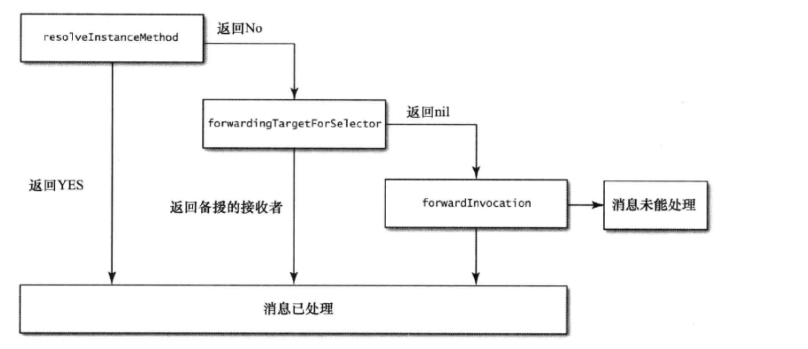
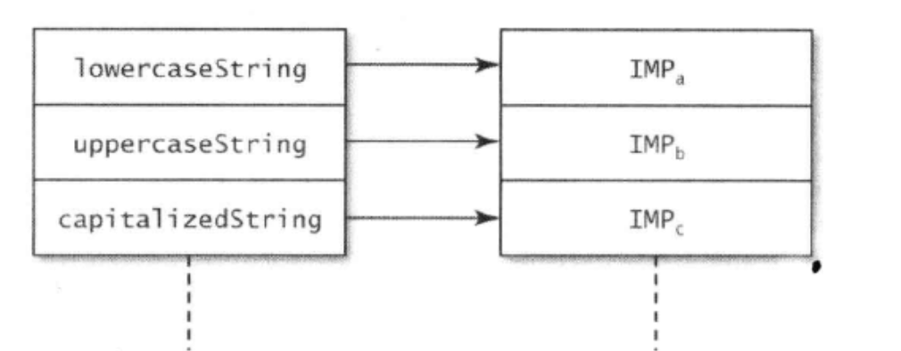
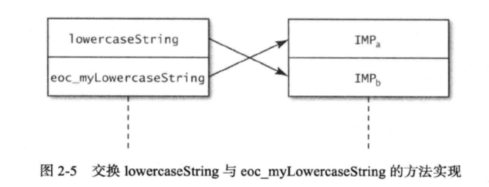

### 消息转发机制

若想令类能理解某条消息，我们必须以程序码实现出对应的方法才行。但是，在编译期向类发送了其无法解读的消息并不会报错，因为在运行期可以继续向类中添加方法，**所以编译器在编译时还无法确知类中到底会不会有某个方法实现。当对象接收到无法解读的消息后，就会启动“消息转发”(message forwarding)机制，程序员可经由此过程告诉对象应该如何处理未知消息。**

你可能早就遇到过经由消息转发流程所处理的消息了，只是未加留意。如果在控制台中看到下面这种提示信息( doesNotR ecognizeSelector)，那就说明你曾向某个对象发送过一条其无法解读的消息，从而启动了消息转发机制，并将此消息转发给了 NSObject 的默认实现。

消息转发分为两大阶段。

* 第一阶段先征询接收者，所属的类，看其是否能动态添加方法，以处理当前这个“未知的选择子”(unknown selector)，这叫做“动态方法解析”(dynamicmethod resolution)。
* 第二阶段涉及“完整的消息转发机制”(full forwarding mechanism)。如果运行期系统已经把第一阶段执行完了，那么接收者自己就无法再以动态新增方法的手段来响应包含该选择子的消息了。
* 此时，运行期系统会请求接收者以其他手段来处理与消息相关的方法调用。这又细分为两小步。
* 首先，请接收者看看有没有其他对象能处理这条消息。若有，则运行期系统会把消息转给那个对象，于是消息转发过程结束，一切如常。
* 若没有“备援的接收者”(replacementreceiver)，则启动完整的消息转发机制，运行期系统会把与消息有关的全部细节都封装到 NSInvocation 对象中，再给接收者最后一次机会，令其设法解决当前还未处理的这条消息。

#### 动态方法解析

对象在收到无法解读的消息后，将调用其所属类的方法：

```objective-c
+ (BOOL) resolveInstanceMethod: (SEL)selector
```

假如尚未实现的方法不是实例方法而是类方法，那么运行期系统就会调用另外一个方法，该方法与“``resolveInstanceMethod``:”类似，叫做``“resolveClassMethod:’``使用这种办法的前提是:相关方法的实现代码已经写好，只等着运行的时候动态插在类里面就可以了。

此方案常用来实现 @dynamic 属性，比如说，要访问CoreData框架中 NSManagedObjects 对象的属性时就可以这么做

```objective-c
id autoDictionaryGetter(id self,sEL cmd);
void autoDictionarySetter(id self, SEL cmd, id value);

(B00L)resolveInstanceMethod:(SEL)selector {
  NSString *selectorString =NsstringFromSelector(selector);
  if (/* selector is from a @dynamic property */){
    if([selectorstring hasPrefix:@"set"]){
      class addMethod(self, selector,(IMP)autoDictionarysetter,"v@:@");
		}else {
			class addMethod (self, selector, (IMP)autoDictionaryGetter,"@@:");
		}
    return YES;
  }
  return [super resloveInstanceMethod:selector];
} 
```

#### 备援接受者

当前接收者还有第二次机会能处理未知的选择子，在这一步中，运行期系统会问它:能不能把这条消息转给其他接收者来处理。与该步骤对应的处理方法如下:

```objective-c
- (id) forwardingTargetForSelector:(SEL)selector
```

方法参数代表未知的选择子，若当前接收者能找到备援对象，则将其返回，若找不到就返回 nil。**通过此方案，我们可以用“组合”(composition)来模拟出“多重继承”(multipleinheritance)的某些特性。在一个对象内部，可能还有一系列其他对象，该对象可经由此方法将能够处理某选择子的相关内部对象返回，这样的话，在外界看来，好像是该对象亲自处理了这些消息似的。**



接收者在每一步中均有机会处理消息。步骤越往后，处理消息的代价就越大。最好能在第一步就处理完，这样的话，运行期系统就可以将此方法缓存起来了。如果这个类的实例稍后还收到同名选择子，那么根本无须启动消息转发流程。若想在第三步里把消息转给备援的接收者，那还不如把转发操作提前到第二步。因为第三步只是修改了调用目标，这项改动放在第二步执行会更为简单，不然的话，还得创建并处理完整的 NSInvocation。

### 调试黑盒方法

给定的**选择子名称**相对应的方法是不是也可以在运行期改变呢?没错，若能善用此特性，则可发挥出巨大优势，因为我们既不需要源代码，也不需要通过继承子类来覆写方法就能改变这个类本身的功能。此方案经常称为"方法调配(method swizzling)"

**类的方法列表会把选择子的名称映射到相关的方法实现之上**，**使得“动态消息派发系统”能够据此找到应该调用的方法。这些方法均以函数指针的形式来表示，这种指针叫做IMP**其原型如下:

```objective-c
id (*IMP)(id, SEL,...)
```

NSString类可以响应lowercaseString、uppercaseString、capitalizedString等选择子。这张映射表中的每个选择子都映射到了不同的 IMP 之上



Objective-C 运行期系统提供的几个方法都能够用来操作这张表。开发者可以向其中新增选择子，也可以改变某选择子所对应的方法实现，还可以交换两个选择子所映射到的指针。

通过此操作，可为已有方法添加新功能。先来看看怎样互换两个已经写好的方法实现。想交换方法实现，可用下列函数:

```objective-c
void method_exchangeImplementations (Method ml, Method m2)
```

此函数的两个参数表示待交换的两个方法实现，而方法实现则可通过下列函数获得

```objective-c
Method class_getInstanceMethod(Class aClass, SEL aSelector)
```

此函数根据给定的选择从类中取出与之相关的方法。执行下列代码，即可交换前面提到的lowercaseString 与uppercaseString 方法实现:

```objective-c
Method originalMethod = class_getInstanceMethod([NsStringclass],@selector(lowercasestring));
Method swappedMethod =  class_getInstanceMethod([NsStringclass],@selector(uppercasestring));
method_exchangeImplementations(originalMethod, swappedMethod);

```


从现在开始，如果在NSSting实例上调用lowercaseString，那么执行的将是 uppercaseString的原有实现，反之亦然:

```objective-c
NSString *string =@"This is the String";
NSString *lowercaseString=[string lowercasestring];
NSLog(@"lowercaseString =号@", lowercaseString);
// Output: lowercaseString = THIS IS THE STRING
NSString *uppercasestring=[string uppercasestring];
NSLog(@"uppercasestring =号@", uppercasestring);
// Output: uppercaseString = this is the string

```

比如想要在调用lowercaseString时记录信息，这时可以通过交换方法实现来达成此目标，我们编写一个方法，在此方法中实现所需的附加功能，并调用原有实现

新方法可以添加至NSString的一个分类(Category)中

```objective-c
@interface Nsstring (EOCMyAdditions)
  -(NSString*) eoc_myLowercasestring;
@end
```



```objective-c
@implementation NSString(EocMyAdditions) 
  - (Nsstring*)eoc_myLowercasestring {
  	NSString *lowercase = [self eoc_myLowercasestring];
  	NSLOg(@"%@ =>%@"， self， lowercase);
  	return lowercase;
}
@end
```

这段代码看上去好像会陷入递归调用的死循环，不过大家要记住，此方法是准备和lowercaseString方法互换的。所以，在运行期，eoc_myLowercaseString 选择子实际上对应于原有的 lowercaseString方法实现。最后，通过下列代码来交换这两个方法实现:

```objective-c
Method originalMethod = class_getInstanceMethod([Nsstring class],@selector(lowercaseString));
Method swappedMethod = class_getInstanceMethod([NSString class], @selector(eoc_myLowercasestring));

method_exchangeImplementations(originalMethod, swappedMethod);

```

执行完上述代码之后，只要在NSString实例上调用lowercaseString方法，就会输出一行记录消息:

```objective-c
NSString *string = @"ThIs is tHe stRiNg";
NSString *lowercasestring =[string lowercasestring];
// output: this Is The String => this is the string
```

通过此方案，开发者可以为那些“完全不知道其具体实现的”(completely opaque，“完全不透明的”)黑盒方法增加日志记录功能，这非常有助于程序调试。然而，此做法只在调试程序时有用。很少有人在调试程序之外的场合用上述“方法调配技术”来永久改动某个类的功能。不能仅仅因为 Obiective-C语言里有这个特性就一定要用它。若是滥用，反而会令代码变得不易读懂且难于维护。


