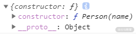
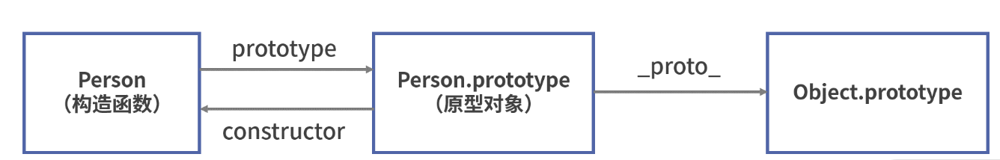
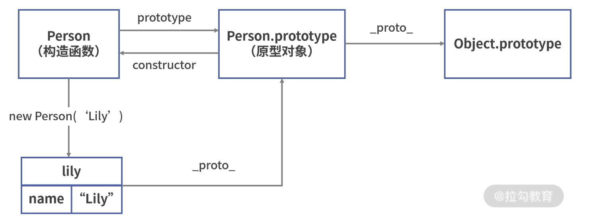

### 原型对象和对象是什么关系 ###

不管是对象，还是函数和数组，它们都是Object的实例，也就是说在 JavaScript 中，除了原始类型以外，其余都是对象。

在 JavaScript 中，函数也是一种特殊的对象，它同样拥有属性和值。**所有的函数会有一个特别的属性prototype**，该**属性的值是一个对象，这个对象便是我们常说的“原型对象”。**

可以在控制台打印一下这个属性：

```javascript
function Person(name) {
  this.name = name;
}
console.log(Person.prototype);

```



该原型对象有两个属性：`constructor`和`__proto__`。

在 JavaScript 中，`__proto__`属性指向对象的原型对象,对于函数来说，它的原型对象便是`prototype`。函数的原型对象`prototype`有以下特点：

* 默认情况下，所有函数的原型对象（`prototype`）都拥有`constructor`属性，该属性指向与之关联的构造函数，在这里构造函数便是`Person`函数
* `Person`函数的原型对象（`prototype`）同样拥有自己的原型对象，用`__proto__`属性表示。前面说过，函数是`Object`的实例，**因此`Person.prototype`的原型对象为`Object.prototype。`**



* `__proto__`属性指向对象的原型对象；
* 对于函数来说，每个函数都有一个`prototype`属性，该属性为该函数的原型对象


### 使用 prototype 和 **proto** 实现继承 ###

通过将对象 A 的`__proto__`属性赋值为对象 B，即`A.__proto__ = B`，此时使用`A.__proto__`便可以访问 B 的属性和方法。

继续以`Person`为例，当我们使用`new Person()`创建对象时，JavaScript 就会创建构造函数`Person`的实例，比如这里我们创建了一个叫“Lily”的`Person`：

```js
var lily = new Person("Lily");

```

JavaScript 引擎通过将`Person`的原型对象`prototype`赋值给实例对象`lily`的`__proto__`属性，实现了`lily`对`Person`的继承，即执行了以下代码：

```js
// 实际上 JavaScript 引擎执行了以下代码

var lily = {};

lily.__proto__ = Person.prototype;

Person.call(lily, "Lily");

```

可以看到，`lily`作为`Person`的实例对象，它的`__proto__`指向了`Person`的原型对象，即`Person.prototype`。



实例对象通过将`__proto__`属性指向构造函数的原型对象（`Person.prototype`），实现了该原型对象的继承。

* 每个对象都有`__proto__`属性来标识自己所继承的原型对象，但只有函数才有`prototype`属性；
* 对于函数来说，每个函数都有一个`prototype`属性，该属性为该函数的原型对象；


### 通过原型链访问对象的方法和属性 ###

- 首先会优先在该对象上搜寻。如果找不到，还会依次层层向上搜索该对象的原型对象、该对象的原型对象的原型对象等（套娃告警）；
- JavaScript 中的所有对象都来自`Object`，`Object.prototype.__proto__ === null`。`null`没有原型，并作为这个原型链中的最后一个环节；
- JavaScript 会遍历访问对象的整个原型链，如果最终依然找不到，此时会认为该对象的属性值为`undefined`。

比如，我们调用`lily.toString()`时，JavaScript 引擎会进行以下操作：

1. 先检查`lily`对象是否具有可用的`toString()`方法；
2. 如果没有，则``检查`lily`的原型对象（`Person.prototype`）是否具有可用的`toString()`方法；
3. `Object.prototype`）是否具有可用的`toString()`方法，于是该方法被调用。

组合继承融合原型链继承和构造函数的优点，它的实现如下

```js
function Parent(name) {
  // 私有属性，不共享
  this.name = name;
}

// 需要复用、共享的方法定义在父类原型上
Parent.prototype.speak = function() {

  console.log("hello");

};

function Child(name) {
  Parent.call(this, name);
}
// 继承方法
Child.prototype = new Parent();

```


