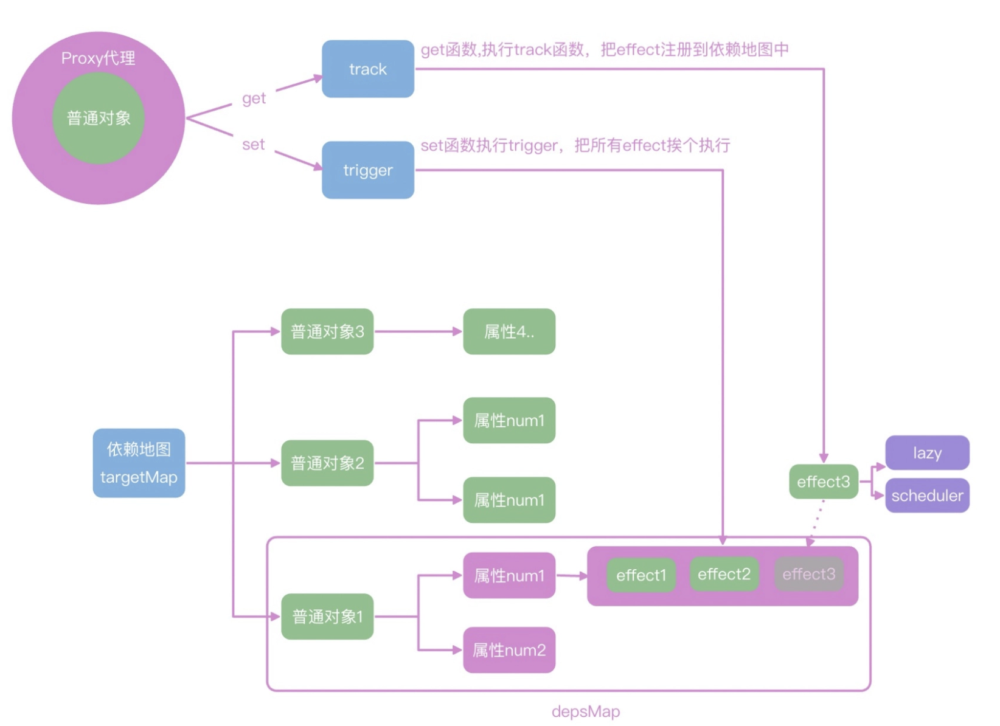

响应式机制的主要功能就是，可以**把普通的 JavaScript 对象封装成为响应式对象**，拦截数据的获取和修改操作，实现依赖数据的自动化更新。

一个最简单的响应式模型，我们可以通过 reactive 或者 ref 函数，把数据包裹成响应式对象，并且通过 effect 函数注册回调函数，然后在数据修改之后，响应式地通知 effect 去执行回调函数即可。

Vue 的响应式是可以独立在其他平台使用的。比如你可以新建 test.js，使用下面的代码在 node 环境中使用 Vue 响应。以 reactive 为例，我们使用 reactive 包裹 JavaScript 对象之后，每一次对响应式对象 counter 的修改，都会执行 effect 内部注册的函数：

```javascript
const {effect, reactive} = require('@vue/reactivity')

let dummy
const counter = reactive({ num1: 1, num2: 2 })
effect(() => {
  dummy = counter.num1 + counter.num2
  console.log(dummy)// 每次counter.num1修改都会打印日志
})
setInterval(()=>{
  counter.num1++
},1000)
```

在 effect 中获取 counter.num1 和 counter.num2 的时候，就会触发 counter 的 get 拦截函数:

1. get 函数，会把当前的 effect 函数注册到一个**全局的依赖地图**中去

2. counter.num1 在修改的时候，就会触发 set 拦截函数，去依赖地图中找到注册的 effect 函数，然后执行

#### reactive ####

src/reactivity 目录中，新建 reactive.spec.js，使用下面代码测试 reactive 的功能，能够在响应式数据 ret 更新之后，执行 effect 中注册的函数：

```javascript
import { effect } from '../effect'
import { reactive } from '../reactive'

describe('测试响应式', () => {
  test('reactive基本使用', () => {
    const ret = reactive({ num: 0 })
    let val
    effect(() => {
      val = ret.num
    })
    expect(val).toBe(0)
    ret.num++
    expect(val).toBe(1)
    ret.num = 10
    expect(val).toBe(10)
  })
})
```

在 Vue3 中，reactive 是通过 ES6 中的 Proxy 特性实现的属性拦截，所以，在 reactive 函数中我们直接返回 newProxy 即可：

```javascript
export function reactive(target) {
  if (typeof target!=='object') {
    console.warn(`reactive  ${target} 必须是一个对象`);
    return target
  }

  return new Proxy(target, mutableHandlers);
}
```

#### mutableHandles ####

它要做的事就是配置 Proxy 的拦截函数，这里我们只拦截 get 和 set 操作，进入到 baseHandlers.js 文件中。

我们使用 createGetter 和 createSetters 来创建 set 和 get 函数，mutableHandles 就是配置了 set 和 get 的对象返回。

* get 中直接返回读取的数据，这里的 Reflect.get 和 target[key]实现的结果是一致的；并且返回值是对象的话，还会嵌套执行 reactive，**并且调用 track 函数收集依赖**。
* set 中调用 trigger 函数，执行 track 收集的依赖。

```javascript
const get = createGetter();
const set = createSetter();

function createGetter(shallow = false) {
  return function get(target, key, receiver) {
    const res = Reflect.get(target, key, receiver)
    track(target, "get", key)
    if (isObject(res)) {
      // 值也是对象的话，需要嵌套调用reactive
      // res就是target[key]
      // 浅层代理，不需要嵌套
      return shallow ? res : reactive(res)
    }
    return res
  }
}

function createSetter() {
  return function set(target, key, value, receiver) {
    const result = Reflect.set(target, key, value, receiver)
    // 在触发 set 的时候进行触发依赖
    trigger(target, "set", key)
    return result
  }
}
export const mutableHandles = {
  get,
  set,
};
```

####  track ####



在 track 函数中，我们可以使用一个巨大的 tragetMap 去存储依赖关系。**map 的 key 是我们要代理的 target 对象，值还是一个 depsMap，存储这每一个 key 依赖的函数，每一个 key 都可以依赖多个 effect**。上面的代码执行完成，depsMap 中就有了 num1 和 num2 两个依赖。

```
targetMap = {
 target： {
   key1: [回调函数1，回调函数2],
   key2: [回调函数3，回调函数4],
 }  ,
  target1： {
   key3: [回调函数5]
 }  

}
```

```javascript
const targetMap = new WeakMap()

export function track(target, type, key) {

  // console.log(`触发 track -> target: ${target} type:${type} key:${key}`)

  // 1. 先基于 target 找到对应的 dep
  // 如果是第一次的话，那么就需要初始化
  // {
  //   target1: {//depsmap
  //     key:[effect1,effect2]
  //   }
  // }
  let depsMap = targetMap.get(target)
  if (!depsMap) {
    // 初始化 depsMap 的逻辑
    // depsMap = new Map()
    // targetMap.set(target, depsMap)
    // 上面两行可以简写成下面的
    targetMap.set(target, (depsMap = new Map()))
  }
  let deps = depsMap.get(key)
  if (!deps) {
    deps = new Set()
  }
  if (!deps.has(activeEffect) && activeEffect) {
    // 防止重复注册
    deps.add(activeEffect)
  }
  depsMap.set(key, deps)
}
```

get 中关键的收集依赖的 track 函数我们已经讲完了，继续看 set 中关键的 trigger 函数

#### trigger ####

trigger 函数实现的思路就是从 targetMap 中，根据 target 和 key 找到对应的依赖函数集合 deps，然后遍历 deps 执行依赖函数。

```javascript
export function trigger(target, type, key) {
  // console.log(`触发 trigger -> target:  type:${type} key:${key}`)
  // 从targetMap中找到触发的函数，执行他
  const depsMap = targetMap.get(target)
  if (!depsMap) {
    // 没找到依赖
    return
  }
  const deps = depsMap.get(key)
  if (!deps) {
    return
  }
  deps.forEach((effectFn) => {

    if (effectFn.scheduler) {
      effectFn.scheduler()
    } else {
      effectFn()
    }
  })
  
}
```

可以看到执行的是 effect 的 scheduler 或者 run 函数，这是因为我们需要在 effect 函数中把依赖函数进行包装，并对依赖函数的执行时机进行控制，这是一个小的设计点。

#### effect ####

我们把传递进来的 fn 函数通过 effectFn 函数包裹执行，在 effectFn 函数内部，把函数赋值给全局变量 activeEffect；然后执行 fn() 的时候，就会触发响应式对象的 get 函数，get 函数内部就会把 activeEffect 存储到依赖地图中，完成依赖的收集

```javascript
export function effect(fn, options = {}) {
  // effect嵌套，通过队列管理
  const effectFn = () => {
    try {
      activeEffect = effectFn
      //fn执行的时候，内部读取响应式数据的时候，就能在get配置里读取到activeEffect
      return fn()
    } finally {
      activeEffect = null
    }
  }
  if (!options.lazy) {
    //没有配置lazy 直接执行
    effectFn()
  }
  effectFn.scheduler = options.scheduler // 调度时机 watchEffect会用到
  return effectFn
  
}
```

scheduler 存在的意义就是我们可以手动控制函数执行的时机，方便应对一些性能优化的场景，比如数据在一次交互中可能会被修改很多次，我们不想每次修改都重新执行依次 effect 函数，而是合并最终的状态之后，最后统一修改一次。

#### computed ####

Vue 中的 computed 计算属性也是一种特殊的 effect 函数，我们可以新建 computed.spec.js 来测试 computed 函数的功能，**computed 可以传递一个函数或者对象，实现计算属性的读取和修改**

```javascript
import {  ref } from '../ref'
import {  reactive } from '../reactive'
import { computed } from '../computed'


describe('computed测试',()=>{
  it('computed基本使用',()=>{
    const ret = reactive({ count: 1 })
    const num = ref(2)
    const sum = computed(() => num.value + ret.count)
    expect(sum.value).toBe(3)

    ret.count++
    expect(sum.value).toBe(4)
    num.value = 10
    expect(sum.value).toBe(12)
  })
  it('computed属性修改',()=>{
    const author = ref('大圣')
    const course = ref('玩转Vue3')
    const title = computed({
      get(){
        return author.value+":"+course.value
      },
      set(val){
        [author.value,course.value] = val.split(':')
      }
    })
    expect(title.value).toBe('大圣:玩转Vue3')

    author.value="winter"
    course.value="重学前端"
    expect(title.value).toBe('winter:重学前端')
    //计算属性赋值
    title.value = '王争:数据结构与算法之美'
    expect(author.value).toBe('王争')
    expect(course.value).toBe('数据结构与算法之美')

  })
})
```

拦截 computed 的 value 属性，并且定制了 effect 的 lazy 和 scheduler 配置，computed 注册的函数就不会直接执行，而是要通过 scheduler 函数中对 _dirty 属性决定是否执行。

```javascript
export function computed(getterOrOptions) {
  // getterOrOptions可以是函数，也可以是一个对象，支持get和set
  // 还记得清单应用里的全选checkbox就是一个对象配置的computed
  let getter, setter
  if (typeof getterOrOptions === 'function') {
    getter = getterOrOptions
    setter = () => {
      console.warn('计算属性不能修改')
    }
  } else {
    getter = getterOrOptions.get
    setter = getterOrOptions.set
  }
  return new ComputedRefImpl(getter, setter)
}
class ComputedRefImpl {
  constructor(getter, setter) {
    this._setter = setter
    this._val = undefined
    this._dirty = true
    // computed就是一个特殊的effect，设置lazy和执行时机
    this.effect = effect(getter, {
      lazy: true,
      scheduler: () => {
        if (!this._dirty) {
          this._dirty = true
          trigger(this, 'value')
        }
      },
    })
  }
  get value() {
    track(this, 'value')
    if (this._dirty) {
      this._dirty = false
      this._val = this.effect()
    }
    return this._val
  }
  set value(val) {
    this._setter(val)
  }
}
```


