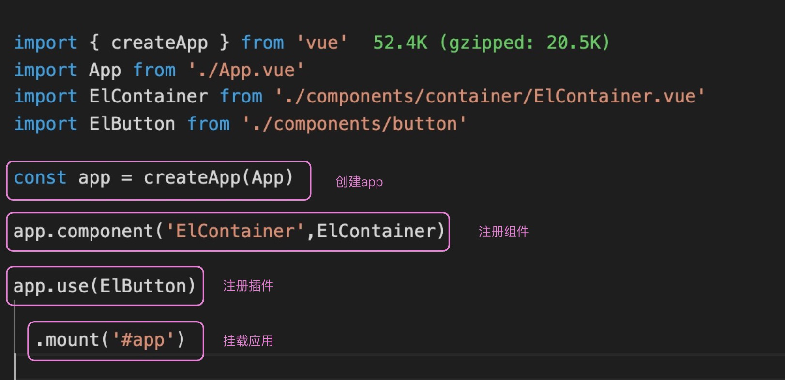

### 首次渲染 ###

想要启动一个 Vue 项目，只需要从 Vue 中引入 createApp，传入 App 组件，并且调用 createApp 返回的 App 实例的 mount 方法，就实现了项目的启动。这个时候 Vue 也完成了首次渲染



```javascript
export const createApp = ((...args) => {
  const app = ensureRenderer().createApp(...args)
  const { mount } = app
  // 重写mount
  app.mount = (containerOrSelector: Element | ShadowRoot | string): any => {
    const container = normalizeContainer(containerOrSelector)
    if (!container) return

    const component = app._component
    if (!isFunction(component) && !component.render && !component.template) {
      component.template = container.innerHTML
    }
    container.innerHTML = ''
    const proxy = mount(container, false, container instanceof SVGElement)
    if (container instanceof Element) {
      container.removeAttribute('v-cloak')
      container.setAttribute('data-v-app', '')
    }
    return proxy
  }
  return app
}) 
function normalizeContainer(container){
  if (isString(container)) {
    const res = document.querySelector(container)
  }
  return container
}
```

* 使用 ensureRenderer 返回的对象去创建 app，并且重写了 app.mount 方法
* 在 mount 方法内部，我们查找 mount 传递的 DOM 元素，并且调用 ensureRenderer 返回的 mount 方法，进行初始化渲染
* app.mount 这个函数的参数只能是 Element、ShadowRoot 或者 string 三者之一

继续深入了解 ensureRenderer 方法，以及 ensureRenderer 方法返回的 createApp 方法。

```javascript
// 浏览器dom操作
import { nodeOps } from './nodeOps'
// 浏览器dom属性更新
import { patchProp } from './patchProp'
import { createRenderer } from '@vue/runtime-core'
const rendererOptions = extend({ patchProp }, nodeOps)

let renderer: Renderer<Element | ShadowRoot> | HydrationRenderer

function ensureRenderer() {
  return (
    renderer ||
    (renderer = createRenderer<Node, Element | ShadowRoot>(rendererOptions))
  )
}  
```

* ensureRenderer 函数，**内部通过 createRenderer 函数，创建了一个浏览器的渲染器，并且缓存了渲染器 renderer**
* 传递的 rendererOptions 就是浏览器里面标签的增删改查 API：
* createRenderer 函数传递的参数是 nodeOps 和 patchProp 的合并对象。
* **通过 ensureRenderer 存储这些操作方法后，createApp 内部就可以脱离具体的渲染平台了**，这也是 Vue 3 实现跨端的核心逻辑

```javascript
export const nodeOps: Omit<RendererOptions<Node, Element>, 'patchProp'> = {
  insert: (child, parent, anchor) => {
    parent.insertBefore(child, anchor || null)
  },
  remove: child => {
    const parent = child.parentNode
    if (parent) {
      parent.removeChild(child)
    }
  },
  createElement: (tag, isSVG, is, props): Element => {
    const el = isSVG
      ? doc.createElementNS(svgNS, tag)
      : doc.createElement(tag, is ? { is } : undefined)

    if (tag === 'select' && props && props.multiple != null) {
      ;(el as HTMLSelectElement).setAttribute('multiple', props.multiple)
    }
    return el
  },

  createText: text => doc.createTextNode(text),

  createComment: text => doc.createComment(text),

  setText: (node, text) => {
    node.nodeValue = text
  },

  setElementText: (el, text) => {
    el.textContent = text
  },
  parentNode: node => node.parentNode as Element | null,
  nextSibling: node => node.nextSibling,
  querySelector: selector => doc.querySelector(selector),
... 
}
```

createRenderer 是调用 baseCreateRenderer 创建的

* 首先获取了平台上所有的 insert、remove 函数，这些函数都是 nodeOps 传递进来的
* 定义了一些列 patch、mount、unmount 函数，这就是 Vue 中更新、渲染组件的工具函数，比如 mountElement 就是渲染 DOM 元素
* mountComponent 就是渲染组件 updateComponent 就是更新组件

```javascript
export function createRenderer<
  HostNode = RendererNode,
  HostElement = RendererElement
>(options: RendererOptions<HostNode, HostElement>) {
  return baseCreateRenderer<HostNode, HostElement>(options)
}

function baseCreateRenderer(){
    const {
    insert: hostInsert,
    remove: hostRemove,
    patchProp: hostPatchProp,
    createElement: hostCreateElement,
    createText: hostCreateText,
    createComment: hostCreateComment,
    setText: hostSetText,
    setElementText: hostSetElementText,
    parentNode: hostParentNode,
    nextSibling: hostNextSibling,
    setScopeId: hostSetScopeId = NOOP,
    cloneNode: hostCloneNode,
    insertStaticContent: hostInsertStaticContent
  } = options
  const patch = ()=>... //一个函数
  const processText = ()=>...
  const processCommentNode = ()=>...
  const processElement = ()=>...
  const mountElement = ()=>...
  const mountChildren = ()=>...
  const patchElement = ()=>...
  const patchBlockChildren = ()=>...
  const patchProps = ()=>...
  const processComponent = ()=>...
  const mountComponent = ()=>...
  const updateComponent = ()=>...
  const setupRenderEffect = ()=>...
  const patchChildren = ()=>...
  const patchKeyedChildren = ()=>...
  const unmount = ()=>...
  const unmountComponent = ()=>...
  const unmountComponent = ()=>...
  const unmountComponent = ()=>...
  const unmountComponent = ()=>...
  //透传的render函数
  const render: RootRenderFunction = (vnode, container, isSVG) => {
    if (vnode == null) {
      if (container._vnode) {
        unmount(container._vnode, null, null, true)
      }
    } else {
      patch(container._vnode || null, vnode, container, null, null, null, isSVG)
    }
    flushPostFlushCbs()
    container._vnode = vnode
  }
  return {
    render,
    hydrate,
    createApp: createAppAPI(render, hydrate)
  }
}
```

* 最后返回的 createApp 方法，实际上是 **createAPI 的返回值，并且给 createAPI 传递了 render 方法**
* render 方法内部很简单，就是判断 container 容器上有没有 _vnode 属性，如果有的话就执行 unmout 方法，没有的话就执行 patch 方法，最后把 vnode 信息存储在 container._vnode 上。

那 createAppAPI 又做了什么呢？。内部创建了一个 app 对象，app 上注册了我们熟悉的 use、component 和 mount 等方法：

```javascript
export function createAppAPI<HostElement>(
  render: RootRenderFunction,
  hydrate?: RootHydrateFunction
): CreateAppFunction<HostElement> {
  return function createApp(rootComponent, rootProps = null) {
    const context = createAppContext()
    let isMounted = false

    const app: App = (context.app = {
      _context: context,
      _instance: null,
      use(plugin: Plugin, ...options: any[]) ,
      component(name: string, component?: Component): any {
        if (!component) {
          return context.components[name]
        }
        context.components[name] = component
        return app
      },
      directive(name: string, directive?: Directive)
      mount(
        rootContainer: HostElement,
        isHydrate?: boolean,
        isSVG?: boolean
      ): any {
        if (!isMounted) {
          const vnode = createVNode(
            rootComponent as ConcreteComponent,
            rootProps
          )
          vnode.appContext = context
          // 核心的逻辑
          if (isHydrate && hydrate) {
            hydrate(vnode as VNode<Node, Element>, rootContainer as any)
          } else {
            render(vnode, rootContainer, isSVG)
          }
          return getExposeProxy(vnode.component!) || vnode.component!.proxy
        } 
      },

      provide(key, value) {
        context.provides[key as string] = value
        return app
      }
    })

    return app
  }
}
```

* mount 内部执行的是传递进来的 render 方法，也就是上面的 render 方法
* container 就是我们 app.mount 中传递的 DOM 元素
* 对 DOM 元素进行处理之后，执行 patch 函数实现整个应用的加载。

### patch 函数 ###

* 执行render函数会触发在baseCreateRenderer 中定义的透传过来的render函数，内部会执行 patch函数
* patch 传递的是 container._vnode，也就是上一次渲染缓存的 vnode、本次渲染组件的 vnode，以及容器 container。
* 首先可以把 n1 和 n2 做一次判断，如果虚拟 DOM 的节点类型不同，就直接 unmount 之前的节点。因为比如之前是 Button 组件，现在要渲染 Container 组件，就没有计算 diff 的必要，直接把 Button 组件销毁再渲染 Container 即可
* 如果 n1 和 n2 类型相同，比如都是 Button 组件或者都是 div 标签，我们需要判断具体的类型再去执行不同的函数，比如 processText、processFragment、processElement 以及 processComponent 等函数

```javascript
  const patch: PatchFn = (
    n1,
    n2,
    container,
    anchor = null,
    parentComponent = null,
    parentSuspense = null,
    isSVG = false,
    slotScopeIds = null,
    optimized = __DEV__ && isHmrUpdating ? false : !!n2.dynamicChildren
  ) => {
    // 两次虚拟dom完全一样 啥也不用干
    if (n1 === n2) {
      return
    }
    // 虚拟dom节点类型不一样， unmount老的虚拟dom，并且n1赋值null
    if (n1 && !isSameVNodeType(n1, n2)) {
      anchor = getNextHostNode(n1)
      unmount(n1, parentComponent, parentSuspense, true)
      n1 = null
    }
    // n2是要渲染的虚拟dom，我们获取type，ref和shapeFlag
    const { type, ref, shapeFlag } = n2
    switch (type) {
      case Text:
        // 文本
        processText(n1, n2, container, anchor)
        break
      case Comment:
        // 注释
        processCommentNode(n1, n2, container, anchor)
        break
      case Static:
        // 静态节点
        if (n1 == null) {
          mountStaticNode(n2, container, anchor, isSVG)
        } else if (__DEV__) {
          patchStaticNode(n1, n2, container, isSVG)
        }
        break
      case Fragment:
        processFragment(
          n1,
          n2,
          container,
          anchor,
          parentComponent,
          parentSuspense,
          isSVG,
          slotScopeIds,
          optimized
        )
        break
      default:
        // 运运算判断操作类型
        if (shapeFlag & ShapeFlags.ELEMENT) {
          // html标签
          processElement(
            n1,
            n2,
            container,
            anchor,
            parentComponent,
            parentSuspense,
            isSVG,
            slotScopeIds,
            optimized
          )
        } else if (shapeFlag & ShapeFlags.COMPONENT) {
          // 组件
          processComponent(
            n1,
            n2,
            container,
            anchor,
            parentComponent,
            parentSuspense,
            isSVG,
            slotScopeIds,
            optimized
          )
        } else if (shapeFlag & ShapeFlags.TELEPORT) {
          ;(type as typeof TeleportImpl).process(
            n1 as TeleportVNode,
            n2 as TeleportVNode,
            container,
            anchor,
            parentComponent,
            parentSuspense,
            isSVG,
            slotScopeIds,
            optimized,
            internals
          )
        } else if (__FEATURE_SUSPENSE__ && shapeFlag & ShapeFlags.SUSPENSE) {
          ;(type as typeof SuspenseImpl).process(
            n1,
            n2,
            container,
            anchor,
            parentComponent,
            parentSuspense,
            isSVG,
            slotScopeIds,
            optimized,
            internals
          )
        } else if (__DEV__) {
          warn('Invalid VNode type:', type, `(${typeof type})`)
        }
    }

    // set ref
    if (ref != null && parentComponent) {
      setRef(ref, n1 && n1.ref, parentSuspense, n2 || n1, !n2)
    }
  }
```

我们首次渲染的 App 是一个组件，所以要执行的就是 processComponent 方法。

进入到 processComponent 代码内部，看下面的代码。首次渲染的时候，n1 就是 null，所以会执行 mountComponent；如果是更新组件的时候，n1 就是上次渲染的 vdom，需要执行 updateComponent。

```javascript
  const processComponent = (
    n1: VNode | null,
    n2: VNode,
    container: RendererElement,
    anchor: RendererNode | null,
    parentComponent: ComponentInternalInstance | null,
    parentSuspense: SuspenseBoundary | null,
    isSVG: boolean,
    slotScopeIds: string[] | null,
    optimized: boolean
  ) => {
    n2.slotScopeIds = slotScopeIds
    if (n1 == null) {
      if (n2.shapeFlag & ShapeFlags.COMPONENT_KEPT_ALIVE) {
        ;(parentComponent!.ctx as KeepAliveContext).activate(
          n2,
          container,
          anchor,
          isSVG,
          optimized
        )
      } else {
        mountComponent(
          n2,
          container,
          anchor,
          parentComponent,
          parentSuspense,
          isSVG,
          optimized
        )
      }
    } else {
      updateComponent(n1, n2, optimized)
    }
  }
```

updateComponent 是虚拟 DOM 的逻辑

进入 mountComponent 函数中，可以看到 mountComponent 函数内部会对组件的类型进行一系列的判断，还有一些对 Vue 2 的兼容代码，核心的渲染逻辑就是 setupComponent 函数和 setupRenderEffect 函数。

```javascript
 //挂载组件
  function mountComponent(vnode, container) {
    // 创建组件实例，其实就是个对象，包含组件的各种属性
    const instance = vnode.component = {
      vnode,
      type:vnode.type,
      props:vnode.props,
      setupState:{}, //响应式状态
      slots:{},
      ctx:{},
      emit:()=>{}
    }
    // 启动setup函数中的各种响应式数据
    setupComponent(instance)

    setupRenderEffect(instance, container)
  }
```

##### setupComponent #####

要完成的就是执行我们写的 setup 函数。

* 内部先初始化了 props 和 slots，并且执行 setupStatefulComponent 创建组件，而这个函数内部从 component 中获取 setup 属性
* 也就是 script setup 内部实现的函数

```javascript
 //组件预渲染
  function setupComponent(instance) {
    const { props, children } = instance.vnode
    // 其实还需要处理slot，根据flags 这里忽略一下下@todo
    // initSlots(instance, children) 
    // 只考虑了composition语法的setup函数
    const component = instance.type
    // script setup写的函数都在setup内部
    const { setup } = component
    // 设置正在处理的componeng实例 
    setCurrentInstance(instance)

    // 不用script setup，setup中的参数就是来源这里
    // export default {
    //   setup(props,{attr,slots,emit})
    // }
    // 所以setup函数内部就可以通过getCurrrntInstance获取当前组件的实例
    const setupContext = {
      attrs:instance.attrs,
      slots:instance.slots,
      emit:instance.emit // @todo 还没实现emit
    }
    const setupResult = setup ? setup(instance.props, setupContext) :null
    setCurrentInstance(null)
    instance.ctx = {
      ...instance.props,
      ...instance.setupState,
    }
    // setup函数返回的数据，需要传递给template使用
    // 如果返回的是函数，就是render函数处理，不需要template了
    if (typeof setupResult === "function") {
      instance.render = setupResult
    }else{
      instance.setupState = setupResult
    }
    // 如果没有render并且又template，需要把template处理成render函数
    // render函数的目的就是返回虚拟dom，compiler就是compiler模块需要实现的
    if (!component.render && component.template) {
      let { template } = component
      if (template[0] === '#') {
        const el = document.querySelector(template)
        template = el ? el.innerHTML : ''
      }
      component.render = new Function('ctx', compile(template))
    }
    
   }
```

#### setupRenderEffect ####

setupRenderEffect 函数，就是为了后续数据修改注册的函数

**组件首次加载会调用 patch 函数去初始化子组件**，注意 setupRenderEffect 本身就是在 patch 函数内部执行的，所以这里就会递归整个虚拟 DOM 树，然后触发生命周期 mounted，完成这个组件的初始化。

页面首次更新结束后，setupRenderEffect 不仅实现了组件的递归渲染，还注册了组件的更新机制。

```javascript
 function setupRenderEffect(instance,container) { 
    const {vnode} = instance
    const { type: Component } = vnode;

   ///effect函数就是注册func，然后触发对象的get方法并将func放入依赖地图中
    instance.update = effect(componentEffect, {
      scheduler: () => {
        queueJob(instance.update)
      },
    })

   //触发依赖地图更新
    function componentEffect(){
      //加载了 
      if(instance.isMounted){
        const {vnode,next} = instance
        if (next) {
          next.el = vnode.el
          // 更新组件的props和slots等
          instance.props = next.props
          instance.slots = next.slots        
        }
        const nextTree = (instance.subTree = instance.render(instance.ctx))
        patch(instance.subTree, nextTree, container)
      }else{
        // 还没挂载
        const subTree = (instance.subTree = Component.render(instance.ctx) )
        patch(null, subTree, container)
        instance.isMounted = true
      }
    }
  }

```


