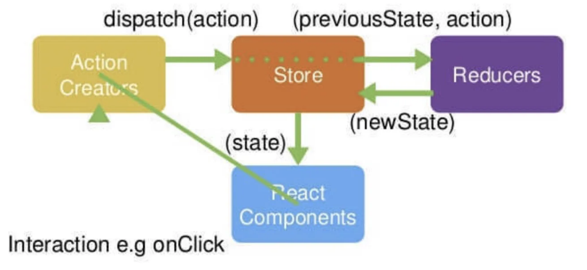

### Reducer

reducer 就是⼀个纯函数，接收旧的 state 和 action，返回新的 state。

```
(previousState, action) => newState
```

永远不要在 reducer ⾥做这些操作:

* 修改传⼊参数
* 执⾏有副作⽤的操作，如 API 请求和路由跳转；
* 调⽤⾮纯函数，如 Date.now() 或 Math.random() 。

什么是 reduce

```js
const array1 = [1, 2, 3, 4];
const reducer = (accumulator, currentValue) => accumulator + currentValue;
// 1 + 2 + 3 + 4
console.log(array1.reduce(reducer));
// expected output: 10
// 5 + 1 + 2 + 3 + 4
console.log(array1.reduce
```

安装redux

```she
yarn add redux
```



```js
import {createStore} from "redux";
function countReducer(state = 0, action) {
		switch (action.type) {
			case "ADD":
				return state + 1;
			case "MINUS":
				return state - 1;
			default:
				return state;
	}
}
const store = createStore(countReducer);
export default store;
```

创建 ReduxPage

```js
import React, {Component} from "react";
import store from "../store/";
export default class ReduxPage extends Component {
	componentDidMount() {
			store.subscribe(() => {
				this.forceUpdate();
			});
	}
	add = () => {
		store.dispatch({type: "ADD"});
	};
	minus = () => {
		store.dispatch({type: "MINUS"});
	};
	render() {
			console.log("store", store); //sy-log
    	return (
					<div>
					<h3>ReduxPage</h3>
					<p>{store.getState()}</p>
					<button onClick={this.add}>add</button>
					<button onClick={this.minus}>minus</button>
						</div>
					);
		}
}
```

### 实现基本的Redux

MyRedux.js

```js
export default function createStore(reducer, enhancer) {
	if (enhancer) {// 比如enhancer是中间件
		return enhancer(createStore)(reducer);  //把createStore传给中间件返回的函数执行
  }
	let currentState;
	let currentListeners = [];
	function getState() {
		return currentState;
	}
  
	function dispatch(action) {
		currentState = reducer(currentState, action);
		currentListeners.forEach(listener => listener());
		return action;
	}
	function subscribe(listener) {
		currentListeners.push(listener);
		return () => {
			const index = currentListeners.indexOf(listener);
			currentListeners.splice(index, 1);
		};
	}
	dispatch({type: "KKBREDUX/OOOO"});
	return {
		getState,
		dispatch,
		subscribe
	};
}
```

* 外层调用dispatch之后会 执行在createStore中传入的reducer处理函数
* 自定义reducer函数处理完成之后会返回新的state
* 通知所有listeners 监听的state有变化

### 实现常用的Redux中间件

##### compose

思考：有如下函数，聚合成⼀个函数，并把第⼀个函数的返回值传递给下⼀个函数，如何处理

```js
function f1(arg) {
	console.log("f1", arg);
	return arg;
}
function f2(arg) {
	console.log("f2", arg);
	return arg;
}
function f3(arg) {
	console.log("f3", arg);
	return arg;
}

```

```js
function compose(...funcs) {
		if (funcs.length === 0) {
			return arg => arg
		}
		if (funcs.length === 1) {
			return funcs[0]
		}
		return funcs.reduce((a, b) =>  (...args) => a(b(...args)) )
}
console.log(compose(f1, f2, f3)("omg"));
```

* compose中传入多个func,所有参数类型是个不定长的funcs数组
* 由于前⼀个函数的返回值是下⼀个函数的参数，所以可以通过reduce高阶函数来处理
* a , b 参数即为前一个func和当前遍历的func，此时reduce处理后的返回结果为一个以args为参数的函数，这个函数的逻辑就是a执行b执行后的结果，这个结果就是刚才说的一个带args参数的函数

#### 中间件实现

applyMiddleware

```js
export default function applyMiddleware(...middlewares) {
		return createStore => reducer => {
				const store = createStore(reducer);
				let dispatch = store.dispatch;
				const midApi = {
						getState: store.getState,
						dispatch: (action, ...args) => dispatch(action, ...args)
				};
			 const middlewareChain = middlewares.map(middleware => middleware(midApi));
			 dispatch = compose(...middlewareChain)(store.dispatch);
			 return {
					...store,
					// 加强版的dispatch
					dispatch
			 };
	  };

}

function compose(...funcs) {
		if (funcs.length === 0) {
			return arg => arg;
		}
  	if (funcs.length === 1) {
			return funcs[0];
		}
		return funcs.reduce((a, b) => (...args) => a(b(...args)));
}
```

* 因为以```enhancer(createStore)(reducer); ```的逻辑来看，applyMiddleware函数得是一个接收createStore为参数且返回一个以reducer为参数的函数

* 基于上述结论，则applyMiddleware应该返回形如这种的结果： 

  ```js
  ``return function(createStore) { 
    		return function(reducer) { 
          .....
        } 
  	}``
  //柯里化后的写法
  return createStore => reducer => { ...  }
  ```

* 初始化袁术store逻辑，封装一个midApi对象，包含getState和dispatch属性，dispatch为原始dispatch
* 通过map遍历middlewares，并执行每一个middleware且传入midApi对象，map之后的类型就是每一个中间件执行之后返回的类型
* 中间件返回的类型为``next => action=>{} ``的函数类型
* compose 基于上述类型的 middlewareChain列表，相当于遍历middlewareChain 用reduce高阶函数处理，这样相当于执行``next => action=>{} 的函数并将执行结果（结果就是带action参数的函数）给下一个middlewareChain的元素执行
* 当compose执行完成后，就会通过``compose(...middlewareChain)(store.dispatch);``触发compose执行后返回的函数执行，而经过compose函数处理后结果就形如 ```next => action=>{ .... next(action)} ``` 的函数执行返回带action参数的函数作为增加后的dispatch，当外层执行dispatch(action)之后，这样compose之前每一个middlewareChain元素的中间件函数逻辑就会像链式调用一样被执行到
* ``compose(...middlewareChain)(store.dispatch)`` 传入的store.dispatch就是第一个next

#### redux-logger 实现

```js
function logger({getState}) {
		return next => action => {
			console.log("====================================");
			console.log(action.type + "执行了！"); //sy-log
			const prevState = getState();
			console.log("prev state", prevState); //sy-log
			const returnValue = next(action);
			const nextState = getState();
			console.log("next state", nextState); //sy-log
			console.log("====================================");
			return returnValue;
	};
}
```


