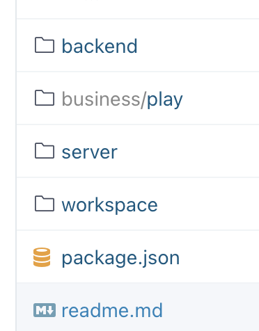

目录结构



* backend 后端服务内容
* business 业务配置中心，模拟云函数架构存储函数内容的地方
* server 服务端运行逻辑
* workspace 模拟开发者工作空间

```javascript
module.exports = {
    column: {
        protocol: 'geek-rpc',

        ip: '127.0.0.1',

        port: 4000,

        protobufFile: __webpack_require__(/*! ./src/proto/detail.proto */ "./src/proto/detail.proto"),

        requestStruct: 'ColumnRequest',
        responseStruct: 'ColumnResponse',

        then(res) {
            return res.column;
        }
    },
    articleList: {
        protocol: 'http',

        url: 'http://127.0.0.1:4003',

        before: function (data) {
            return data;
        },

        then: function (res) {
            return JSON.parse(res).data.list;
        },

        catch: function () {

        }
    }
}
```

request-factory.js

```javascript
function factory(config) {
    if (!requestors[config.protocol] && !requestors['default']) {
        throw new Error(`暂不支持的协议: ${config.protocol}`);
    }
    config.before = config.before || (d => d);
    config.then = config.then || (d => d);
    config.catch = config.catch || (d => d);

    //根据http或者rpc协议名找到对应的 协议对象，调用compile函数
    requestors[config.protocol].compile(config);

    return async function (data) {

        try {
            data = config.before(data);

        } catch (e) {
            // 如果beforeHook抛出了错误，则交给catch处理。开发者可以在before抛出的error上挂属性来让catch做一些分辨逻辑。
            config.catch(e);
            // 如果catch没抛出其他错误，则认为此次请求是平安取消的
            return Promise.resolve(null)
        }

        return {

            result: await requestors[config.protocol]
                .request(data)

                // 如果config.then里抛出了错误
                .then(config.then)
                
                // 如果config.catch返回了null，那这整个请求过程其实是不算失败的
                .catch(config.catch)
        }
    }
}
const requestors = {}

/**
 * @param protocol 数据源协议名字
 * @param requestor{function} 请求流程定义
 */
factory.registerProtocol = function (protocol, requestor) {
    requestors[protocol] = requestor;
}

module.exports = factory;
```

geek-rpc.js

```javascript
const EasySock = require('easy_sock');
const protobuf = require('protocol-buffers')
const fs = require('fs');

let schemas = null;
let easySock = null;

module.exports = {

    compile: function (config) {
        schemas = protobuf(
            config.protobufFile
        );

        easySock = new EasySock({
            ip: config.ip,
            port: config.port,
            timeout: 500,
            keepAlive: true
        })

        easySock.encode = function (data, seq) {
            //比如config.requestStruct =  "ColumnRequest"
            const body = schemas[config.requestStruct].encode(data);

            const head = Buffer.alloc(8);
            head.writeInt32BE(seq);
            head.writeInt32BE(body.length, 4);

            return Buffer.concat([head, body])
        }
        easySock.decode = function (buffer) {
            const seq = buffer.readInt32BE();
            const body = schemas[config.responseStruct].decode(buffer.slice(8));

            return {
                result: body,
                seq
            }
        }
        easySock.isReceiveComplete = function (buffer) {
            if (buffer.length < 8) {
                return 0
            }
            const bodyLength = buffer.readInt32BE(4);

            if (buffer.length >= bodyLength + 8) {
                return bodyLength + 8

            } else {
                return 0
            }
        }
    },

    request: async function (data) {
        return await new Promise((resolve, reject) => {
            easySock.write(data, function (err, data) {
                err ? reject(err) : resolve(data)
            })
        })
    }
}
```

run.js

* 通过routePath 拿到对应的data.js
* 遍历dataConfig,通过requestFactory生成对应协议的请求对象
* 将请求对象缓存到ret里，key是data里的key
* 当对应的route的请求进入koa时，通过遍历缓存的请求对象获取数据

```javascript
const mount = require('koa-mount')
const requestFactory = require('./request-factory')
const createTemplate = require('./create-template');

requestFactory.registerProtocol('geek-rpc',
    require('./requestors/geek-rpc')
);
requestFactory.registerProtocol('http',
    require('./requestors/http')
);

module.exports = function (app) {
    const koa = new (require('koa'))

    koa.use(async (ctx, next) => {
        if (ctx.url == '/favicon.ico') {
            return;
        }
        await next();
    })

    Object.keys(app).forEach(routepath => {
				//通过routePath 拿到对应的data.js
        const dataConfig = eval(app[routepath].data);
        //遍历dataConfig,通过requestFactory生成对应协议的请求对象
        const requests = Object.keys(dataConfig)
            .reduce((ret, key) => {
              	//将请求对象缓存到ret里，key是data里的key
                //requestFactory会根据data里的配置进行complie 和返回包含request逻辑的请求对象
                ret[key] = requestFactory(dataConfig[key]);
                return ret;
            }, {});
        const template = createTemplate(app[routepath].template);

        koa.use(
            mount(routepath, async (ctx) => {
                ctx.status = 200;
                const result = {};
              //当对应的route的请求进入koa时，通过遍历缓存的请求对象获取数据
                await Promise.all(
                    Object.keys(requests).map(key => {
                        return requests[key](ctx.query)
                            .then(res => {
                                result[key] = res.result;
                                return res.result;
                            })
                    })
                )

                try {
                    ctx.body = template(result);
                } catch(e) {
                    ctx.status = 500;
                    ctx.body = e.stack;
                }
            })
        );
    });

    koa.listen(3000);
}
```

