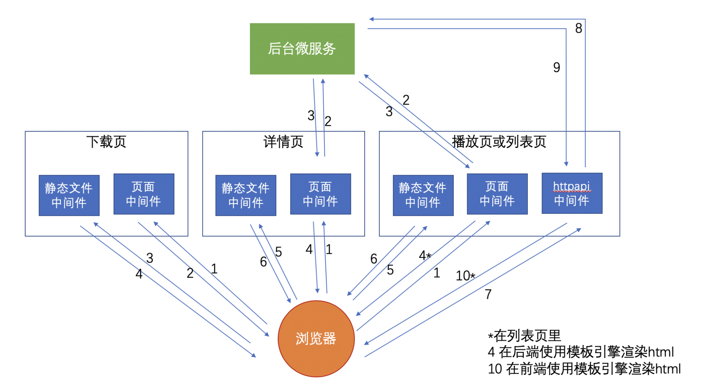

### 整站需求分析 ###



#### 课程详情页的需求解构 ####

* 使用 RPC 通信从后台服务器获取数据
* 模板渲染
  * include 子模板
  * xss 过滤、模板 helper 函数


#### GraphQL ####

Facebook 开发的实现 API 服务的库

让前端有“自定义查询”数据的能力


#### 课程列表页的需求解构 ####

前后端同构

* 同一个模板/组件，可在浏览器渲染，也可在 Node.js 渲染。


* ReactDomServer.renderToString()
* VueServerRenderer.renderToString()

React/Vue 同构的最大难题其实是数据部分

#### node 服务入口 index.js ####

```js
const app = new (require('koa'));
const mount = require('koa-mount');
const serveStatic = require('koa-static'); //koa static 
const getData = require('./get-data') //get mock data
const ReactDOMServer = require('react-dom/server');//react server dom
const App = require('./app.jsx') // react App组件
const template = require('./template')(__dirname + '/index.htm') //模版引擎

//把source 目录下的资源挂载到static路径下
app.use(mount('/static', serveStatic(__dirname + '/source')))

//get data api
app.use(mount('/data', async (ctx) => {
    ctx.body = await getData(+(ctx.query.sort || 0), +(ctx.query.filt || 0));
}));


app.use(async (ctx) => {
    ctx.status = 200;
  	//get filtType from query
    const filtType = +(ctx.query.filt || 0)
    //get sortType from query
    const sortType = +(ctx.query.sort || 0);
  	//get mock data
    const reactData = await getData(sortType, filtType);
    
  	//react 服务端渲染把App 组件渲染成renderString,并附在模版引擎定义的reactString上
    ctx.body = template({
        reactString: ReactDOMServer.renderToString(
            App(reactData)
        ),
        reactData,
        filtType,
        sortType
    })
})

app.listen(3000)
```

#### get Data 逻辑 ####

通过rpc 从后台获取数据

```js
const listClient = require('./list-client');

module.exports = async function (sortType = 0, filtType = 0) {
    
    // 使用微服务拉取数据
    const data = await new Promise((resolve, reject) => {
        listClient.write({
            sortType,
            filtType

        }, function (err, res) {
            err ? reject(err) : resolve(res.columns);
        })
    });

    return data
}
```

**list-client.js**  从微服务请求数据

```js
const EasySock = require('easy_sock');

const protobuf = require('protocol-buffers')
const fs = require('fs');
//列表的proto结构文件
const schemas = protobuf(fs.readFileSync(`${__dirname}/list.proto`));

const easySock = new EasySock({ 
    ip: '127.0.0.1',
    port: 4003,
    timeout: 500,
    keepAlive: true
})

easySock.encode = function(data, seq) {
   	//请求数据 encode 成 proto定义的request
    const body = schemas.ListRequest.encode(data);

    const head = Buffer.alloc(8);
  	//head 头4个字节为seq请求序号
    head.writeInt32BE(seq);
    //head 后4个字节为body长度
    head.writeInt32BE(body.length, 4);

    return Buffer.concat([head, body])
}
easySock.decode = function(buffer) {
    //返回的数据seq 从head开始读前4个为seq
    const seq = buffer.readInt32BE();
    //head 后面的body decode出数据(根据proto定义的ListResponse)
    const body = schemas.ListResponse.decode(buffer.slice(8));
    
    return {
        result: body,
        seq
    }
}
easySock.isReceiveComplete = function(buffer) {
    if (buffer.length < 8) { //如果都不足一个head的长度说明没接收完
        return 0
    }
    const bodyLength = buffer.readInt32BE(4);

    if (buffer.length >= bodyLength + 8) {
        return bodyLength + 8
        
    } else {
        return 0
    }
}

module.exports = easySock;
```

#### component 共用react 组件

```react
const React = require('react');
const ColumnItem = require('./column_item.jsx')

module.exports = class Container extends React.Component {

    render() {
        return (
            <div className="_2lx4a-CP_0">
                <div className="_3KjZQbwk_0">
                    <div className="kcMABq6U_0">
                        <span>课程：</span>
                        <a className="_2TWCBjxa_0" onClick={this.props.filt.bind(this, 0)}>全部</a>
                        <a className="_2TWCBjxa_0" onClick={this.props.filt.bind(this, 1)}>专栏</a>
                        <a className="_2TWCBjxa_0" onClick={this.props.filt.bind(this, 2)}>视频课程</a>
                        <a className="_2TWCBjxa_0" onClick={this.props.filt.bind(this, 3)}>微课</a>
                    </div>
                </div>
                <div className="_3hVBef3W_0">
                    <div className="_3S9KmBtG_0">
                        <div className="_1o6EOwiF_0">
                            <div className="_3HUryTHs_0">
                                <a className="_1kRLIDSR_0" onClick={this.props.sort.bind(this, 1)}>上新</a>
                                <a className="_1kRLIDSR_0" onClick={this.props.sort.bind(this, 2)}>订阅数</a>
                                <a className="_1kRLIDSR_0" onClick={this.props.sort.bind(this, 3)}>价格

                                </a>
                            </div>
                            <span className="JfgzzksA_0">{this.props.columns.length}个课程</span>
                        </div>
                        <div>
                            {this.props.columns.map(column => {
                                return (
                                    <ColumnItem column={column} key={column.id} />
                                )
                            })}
                        </div>
                        <div className="OjL5wNoM_0"><span>— 没有更多了 —</span></div>
                    </div>
                </div>
            </div>

        )
    }
}
```

#### 浏览器端 ####

index.jsx

```react
const Container = require('../component/container.jsx');
const React = require('react');
const ReactDOM = require('react-dom');

class App extends React.Component {

    constructor() {
        super();
        this.state = {
            //首次服务端渲染完成后， 缓存到reactInitData变量中
            columns: reactInitData,
            filtType: reactInitFiltType,
            sortType: reactInitSortType
        }
    }

    render() {
        return (
            <Container
                columns={this.state.columns}
                filt={(filtType) => {
                    fetch(`./data?sort=${this.state.sortType}&filt=${filtType}`)
                        .then(res => res.json())
                        .then(json => {
                            this.setState({
                                columns: json,
                                filtType: filtType
                            })
                        })
                }}
                sort={(sortType) => {
                    fetch(`./data?sort=${sortType}&filt=${this.state.filtType}`)
                        .then(res => res.json())
                        .then(json => {
                            this.setState({
                                columns: json,
                                sortType: sortType
                            })
                        })
                }}
            />
        )
    }
}
ReactDOM.render(
    <App />,
    //在htm中找到id为reactapp的 进行渲染
    document.getElementById('reactapp')
)
```

Webpack.config.js

```js
module.exports = {
    mode: 'development',
    devtool: false,
    entry: __dirname + '/index.jsx',
    output: {
        filename: 'main.js',
        path: __dirname + '/../node/source/'
    },
    module: {
        rules: [
            {
                test: /\.jsx$/, use: {
                    loader: 'babel-loader',
                    options: {
                        presets: ['@babel/preset-react']
                    }
                }
            }
        ]
    }
}
```

#### backend(rpc 数据服务) ####

rpc-server.js

```js
const net = require("net");

module.exports = class RPC {
    constructor({ encodeResponse, decodeRequest, isCompleteRequest }) {
        this.encodeResponse = encodeResponse;
        this.decodeRequest = decodeRequest;
        this.isCompleteRequest = isCompleteRequest;
    }

    createServer(callback) {
        let buffer = null;

        const tcpServer = net.createServer((socket) => {

            socket.on('data', (data) => {
                buffer = (buffer && buffer.length > 0) ?
                    Buffer.concat([buffer, data]) : // 有遗留数据才做拼接操作
                    data;

                let checkLength = null;
                while (buffer && (checkLength = this.isCompleteRequest(buffer))) {
                    let requestBuffer = null;
                    if (checkLength == buffer.length) {
                        requestBuffer = buffer;
                        buffer = null;

                    } else {
                        requestBuffer = buffer.slice(0, checkLength);
                        buffer = buffer.slice(checkLength);
                    }
										//外层自定义的decode函数解析请求request
                    const request = this.decodeRequest(requestBuffer);
                    callback(
                        { // request
                            body: request.result,
                            socket
                        },
                        { // response
                            end: (data) => {
                                const buffer = this.encodeResponse(data, request.seq)
                                socket.write(buffer);
                            }
                        }
                    );
                }
            })
        });

        return {
            listen() {
                tcpServer.listen.apply(tcpServer, arguments)
            }
        }
    }
}
```

##### **geeknode-rpc-server.js** #####

```js
const RPC = require('./rpc-server');

/**
 * 因为所有服务用的包头格式都一样，不一样的只有protobuf协议，所以这里可以将这段逻辑封成一个模块
 * 通过传入不同的protobuf协议模版  以便自定义的encode和decode函数可以根据传入的schema来encode和decode
 * 
 */
module.exports = function (protobufRequestSchema, protobufResponseSchema) {
    return new RPC({
        // 解码请求包
        decodeRequest(buffer) {
            const seq = buffer.readUInt32BE();

            return {
                seq: seq,
                result: protobufRequestSchema.decode(buffer.slice(8))
            }
        },
        // 判断请求包是不是接收完成
        isCompleteRequest(buffer) {
            const bodyLength = buffer.readUInt32BE(4);

            return 8 + bodyLength
        },
        // 编码返回包
        encodeResponse(data, seq) {
            const body = protobufResponseSchema.encode(data);

            const head = Buffer.alloc(8);
            head.writeUInt32BE(seq);
            head.writeUInt32BE(body.length, 4);

            return Buffer.concat([head, body]);
        }
    })
}
```

#### server.js ####

```js
const fs = require('fs')
const protobuf = require('protocol-buffers');
const schemas = protobuf(
    fs.readFileSync(`${__dirname}/list.proto`)
);

// 假数据
const columnData = require('./mockdata/column')

/**
 * 服务端的编解包逻辑
 */
const server = require('./lib/geeknode-rpc-server')(schemas.ListRequest, schemas.ListResponse);

server
    .createServer((request, response) => {
        const { sortType, filtType } = request.body;

        // 直接返回假数据
        response.end({
            columns: columnData
                .sort((a, b) => {
                    if (sortType == 1) {
                        return a.id - b.id

                    } else if (sortType == 2) {
                        return a.sub_count - b.sub_count

                    } else if (sortType == 3) {
                        return a.column_price - b.column_price

                    }

                })
                .filter((item) => {
                    if (filtType == 0) {
                        return item

                    } else {
                        return item.type == filtType
                    }
                })
        });
    })
    .listen(4003, () => {
        console.log('rpc server listened: 4003')
    });
```

目录结构：


