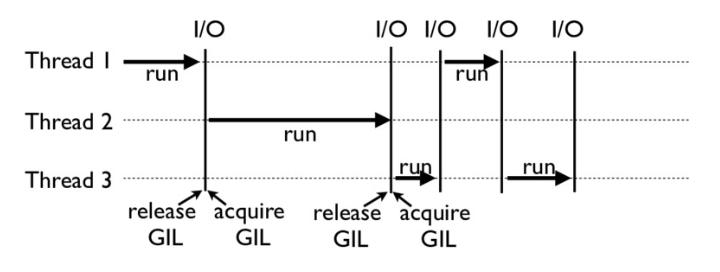

### '==' VS 'is' ###

'=='操作符比较对象之间的值是否相等，'is'操作符比较的是对象的身份标识是否相等，即它们是否是同一个对象，是否指向同一个内存地址

```
出于对性能优化的考虑，Python 内部会对 -5 到 256 的整型维持一个数组，起到一个缓存的作用。这样，每次你试图创建一个 -5 到 256 范围内的整型数字时，Python 都会从这个数组中返回相对应的引用，而不是重新开辟一块新的内存空间
```

执行a == b相当于是去执行``a.__eq__(b)``，而 Python 大部分的数据类型都会去重载__eq__这个函数，其内部的处理通常会复杂一些。比如，对于列表，``__eq__``函数会去遍历列表中的元素，比较它们的顺序和值是否相等。

### 浅拷贝和深度拷贝 ###

浅拷贝，是指重新分配一块内存，创建一个新的对象，里面的元素是原对象中子对象的引用。因此，如果原对象中的元素不可变，那倒无所谓；但如果元素可变，浅拷贝通常会带来一些副作用

所谓深度拷贝，是指重新分配一块内存，创建一个新的对象，并且将原对象中的元素，以递归的方式，通过创建新的子对象拷贝到新对象中。因此，新对象和原对象没有任何关联。

```python
import copy
l1 = [[1, 2], (30, 40)]
l2 = copy.deepcopy(l1)
l1.append(100)
l1[0].append(3)

l1
[[1, 2, 3], (30, 40), 100]

l2 
[[1, 2], (30, 40)]
```

### python协程 ###

这是一个很简单的爬虫，main() 函数执行时，调取 crawl_page() 函数进行网络通信，经过若干秒等待后收到结果，然后执行下一个。

```python
import asyncio

async def crawl_page(url):
    print('crawling {}'.format(url))
    sleep_time = int(url.split('_')[-1])
    await asyncio.sleep(sleep_time)
    print('OK {}'.format(url))

async def main(urls):
    tasks = [asyncio.create_task(crawl_page(url)) for url in urls]
    for task in tasks:
        await task

%time asyncio.run(main(['url_1', 'url_2', 'url_3', 'url_4']))

########## 输出 ##########

crawling url_1
crawling url_2
crawling url_3
crawling url_4
OK url_1
OK url_2
OK url_3
OK url_4
Wall time: 3.99 s
```

* async 修饰词声明异步函数，于是，这里的 crawl_page 和 main 都变成了异步函数。而调用异步函数，我们便可得到一个协程对象（coroutine object）。
* await 执行的效果，和 Python 正常执行是一样的，也就是说程序会阻塞在这里，进入被调用的协程函数，执行完毕返回后再继续
* 需要 asyncio.run 来触发运行。asyncio.run 这个函数是 Python 3.7 之后才有的特性
* 有了协程对象后，便可以通过 asyncio.create_task 来创建任务。任务创建后很快就会被调度执行


### 解密协程运行时 ###

```python
import asyncio

async def worker_1():
    print('worker_1 start')
    await asyncio.sleep(1)
    print('worker_1 done')

async def worker_2():
    print('worker_2 start')
    await asyncio.sleep(2)
    print('worker_2 done')

async def main():
    task1 = asyncio.create_task(worker_1())
    task2 = asyncio.create_task(worker_2())
    print('before await')
    await task1
    print('awaited worker_1')
    await task2
    print('awaited worker_2')

%time asyncio.run(main())

########## 输出 ##########

before await
worker_1 start
worker_2 start
worker_1 done
awaited worker_1
worker_2 done
awaited worker_2
Wall time: 2.01 s
```

* asyncio.run(main())，程序进入 main() 函数，事件循环开启；
* task1 和 task2 任务被创建，并进入事件循环等待运行；运行到 print，输出 'before await'；
* await task1 执行，用户选择从当前的主任务中切出，事件调度器开始调度 worker_1；
* worker_1 开始运行，运行 print 输出'worker_1 start'，然后运行到 await asyncio.sleep(1)， 从当前任务切出，事件调度器开始调度 worker_2；
* worker_2 开始运行，运行 print 输出 'worker_2 start'，然后运行 await asyncio.sleep(2) 从当前任务切出；
* 以上所有事件的运行时间，都应该在 1ms 到 10ms 之间，甚至可能更短，事件调度器从这个时候开始暂停调度
* 一秒钟后，worker_1 的 sleep 完成，事件调度器将控制权重新传给 task_1，输出 'worker_1 done'，task_1 完成任务，从事件循环中退出；
* await task1 完成，事件调度器将控制器传给主任务，输出 'awaited worker_1'，·然后在 await task2 处继续等待；
* 两秒钟后，worker_2 的 sleep 完成，事件调度器将控制权重新传给 task_2，输出 'worker_2 done'，task_2 完成任务，从事件循环中退出；
* 主任务输出 'awaited worker_2'，协程全任务结束，事件循环结束。

#### 协程爬取豆瓣 ####

```python
import asyncio
import aiohttp

from bs4 import BeautifulSoup

async def fetch_content(url):
    async with aiohttp.ClientSession(
        headers=header, connector=aiohttp.TCPConnector(ssl=False)
    ) as session:
        async with session.get(url) as response:
            return await response.text()

async def main():
    url = "https://movie.douban.com/cinema/later/beijing/"
    init_page = await fetch_content(url)
    init_soup = BeautifulSoup(init_page, 'lxml')

    movie_names, urls_to_fetch, movie_dates = [], [], []

    all_movies = init_soup.find('div', id="showing-soon")
    for each_movie in all_movies.find_all('div', class_="item"):
        all_a_tag = each_movie.find_all('a')
        all_li_tag = each_movie.find_all('li')

        movie_names.append(all_a_tag[1].text)
        urls_to_fetch.append(all_a_tag[1]['href'])
        movie_dates.append(all_li_tag[0].text)

    tasks = [fetch_content(url) for url in urls_to_fetch]
    pages = await asyncio.gather(*tasks)

    for movie_name, movie_date, page in zip(movie_names, movie_dates, pages):
        soup_item = BeautifulSoup(page, 'lxml')
        img_tag = soup_item.find('img')

        print('{} {} {}'.format(movie_name, movie_date, img_tag['src']))

%time asyncio.run(main())

########## 输出 ##########

阿拉丁 05月24日 https://img3.doubanio.com/view/photo/s_ratio_poster/public/p2553992741.jpg
龙珠超：布罗利 05月24日 https://img3.doubanio.com/view/photo/s_ratio_poster/public/p2557371503.jpg
五月天人生无限公司 05月24日 https://img3.doubanio.com/view/photo/s_ratio_poster/public/p2554324453.jpg
... ...
直播攻略 06月04日 https://img3.doubanio.com/view/photo/s_ratio_poster/public/p2555957974.jpg
Wall time: 4.98 s
```

#### Asyncio 工作原理 ####

Asyncio 和其他 Python 程序一样，是单线程的，它只有一个主线程，但是可以进行多个不同的任务（task），这里的任务，就是特殊的 future 对象。这些不同的任务，被一个叫做 event loop 的对象所控制

所谓的预备状态，是指任务目前空闲，但随时待命准备运行。而等待状态，是指任务已经运行，但正在等待外部的操作完成，比如 I/O 操作。

event loop 会维护两个任务列表，分别对应这两种状态；并且选取预备状态的一个任务（具体选取哪个任务，和其等待的时间长短、占用的资源等等相关），使其运行，一直到这个任务把控制权交还给 event loop 为止。

```py
tasks = [asyncio.create_task(download_one(site)) for site in sites]
await asyncio.gather(*task)
```

这里的```asyncio.create_task(coro)```，表示对输入的协程 coro 创建一个任务，安排它的执行,```asyncio.gather(*aws, loop=None, return_exception=False)```，则表示在 event loop 中运行aws序列的所有任务。

* 如果是 I/O bound，并且 I/O 操作很慢，需要很多任务 / 线程协同实现，那么使用 Asyncio 更合适。
* 如果是 I/O bound，但是 I/O 操作很快，只需要有限数量的任务 / 线程，那么使用多线程就可以了。
* 如果是 CPU bound，则需要使用多进程来提高程序运行效率。

### Python GIL（全局解释器锁） ###

Python 的线程，的的确确封装了底层的操作系统线程，在 Linux 系统里是 Pthread（全称为 POSIX Thread），而在 Windows 系统里是 Windows Thread。另外，Python 的线程，也完全受操作系统管理，比如协调何时执行、管理内存资源、管理中断等等。

GIL。它的意思是全局解释器锁，本质上是类似操作系统的 Mutex。**每一个 Python 线程，在 CPython 解释器中执行时，都会先锁住自己的线程，阻止别的线程执行。**

CPython 会做一些小把戏，轮流执行 Python 线程。这样一来，用户看到的就是“伪并行”——Python 线程在交错执行，来模拟真正并行的线程。

**CPython 使用引用计数来管理内存**，所有 Python 脚本中创建的实例，都会有一个引用计数，来记录有多少个指针指向它。当引用计数只有 0 时，则会自动释放内存。

```python
>>> import sys
>>> a = []
>>> b = a
>>> sys.getrefcount(a)
3
```

a 的引用计数是 3，因为有 a、b 和作为参数传递的 getrefcount 这三个地方，都引用了一个空列表

如果有两个 Python 线程同时引用了 a，就会造成**引用计数的 race condition**，引用计数可能最终只增加 1，这样就会造成内存被污染。因为第一个线程结束时，会把引用计数减少 1，这时可能达到条件释放内存，当第二个线程再试图访问 a 时，就找不到有效的内存了

CPython 引进 GIL 其实主要就是这么两个原因：

* 一是设计者为了规避类似于内存管理这样的复杂的竞争风险问题（race condition）
* 二是因为 CPython 大量使用 C 语言库，但大部分 C 语言库都不是原生线程安全的（线程安全会降低性能和增加复杂度）



为什么 Python 线程会去主动释放 GIL 呢？毕竟，如果仅仅是要求 Python 线程在开始执行时锁住 GIL，而永远不去释放 GIL，那别的线程就都没有了运行的机会。

CPython 中还有另一个机制，叫做 check_interval，意思是 **CPython 解释器会去轮询检查线程 GIL 的锁住情况。每隔一段时间，Python 解释器就会强制当前线程去释放 GIL**，这样别的线程才能有执行的机会。

### Python 的线程安全 ###

```python
import threading

n = 0

def foo():
    global n
    n += 1

threads = []
for i in range(100):
    t = threading.Thread(target=foo)
    threads.append(t)

for t in threads:
    t.start()

for t in threads:
    t.join()

print(n)
# 尽管大部分时候它能够打印 100，但有时侯也会打印 99 或者 98。
```

n+=1这一句代码让线程并不安全。

**GIL 的设计，主要是为了方便 CPython 解释器层面的编写者，而不是 Python 应用层面的程序员**。作为 Python 的使用者，我们还是需要 lock 等工具，来确保线程安全

```python
n = 0
lock = threading.Lock()

def foo():
    global n
    with lock:
        n += 1
```

绕过 GIL 的大致思路有这么两种就够了：

1. 绕过 CPython，使用 JPython（Java 实现的 Python 解释器）等别的实现；
2. 把关键性能代码，放到别的语言（一般是 C++）中实现。

**GIL会在遇到io的时候自动释放，给其他线程执行的机会，这样Python多线程在io阻塞的多任务中有效**

#### GIL 与多线程的关系 ####

举个例子来理解。比如，我用 10 个线程来爬取 50 个网站的内容。线程 1 在爬取第 1 个网站时，被 I/O block 住了，处于等待状态；这时，GIL 就会释放，而线程 2 就会开始执行，去爬取第 2 个网站，依次类推。等到线程 1 的 I/O 操作完成时，主程序便又会切回线程 1，让其完成剩下的操作。这样一来，从用户角度看到的，便是我们所说的多线程。

### 装饰器 ###

```python
def my_decorator(func):
    def wrapper():
        print('wrapper of decorator')
        func()
    return wrapper

def greet():
    print('hello world')

greet = my_decorator(greet)
greet()

# 输出
wrapper of decorator
hello world
# 这里的函数 my_decorator() 就是一个装饰器，它把真正需要执行的函数 greet() 包裹在其中
```

Python 中有更简单、更优雅的表示：

```python
def my_decorator(func):
    def wrapper():
        print('wrapper of decorator')
        func()
    return wrapper

@my_decorator
def greet():
    print('hello world')

greet()
```

#### 带有自定义参数的装饰器 ####

比如我想要定义一个参数，来表示装饰器内部函数被执行的次数，那么就可以写成下面这种形式：

```python
def repeat(num):
    def my_decorator(func):
        def wrapper(*args, **kwargs):
            for i in range(num):
                print('wrapper of decorator')
                func(*args, **kwargs)
        return wrapper
    return my_decorator


@repeat(4)
def greet(message):
    print(message)

greet('hello world')
```

类装饰器主要依赖于函数__call__()，每当你调用一个类的示例时，函数__call__()就会被执行一次。

```python
class Count:
    def __init__(self, func):
        self.func = func
        self.num_calls = 0

    def __call__(self, *args, **kwargs):
        self.num_calls += 1
        print('num of calls is: {}'.format(self.num_calls))
        return self.func(*args, **kwargs)

@Count
def example():
    print("hello world")

example()

```

如果你怀疑某些函数的耗时过长，导致整个系统的 latency（延迟）增加，所以想在线上测试某些函数的执行时间，那么，装饰器就是一种很常用的手段

```python
import time
import functools

def log_execution_time(func):
    @functools.wraps(func)
    def wrapper(*args, **kwargs):
        start = time.perf_counter()
        res = func(*args, **kwargs)
        end = time.perf_counter()
        print('{} took {} ms'.format(func.__name__, (end - start) * 1000))
        return res
    return wrapper
    
@log_execution_time
def calculate_similarity(items):
    ...
```


