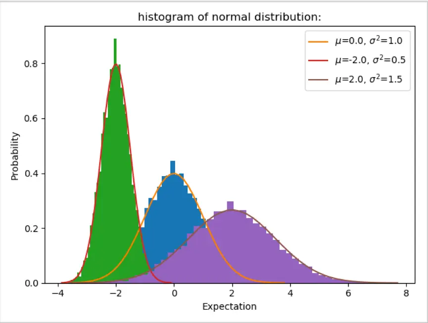
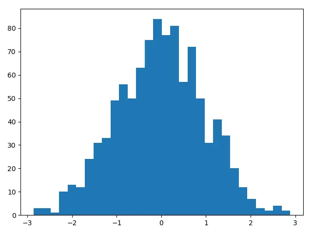
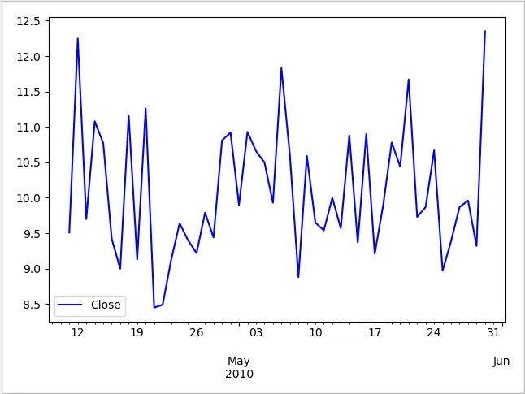

随机漫步理论认为股票价格的日常变动从根本上说是不可预知的，类似于”布朗运动”那样属于随机游走，没有任何规律可循

虽然无法预测股票价格会如何变化，但是可以从呈现的正态分布中据悉股票价格变化的概率分布，因此股价的波动性是可以量化的。正态随机漫步理论也为之后量化金融的发展奠定了基础。

**正态分布的基础知识：**

正态分布(Normal distribution)是连续随机变量概率分布的一种

正态分布描述的是某件事出现不同结果的概率分布情况



该曲线和横轴之间的面积为1，表示概率总和为1，期望值`μ`决定了分布的位置，标准差`σ`决定了分布的幅度

Python内置的`random`模块和第三方库NumPy的`random`模块都提供了生成随机漫步序列的方法

`random`模块的`normalvariate(mu,sigma)`方法可以生成符合正态分布的随机数， 其中`mu`, `sigma`分别对应公式中的期望值`μ`, 标准差`σ`，当`mu=0`, `sigma=1`为标准正态分布

```python
print("normalvariate: ",random.normalvariate(0,1))
#normalvariate:  2.1798947785444143

## 由于random.normalvariate()方法每次只能生成一个随机数，接下来使用循环的方式产生一组随机序列
walk = []
for _ in range(1000):
    walk.append(random.normalvariate(0,1))

# 然后使用matplotlib.pyplot.hist()方法将随机序列绘制成直方图
import matplotlib.pyplot as plt#导入模块
plt.hist(walk, bins=30)#bins直方图的柱数 
plt.show()    

```

直方图呈现两头低，中间高，左右对称的钟形，符合正态分布的标准，图片显示效果如下：



Numpy中的`random`模块也提供了产生正态分布随机数的方法`numpy.random.normal()`

```python
## numpy.random.normal(loc=0.0, scale=1.0, size=None)的参数中，loc、scale分别对应公式中的期望值μ，标准差σ，默认呈标准正态分布(μ=0,σ=1)，size指输出的值的数量，默认为None时只输出一个值
import matplotlib.pyplot as plt#导入模块
plt.hist(np.random.normal(loc=0.0, scale=1.0, size=1000), bins=30)#bins直方图的柱数
plt.show()

# NumPy中主要以N维数组对象ndarray存储数据的，因此np.random.normal()返回值的类型为'numpy.ndarray'
```

我们先使用NumPy的`random.normalvariate()`生成一个平均收盘股价为10元（即期望为10），振幅为1元（即标准差为1），样本数量为1000的正态分布随机数组，如下所示：

```python
stock_data = np.random.normal(loc=10.0, scale=1.0, size=1000)
print("stock_data：\n {}".format(stock_data))
"""
stock_data：
[10.78547256  9.76528172  9.22565839  9.88816694  9.98375121  8.82134049
 10.35872851  9.47037456 10.10779769  8.90763374  9.87537764 10.19336141
 10.23045668  9.56778185  .......  11.52876708  9.31758815  9.92082024]
"""

```

此处使用`np.around()`方法将所有数据保留2位小数，由于矢量运算的能力，此处仅需一行代码就可实现

```python
stock_data = np.around(stock_data,2)#保留2位小数
print("stock_data：\n {}".format(stock_data))
"""
stock_data：
[11.97  9.34 12.14 11.28 11.7   8.65  8.81  8.63 11.93  9.48  8.93  9.83
 10.54  9.38 10.93  9.09 10.4   9.88 10.35 11.67  7.97 12.19 10.1  11.22
  9.85 10.91 10.38  9.16  9.46  ...... 10.02  9.27 11.2   9.4   9.83  8.99]
"""

```

#### DataFrame数据生成 ####

DataFrame是一个表格型的数据结构，既有行索引 index也有列索引columns，创建DataFrame的基本方法为`df = pd.DataFrame(data, index=index,columns=columns)`

* 我们将收盘价定义为“close”，涨跌幅定义为“price range”。行索引index在此处表示为交易日期
* Pandas提供了强大的处理日期数据的功能，我们使用`pandas.date_range()`生成`DatetimeIndex`格式的日期序列，其中参数包括：起始时间start、结束时间end、时期数量periods、日期间隔频率freq='M'月、'D'天、'W'、周、'Y'年等等

此处生成从2010-01-01开始的1000个日期的时间序列

```python
import pandas as pd
#生成日时间序列
dd=pd.date_range('2010-01-01',freq='D',periods=1000)
print(f'生成日时间序列：\n{dd}')
"""
生成日时间序列：
DatetimeIndex(['2010-01-01', '2010-01-02', '2010-01-03', '2010-01-04',
               '2010-01-05', '2010-01-06', '2010-01-07', '2010-01-08',
               '2010-01-09', '2010-01-10',
               ...
               '2012-09-17', '2012-09-18', '2012-09-19', '2012-09-20',
               '2012-09-21', '2012-09-22', '2012-09-23', '2012-09-24',
               '2012-09-25', '2012-09-26'],
              dtype='datetime64[ns]', length=1000, freq='D')"""
"""

```

* 关于data参数的类型，我们通过`np.random.normal()`返回的数据类型为`'numpy.ndarray'`
* 将`data`、 `index`和`columns`三个参数传入创建DataFrame的方法中，就可以生成DataFrame格式的股票交易数据

```python
df_stock = pd.DataFrame({'close': stock_data, 'price range': pct_change}, index=dd)
print(f'股价交易数据：\n {df_stock.head()}')#打印前5行数据
"""
股价交易数据：
             close  price range
2010-01-01  10.59          NaN
2010-01-02   8.52        -0.20
2010-01-03   9.03         0.06
2010-01-04  10.33         0.14
2010-01-05  10.10        -0.02
"""

```

利用Pandas强大数据分析功能处理我们的数据,通过Pandas封装的matplotlib绘图功能，绘制其中50个交易日收盘价曲线，用可视化的方式了解下随机漫步的股价走势

```python
import matplotlib.pyplot as plt
#绘制收盘价
df_stock.close[100:150].plot(c='b')
plt.legend(['Close'],loc='best')
plt.show()

```




