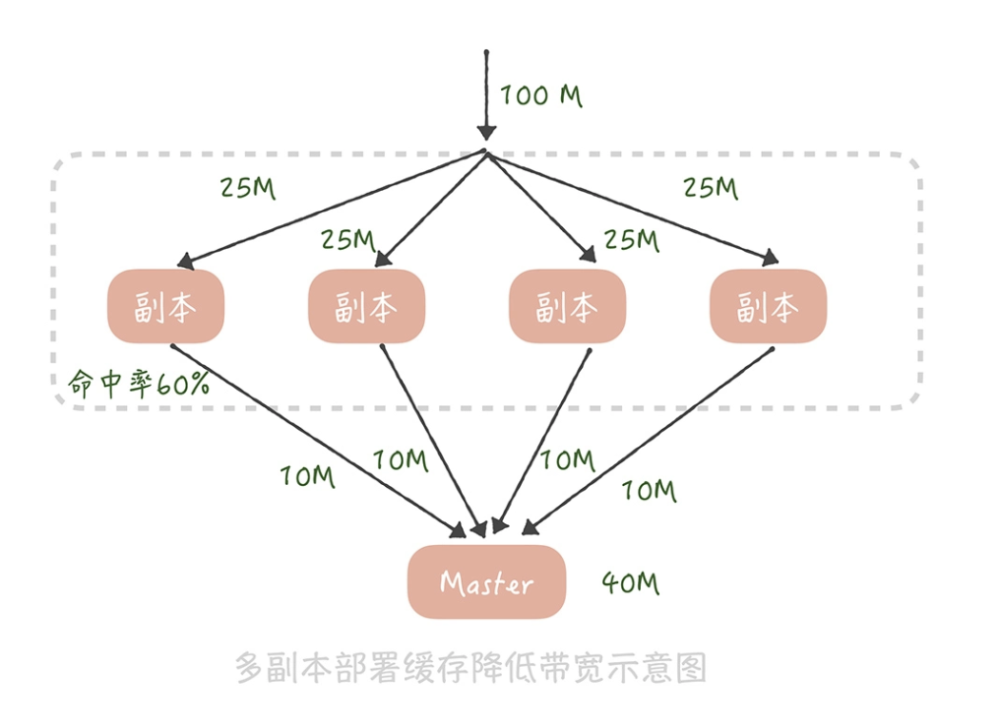
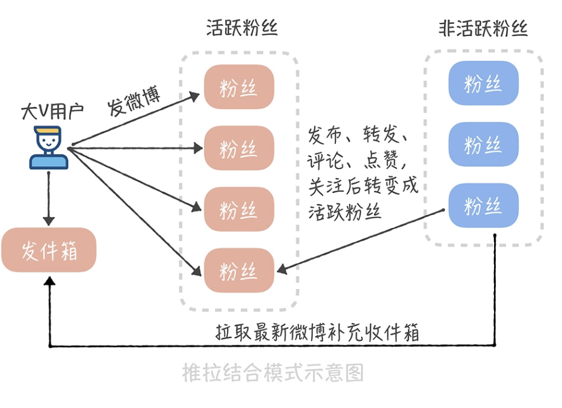

### 设计信息流系统的关注点有哪些 ###

* 我们需要关注**延迟数据**，也就是说，你关注的人发了微博信息之后，信息需要在短时间之内出现在你的信息流中。
* 其次，我们需要考虑如何**支撑高并发的访问**。信息流是微博的主体模块，是用户进入到微博之后最先看到的模块，因此它的并发请求量是最高的，可以达到每秒几十万次请求。
* 信息流**拉取性能直接影响用户的使用体验**。微博信息流系统中需要聚合的数据非常多，你打开客户端看一看，想一想其中需要聚合哪些数据？主要是微博的数据，用户的数据，除此之外，还需要查询微博是否被赞、评论点赞转发的计数、是否被关注拉黑等等。聚合这么多的数据就需要查询多次缓存、数据库、计数器，而在每秒几十万次的请求下，如何保证在 100ms 之内完成这些查询操作，展示微博的信息流呢？

### 如何基于推模式实现信息流系统 ###

推模式是指用户发送一条微博后，主动将这条微博推送给他的粉丝，从而实现微博的分发，也能以此实现微博信息流的聚合。

假设微博系统是一个邮箱系统，那么用户发送的微博可以认为是进入到一个发件箱，用户的信息流可以认为是这个人的收件箱

推模式的做法是在用户发布一条微博时，除了往自己的发件箱里写入一条微博，同时也会给他的粉丝收件箱里写入一条微博。

假如用户 A 有三个粉丝 B、C、D，如果用 SQL 表示 A 发布一条微博时系统做的事情，那么就像下面展示的这个样子

```sql
insert into outbox(userId, feedId, create_time) values("A", $feedId, $current_time); //写入A的发件箱
insert into inbox(userId, feedId, create_time) values("B", $feedId, $current_time); //写入B的收件箱
insert into inbox(userId, feedId, create_time) values("C", $feedId, $current_time); //写入C的收件箱
insert into inbox(userId, feedId, create_time) values("D", $feedId, $current_time); //写入D的收件箱
```

当我们要查询 B 的信息流时，只需要执行下面这条 SQL 就可以了

```sql
select feedId from inbox where userId = "B";
```

如果你想要提升读取信息流的性能，可以把收件箱的数据存储在缓存里面，每次获取信息流的时候直接从缓存中读取就好了

### 推模式存在的问题和解决思路 ###

* 首先，就是消息延迟。在讲系统通知未读数的时候，我们曾经提到过，不能采用遍历全量用户给他们加未读数的方式，原因是遍历一次全量用户的延迟很高
* 而推模式也有同样的问题。对明星来说，他们的粉丝数庞大，如果在发微博的同时还要将微博写入到上千万人的收件箱中，那么发微博的响应时间会非常慢，用户根本没办法接受。因此，我们**一般会使用消息队列来消除写入的峰值**
* 即使这样，由于写入收件箱的消息实在太多，你还是有可能在几个小时之后才能够看到明星发布的内容，这会非常影响用户的使用体验。

在推模式下，你需要关注的是微博的写入性能，因为用户每发一条微博，都会产生多次的数据库写入。为了尽量减少微博写入的延迟，我们可以从两方面来保障。

1. 在消息处理上，你可以启动多个线程并行地处理微博写入的消息。
2. 由于消息流在展示时可以使用缓存来提升读取性能，所以我们应该尽量保证数据写入数据库的性能，必要时可以采用写入性能更好的数据库存储引擎。

* 网易微博的时候就是采用推模式来实现微博信息流的。当时为了提升数据库的插入性能，我们采用了 TokuDB 作为 MySQL 的存储引擎
* 这个引擎架构的核心是一个名为分形树的索引结构（Fractal Tree Indexes）。我们知道数据库在写入的时候会产生对磁盘的随机写入，造成磁盘寻道，影响数据写入的性能；而分形树结构和 LSM 一样，可**以将数据的随机写入转换成顺序写入，提升写入的性能。另外，TokuDB 相比于 InnoDB 来说，数据压缩的性能更高**

其次，存储成本很高。在这个方案中我们一般会这么来设计表结构

先设计一张 Feed 表，这个表主要存储微博的基本信息，包括微博 ID、创建人的 ID、创建时间、微博内容、微博状态（删除还是正常）等等，**它使用微博 ID 做哈希分库分表；**

另外一张表是用户的发件箱和收件箱表，也叫做 TimeLine 表（时间线表)

**存在的问题：**

* 由于推模式需要给每一个用户都维护一份收件箱的数据，所以数据的存储量极大，你可以想一想，谢娜的粉丝目前已经超过 1.2 亿，那么如果采用推模式的话，谢娜每发送一条微博就会产生超过 1.2 亿条的数据，多么可怕:

​	解决思路： 除了选择压缩率更高的存储引擎之外，**还可以定期地清理数据**，因为用户更加关注最近几天发布的数据，通常不会翻阅	很久之前的微博，所以你可以**定期地清理用户的收件箱，比如只保留最近 1 个月的数据就可以了。**

* 推模式下我们还通常会遇到扩展性的问题。在微博中有一个分组的功能，它的作用是你可以将关注的人分门别类，比如你可以把关注的人分为“明星”“技术”“旅游”等类别，然后把杨幂放入“明星”分类里，将 InfoQ 放在“技术”类别里。**那么引入了分组之后，会对推模式有什么样的影响呢？**

  如果杨幂发了一条微博，那么不仅需要插入到我的收件箱中，还需要插入到我的“明星”收件箱中，这样不仅增加了消息分发的压力，同时由于每一个收件箱都需要单独存储，所以存储成本也就更高。

​	在处理取消关注和删除微博的逻辑时会更加复杂。比如当杨幂删除了一条微博，那么如果要删除她所有粉丝收件箱中的这条微博，会	带来额外的分发压力，我们还是尽量不要这么做。	

* 而如果你将一个人取消关注，那么需要从你的收件箱中删除这个人的所有微博，假设他发了非常多的微博，那么即使你之后很久不登录，也需要从你的收件箱中做大量的删除操作，有些得不偿失。**所以你可以采用的策略是： 在读取自己信息流的时候，判断每一条微博是否被删除以及你是否还关注这条微博的作者，如果没有的话，就不展示这条微博的内容了。使用了这个策略之后，就可以尽量减少对于数据库多余的写操作了。**

**推模式究竟适合什么样的业务的场景呢？** **它比较适合于一个用户的粉丝数比较有限的场景**，比如说微信朋友圈，你可以理解为我在微信中增加一个好友是关注了他也被他关注，所以好友的上限也就是粉丝的上限（朋友圈应该是 5000）。有限的粉丝数可以保证消息能够尽量快地被推送给所有的粉丝，增加的存储成本也比较有限

### 如何使用拉模式设计信息流系统 ###

用户主动拉取他关注的所有人的微博，将这些微博按照发布时间的倒序进行排序和聚合之后，生成信息流数据的方法。

* 用户的收件箱不再有用，因为信息流数据不再出自收件箱，而是出自发件箱。
* 发件箱里是用户关注的所有人数据的聚合。因此用户在发微博的时候就只需要写入自己的发件箱，而不再需要推送给粉丝的收件箱了
* 在获取信息流的时候，就要查询发件箱的数据了。

假设用户 A 关注了用户 B、C、D，那么当用户 B 发送一条微博的时候，他会执行这样的操作：

```sql
insert into outbox(userId, feedId, create_time) values("B", $feedId, $current_time); //写入B的发件箱
```

当用户 A 想要获取他的信息流的时候，就要聚合 B、C、D 三个用户收件箱的内容了：

```sql
select feedId from outbox where userId in (select userId from follower where fanId = "A") order by create_time desc  
# 先从关注表中查出A关注的用户，然后在发件箱表中聚合A关注用户的发件箱数据
```

* 拉模式彻底解决了推送延迟的问题，大 V 发微博的时候不再需要推送到粉丝的收件箱，自然就不存在延迟的问题了
* 其次，存储成本大大降低了。在推模式下，谢娜的粉丝有 1.2 亿，那么谢娜发送一条微博就要被复制 1.2 亿条，写入到存储系统中。在拉模式下只保留了发件箱，微博数据不再需要复制，成本也就随之降低了。

**拉模式也会有一些问题**

* 在拉模式下，我们需要对多个发件箱的数据做聚合，这个查询和聚合的成本比较高。微博的关注上限是 2000，假如你关注了 2000 人，就要查询这 2000 人发布的微博信息，然后再对查询出来的信息做聚合。
* 如何保证在毫秒级别完成这些信息的查询和聚合呢？答案还是缓存。我们可以把用户发布的微博 ID 放在缓存中，不过如果把全部用户的所有微博都缓存起来，消耗的硬件成本也是很高的

在实际执行中，我们对用户的浏览行为做了分析，发现 97% 的用户都是在浏览最近 5 天之内的微博，也就是说，用户很少翻看五天之前的微博内容，所以我们**只缓存了每个用户最近 5 天发布的微博 ID**

假设我们部署 6 个缓存节点来存储这些微博 ID，**在每次聚合时并行从这几个缓存节点中批量查询多个用户的微博 ID**，获取到之后再在应用服务内存中排序后就好了，这就是对缓存的 6 次请求，可以保证在 5 毫秒之内返回结果

缓存节点的带宽成本比较高：

* 假设微博信息流的访问量是每秒 10 万次请求，每个缓存节点每秒要被查询 10 万次
* 假设一共部署 6 个缓存节点，用户人均关注是 90，平均来说每个缓存节点要存储 15 个用户的数据
* 如果每个人平均每天发布 2 条微博，5 天就是发布 10 条微博，15 个用户就要存储 150 个微博 ID
* 每个微博 ID 要是 8 个字节，150 个微博 ID 大概就是 1kB 的数据，**单个缓存节点的带宽就是 1kB * 10 万 = 100MB，基本上跑满了机器网卡带宽了**

部署多个缓存副本提升缓存可用性，其实，**缓存副本也可以分摊带宽的压力。我们知道在部署缓存副本之后，请求会先查询副本中的数据，只有不命中的请求才会查询主缓存的数据**。

* 假如原本缓存带宽是 100M，我们部署 4 组缓存副本，缓存副本的命中率是 60%，那么主缓存带宽就降到 100M * 40% = 40M
* 而每组缓存副本的带宽为 100M / 4 = 25M，这样每一组缓存的带宽都降为可接受的范围之内了。



使用**缓存副本来抗流量也是一种常见的缓存设计思路**

### 推拉结合的方案是怎样的 ###

方案的核心在于大 V 用户在发布微博的时候，不再推送到全量用户，而是只推送给活跃的用户

* 首先，我们要如何判断哪些是大 V 用户呢？或者说，哪些用户在发送微博时需要推送全量用户，哪些用户需要推送活跃用户呢
  * 粉丝数超过 50 万就算作大 V，需要只推送活跃用户
  * 活跃用户可以定义为最近几天内在微博中有过操作的用户，比如说刷新过信息流、发布过微博、转发评论点赞过微博，关注过其他用户等等，一旦有用户有过这些操作，我们就把他标记为活跃的用户。
* 对大 V 来说，我们可以**存储一个活跃粉丝的列表**，这个列表里面就是我们标记的活跃用户。当某一个用户从**不活跃用户变为活跃用户**时，我们会查询这个用户的关注者中哪些是大 V，然后把**这个用户写入到这些大 V 的活跃粉丝列表里面**
* 这个活跃粉丝列表是定长的，如果活跃粉丝数量超过了长度，就把最先加入的粉丝从列表里剔除，这样可以保证推送的效率。

一个用户被从活跃粉丝列表中剔除，或者是他从不活跃变成了活跃后，**由于他不在大 V 用户的活跃粉丝列表中，所以也就不会收到微博的实时推送，因此，我们需要异步地把大 V 用户最近发布的微博插入到他的收件箱中，保证他的信息流数据的完整性**



采用推拉结合的方式可以一定程度上弥补推模式的缺陷，不过也带来了一些维护的成本，比如说系统需要维护用户的在线状态，还需要多维护一套活跃的粉丝列表数据，在存储上的成本就更高了。