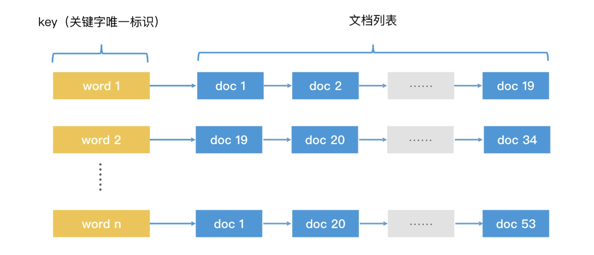
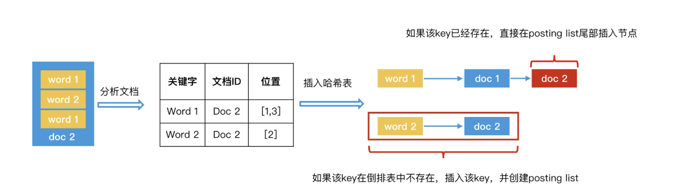

### 什么是倒排索引？

给每首诗一个唯一的编号作为 ID，然后使用哈希表将诗的 ID 作为键（Key），把诗的内容作为键对应的值（Value）。这样，我们就能在 O(1) 的时间代价内，完成对指定 key 的检索。这样一个以对象的唯一 ID 为 key 的哈希索引结构，叫作正排索引（Forward Index）。

我们会发现，“根据题目查找内容”和“根据关键字查找题目”，这两个问题其实是完全相反的。既然完全相反，那我们能否“反着”建立一个哈希表来帮助我们查找呢？

将每个关键字当作 key，将包含了这个关键字的诗的列表当作存储的内容

根据关键字来查询这个哈希表，在 O(1) 的时间内，我们就能得到包含该关键字的文档列表。**这种根据具体内容或属性反过来索引文档标题的结构，我们就叫它倒排索引（Inverted Index）**。在倒排索引中，key 的集合叫作字典（Dictionary），一个 key 后面对应的记录集合叫作记录列表（Posting List）。

### 如何创建倒排索索引？

1. 给每个文档编号，作为其唯一的标识，并且排好序，然后开始遍历文档
2. 解析当前文档中的每个关键字，生成 **< 关键字，文档 ID，关键字位置 >** 这样的数据对。因为在许多检索场景中，都需要显示关键字前后的内容，比如，在组合查询时，我们要判断多个关键字之间是否足够近。所以我们需要记录位置信息
3. 将关键字作为 key 插入哈希表。如果哈希表中已经有这个 key 了，我们就在对应的 posting list 后面追加节点，记录该文档 ID（关键字的位置信息如果需要，也可以一并记录在节点中）；如果哈希表中还没有这个 key，我们就直接插入该 key，并创建 posting list 和对应节点。
4. 重复第 2 步和第 3 步，处理完所有文档，完成倒排索引的创建。

#### 如何查询同时含有“极”字和“客”字两个 key 的文档？

我们可以先分别用两个 key 去倒排索引中检索，这样会得到两个不同的 posting list：A 和 B。A 中的文档都包含了“极”字，B 中文档都包含了“客”字。只需查找出 A 和 B 的公共元素即可。

如果 A 和 B 都是无序链表，那我们只能将 A 链表和 B 链表中的每个元素分别比对一次，这个时间代价是 O(m*n)

但是，**如果两个链表都是有序的，我们就可以用归并排序的方法来遍历 A 和 B 两个链表，时间代价会降低为 O(m + n)**，其中 m 是链表 A 的长度，n 是链表 B 的长度

* 第 1 步，使用指针 p1 和 p2 分别指向有序链表 A 和 B 的第一个元素。
* 第 2 步，对比 p1 和 p2 指向的节点是否相同，这时会出现 3 种情况：
  * 两者的 id 相同，说明该节点为公共元素，直接将该节点加入归并结果。然后，p1 和 p2 要同时后移，指向下一个元素；
  * p1 元素的 id 小于 p2 元素的 id，p1 后移，指向 A 链表中下一个元素；
  * p1 元素的 id 大于 p2 元素的 id，p2 后移，指向 B 链表中下一个元素。
* 第 3 步，重复第 2 步，直到 p1 或 p2 移动到链表尾为止。

