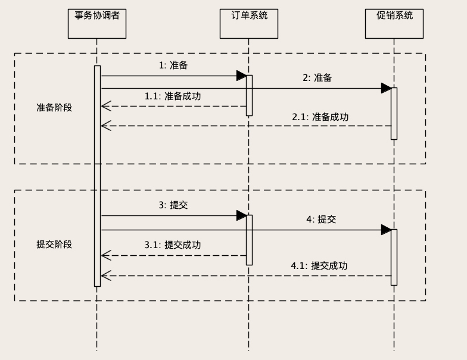

### 如何保证多个系统间的数据是一致的 ###

在分布式环境中，一个交易将会被分布到不同的系统中，多个微服务进程内执行计算，在多个数据库中执行数据更新操作，这个场景比数据库事务支持的单进程单数据库场景复杂太多了。**所以，并没有什么分布式事务服务或者组件能在分布式环境下，提供接近数据库事务的数据一致性保证。**

事务的 ACID 四个特性，我们知道即使是数据库事务，它考虑到性能的因素，大部分情况下不能也不需要百分之百地实现 ACID，所以才有了事务四种隔离级别。

分布式事务也是事务，也需要遵从 ACID 四个特性，但实际情况是，**在分布式系统中，因为必须兼顾性能和高可用**，所以是不可能完全满足 ACID 的。我们常用的几种分布式事务的实现方法，都是“残血版”的事务，而且相比数据库事务，更加的“残血”。

### 2PC：订单与优惠券的数据一致性问题 ###

2PC 也叫二阶段提交，是一种常用的分布式事务实现方法。我们用订单和优惠券的例子来说明一下，如何用 2PC 来解决订单系统和促销系统的数据一致性问题。在我们购物下单时，如果使用了优惠券，订单系统和优惠券系统都要更新自己的数据，才能完成“在订单中使用优惠券”这个操作

订单系统需要：

1. 在“订单优惠券表”中写入订单关联的优惠券数据；
2. 在“订单表”中写入订单数据。

**订单系统内两个操作的一致性问题可以直接使用数据库事务来解决。促销系统需要操作就比较简单，把刚刚使用的那张优惠券的状态更新成“已使用”就可以了**。我们需要这两个系统的数据更新操作保持一致，要么都更新成功，要么都更新失败。

2PC 引入了一个事务协调者的角色，来协调订单系统和促销系统，协调者对客户端提供一个完整的“使用优惠券下单”的服务，在这个服务的内部，**协调者再分别调用订单和促销的相应服务。**

所谓的二阶段指的是准备阶段和提交阶段。在准备阶段，协调者分别给订单系统和促销系统发送“准备”命令，订单和促销系统收到准备命令之后，开始执行准备操作。准备阶段都需要做哪些事儿呢？

1. 在订单库开启一个数据库事务；
2. 在“订单优惠券表”写入这条订单的优惠券记录；
3. 在“订单表”中写入订单数据。

到这里我们没有提交订单数据库的事务，最后给事务协调者返回“准备成功”。类似的，促销服务在准备阶段，需要在促销库开启一个数据库事务，更新优惠券状态，**但是暂时不要提交这个数据库事务，给协调者返回“准备成功”**

等两个系统都准备好了之后，进入提交阶段。提交阶段就比较简单了，协调者再给这两个系统发送“提交”命令，每个系统提交自己的数据库事务，然后给协调者返回“提交成功”响应，协调者收到所有响应之后，给客户端返回成功响应，整个分布式事务就结束

在准备阶段，如果任何一步出现错误或者是超时，协调者就会给两个系统发送“回滚事务”请求。每个系统在收到请求之后，回滚自己的数据库事务，分布式事务执行失败，两个系统的数据库事务都回滚了，相关的所有数据回滚到分布式事务执行之前的状态，就像这个分布式事务没有执行一样

如果准备阶段成功，进入提交阶段，这个时候就“只有华山一条路”，整个分布式事务只能成功，不能失败。

如果发生网络传输失败的情况，需要反复重试，直到提交成功为止。如果这个阶段发生宕机，包括两个数据库宕机或者订单服务、促销服务所在的节点宕机，还是有可能出现订单库完成了提交，但促销库因为宕机自动回滚，导致数据不一致的情况。但是，**因为提交的过程非常简单，执行很快，出现这种情况的概率非常小，所以，从实用的角度来说，2PC 这种分布式事务的方法，实际的数据一致性还是非常好的。**

在实现 2PC 的时候，没必要单独启动一个事务协调服务，这个协调服务的工作最好和订单服务或者优惠券服务放在同一个进程里面，这样做有两个好处

* 参与分布式事务的进程更少，故障点也就更少，稳定性更好；
* 减少了一些远程调用，性能也更好一些。

2PC 是一种强一致的设计，它可以保证原子性和隔离性。只要 2PC 事务完成，订单库和促销库中的数据一定是一致的状态，也就是我们总说的，要么都成功，要么都失败。

**2PC 也有很明显的缺陷，整个事务的执行过程需要阻塞服务端的线程和数据库的会话，所以，2PC 在并发场景下的性能不会很高。并且，协调者是一个单点，一旦过程中协调者宕机，就会导致订单库或者促销库的事务会话一直卡在等待提交阶段，直到事务超时自动回滚。**

所以，只有在需要强一致、并且并发量不大的场景下，才考虑使用 2PC。

### 本地消息表：订单与购物车的数据一致性问题 ###

2PC 它的适用场景其实是很窄的，更多的情况下，只要保证数据最终一致就可以了。比如说，在购物流程中，用户在购物车界面选好商品后，点击“去结算”按钮进入订单页面创建一个新订单。这个过程我们的系统其实做了两件事儿。

* 第一，订单系统需要创建一个新订单，订单关联的商品就是购物车中选择的那些商品
* 第二，创建订单成功后，购物车系统需要把订单中的这些商品从购物车里删掉。

清空购物车这个操作，它对一致性要求就没有扣减优惠券那么高，订单创建成功后，晚几秒钟再清空购物车，完全是可以接受的。只要保证经过一个小的延迟时间后，最终订单数据和购物车数据保持一致就可以了。

本地消息表的实现思路是这样的，订单服务在收到下单请求后，正常使用订单库的事务去更新订单的数据，并且，在执行这个数据库事务过程中，在本地记录一条消息。这个消息就是一个日志，内容就是“清空购物车”这个操作。**因为这个日志是记录在本地的，这里面没有分布式的问题，那这就是一个普通的单机事务，那我们就可以让订单库的事务，来保证记录本地消息和订单库的一致性**

然后，我们再用一个异步的服务，去读取刚刚记录的清空购物车的本地消息，调用购物车系统的服务清空购物车。购物车清空之后，把本地消息的状态更新成已完成就可以了。异步清空购物车这个过程中，如果操作失败了，可以通过重试来解决。最终，可以保证订单系统和购物车系统它们的数据是一致的。

这里面，本地消息表，你可以选择存在订单库中，也可以用文件的形式，保存在订单服务所在服务器的本地磁盘中，两种方式都是可以的，相对来说，放在订单库中更简单一些

**消息队列 RocketMQ 提供一种事务消息的功能，其实就是本地消息表思想的一个实现。使用事务消息可以达到和本地消息表一样的最终一致性**，相比我们自己来实现本地消息表，使用起来更加简单

**如果看事务的 ACID 四个特性，本地消息表这种方法，它只能满足 D（持久性**），但 A（原子性）C（一致性）、I（隔离性）都比较差，但是，它的优点非常突出。

当然，即使能接受数据最终一致，本地消息表也不是什么场景都可以适用的。它有一个前提条件就是，异步执行的那部分操作，不能有依赖的资源。比如说，我们下单的时候，除了要清空购物车以外，还需要锁定库存。

库存系统锁定库存这个操作，虽然可以接受数据最终一致，但是，锁定库存这个操作是有一个前提的，这个前提是：库存中得有货。这种情况就不适合使用本地消息表，不然就会出现用户下单成功后，系统的异步任务去锁定库存的时候，因为缺货导致锁定失败。这样的情况就很难处理了