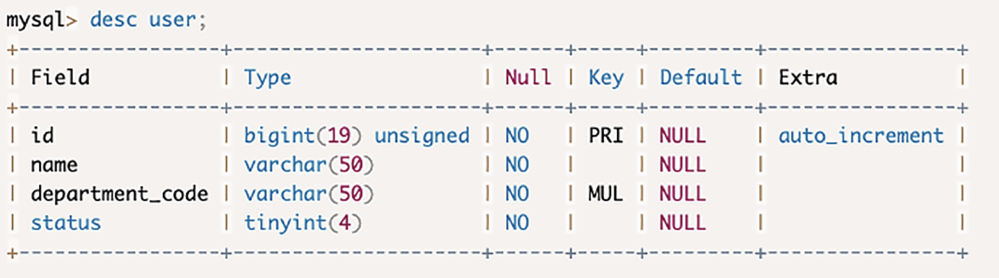

### 定量认识 MySQL ###

那个系统第一次全站宕机发生在圣诞节平安夜，故障之前的一段时间，系统并没有更新过版本，这个时候，其实慢 SQL 已经存在了，直到平安夜那天，访问量的峰值比平时增加一些，正是增加的这部分访问量，引发了数据库的雪崩

慢 **SQL 对数据库的影响，是一个量变到质变的过程，对“量”的把握，就很重要**。作为一个合格的程序员，你需要对数据库的能力，有一个定量的认识。

**影响 MySQL 处理能力的因素很多，比如：服务器的配置、数据库中的数据量大小、MySQL 的一些参数配置、数据库的繁忙程度等等。**

**一台 MySQL 数据库，大致处理能力的极限是，每秒一万条左右的简单 SQL，**这里的“简单 SQL”，指的是类似于主键查询这种不需要遍历很多条记录的 SQL，根据服务器的配置高低，可能低端的服务器只能达到每秒几千条，高端的服务器可以达到每秒钟几万条，所以这里给出的一万 TPS 是中位数的经验值。考虑到正常的系统不可能只有简单 SQL，所以实际的 TPS 还要打很多折扣

**一般一台 MySQL 服务器，平均每秒钟执行的 SQL 数量在几百左右**，就已经是非常繁忙了，即使看起来 CPU 利用率和磁盘繁忙程度没那么高，你也需要考虑给数据库“减负”了

另外一个重要的定量指标是，到底多慢的 SQL 才算慢 SQL。这里面这个“慢”，衡量的单位本来是执行时长，但是时长这个东西，我们在编写 SQL 的时候并不好去衡量。那我们可以用执行 SQL 查询时，需要遍历的数据行数替代时间作为衡量标准，**因为查询的执行时长基本上是和遍历的数据行数正相关的。**

* 你在编写一条查询语句的时候，可以依据你要查询数据表的数据总量，**估算一下这条查询大致需要遍历多少行数据**。如果遍历行数在**百万以内的，只要不是每秒钟都要执行几十上百次的频繁查询，可以认为是安全的**
* 遍历数据行数在几百万的，查询时间最少也要几秒钟，你就要仔细考虑有没有优化的办法。遍历行数达到千万量级和以上的，我只能告诉你，这种查询就不应该出现在你的系统中。当然我们这里说的都是在线交易系统，离线分析类系统另说。
* 遍历行数在千万左右，是 MySQL 查询的一个坎儿。MySQL 中单个表数据量，也要尽量控制在一千万条以下，最多不要超过二三千万这个量级。原因也很好理解，对一个千万级别的表执行查询，加上几个 WHERE 条件过滤一下，符合条件的数据最多可能在几十万或者百万量级，这还可以接受。但如果再和其他的表做一个联合查询，遍历的数据量很可能就超过千万级别了。所以，每个表的数据量最好小于千万级别。

### 使用索引避免全表扫描 ###

数据库索引的原理也很简单，我举个例子你就明白了。比如说，有一个无序的数组，数组的每个元素都是一个用户对象。如果说我们要把所有姓李的用户找出来。比较笨的办法是，用一个循环把数组遍历一遍。

我们用一个 Map(在有些编程语言中是 Dictionary) 来给数组做一个索引，Key 保存姓氏，值是所有这个姓氏的用户对象在数组中序号的集合。这样再查找的时候，就不用去遍历数组，先在 Map 中查找，然后再直接用序号去数组中拿用户数据，这样查找速度就快多了。

**绝大多数情况下，都应该使用索引，避免去遍历整张表，也就是通常说的，避免全表扫描**。你在每次开发新功能，需要给数据库增加一个新的查询时，都要评估一下，是不是有索引可以支撑新的查询语句，如果有必要的话，需要新建索引来支持新增的查询。

**增加索引付出的代价是，会降低数据插入、删除和更新的性能。**这个也很好理解，增加了索引，在数据变化的时候，不仅要变更数据表里的数据，还要去变更每个索引。所以，**对于更新频繁并且对更新性能要求较高的表，可以尽量少建索引。而对于查询较多更新较少的表，可以根据查询的业务逻辑，适当多建一些索引。**

### 分析 SQL 执行计划 ###

只要在你的 SQL 语句前面加上 EXPLAIN 关键字，然后执行这个查询语句就可以了。

比如有一个用户表，包含用户 ID、姓名、部门编号和状态这几个字段：



下面这两个 SQL，他们的查询结果是一样的，都满足要求，但是，哪个查询性能更好呢？

```sql
SELECT * FROM user WHERE left(department_code, 5) = '00028';
SELECT * FROM user WHERE department_code LIKE '00028%';
```

分别查看一下这两个 SQL 的执行计划：


* 首先来看 rows 这一列，rows 的含义就是，MySQL 预估执行这个 SQL 可能会遍历的数据行数。第一个 SQL 遍历了四千多行，这就是整个 User 表的数据条数

* 第二个 SQL 只有 8 行，这 8 行其实就是符合条件的 8 条记录。显然第二个 SQL 查询性能要远远好于第一个 SQL。

* 注意看 type 这一列，这一列表示这个查询的访问类型。ALL 代表全表扫描，这是最差的情况。range 代表使用了索引，在索引中进行范围查找

* 因为第二个 SQL 语句的 WHERE 中有一个 LIKE 的查询条件。如果直接命中索引，type 这一列显示的是 index。如果使用了索引，可以在 key 这一列中看到，实际上使用了哪个索引。

* 第二个 SQL 虽然使用了普遍认为低效的 LIKE 查询条件，但是仍然可以用到索引的范围查找，遍历数据的行数远远少于第一个 SQL，查询性能更好。

  

  

  

  

  

  

  


