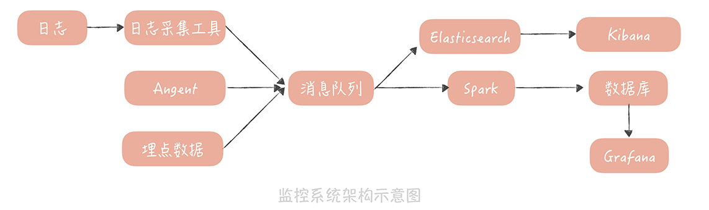

系统在运行过程中，频频得到用户的投诉，原因是

* 使用的数据库主从延迟变长，导致业务功能上出现了问题；
* 接口的响应时间变长，用户反馈商品页面出现空白页；
* 系统中出现大量错误，影响了用户的正常使用。

正所谓“道路千万条，监控第一条，监控不到位，领导两行泪”

### 监控指标如何选择 ###

**谷歌针对分布式系统监控的经验**总结，四个黄金信号（Four Golden Signals）。它指的是在**服务层面一般需要监控四个指标，分别是延迟、通信量、错误和饱和度。**

* 延迟指的是请求的响应时间。比如接口的响应时间、访问数据库和缓存的响应时间
* 通信量可以理解为吞吐量，也就是单位时间内请求量的大小。比如访问第三方服务的请求量，访问消息队列的请求量
* 错误表示当前系统发生的错误数量。这里需要注意的是， 我们需要监控的错误既有显式的，比如在监控 Web 服务时，出现 4 * * 和 5 * * 的响应码；也有隐式的，比如 Web 服务虽然返回的响应码是 200，但是却发生了一些和业务相关的错误（出现了数组越界的异常或者空指针异常等），这些都是错误的范畴。
* 饱和度指的是服务或者资源到达上限的程度（也可以说是服务或者资源的利用率），比如 CPU 的使用率、内存使用率、磁盘使用率、缓存数据库的连接数等等。

这些指标也是需要你特殊关注的。比如，**数据库主从延迟数据**、**消息队列的堆积情况**、**缓存的命中率**等等。我把高并发系统中常见组件的监控指标整理成了一张表格，其中没有包含诸如 **CPU、内存、网络、磁盘等基础监控指标**，只是业务上监控指标


### 如何采集数据指标 ###

Agent 是一种比较常见的采集数据指标的方式。

* 通过在数据源的服务器上部署自研或者开源的 Agent 来收集数据，发送给监控系统，实现数据的采集
* 在采集数据源上的信息时，Agent 会依据数据源上提供的一些接口获取数据

比如，你要从 Memcached 服务器上获取它的性能数据，那么，你就可以在 Agent 中连接这个 Memcached 服务器，并且发送一个 stats 命令，获取服务器的统计信息

然后，你就可以从返回的信息中，挑选重要的监控指标，发送给监控服务器，形成 Memcached 服务的监控报表

```c
    STAT cmd_get 201809037423    //计算查询的QPS
    STAT cmd_set 16174920166     //计算写入的QPS
    STAT get_hits 175226700643   //用来计算命中率，命中率 = get_hits/cmd_get
    STAT curr_connections 1416   //当前连接数
    STAT bytes 3738857307        //当前内存占用量
    STAT evictions 11008640149   //当前被memcached服务器剔除的item数
量，如果这个数量过大(比如例子中的这个数值），那么代表当前Memcached容量不足或者Memcached Slab Class分配有问题
```

另一种很重要的数据获取方式是在代码中埋点。

Agent 主要收集的是组件服务端的信息，而埋点则是从客户端的角度来描述所使用的组件，和服务的性能和可用性。

由于调用缓存、数据库的请求量会比较高，一般单机也会达到每秒万次，如果不经过任何优化，把每次请求耗时都发送给监控服务器，那么监控服务器会不堪重负。所以，我们一般会在埋点时先做一些汇总。比如，**每隔 10 秒汇总这 10 秒内对同一个资源的请求量总和、响应时间分位值、错误数等，然后发送给监控服务器**。这样，就可以大大减少发往监控服务器的请求量了。

日志也是你监控数据的重要来源之一。

你所熟知的 Tomcat 和 Nginx 的访问日志，都是重要的监控日志。你可以通过开源的日志采集工具，将这些日志中的数据发送给监控服务器

目前，常用的日志采集工具有很多，比如，Apache Flume、Fluentd和Filebeat，你可以选择一种熟悉的使用。在我的项目中，我倾向于使用 Filebeat 来收集监控日志数据。

### 监控数据的处理和存储 ###

我们一般会先用消息队列来承接数据，主要的作用是削峰填谷，防止写入过多的监控数据，让监控服务产生影响。

与此同时，我们一般会部署两个队列处理程序，来消费消息队列中的数据

**一个处理程序接收到数据后，把数据写入到 Elasticsearch，然后通过 Kibana 展示数据**，这些数据主要是用来做原始数据的查询。

另一个处理程序是一些**流式处理的中间件，比如 Spark、Storm。它们从消息队列里接收数据后会做一些处理**，这些处理包括

* 解析数据格式，尤其是日志格式。从里面提取诸如请求量、响应时间、请求 URL 等数据；
* 对数据做一些聚合运算。比如，针对 Tomcat 访问日志，可以计算同一个 URL 一段时间之内的请求量、响应时间分位值、非 200 请求量的大小等等。
* 将数据存储在时间序列数据库中。这类数据库的特点是，可以对带有时间标签的数据做更有效的存储，而我们的监控数据恰恰带有时间标签，并且按照时间递增，非常适合存储在时间序列数据库中。目前业界比较常用的时序数据库有 InfluxDB、OpenTSDB、Graphite
* 最后，你就可以通过 Grafana 来连接时序数据库，将监控数据绘制成报表，呈现给开发和运维的同学了。



1. **访问趋势报表**。这类报表接入的是 Web 服务器，和应用服务器的访问日志，展示了服务整体的访问量、响应时间情况、错误数量、带宽等信息。它主要反映的是服务的整体运行情况，帮助你来发现问题
2. **性能报表**。 这类报表对接的是资源和依赖服务的埋点数据，展示了被埋点资源的访问量和响应时间情况。它反映了资源的整体运行情况，当你从访问趋势报表发现问题后，可以先从性能报表中，找到究竟是哪一个资源或者服务出现了问题。
3. **资源报表**。 这类报表主要对接的是，使用 Agent 采集的资源的运行情况数据。当你从性能报表中，发现某一个资源出现了问题，那么就可以进一步从这个报表中，发现资源究竟出现了什么问题，是连接数异常增高还是缓存命中率下降。这样可以进一步帮你分析问题的根源，找到解决问题的方案。


