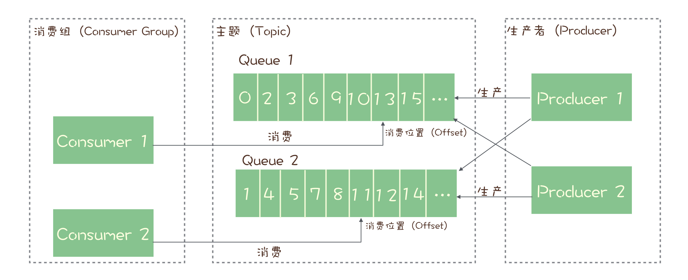

### RocketMQ 的消息模型 ###

几乎所有的消息队列产品都使用一种非常朴素的“请求 - 确认”机制，确保消息不会在传递过程中由于网络或服务器故障丢失。具体的做法也非常简单。在生产端，生产者先将消息发送给服务端，也就是 Broker，服务端在收到消息并将消息写入主题或者队列中后，会给生产者发送确认的响应

**如果生产者没有收到服务端的确认或者收到失败的响应，则会重新发送消息**；在消费端，消费者在收到消息并完成自己的消费业务逻辑（比如，将数据保存到数据库中）后，也会给服务端发送消费成功的确认，**服务端只有收到消费确认后，才认为一条消息被成功消费，否则它会给消费者重新发送这条消息，直到收到对应的消费成功确认。**

每个主题包含多个队列，通过多个队列来实现多实例并行生产和消费。需要注意的是**，RocketMQ 只在队列上保证消息的有序性，主题层面是无法保证消息的严格顺序的**

RocketMQ 中，订阅者的概念是通过消费组（Consumer Group）来体现的，也就是说，一条消息被 Consumer Group1 消费过，也会再给 Consumer Group2 消费。

消费组中包含多个消费者，**同一个组内的消费者是竞争消费的关系，每个消费者负责消费组内的一部分消息。如果一条消息被消费者 Consumer1 消费了，那同组的其他消费者就不会再收到这条消息。**

**在 Topic 的消费过程中，由于消息需要被不同的组进行多次消费，所以消费完的消息并不会立即被删除，这就需要 RocketMQ 为每个消费组在每个队列上维护一个消费位置（Consumer Offset）**，这个位置之前的消息都被消费过，之后的消息都没有被消费过，每成功消费一条消息，消费位置就加一

### Kafka 的消息模型 ###

Kafka 的消息模型和 RocketMQ 是完全一样的，在 Kafka 中，队列这个概念的名称不一样，Kafka 中对应的名称是“分区（Partition）”，含义和功能是没有任何区别的。

### 小结 ###

1. 主题（topic）中有多个队列（**队列数量可以水平进行扩容**），**生产者将其消息发送给主题中的某个队列（根据一定的路由规则，比如取模之类的**），主题不保证消息的有序，只有队列中的消息才是有序的。
2. 从主题中的所有队列中取出消息给所有消费组进行消费，**消息只能被消费组中的一个线程进行消费**,**不同队列中的消息可以同时被消费，并且消费组的线程也可以并发的消费不同的消息.** 比如消费组1里面有consumer A，consumer B两个消费者，那么A，B两个消费者可以消费多个队列，组内是竞争关系，A消费了某个消息，B就不能再消费这条消息，与此同时，这个队列上的offset（对于消费组1的offset）会往后移动。**对于同一个队列，每个消费组之间是共享关系**
3. 消费者会根据消费组在队列上的数来记录已消费位置，做到的就是队列上的有序，但是有可能整个topic下，是无序的
4. 如果两个业务都需要消费完整的topic消息，那么他们这两个业务的消费者不能在一个消费组内，需要分开。消费组里面的消费者数量可以水平扩容，是为了增大消费组的消费能力

