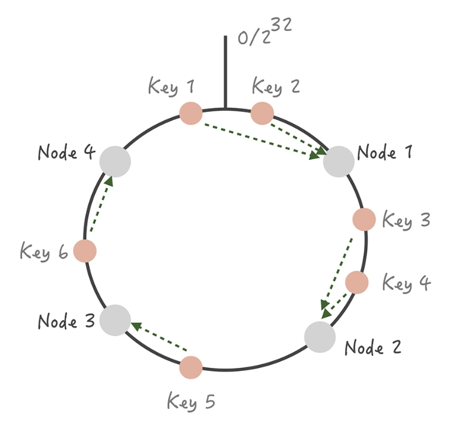

你需要关注缓存命中率这个指标（缓存命中率 = 命中缓存的请求数 / 总请求数）。一般来说，在你的电商系统中，核心缓存的命中率需要维持在 99% 甚至是 99.9%，哪怕下降 1%，系统都会遭受毁灭性的打击。

假设系统的 QPS 是 10000/s，**每次调用会访问 10 次缓存或者数据库中的数据，那么当缓存命中率仅仅减少 1%，数据库每秒就会增加 10000 * 10 * 1% = 1000 次请求**。而一般来说我们单个 MySQL 节点的读请求量峰值就在 1500/s 左右，增加的这 1000 次请求很可能会给数据库造成极大的冲击。

我们可以通过部署多个节点，同时设计一些方案让这些节点互为备份。这样，当某个节点故障时，它的备份节点可以顶替它继续提供服务

### 客户端方案 ##

* 写入数据时，需要把被写入缓存的数据分散到多个节点中，即进行数据分片；
* 关于读数据，这里可以使用主从和多副本两种策略，两种策略是为了解决不同的问题而提出的。

#### 缓存数据如何分片 ####

单一的缓存节点受到机器内存、网卡带宽和单节点请求量的限制，不能承担比较高的并发，因此我们考虑将数据分片，依照分片算法将数据打散到多个不同的节点上，每个节点上存储部分数据。

这样在某个节点故障的情况下，其他节点也可以提供服务，保证了一定的可用性

**一般来讲，分片算法常见的就是 Hash 分片算法和一致性 Hash 分片算法两种。**

Hash 分片的算法就是对缓存的 Key 做哈希计算，然后对总的缓存节点个数取余：

比如说，我们部署了三个缓存节点组成一个缓存的集群，当有新的数据要写入时，我们先对这个缓存的 Key 做比如 crc32 等 Hash 算法生成 Hash 值，然后对 Hash 值模 3，得出的结果就是要存入缓存节点的序号。

缺点是当增加或者减少缓存节点时，缓存总的节点个数变化造成计算出来的节点发生变化，从而造成缓存失效不可用,如果采用这种方法，最好建立在你对于这组缓存命中率下降不敏感

当然了，**用一致性 Hash 算法可以很好地解决增加和删减节点时，命中率下降的问题**

* 我们将整个 Hash 值空间组织成一个虚拟的圆环，然后将缓存节点的 IP 地址或者主机名做 Hash 取值后，放置在这个圆环上
* 当我们需要确定某一个 Key 需要存取到哪个节点上的时候，先对这个 Key 做同样的 Hash 取值，确定在环上的位置,然后按照顺时针方向在环上“行走”，遇到的第一个缓存节点就是要访问的节点

这时如果在 Node 1 和 Node 2 之间增加一个 Node 5，你可以看到原本命中 Node 2 的 Key 3 现在命中到 Node 5，而其它的 Key 都没有变化；同样的道理，如果我们把 Node 3 从集群中移除，那么只会影响到 Key 5 。所以你看，**在增加和删除节点时，只有少量的 Key 会“漂移”到其它节点上**,大部分的 Key 命中的节点还是会保持不变，从而可以保证命中率不会大幅下降。

虽然这个算法对命中率的影响比较小，但它还是存在问题：

1. 缓存节点在圆环上分布不平均，会造成部分缓存节点的压力较大；(比如一个有三个节点 A、B、C 承担整体的访问，每个节点的访问量平均，A 故障后，B 将承担双倍的压力（A 和 B 的全部请求），当 B 承担不了流量 Crash 后，C 也将因为要承担原先三倍的流量而 Crash，这就造成了整体缓存系统的雪崩)
2. 一致性 Hash 算法的脏数据问题(客户端初始写入一个 Key 为 k，值为 3 的缓存数据到 Cache A 中。这时如果要更新 k 的值为 4，但是缓存 A 恰好和客户端连接出现了问题，那这次写入请求会写入到 Cache B 中。接下来缓存 A 和客户端的连接恢复，当客户端要获取 k 的值时，就会获取到存在 Cache A 中的脏数据 3，而不是 Cache B 中的 4。)

所以，在**使用一致性 Hash 算法时一定要设置缓存的过期时间**，这样当发生漂移时，之前存储的脏数据可能已经过期，就可以减少存在脏数据的几率。

数据分片最大的优势就是缓解缓存节点的存储和访问压力

#### 多副本 ####

我们考虑在 Master/Slave 之前增加一层副本层

当客户端发起查询请求时，请求首先会先从多个副本组中选取一个副本组发起查询，如果查询失败，就继续查询 Master/Slave，并且将查询的结果回种到所有副本组中，避免副本组中脏数据的存在。

**每一个副本组容量比 Master 和 Slave 要小，因此它只存储了更加热的数据**。在这套架构中，Master 和 Slave 的请求量会大大减少

### 服务端方案 ###

Redis 在 2.4 版本中提出了 Redis Sentinel 模式来解决主从 Redis 部署时的高可用问题，它可以在主节点挂了以后自动将从节点提升为主节点，保证整体集群的可用性

* Sentinel 会时刻监控 Master 的状态，当发现 Master 在配置的时间间隔内无响应，就认为 Master 已经挂了
* Sentinel 会从从节点中选取一个提升为主节点，并且把所有其他的从节点作为新主的从节点
* Sentinel 集群内部在仲裁的时候，会根据配置的值来决定当有几个 Sentinel 节点认为主挂掉可以做主从切换的操作，也就是集群内部需要对缓存节点的状态达成一致才行

高可用的设计思路没有其他的核心就是增加副本，针对数据就增加数据副本，针对服务就增加服务副本，针对机房就增加机房副本，增加副本引入的新问题是数据不一致性，下面各种算法什么的都是为了解决因增加副本而带来的数据不一致性问题或者节点挂了怎么使服务继续可用的策略。比如：数据怎么迁移？故障怎么隔离？故障节点恢复后怎么是否加入？怎么加入？最近热上了看火影，影分术就是鸣人的高可用方式，其他的高可用思路和这个如出一辙。从动漫中也可以看出，这个需要更多能量，对公司而言，需要更多机器和存储空间，技术复杂度也会增加一些，幸好有现成的组件避免人人都重复造轮子的资源浪费。

