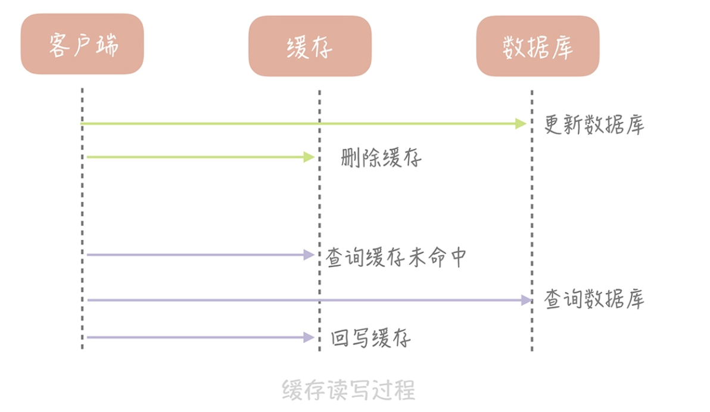
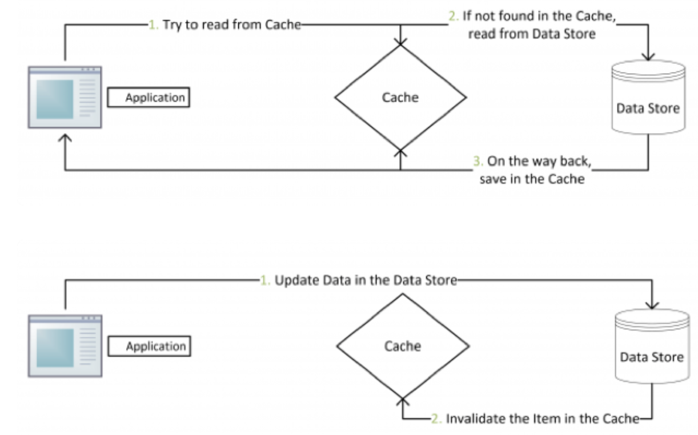
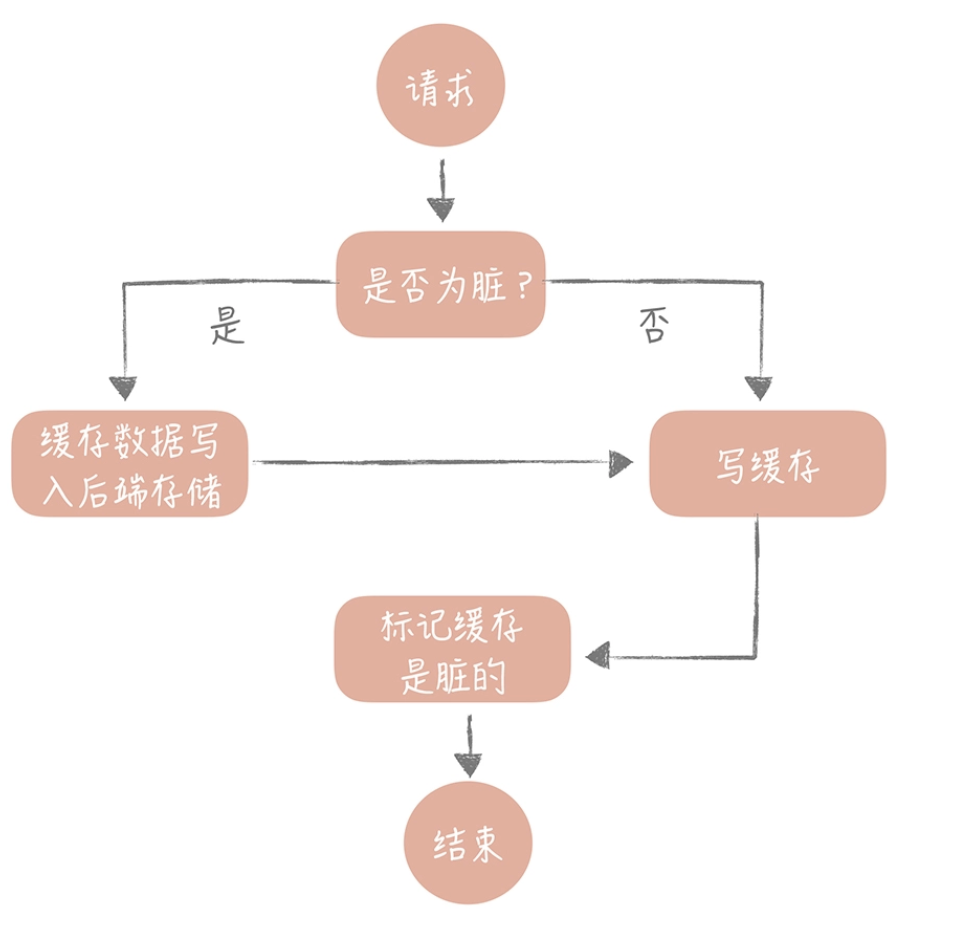
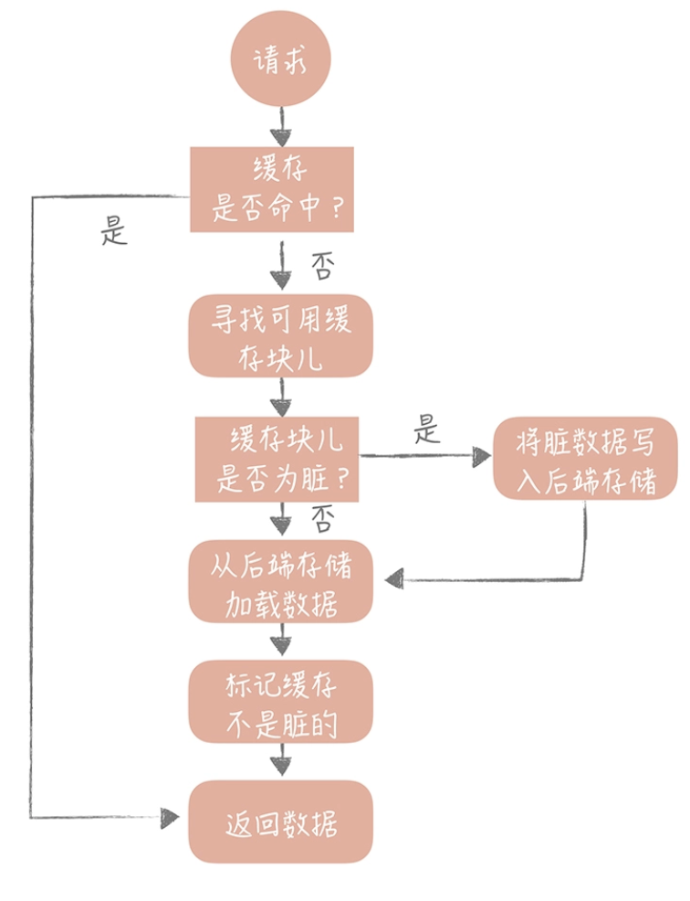

### Cache Aside（旁路缓存）策略 ###

当我们要把 ID 为 1 的用户的年龄从 19 变更为 20，要如何做呢？

**你可能会产生这样的思路**：先更新数据库中 ID 为 1 的记录，再更新缓存中 Key 为 1 的数据

**这个思路会造成缓存和数据库中的数据不一致**：

1. A 请求将数据库中 ID 为 1 的用户年龄从 19 变更为 20
2. 与此同时，请求 B 也开始更新 ID 为 1 的用户数据，它把数据库中记录的年龄变更为 21，然后变更缓存中的用户年龄为 21
3. 紧接着，A 请求开始更新缓存数据，它会把缓存中的年龄变更为 20。此时，数据库中用户年龄是 21，而缓存中的用户年龄却是 20。

我们并没有对操作做任何的并发控制。那么当两个线程并发更新它们的时候，就会因为**写入顺序的不同造成数据的不一致。**

另外，直接更新缓存还存在另外一个问题就是**丢失更新**

比如：缓存中存储的就不只是金额信息，而是完整的账户信息了。当更新缓存中账户金额时，你**需要从缓存中查询完整的账户数据，把金额变更后再写入到缓存中。**

1. 比如说原有金额是 20，A 请求从缓存中读到数据，并且把金额加 1，变更成 21
2. 在未写入缓存之前又有请求 B 也读到缓存的数据后把金额也加 1，也变更成 21
3. 两个请求同时把金额写回缓存，这时缓存里面的金额是 21，但是我们实际上预期是金额数加 2

**那我们要如何解决这个问题呢？**其实，我们可以在更新数据时**不更新缓存，而是删除缓存中的数据**，在读取数据时，发现缓存中没了数据之后，再从数据库中读取数据，更新到缓存中

这个策略就是我们使用缓存最常见的策略，**Cache Aside 策略（也叫旁路缓存策略）**，**这个策略数据以数据库中的数据为准**，缓存中的数据是按需加载的。它可以分为读策略和写策略。

**读策略的步骤是：**

* 从缓存中读取数据；
* 如果缓存命中，则直接返回数据；
* 如果缓存不命中，则从数据库中查询数据；
* 查询到数据后，将数据写入到缓存中，并且返回给用户。

**写策略的步骤是：**

* 更新数据库中的记录；
* 删除缓存记录。

那么像 Cache Aside 策略这样先更新数据库，后删除缓存就没有问题了吗？其实在理论上还是有缺陷的

比如，一个是读操作，但是没有命中缓存，就会到数据库中取数据。而此时来了一个写操作，写完数据库后，让缓存失效，然后之前的那个读操作再把老的数据放进去，所以会造成脏数据。

这个案例理论上会出现，但实际上出现的概率可能非常低，因为这个条件需要发生在读缓存时缓存失效，而且有一个并发的写操作。**实际上数据库的写操作会比读操作慢得多**，而且还要锁表，**读操作必须在写操作前进入数据库操作，又要晚于写操作更新缓存**，所有这些条件都具备的概率并不大

**Cache Aside 策略是我们日常开发中最经常使用的缓存策略，不过我们在使用时也要学会依情况而变**。比如说当新注册一个用户，按照这个更新策略，你要写数据库，然后清理缓存（当然缓存中没有数据给你清理）。可当我注册用户后立即读取用户信息，并且**数据库主从分离时，会出现因为主从延迟所以读不到用户信息的情况。**

而解决这个问题的办法恰恰是在插入新数据到数据库之后写入缓存，这样后续的读请求就会从缓存中读到数据了。**并且因为是新注册的用户，所以不会出现并发更新用户信息的情况。**

Cache Aside 存在的最大的问题是当写入比较频繁时，缓存中的数据会被频繁地清理，这样会对缓存的命中率有一些影响。如果你的业务对缓存命中率有严格的要求，那么可以考虑两种解决方案：

1. **一种做法是在更新数据时也更新缓存，只是在更新缓存前先加一个分布式锁，因为这样在同一时间只允许一个线程更新缓存**，就不会产生并发问题了。当然这么做对于写入的性能会有一些影响

   对于Cache aside和read/write through而带来的数据不一致问题，工作中是这样解决：

    a写线程，b读线程：

   *  b线程：读缓存->未命中->上写锁>从db读数据到缓存->释放锁； 
   * a线程：上写锁->写db->删除缓存/改缓存->释放锁； 
   * 这样来保证a，b线程并发读写缓存带来的脏数据问题；

2. 另一种做法同样也是在更新数据时更新缓存，**只是给缓存加一个较短的过期时间，**这样即使出现缓存不一致的情况，缓存的数据也会很快过期，对业务的影响也是可以接受

### Read/Write Through（读穿 / 写穿）策略 ####

这个策略的核心原则是**用户只与缓存打交道，由缓存和数据库通信**，写入或者读取数据

**Write Through 的策略**是这样的：先查询要写入的数据在缓存中是否已经存在，如果已经存在，则更新缓存中的数据，并且由**缓存组件同步更新到数据库中**,如果缓存中数据不存在，我们把这种情况叫做“Write Miss（写失效）

一般来说，我们可以选择两种“Write Miss”方式:

1. 写入缓存相应位置，再由缓存组件同步更新到数据库中
2. 不写入缓存中，而是直接更新到数据库中

**Read Through 策略**就简单一些，它的步骤是这样的：先查询缓存中数据是否存在，如果存在则直接返回，如果不存在，则由缓存组件负责从数据库中同步加载数据。

Read Through/Write Through 策略的特点是由缓存节点而非用户来和数据库打交道，在我们开发过程中相比 Cache Aside 策略要少见一些，**原因是我们经常使用的分布式缓存组件**

无论是 Memcached 还是 Redis 都不提供写入数据库，或者自动加载数据库中的数据的功能。而我们在使用本地缓存的时候可以考虑使用这种策略

Write Through 策略中写数据库是同步的，这对于性能来说会有比较大的影响，那么我们可否异步地更新数据库？这就是接下来要提到的“Write Back”策略。

### Write Back（写回）策略 ###

这个策略的核心思想是在写入数据时只写入缓存，并且把缓存块儿标记为“脏”的。**而脏块儿只有被再次使用时才会将其中的数据写入到后端存储中。**

Write back 策略的示意图

* 写入发现该存储块是脏数据，就把该缓存数据写入持久存储
* 然后写入缓存并标记为脏数据

**读的策略也有一些变化了**。

* 我们在读取缓存时如果发现缓存命中则直接返回缓存数据。
* 如果缓存不命中则寻找一个可用的缓存块儿，如果这个缓存块儿是“脏”的，就把缓存块儿中之前的数据写入到后端存储中，并且从后端存储加载数据到缓存块儿
* 如果不是脏的，则由缓存组件将后端存储中的数据加载到缓存中，最后我们将缓存设置为不是脏的，返回数据就好了。

其实这种策略不能被应用到我们常用的数据库和缓存的场景中，它是计算机体系结构中的设计，无论是操作系统层面的 Page Cache，还是日志的异步刷盘，亦或是消息队列中消息的异步写入磁盘，大多采用了这种策略。因为这个策略在性能上的优势毋庸置疑，它避免了直接写磁盘造成的随机写问题，毕竟写内存和写磁盘的随机 I/O 的延迟相差了几个数量级呢。

但因为缓存一般使用内存，而内存是非持久化的，**所以一旦缓存机器掉电，就会造成原本缓存中的脏块儿数据丢失**。所以你会发现系统在掉电之后，之前写入的文件会有部分丢失，就是因为 Page Cache 还没有来得及刷盘造成的

当然，你依然可以在一些场景下使用这个策略：你在向低速设备写入数据的时候，可以在内存里先暂存一段时间的数据，甚至做一些统计汇总，然后定时地刷新到低速设备上

