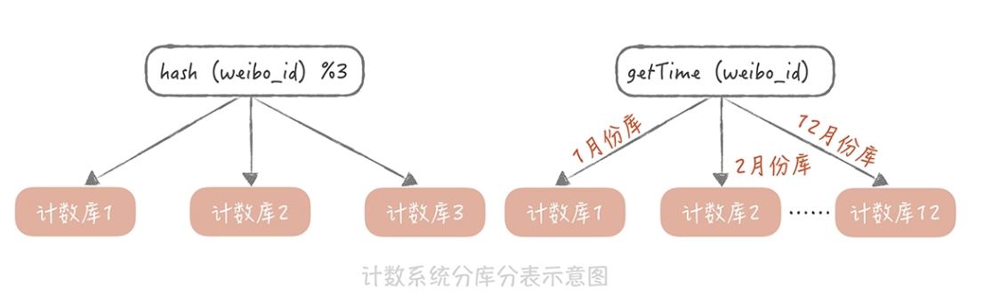
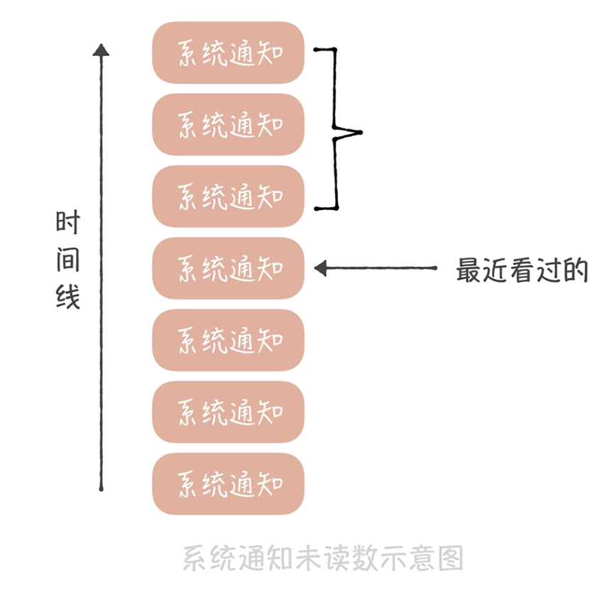
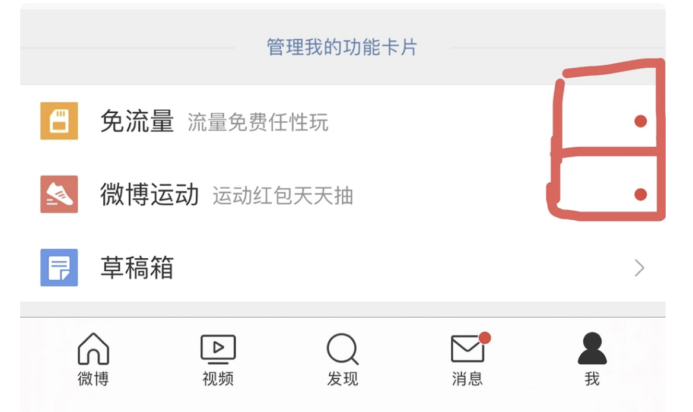
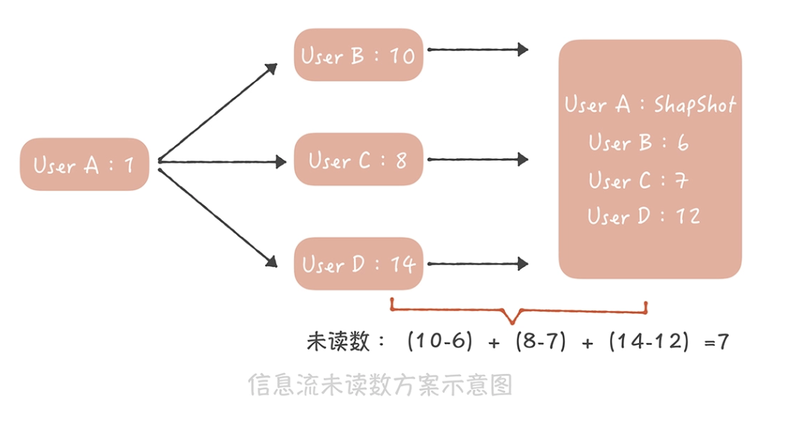

比如，把计数与微博数据存储在一起，这样每次更新计数的时候都需要锁住这一行记录，降低了写入的并发

### 计数在业务上的特点 ###

* 数据量巨大。微博系统中微博条目的数量早已经超过了千亿级别，仅仅计算微博的转发、评论、点赞、浏览等核心计数，其数据量级就已经在几千亿的级别。更何况微博条目的数量还在不断高速地增长，并且随着微博业务越来越复杂，微博维度的计数种类也可能会持续扩展（比如说增加了表态数），因此，仅仅是微博维度上的计数量级就已经过了万亿级别。除此之外，微博的用户量级已经超过了 10 亿，用户维度的计数量级相比微博维度来说虽然相差很大，但是也达到了百亿级别。那么如何存储这些过万亿级别的数字
* 访问量大，对于性能的要求高。微博的日活用户超过 2 亿，月活用户接近 5 亿，核心服务（比如首页信息流）访问量级达到每秒几十万次，计数系统的访问量级也超过了每秒百万级别，而且在性能方面，它要求要毫秒级别返回结果。
* 最后，对于可用性、数字的准确性要求高。一般来讲，用户对于计数数字是非常敏感的，比如你直播了好几个月，才涨了 1000 个粉，突然有一天粉丝数少了几百个

### 支撑高并发的计数系统要如何设计 ###

假如要存储微博维度（微博的计数，转发数、点赞数等等）的数据，你可以这么设计表结构：以微博 ID 为主键，转发数、评论数、点赞数和浏览数分别为单独一列，这样在获取计数时用一个 SQL 语句就搞定了

```sql
select repost_count, comment_count, praise_count, view_count from t_weibo_count where weibo_id = ?
```

后来，随着微博的不断壮大，之前的计数系统面临了很多的问题和挑战。

比如微博用户量和发布的微博量增加迅猛，计数存储数据量级也飞速增长，而 MySQL 数据库单表的存储量级达到几千万的时候，性能上就会有损耗。所以我们考虑使用分库分表的方式分散数据量，提升读取计数的性能。

我们用“weibo_id”作为分区键，在选择分库分表的方式时，考虑了下面两种：

* 一种方式是选择一种哈希算法对 weibo_id 计算哈希值，然后根据这个哈希值计算出需要存储到哪一个库哪一张表中
* 另一种方式是按照 weibo_id 生成的时间来做分库分表

因为越是最近发布的微博，计数数据的访问量就越大，所以虽然我考虑了两种方案，**但是按照时间来分库分表会造成数据访问的不均匀，**最后用了哈希的方式来做分库分表。



信息流的访问量巨大，仅仅靠数据库已经完全不能承担如此高的并发量了。于是我们考虑使用 Redis 来加速读请求，通过部署多个从节点来提升可用性和性能，并且通过 Hash 的方式对数据做分片，也基本上可以保证计数的读取性能。然而，这种数据库 + 缓存的方式有一个弊端：无法保证数据的一致性，比如，如果数据库写入成功而缓存更新失败，就会导致数据的不一致，影响计数的准确性。所以，**我们完全抛弃了 MySQL，全面使用 Redis 来作为计数的存储组件**

除了考虑计数的读取性能之外，由于热门微博的计数变化频率相当高，也需要考虑如何提升计数的写入性能。比如，每次在转发一条微博的时候，都需要增加这条微博的转发数，那么如果明星发布结婚、离婚的微博，瞬时就可能会产生几万甚至几十万的转发。如果是你的话，要如何降低写压力呢？

可能想到用消息队列来削峰填谷了，也就是说，我们在转发微博的时候向消息队列写入一条消息，然后在消息处理程序中给这条微博的转发计数加 1。这里需要注意的一点， 我们可以通过批量处理消息的方式进一步减小 Redis 的写压力，比如像下面这样连续更改三次转发数（我用 SQL 来表示来方便你理解）：

```sql
UPDATE t_weibo_count SET repost_count = repost_count + 1 WHERE weibo_id = 1; 
UPDATE t_weibo_count SET repost_count = repost_count + 1 WHERE weibo_id = 1;  
UPDATE  t_weibo_count SET repost_count = repost_count +1 WHERE weibo_id = 1; 

# merge
UPDATE t_weibo_count SET repost_count = repost_count + 3 WHERE weibo_id = 1; 
```

### 如何降低计数系统的存储成本 ###

如何在有限的存储成本下实现对于全量计数数据的存取。

Redis 是使用内存来存储信息，相比于使用磁盘存储数据的 MySQL 来说，存储的成本不可同日而语，比如一台服务器磁盘可以挂载到 2 个 T，但是内存可能只有 128G，这样磁盘的存储空间就是内存的 16 倍。**而 Redis 基于通用性的考虑，对于内存的使用比较粗放，存在大量的指针以及额外数据结构的开销**，如果要存储一个 KV 类型的计数信息，Key 是 8 字节 Long 类型的 weibo_id，Value 是 4 字节 int 类型的转发数，存储在 Redis 中之后会占用超过 70 个字节的空间，空间的浪费是巨大的

先对原生 Redis 做一些改造，采用新的数据结构和数据类型来存储计数数据。我在改造时，主要涉及了两点：

* 一是原生的 Redis 在存储 Key 时是按照字符串类型来存储的，比如一个 8 字节的 Long 类型的数据，需要 8（sdshdr 数据结构长度）+ 19（8 字节数字的长度）+1（’\0’）=28 个字节，如果我们使用 Long 类型来存储就只需要 8 个字节，会节省 20 个字节的空间；
* 二是去除了原生 Redis 中多余的指针，如果要存储一个 KV 信息就只需要 8（weibo_id）+4（转发数）=12 个字节，相比之前有很大的改进。

微博的计数有转发数、评论数、浏览数、点赞数等等，如果每一个计数都需要存储 weibo_id，那么总共就需要 8（weibo_id）*4（4 个微博 ID）+4（转发数） + 4（评论数） + 4（点赞数） + 4（浏览数）= 48 字节。但是我们可以把相同微博 ID 的计数存储在一起，这样就只需要记录一个微博 ID

由于计数的量级实在是太过巨大，并且还在以极快的速度增长，**所以如果我们以全内存的方式来存储计数信息，就需要使用非常多的机器来支撑。**

然而微博计数的数据具有明显的热点属性：越是最近的微博越是会被访问到，时间上久远的微博被访问的几率很小。所以为了尽量减少服务器的使用，我们考虑给计数服务增加 SSD 磁盘，**然后将时间上比较久远的数据 dump 到磁盘上，内存中只保留最近的数据。当我们要读取冷数据的时候，使用单独的 I/O 线程异步地将冷数据从 SSD 磁盘中加载到一块儿单独的 Cold Cache 中**。

### 总结 ###

1、一开始用mysql进行计数，后来加入了主从架构，分库分表架构。 

2、因为计数访问量太大了，加入了缓存，但是这个会造成相应的那个缓存和数据库数据不一致，如果要保证一性的话，就需要采用内存队列，对于同一个id的数量只能用单线程进行处理，这个会造成性能问题。 

3、后来直接抛弃了mysql，直接用redis cluster来支持计数服务,因为redis通过rdb和aof来支持持久化，可以通过设置保证至少有一台从redis机器同步了数据，从redis来做相应的那个持久化操作达到数据不丢失，因为原生的redis数据结构会占用比较多的字节，这里直接进行改造，让redis的数据结构占用内存加少。 

4、但是redis是全内存的，随着量越来越大肯定没法支持了，这里进行改造，引入ssd，支持把冷数据放到ssd中，热数据在内存中，当要访问冷数据时利用一个线程异步把冷数据加载到一个cold cache里面去。这个有很多开源的实现，如Pika，SSDB用ssd来替代内存存储冷数据。


### 系统通知的未读数要如何设计 ###

假如你的系统中只有 A、B、C 三个用户，那么你可以在通用计数系统中增加一块儿内存区域，并且以用户 ID 为 Key 来存储这三个用户的未读通知数据，当系统发送一个新的通知时，我们会循环给每一个用户的未读数加 1，这个处理逻辑的伪代码就像下面这样：

```java
List<Long> userIds = getAllUserIds();
for(Long id : userIds) {
  incrUnreadCount(id);
}
```

* 首先，获取全量用户就是一个比较耗时的操作，相当于对用户库做一次全表的扫描，这不仅会对数据库造成很大的压力，而且查询全量用户数据的响应时间是很长的，对于在线业务来说是难以接受的。
* 如果你的用户库已经做了分库分表，那么就要扫描所有的库表，响应时间就更长了

在发送系统通知之前，先从线下的数据仓库中获取全量的用户 ID，并且存储在一个本地的文件中，然后再轮询所有的用户 ID，给这些用户增加未读计数。

这似乎是一个可行的技术方案，然而它给所有人增加未读计数，会消耗非常长的时间。你计算一下，假如你的系统中有一个亿的用户，给一个用户增加未读数需要消耗 1ms，那么给所有人都增加未读计数就需要 100000000 * 1 /1000 = 100000 秒，也就是超过一天的时间；即使你启动 100 个线程并发的设置，也需要十几分钟的时间才能完成，而用户很难接受这么长的延迟时间。

另外，使用这种方式需要给系统中的每一个用户都记一个未读数的值，而在系统中，活跃用户只是很少的一部分，大部分的用户是不活跃的，甚至从来没有打开过系统通知，为这些用户记录未读数显然是一种浪费

系统通知实际上是存储在一个大的列表中的，这个列表对所有用户共享，也就是所有人看到的都是同一份系统通知的数据。不过不同的人最近看到的消息不同，所以每个人会有不同的未读数。因此，**你可以记录一下在这个列表中每个人看过最后一条消息的 ID，然后统计这个 ID 之后有多少条消息，这就是未读数了。**



这个方案在实现时有这样几个关键点

* 用户访问系统通知页面需要设置未读数为 0，我们需要将**用户最近看过的通知 ID 设置为最新的一条系统通知 ID；**
* 如果最近看过的通知 ID 为空，则认为是一个新的用户，返回未读数为 0；
* 对于非活跃用户，比如最近一个月都没有登录和使用过系统的用户，可以把用户最近看过的通知 ID 清空，节省内存空间。

这是一种比较通用的方案，既节省内存，又能尽量减少获取未读数的延迟。 这个方案适用的另一个业务场景是全量用户打点的场景，比如像下面这张微博截图中的红点。



这个红点和系统通知类似，也是一种通知全量用户的手段，如果逐个通知用户，延迟也是无法接受的。

* 首先，我们为每一个用户存储一个时间戳，代表最近点过这个红点的时间
* 用户点了红点，就把这个时间戳设置为当前时间
* 我们也记录一个全局的时间戳，这个时间戳标识最新的一次打点时间,如果你在后台操作给全体用户打点，就更新这个时间戳为当前时间

我们在判断是否需要展示红点时，**只需要判断用户的时间戳和全局时间戳的大小**，如果用户时间戳小于全局时间戳，代表在用户最后一次点击红点之后又有新的红点推送，那么就要展示红点，反之，就不展示红点了。

这两个场景的共性是全部用户共享一份有限的存储数据，每个人只记录自己在这份存储中的偏移量，就可以得到未读数了。你可以看到，系统消息未读的实现方案不是很复杂，它通过设计避免了操作全量数据未读数

### 如何为信息流的未读数设计方案 ###

* 微博的信息流是基于关注关系的，未读数也是基于关注关系的，就是说，你关注的人发布了新的微博，那么你作为粉丝未读数就要增加 1, 对于一些动辄几千万甚至上亿粉丝的微博大 V 就麻烦了，增加未读数可能需要几个小时。假设你是杨幂的粉丝，想了解她实时发布的博文，那么如果当她发布博文几个小时之后，你才收到提醒，这显然是不能接受的。**所以未读数的延迟是你在设计方案时首先要考虑的内容。**
* 其次，信息流未读数请求量极大、并发极高，这是因为接口是客户端轮询请求的，不是用户触发的。也就是说，用户即使打开微博客户端什么都不做，这个接口也会被请求到
* 最后，它不像系统通知那样有共享的存储，因为每个人关注的人不同，信息流的列表也就不同，所以也就没办法采用系统通知未读数的方案。

那要如何设计能够承接每秒几十万次请求的信息流未读数系统呢？

* 首先，在通用计数器中记录每一个用户发布的博文数；
* 然后在 Redis 或者 Memcached 中记录一个人所有关注人的博文数快照，当用户点击未读消息重置未读数为 0 时，**将他关注所有人的博文数刷新到快照中；**
* 他关注所有人的**博文总数减去快照中的博文总数就是他的信息流未读数。**



用户 A 最近一次查看未读消息时，记录在快照中的这三个用户的博文数分别是 6、7、12，因此用户 A 的未读数就是（10-6）+（8-7）+（14-12）=7。

这个方案设计简单，**并且是全内存操作，性能足够好，能够支撑比较高的并发，**事实上微博团队仅仅用 16 台普通的服务器就支撑了每秒接近 50 万次的请求，这就足以证明这个方案的性能有多出色，因此，它完全能够满足信息流未读数的需求

* 当然了这个方案也有一些缺陷，比如说快照中需要存储关注关系，如果关注关系变更的时候更新不及时，那么就会造成未读数不准确
* 快照采用的是全缓存存储，如果缓存满了就会剔除一些数据，那么被剔除用户的未读数就变为 0 了。但是好在用户对于未读数的准确度要求不高（未读 10 条还是 11 条，其实用户有时候看不出来），因此，这些缺陷也是可以接受的。

通过未读数系统设计这个案例，一些建议：

1. 缓存是提升系统性能和抵抗大并发量的神器，像是微博信息流未读数这么大的量级我们仅仅使用十几台服务器就可以支撑，这全都是缓存的功劳；
2. 要围绕系统设计的关键困难点想解决办法，就像我们解决系统通知未读数的延迟问题一样；
3. 合理分析业务场景，明确哪些是可以权衡的，哪些是不行的，会对你的系统设计增益良多，比如对于长久不登录用户，我们就会记录未读数为 0，通过这样的权衡，可以极大地减少内存的占用，减少成本。


