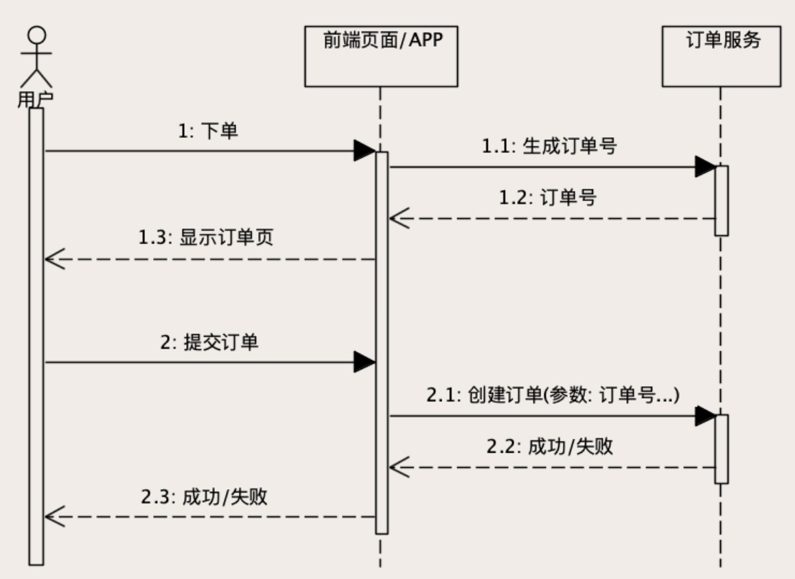

### 创建和更新订单时，如何保证数据准确无误 ###

一个购物流程，从下单开始、支付、发货，直到收货，这么长的一个流程中，每一个环节，都少不了更新订单数据，每一次更新操作又需要同时更新好几张表。这些操作可能被随机分布到很多台服务器上执行，服务器有可能故障，网络有可能出问题。

任何一个电商，它的订单系统的功能都是独一无二的，基于它的业务，有非常多的功能，并且都很复杂。我们在讨论订单系统的存储问题时，必须得化繁为简，只聚焦那些最核心的、共通的业务和功能上，并且以这个为基础来讨论存储技术问题。

### 订单系统的核心功能和数据 ###

1. 创建订单
2. 随着购物流程更新订单状态；
3. 查询订单，包括用订单数据生成各种报表

为了支撑这些必备功能，在数据库中，我们至少需要有这样几张表

1. 订单主表：也叫订单表，保存订单的基本信息。
2. 订单商品表：保存订单中的商品信息。
3. 订单支付表：保存订单的支付和退款信息。
4. 订单优惠表：保存订单使用的所有优惠信息。

订单主表和后面的几个子表都是一对多的关系，关联的外键就是订单主表的主键，也就是订单号。

#### 如何避免重复下单？ ####

一个订单系统，提供创建订单的 HTTP 接口，用户在浏览器页面上点击“提交订单”按钮的时候，浏览器就会给订单系统发一个创建订单的请求，订单系统的后端服务，在收到请求之后，往数据库的订单表插入一条订单数据，创建订单成功

假如说，用户点击“创建订单”的按钮时手一抖，点了两下，浏览器发了两个 HTTP 请求，结果是什么？创建了两条一模一样的订单。这样肯定不行，需要做防重。

有的同学会说，前端页面上应该防止用户重复提交表单，你说的没错。但是，网络错误会导致重传，很多 RPC 框架、网关都会有自动重试机制，所以对于订单服务来说，重复请求这个事儿，你是没办法完全避免的。

解决办法是，**让你的订单服务具备幂等性**。什么是幂等呢？一个幂等操作的特点是，其任意多次执行所产生的影响均与一次执行的影响相同。也就是说，一个幂等的方法，使用同样的参数，对它进行调用多次和调用一次，对系统产生的影响是一样的。所以，对于幂等的方法，不用担心重复执行会对系统造成任何改变。一个幂等的创建订单服务，无论创建订单的请求发送多少次，正确的结果是，数据库只有一条新创建的订单记录。

在插入订单数据之前，先查询一下订单表里面有没有重复的订单，行不行？不太行，因为你很难用 SQL 的条件来定义“重复的订单”，订单用户一样、商品一样、价格一样，就认为是重复订单么？不一定，万一用户就是连续下了两个一模一样的订单呢？

很多电商解决这个问题的思路是这样的。在数据库的最佳实践中有一条就是，**数据库的每个表都要有主键，绝大部分数据表都遵循这个最佳实践**。一般来说，我们在往数据库插入一条记录的时候，都不提供主键，由数据库在插入的同时自动生成一个主键。这样重复的请求就会导致插入重复数据。

表的主键自带唯一约束，如果我们在一条 INSERT 语句中提供了主键，并且这个主键的值在表中已经存在，那这条 INSERT 会执行失败，数据也不会被写入表中。我们可以利用**数据库的这种“主键唯一约束”特性，在插入数据的时候带上主键**，来解决创建订单服务的幂等性问题

具体的做法是：**给订单系统增加一个“生成订单号”的服务，这个服务没有参数，返回值就是一个新的、全局唯一的订单号。在用户进入创建订单的页面时，前端页面先调用这个生成订单号服务得到一个订单号**，在用户提交订单的时候，在创建订单的请求中带着这个订单号。

这个订单号也是我们订单表的主键，这样，无论是用户手抖，还是各种情况导致的重试，这些重复请求中带的都是同一个订单号。订单服务在订单表中插入数据的时候，执行的这些重复 INSERT 语句中的主键，也都是同一个订单号。数据库的唯一约束就可以保证，只有一次 INSERT 语句是执行成功的，这样就实现了创建订单服务幂等性。

#### 如何解决 ABA 问题？ ####

订单系统各种更新订单的服务一样也要具备幂等性

比如说支付、发货等等这些步骤中的更新订单操作，最终落到订单库上，都是对订单主表的 UPDATE 操作。**数据库的更新操作，本身就具备天然的幂等性**，比如说，你把订单状态，从未支付更新成已支付，执行一次和重复执行多次，订单状态都是已支付，不用我们做任何额外的逻辑，这就是天然幂等。

什么是 ABA 问题呢？比如说，订单支付之后，小二要发货，发货完成后要填个快递单号。假设说，小二填了一个单号 666，刚填完，发现填错了，赶紧再修改成 888。对订单服务来说，这就是 2 个更新订单的请求。

正常情况下，订单中的快递单号会先更新成 666，再更新成 888，这是没问题的。那不正常情况呢？666 请求到了，单号更新成 666，然后 888 请求到了，单号又更新成 888，但是 666 更新成功的响应丢了，调用方没收到成功响应，自动重试，再次发起 666 请求，单号又被更新成 666 了，这数据显然就错了。这就是非常有名的 ABA 问题。

ABA 问题怎么解决？给你的订单主表增加一列，列名可以叫 version。每次查询订单的时候，版本号需要随着订单数据返回给页面。页面在更新数据的请求中，需要把这个版本号作为更新请求的参数，再带回给订单更新服务。

订单服务在更新数据的时候，需要比较订单当前数据的版本号，是否和消息中的版本号一致，如果不一致就拒绝更新数据。如果版本号一致，还需要再更新数据的同时，把版本号 +1。**“比较版本号、更新数据和版本号 +1”，这个过程必须在同一个事务里面执行**。

通过这个版本号，就可以保证，从我打开这条订单记录开始，一直到我更新这条订单记录成功，这个期间没有其他人修改过这条订单数据。**因为，如果有其他人修改过，数据库中的版本号就会改变，那我的更新操作就不会执行成功。我只能重新查询新版本的订单数据，然后再尝试更新。**

每次请求之前必须先生成一个唯一的请求id,服务端将该id暂时放入redis。客户端请求时必须携带上这个id，接口会首先到redis中查询，如果有的话就继续后续的处理逻辑，同时删除该id,没有的话就退出，返回不能重复请求的错误到客户端。 一句话总结：每次处理必须对应一个一次性的token

