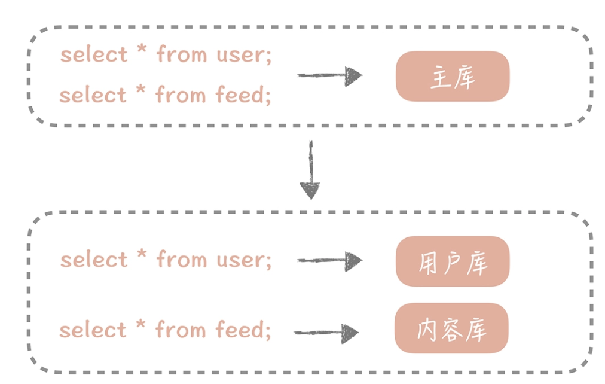

1. 系统正在持续不断地发展，注册的用户越来越多，产生的订单越来越多，数据库中存储的数据也越来越多，单个表的数据量超过了千万甚至到了亿级别。这时即使你使用了索引，索引占用的空间也随着数据量的增长而增大，**数据库就无法缓存全量的索引信息，那么就需要从磁盘上读取索引数据，就会影响到查询的性能了**。那么这时你要如何提升查询性能呢？

2. 数据量的增加也占据了磁盘的空间，**数据库在备份和恢复的时间变长**，你如何让数据库系统支持如此大的数据量呢？
3. 不同模块的数据，比如用户数据和用户关系数据，全都存储在一个主库中，一旦主库发生故障，所有的模块都会受到影响，那么如何做到不同模块的故障隔离呢？

这些问题你可以归纳成，数据库的写入请求量大造成的性能和可用性方面的问题，要解决这些问题，**你所采取的措施就是对数据进行分片。这样可以很好地分摊数据库的读写压力，也可以突破单机的存储瓶颈，而常见的一种方式是对数据库做“分库分表”**

### 如何对数据库做垂直拆分 ###

它的基本思想是依照某一种策略将**数据尽量平均地分配到多个数据库节点或者多个表中。**

不同于主从复制时数据是全量地被拷贝到多个节点，**分库分表后，每个节点只保存部分的数据，这样可以有效地减少单个数据库节点和单个数据表中存储的数据量**，在解决了数据存储瓶颈的同时也能有效地提升数据查询的性能。同时，因为数据被分配到多个数据库节点上，那么数据的写入请求也从请求单一主库变成了请求多个数据分片节点，在一定程度上也会提升并发写入的性能。

比如，一个直播项目，在这个项目中，需要存储用户在直播间中发的消息以及直播间中的系统消息，你知道这些消息量极大，有些比较火的直播间有上万条留言是很常见的事儿，日积月累下来就积攒了几亿的数据，查询的性能和存储空间都扛不住了。没办法，就只能加班加点重构，**启动多个数据库来分摊写入压力和容量的压力，也需要将原来单库的数据迁移到新启动的数据库节点上，好在最后成功完成分库分表和数据迁移校验工作**，不过也着实花费了不少的时间和精力。

数据库分库分表的方式有两种：一种是垂直拆分，另一种是水平拆分

**垂直拆分的原则一般是按照业务类型来拆分，核心思想是专库专用**，将业务耦合度比较高的表拆分到单独的库中

在微博系统中有和用户相关的表，有和内容相关的表，有和关系相关的表，这些表都存储在主库中。**在拆分后，我们期望用户相关的表分拆到用户库中，内容相关的表分拆到内容库中，关系相关的表分拆到关系库中。**

### 如何对数据库做水平拆分 ###

和垂直拆分的关注点不同，垂直拆分的关注点在于业务相关性，**而水平拆分指的是将单一数据表按照某一种规则拆分到多个数据库和多个数据表中，关注点在数据的特点**

1. 按照某一个字段的哈希值做拆分，这种拆分规则比较适用于实体表，比如说用户表，内容表，我们一般按照这些实体表的 ID 字段来拆分。比如说我们想把用户表拆分成 16 个库，每个库是 64 张表，**那么可以先对用户 ID 做哈希，哈希的目的是将 ID 尽量打散，然后再对 16 取余，这样就得到了分库后的索引值；对 64 取余，就得到了分表后的索引值**。

2. 另一种比较常用的是按照某一个字段的区间来拆分，比较常用的是时间字段。你知道在内容表里面有“创建时间”的字段，而我们也是按照时间来查看一个人发布的内容。我们可能会要看昨天的内容，也可能会看一个月前发布的内容，这时就可以按照创建时间的区间来分库分表，比如说**可以把一个月的数据放入一张表中，这样在查询时就可以根据创建时间先定位数据存储在哪个表里面，再按照查询条件来查询。**

数据库在分库分表之后，数据的访问方式也有了极大的改变，**原先只需要根据查询条件到从库中查询数据即可，现在则需要先确认数据在哪一个库表中，再到那个库表中查询数据。这种复杂度也可以通过数据库中间件来解决**

### 解决分库分表引入的问题 ###

分库分表引入的一个最大的问题就是引入了分库分表键，**也叫做分区键，也就是我们对数据库做分库分表所依据的字段。**

从分库分表规则中你可以看到，无论是哈希拆分还是区间段的拆分，我们首先都需要选取一个数据库字段，这带来一个问题是：**我们之后所有的查询都需要带上这个字段，才能找到数据所在的库和表**，否则就只能向所有的数据库和数据表发送查询命令

比如，在用户库中我们使用 ID 作为分区键，这时如果需要按照昵称来查询用户时，你可以按照昵称作为分区键再做一次拆分，但是这样会极大地增加存储成本，如果以后我们还需要按照注册时间来查询时要怎么办呢，再做一次拆分吗？

**所以最合适的思路是你要建立一个昵称和 ID 的映射表**，**在查询的时候要先通过昵称查询到 ID，再通过 ID 查询完整的数据**，这个表也可以是分库分表的，也需要占用一定的存储空间，但是因为表中只有两个字段，所以相比重新做一次拆分还是会节省不少的空间的。

**分库分表引入的另外一个问题是一些数据库的特性在实现时可能变得很困难。比如说多表的 JOIN 在单库时是可以通过一个 SQL 语句完成的，但是拆分到多个数据库之后就无法跨库执行 SQL 了，不过好在我们对于 JOIN 的需求不高**，即使有也一般是把两个表的数据取出后在业务代码里面做筛选

1. 如果在性能上没有瓶颈点那么就尽量不做分库分表；
2. 如果要做，就尽量一次到位，比如说 16 库，每个库 64 表就基本能够满足几年内你的业务的需求。
3. 很多的 NoSQL 数据库，例如 Hbase，MongoDB 都提供 auto sharding 的特性，如果你的团队内部对于这些组件比较熟悉，有较强的运维能力，那么也可以考虑使用这些 NoSQL 数据库替代传统的关系型数据库

